# INFORME TÉCNICO ARQUITECTURAL DE REFERENCIA
## AWS Generative AI - Dominio 1: Integración de Modelos Fundacionales, Gestión de Datos y Cumplimiento
*(Content Domain 1: Foundation Model Integration, Data Management, and Compliance)*

---

## Control del Documento
- **Versión:** 2.4.0 (Enterprise Architecture Standard)
- **Estado:** Documento de Referencia de Producción / Guía de Certificación y Arquitectura
- **Clasificación:** Confidencial / Técnico de Alto Nivel
- **Alineación:** AWS Well-Architected Framework (Generative AI Lens), NIST AI RMF, ISO/IEC 42001
- **Fecha de Emisión:** Septiembre 2026

---

## TABLA DE CONTENIDOS

1. [Resumen Ejecutivo y Alcance del Dominio 1](#1-resumen-ejecutivo-y-alcance-del-dominio-1)
2. [Task 1.1: Analizar Requisitos y Diseñar Soluciones de IA Generativa](#2-task-11-analizar-requisitos-y-diseñar-soluciones-de-ia-generativa)
   - [Skill 1.1.1: Diseños Arquitecturales Integrales y Alineación Técnica](#skill-111-diseños-arquitecturales-integrales-y-alineación-técnica)
   - [Skill 1.1.2: Pruebas de Concepto (PoC), Validación de Rendimiento y Valor de Negocio](#skill-112-pruebas-de-concepto-poc-validación-de-rendimiento-y-valor-de-negocio)
   - [Skill 1.1.3: Componentes Estandarizados y AWS Well-Architected GenAI Lens](#skill-113-componentes-estandarizados-y-aws-well-architected-genai-lens)
3. [Task 1.2: Seleccionar y Configurar Modelos Fundacionales (FMs)](#3-task-12-seleccionar-y-configurar-modelos-fundacionales-fms)
   - [Skill 1.2.1: Evaluación y Selección de FMs con Base en Benchmarks y Limitaciones](#skill-121-evaluación-y-selección-de-fms-con-base-en-benchmarks-y-limitaciones)
   - [Skill 1.2.2: Arquitecturas Desacopladas para Selección Dinámica de Modelos](#skill-122-arquitecturas-desacopladas-para-selección-dinámica-de-modelos)
   - [Skill 1.2.3: Resiliencia, Circuit Breakers, Cross-Region Inference y Degradación Suave](#skill-123-resiliencia-circuit-breakers-cross-region-inference-y-degradación-suave)
   - [Skill 1.2.4: Personalización, PEFT (LoRA), SageMaker Model Registry y Ciclo de Vida](#skill-124-personalización-peft-lora-sagemaker-model-registry-y-ciclo-de-vida)
4. [Task 1.3: Implementar Pipelines de Validación y Procesamiento de Datos](#4-task-13-implementar-pipelines-de-validación-y-procesamiento-de-datos)
   - [Skill 1.3.1: Workflows de Validación de Calidad de Datos (Glue Data Quality / Data Wrangler)](#skill-131-workflows-de-validación-de-calidad-de-datos-glue-data-quality--data-wrangler)
   - [Skill 1.3.2: Procesamiento de Tipos de Datos Complejos y Multimodales](#skill-132-procesamiento-de-tipos-de-datos-complejos-y-multimodales)
   - [Skill 1.3.3: Formateo y Serialización de Entrada Específica por Modelo](#skill-133-formateo-y-serialización-de-entrada-específica-por-modelo)
   - [Skill 1.3.4: Enriquecimiento, Normalización y Anonimización de Datos](#skill-134-enriquecimiento-normalización-y-anonimización-de-datos)
5. [Task 1.4: Diseñar e Implementar Soluciones de Bases de Datos Vectoriales](#5-task-14-diseñar-e-implementar-soluciones-de-bases-de-datos-vectoriales)
   - [Skill 1.4.1: Arquitecturas Avanzadas de Vector Stores para Aumento de FMs](#skill-141-arquitecturas-avanzadas-de-vector-stores-para-aumento-de-fms)
   - [Skill 1.4.2: Frameworks de Metadatos y Particionamiento Contextual](#skill-142-frameworks-de-metadatos-y-particionamiento-contextual)
   - [Skill 1.4.3: Arquitecturas de Alto Rendimiento a Escala (Sharding, HNSW, IVF, Cuantización)](#skill-143-arquitecturas-de-alto-rendimiento-a-escala-sharding-hnsw-ivf-cuantización)
   - [Skill 1.4.4: Conectores e Integración con Repositorios Empresariales](#skill-144-conectores-e-integración-con-repositorios-empresariales)
   - [Skill 1.4.5: Mantenimiento, Sincronización Incremental y Manejo de Tombstones](#skill-145-mantenimiento-sincronización-incremental-y-manejo-de-tombstones)
6. [Task 1.5: Diseñar Mecanismos de Recuperación para Aumento de FMs (RAG)](#6-task-15-diseñar-mecanismos-de-recuperación-para-aumento-de-fms-rag)
   - [Skill 1.5.1: Estrategias Avanzadas de Segmentación de Documentos (Chunking)](#skill-151-estrategias-avanzadas-de-segmentación-de-documentos-chunking)
   - [Skill 1.5.2: Selección y Configuración de Modelos de Embeddings](#skill-152-selección-y-configuración-de-modelos-de-embeddings)
   - [Skill 1.5.3: Despliegue y Configuración de Motores de Búsqueda Vectorial](#skill-153-despliegue-y-configuración-de-motores-de-búsqueda-vectorial)
   - [Skill 1.5.4: Búsqueda Híbrida (Lexical + Semantic) y Reranking](#skill-154-búsqueda-híbrida-lexical--semantic-y-reranking)
   - [Skill 1.5.5: Sistemas Sofisticados de Manejo y Transformación de Consultas](#skill-155-sistemas-sofisticados-de-manejo-y-transformación-de-consultas)
   - [Skill 1.5.6: Interfaces Estandarizadas de Acceso, Tool Calling y Model Context Protocol (MCP)](#skill-156-interfaces-estandarizadas-de-acceso-tool-calling-y-model-context-protocol-mcp)
7. [Task 1.6: Implementar Estrategias de Ingeniería de Prompts y Gobernanza](#7-task-16-implementar-estrategias-de-ingeniería-de-prompts-y-gobernanza)
   - [Skill 1.6.1: Frameworks de Instrucción y Amazon Bedrock Guardrails](#skill-161-frameworks-de-instrucción-y-amazon-bedrock-guardrails)
   - [Skill 1.6.2: Sistemas Interactivos, Memoria Conversacional y Clasificación de Intenciones](#skill-162-sistemas-interactivos-memoria-conversacional-y-clasificación-de-intenciones)
   - [Skill 1.6.3: Gobernanza de Prompts, Versionado, Auditoría y Trazabilidad](#skill-163-gobernanza-de-prompts-versionado-auditoría-y-trazabilidad)
   - [Skill 1.6.4: Aseguramiento de Calidad (QA), Pruebas de Regresión y Fuzzing](#skill-164-aseguramiento-de-calidad-qa-pruebas-de-regresión-y-fuzzing)
   - [Skill 1.6.5: Técnicas Avanzadas de Prompting y Bucles de Retroalimentación Humana](#skill-165-técnicas-avanzadas-de-prompting-y-bucles-de-retroalimentación-humana)
   - [Skill 1.6.6: Orquestación Compleja: Amazon Bedrock Prompt Flows y Agentes Autónomos](#skill-166-orquestación-compleja-amazon-bedrock-prompt-flows-y-agentes-autónomos)
8. [Matrices de Decisión Técnicas de Referencia](#8-matrices-de-decisión-técnicas-de-referencia)
9. [Seguridad, Cifrado y Cumplimiento Normativo](#9-seguridad-cifrado-y-cumplimiento-normativo)
10. [Conclusiones y Guía de Operaciones en Producción](#10-conclusiones-y-guía-de-operaciones-en-producción)

---

# 1. Resumen Ejecutivo y Alcance del Dominio 1

El **Dominio 1: Foundation Model Integration, Data Management, and Compliance** representa el núcleo técnico y operativo de cualquier iniciativa de Inteligencia Artificial Generativa (GenAI) desplegada sobre Amazon Web Services (AWS). Este dominio no solo abarca la selección del modelo adecuado, sino toda la infraestructura habilitadora requerida para transformar datos corporativos heterogéneos en representaciones semánticas accionables, gobernar el flujo de inferencia y garantizar que las soluciones cumplan con estrictos estándares de seguridad, latencia, precisión y costo-efectividad.

### Ejes Fundamentales del Dominio 1:
1. **Alineación Estratégica y Arquitectura:** Traducción de casos de negocio en patrones arquitectónicos robustos (Serverless, desacoplados, resilientes).
2. **Selección y Ciclo de Vida de FMs:** Evaluación cuantitativa de modelos, enrutamiento dinámico, patrones de disyuntor (*circuit breaker*), inferencia multi-región y técnicas de adaptación eficiente de parámetros (*PEFT/LoRA*).
3. **Calidad y Canalización de Datos:** Gobernanza de calidad de datos, soporte multimodal unificado (texto, imagen, audio, tablas) y preprocesamiento semántico.
4. **Infraestructura Vectorial:** Selección, dimensionamiento, sharding y sincronización continua de bases de datos vectoriales a escala empresarial.
5. **Recuperación Semántica Avanzada (RAG):** Segmentación (*chunking*) contextual y jerárquica, búsqueda híbrida, modelos de reclasificación (*reranking*), reescritura de consultas y adopción del estándar *Model Context Protocol* (MCP).
6. **Ingeniería de Prompts y Gobernanza Responsable:** Control de alucinaciones mediante *Amazon Bedrock Guardrails*, gestión centralizada de plantillas, pipelines de regresión de prompts y flujos de ejecución declarativos con *Prompt Flows*.

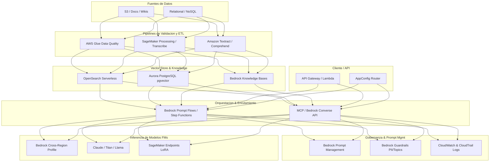

---

# 2. Task 1.1: Analizar Requisitos y Diseñar Soluciones de IA Generativa

## Skill 1.1.1: Diseños Arquitecturales Integrales y Alineación Técnica
El diseño de soluciones GenAI en AWS exige un desacoplamiento estricto entre el consumidor de la inferencia, la lógica de orquestación y el proveedor del modelo de lenguaje.

### Patrones de Integración
1. **Inferencia Síncrona REST / gRPC:**
   - **Caso de uso:** Asistentes conversacionales, completado de código, sistemas interactivos.
   - **Topología:** Amazon API Gateway (REST o HTTP API con soporte de timeout de 29s) -> AWS Lambda -> Amazon Bedrock Runtime (`InvokeModel`).
   - **Streaming en tiempo real:** Para mitigar la latencia percibida (Time to First Token - TTFT), se implementan APIs basadas en WebSockets en API Gateway o Lambda Function URLs con soporte de respuesta en streaming (`InvokeModelWithResponseStream`), transmitiendo fragmentos (*chunks*) mediante Server-Sent Events (SSE).

2. **Inferencia Asíncrona Conducida por Eventos:**
   - **Caso de uso:** Resumen masivo de contratos, procesamiento por lotes de tickets de soporte, transcripción y análisis forense de audio.
   - **Topología:** Amazon S3 (Carga de archivo) -> Amazon EventBridge -> AWS Step Functions -> Amazon Bedrock Batch Inference Job (o SageMaker Asynchronous Inference Endpoint).
   - **Manejo de estados:** Se desacopla la carga útil mediante Amazon SQS y Dead Letter Queues (DLQ) para gestionar picos y reintentos sin saturar cuotas de TPM/RPM.

3. **Estrategias de Despliegue de FMs:**
   - **Serverless Bajo Demanda (Amazon Bedrock On-Demand):** Pago por token consumido (entrada/salida). Óptimo para cargas variables, experimentación y producción con tráfico no predictivo.
   - **Rendimiento Provisionado (Bedrock Provisioned Throughput):** Reserva de Unidades de Modelo (Model Units - MU) para garantizar rendimiento sostenido, compromiso de latencia y soporte para modelos personalizados (fine-tuned) que requieren MUs obligatoriamente.
   - **Endpoints Dedicados en Amazon SageMaker AI:** Para modelos de código abierto altamente modificados (e.g., DeepSeek, Mistral fine-tuned), arquitecturas de inferencia multi-modelo (MME) o hardware personalizado (instancias AWS Inferentia2 con AWS Neuron SDK).

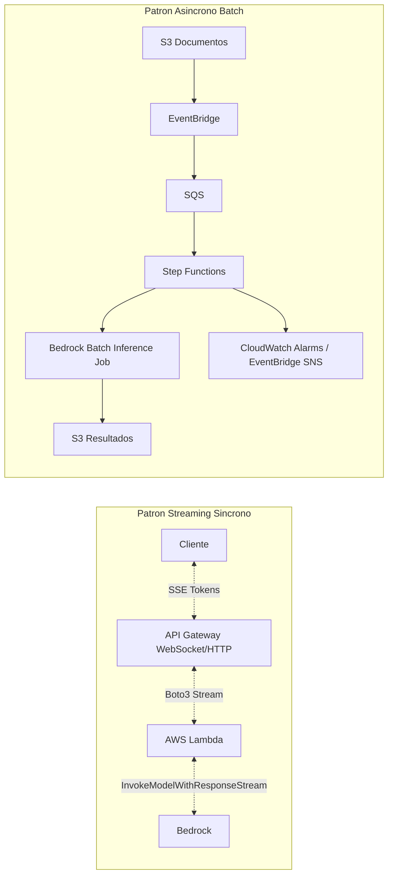

---

## Skill 1.1.2: Pruebas de Concepto (PoC), Validación de Rendimiento y Valor de Negocio
La fase de viabilidad técnica previene la inversión prematura en modelos sobredimensionados o patrones arquitectónicos costosos.

### Metodología de Validación PoC en AWS:
1. **Experimentación en Amazon Bedrock Playgrounds:**
   - Comparación interactiva lado a lado (*Chat, Text, Image*) variando hiperparámetros de inferencia:
     - `temperature` (0.0 para determinismo analítico, 0.7-1.0 para creatividad/síntesis abierta).
     - `top_p` (muestreo de núcleo) y `top_k` (filtrado de los $k$ tokens más probables).
     - `stop_sequences` (delimitadores de parada para detener la generación de texto estructurado).
2. **Framework Cuantitativo de Evaluación (Amazon Bedrock Model Evaluation):**
   - **Evaluación Automática:**
     - *Métricas estándar:* ROUGE (solapamiento de n-gramas para resumen), BLEU (precisión de n-gramas para traducción), BERTScore (similitud semántica contextual), F1-Score (extracción de entidades).
     - *Métricas de RAG:* Answer Relevance, Faithfulness/Factual Groundedness, Context Recall, Context Precision.
   - **Evaluación con Humanos en el Bucle (Human-in-the-Loop):**
     - Integración con Amazon SageMaker Ground Truth. Equipos internos o revisores externos evalúan métricas subjetivas: tono de marca, estilo, exactitud técnica, toxicidad percibida.
3. **Métricas de Rendimiento e Impacto Financiero:**
   - **TTFT (Time to First Token):** Latencia hasta el primer byte emitido. Crítico para la experiencia de usuario interactiva (umbral objetivo: $< 1.2$ segundos).
   - **Throughput (Tokens por segundo):** Velocidad de generación sostenida.
   - **Cálculo de TCO (Total Cost of Ownership):** Modelado del costo diario = $\sum (	ext{Tokens Input} 	imes P_{in} + 	ext{Tokens Output} 	imes P_{out}) + 	ext{Costo de Vector Store} + 	ext{Cómputo ETL}$.

---

## Skill 1.1.3: Componentes Estandarizados y AWS Well-Architected GenAI Lens
La industrialización de soluciones exige marcos estandarizados provistos por el AWS Well-Architected Tool aplicando la lente especializada en IA Generativa:

### Pilares del AWS GenAI Lens:
1. **Excelencia Operativa:**
   - Instrumentación de trazabilidad con AWS X-Ray y Amazon CloudWatch Application Signals.
   - Versionado riguroso de artefactos: Datos de entrenamiento, Embeddings, Prompts y Model IDs vinculados en un registro central.
2. **Seguridad:**
   - Aislamiento de red mediante VPC Endpoints (AWS PrivateLink) para Amazon Bedrock y SageMaker, bloqueando el tráfico hacia la Internet pública.
   - Aplicación del principio de mínimo privilegio en políticas de IAM con roles específicos por función (`bedrock:InvokeModel`, `bedrock:ApplyGuardrail`).
   - Cifrado integral utilizando AWS KMS con Claves Administradas por el Cliente (CMK) para llamadas a Bedrock, índices vectoriales y almacenamiento en S3.
3. **Fiabilidad:**
   - Implementación de cuotas de respaldo, estrategias de reintento con *jitter* exponencial y mecanismos de conmutación por error ante límites de cuota (HTTP 429 *ThrottlingException*).
4. **Eficiencia del Rendimiento:**
   - Selección del tamaño del modelo adecuado (*Right-sizing*): No usar un modelo de 70B parámetros si un modelo compacto optimizado de 8B o un modelo tipo Claude Haiku cumple el SLA con un 80% menos de latencia.
5. **Optimización de Costos:**
   - Uso intensivo de almacenamiento en caché de contexto (*Context Caching* / *Prompt Caching*) en modelos compatibles para reducir el costo de tokens de entrada estáticos hasta en un 90%.
   - Implementación de cuotas de presupuesto en AWS Budgets con alertas automatizadas a nivel de proyecto.
6. **Sostenibilidad:**
   - Reducción de la huella de carbono minimizando inferencias innecesarias mediante enrutamiento semántico y uso de chips energéticamente eficientes como AWS Trainium y AWS Inferentia2.

---

# 3. Task 1.2: Seleccionar y Configurar Modelos Fundacionales (FMs)

## Skill 1.2.1: Evaluación y Selección de FMs con Base en Benchmarks y Limitaciones
La selección del modelo debe guiarse por una matriz multidimensional entre capacidades técnicas, límites de contexto, SLA y economía operativa.

### Familias de Modelos Clave en Amazon Bedrock:
- **Anthropic Claude (3.5 Sonnet, 3.5 Haiku, 3 Opus):** Liderazgo en razonamiento complejo, depuración y generación de código (HumanEval $> 90\%$), análisis multimodal avanzado y soporte de contexto amplio (200k tokens con retención de aguja en pajar del 99.9%).
- **Amazon Titan (Text Premier, Text Express, Multimodal Embeddings):** Alta rentabilidad, integración nativa con cumplimiento estricto de AWS, indeminizaciones de propiedad intelectual y bajo costo por token.
- **Meta Llama (3.1 / 3.2 / 3.3 - 8B, 70B, 405B):** Pesos abiertos, alta capacidad de personalización, soporte de múltiples idiomas y excelente rendimiento en tareas de transformación estructurada.
- **Mistral AI (Mistral 7B, Mixtral 8x7B, Mistral Large):** Eficiencia en razonamiento matemático, arquitectura Mixture-of-Experts (MoE) que reduce la latencia activa por token generado.
- **Cohere (Command R, Command R+, Embed Multilingual):** Especializado en flujos de RAG avanzados, generación con citas directas y compatibilidad de herramientas empresariales.

### Benchmarks Clave a Considerar:
- **MMLU (Massive Multitask Language Understanding):** Conocimiento general factual y razonamiento interdisciplinario.
- **GSM8K:** Razonamiento matemático en múltiples pasos.
- **HumanEval:** Síntesis y validación sintáctica de código.
- **HELM (Holistic Evaluation of Language Models):** Robustez, sesgo, calibración y equidad.

---

## Skill 1.2.2: Arquitecturas Desacopladas para Selección Dinámica de Modelos
Un error crítico en GenAI es acoplar rígidamente el código de la aplicación a los parámetros específicos de un proveedor (vendor lock-in). Se implementa el patrón **Model Router** desacoplado:

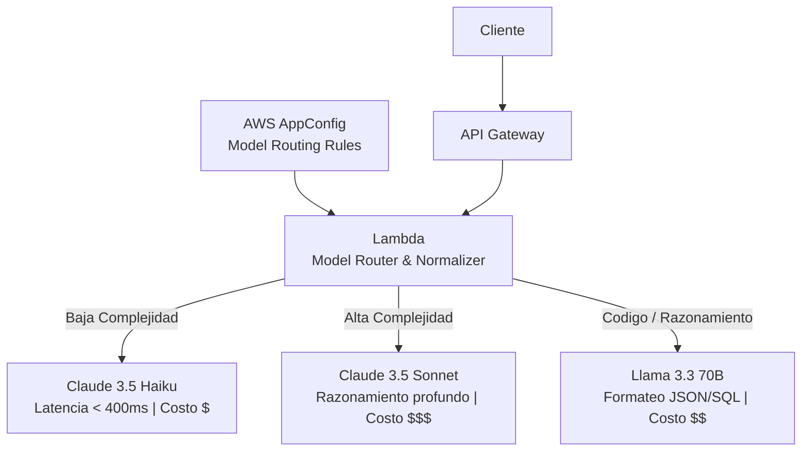

### Implementación Arquitectural con AWS AppConfig y Bedrock Converse API:
1. **AWS AppConfig:** Almacena dinámicamente pesos de enrutamiento, modelos asignados por nivel de usuario (e.g. Free vs Enterprise) o reglas de complejidad de tokens sin requerir redepliegues de código.
2. **Bedrock Converse API (`bedrock_runtime.converse`):** Estandariza la estructura del payload. Independientemente de si se invoca Titan, Claude, Mistral o Llama, el esquema JSON de entrada (`messages`, `system`, `inferenceConfig`) y salida permanece idéntico.

#### Fragmento de Código de Enrutador Dinámico (Python Boto3):
```python
import json
import boto3

bedrock = boto3.client('bedrock-runtime', region_name='us-east-1')
appconfig = boto3.client('appconfigdata')

def get_target_model(task_type: str) -> str:
    # Consulta dinámica de configuración en caliente
    response = appconfig.get_latest_configuration(ConfigurationToken="TokenXYZ")
    config = json.loads(response['Configuration'].read().decode('utf-8'))
    return config.get('routing_table', {}).get(task_type, "anthropic.claude-3-5-haiku-20241022-v1:0")

def invoke_dynamic_model(messages, system_prompt, task_type="fast_query"):
    model_id = get_target_model(task_type)
    
    # Invocación unificada mediante Bedrock Converse API
    response = bedrock.converse(
        modelId=model_id,
        messages=messages,
        system=[{"text": system_prompt}],
        inferenceConfig={
            "temperature": 0.2,
            "maxTokens": 1024,
            "topP": 0.9
        }
    )
    return response['output']['message']['content'][0]['text']
```

---

## Skill 1.2.3: Resiliencia, Circuit Breakers, Cross-Region Inference y Degradación Suave

### 1. Amazon Bedrock Cross-Region Inference:
Permite enrutar dinámicamente el tráfico de inferencia a través de múltiples regiones de AWS para maximizar la disponibilidad y sortear picos de demanda regionales o límites de cuota de servicio (*Service Quotas*).
- **Perfiles de Inferencia Geográficos del Sistema (System Inference Profiles):** Agrupan capacidades en regiones como US (`us.anthropic.claude-3-5-sonnet-20241022-v2:0`) o EU (`eu.anthropic.claude-3-5-sonnet-20241022-v2:0`).
- **Application Inference Profiles:** Permiten definir políticas personalizadas de enrutamiento cross-region asociando métricas de CloudWatch y presupuestos por aplicación.

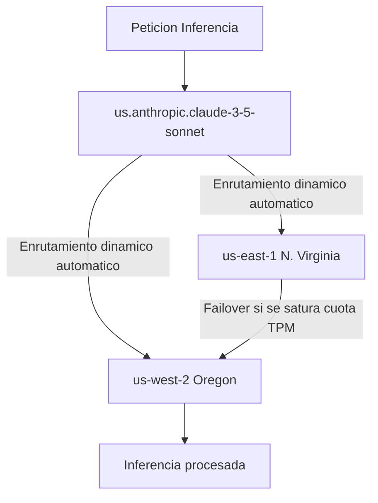

### 2. Patrón Circuit Breaker con AWS Step Functions y DynamoDB:
#### Definición en Amazon States Language (ASL) para el Disyuntor (Circuit Breaker):
```json
{
  "Comment": "Patrón Circuit Breaker para Invocación Resiliente de FMs en Bedrock",
  "StartAt": "CheckCircuitState",
  "States": {
    "CheckCircuitState": {
      "Type": "Task",
      "Resource": "arn:aws:states:::dynamodb:getItem",
      "Parameters": {
        "TableName": "CircuitBreakerState",
        "Key": {
          "ServiceName": {"S": "Bedrock-Claude-Sonnet"}
        }
      },
      "ResultPath": "$.circuit",
      "Next": "EvaluateCircuitState"
    },
    "EvaluateCircuitState": {
      "Type": "Choice",
      "Choices": [
        {
          "Variable": "$.circuit.Item.State.S",
          "StringEquals": "OPEN",
          "Next": "RouteToFallbackModel"
        }
      ],
      "Default": "InvokePrimaryBedrockModel"
    },
    "InvokePrimaryBedrockModel": {
      "Type": "Task",
      "Resource": "arn:aws:states:::bedrock:invokeModel",
      "Parameters": {
        "ModelId": "arn:aws:bedrock:us-east-1::foundation-model/anthropic.claude-3-5-sonnet-20241022-v2:0",
        "Body": {
          "anthropic_version": "bedrock-2023-05-31",
          "max_tokens": 1024,
          "messages": "$.messages"
        }
      },
      "Retry": [
        {
          "ErrorEquals": ["Bedrock.ThrottlingException", "Bedrock.ModelTimeoutException"],
          "IntervalSeconds": 1,
          "MaxAttempts": 3,
          "BackoffRate": 2.0
        }
      ],
      "Catch": [
        {
          "ErrorEquals": ["States.ALL"],
          "ResultPath": "$.error",
          "Next": "TripCircuitOpen"
        }
      ],
      "End": true
    },
    "TripCircuitOpen": {
      "Type": "Task",
      "Resource": "arn:aws:states:::dynamodb:updateItem",
      "Parameters": {
        "TableName": "CircuitBreakerState",
        "Key": { "ServiceName": {"S": "Bedrock-Claude-Sonnet"} },
        "UpdateExpression": "SET #s = :open, #ts = :now",
        "ExpressionAttributeNames": { "#s": "State", "#ts": "LastTripTime" },
        "ExpressionAttributeValues": {
          ":open": {"S": "OPEN"},
          ":now": {"N": "1774358400"}
        }
      },
      "Next": "RouteToFallbackModel"
    },
    "RouteToFallbackModel": {
      "Type": "Task",
      "Resource": "arn:aws:states:::bedrock:invokeModel",
      "Parameters": {
        "ModelId": "arn:aws:bedrock:us-east-1::foundation-model/anthropic.claude-3-5-haiku-20241022-v1:0",
        "Body": {
          "anthropic_version": "bedrock-2023-05-31",
          "max_tokens": 1024,
          "messages": "$.messages"
        }
      },
      "End": true
    }
  }
}
```

Cuando un modelo sufre errores 5xx persistentes o degradación extrema de latencia:
1. **Estado CERRADO (Closed):** Las llamadas fluyen con normalidad hacia el modelo primario.
2. **Estado ABIERTO (Open):** Tras $N$ fallos consecutivos registrados en DynamoDB, el interruptor se abre; las solicitudes se desvían de inmediato al modelo secundario o fallback sin llamar al primario.
3. **Estado MEDIO ABIERTO (Half-Open):** Tras un periodo de enfriamiento (e.g. 60 segundos), se permite el paso de una solicitud canaria para comprobar la recuperación del servicio primario.

### 3. Estrategias de Degradación Suave (Graceful Degradation):
- **Nivel 1:** Si falla el modelo insignia (e.g. Claude 3.5 Sonnet), conmutar a modelo ágil (Claude 3.5 Haiku o Llama 3.1 70B).
- **Nivel 2:** Si falla la capa de FMs externos, responder con respuestas semánticamente cacheadas en Amazon ElastiCache (Redis) o DynamoDB.
- **Nivel 3:** Respuesta predefinida con derivación controlada a agentes humanos o generación determinística offline.

---

## Skill 1.2.4: Personalización, PEFT (LoRA), SageMaker Model Registry y Ciclo de Vida

### Espectro de Adaptación de Modelos:


### 1. Parámetros Eficientes: Low-Rank Adaptation (LoRA) y QLoRA:
- **Concepto Matemático:** Modela la actualización de la matriz de pesos densos $W_0 \in \mathbb{R}^{d 	imes k}$ mediante una descomposición de bajo rango:
  $$\Delta W = B \cdot A, \quad 	ext{donde } B \in \mathbb{R}^{d 	imes r}, A \in \mathbb{R}^{r 	imes k}, \quad r \ll \min(d, k)$$
- **Beneficio Técnico:** Congela el 99% de los pesos originales del modelo; únicamente se entrenan y almacenan los adaptadores (matrices $A$ y $B$), reduciendo los requerimientos de VRAM en un 70-80% y permitiendo almacenar adaptadores de pocos megabytes.
- **QLoRA:** Aplica cuantización de 4 bits (NormalFloat4) al modelo base congelado con des-cuantización dinámica durante el cálculo de gradientes.

### 2. Amazon SageMaker Model Registry & CI/CD Pipelines:
- **SageMaker Model Registry:** Catálogo centralizado donde se versionan los modelos afinados, sus artefactos (`model.tar.gz`), métricas de validación y linaje de datos.
- **Políticas de Despliegue Automatizado (Blue/Green & Canary):**
  - Configuración de SageMaker Production Variants con pesos de tráfico graduales (`InitialVariantWeight: 0.1` -> `0.9`).
  - Alarmas de Amazon CloudWatch conectadas a rollback automático si la tasa de errores de inferencia supera el 1%.
- **Retiro y Ciclo de Vida:** Archivo de versiones deprecadas, vaciado de endpoints no utilizados mediante tareas programadas de EventBridge para optimizar costos de cómputo GPU.

---

# 4. Task 1.3: Implementar Pipelines de Validación y Procesamiento de Datos

## Skill 1.3.1: Workflows de Validación de Calidad de Datos (Glue Data Quality / Data Wrangler)
Los modelos fundacionales son altamente sensibles a la degradación de sus entradas (*Garbage In, Garbage Out*).

### AWS Glue Data Quality:
Utiliza el motor **Data Quality Definition Language (DQDL)** para definir aserciones declarativas antes de que los datos alimenten el proceso de embedding o fine-tuning.

```
Rules = [
    IsComplete "contract_text",
    ColumnLength "contract_text" between 50 and 50000,
    RowCount > 1000,
    IsUtf8Encoded "contract_text",
    CustomSql "SELECT COUNT(*) FROM primary WHERE prompt_tokens > 8000" == 0
]
```

### Pipeline de Validación Automatizado:
1. Ingesta a S3 Landing Zone.
2. AWS Glue Job ejecuta la evaluación DQDL. Si la puntuación de calidad cae por debajo del 95%:
   - Se frena el pipeline.
   - Se envían los registros anómalos a un bucket de cuarentena S3 (`s3://data-lake-quarantine/`).
   - Se dispara una notificación SNS y una métrica personalizada en Amazon CloudWatch.

---

## Skill 1.3.2: Procesamiento de Tipos de Datos Complejos y Multimodales

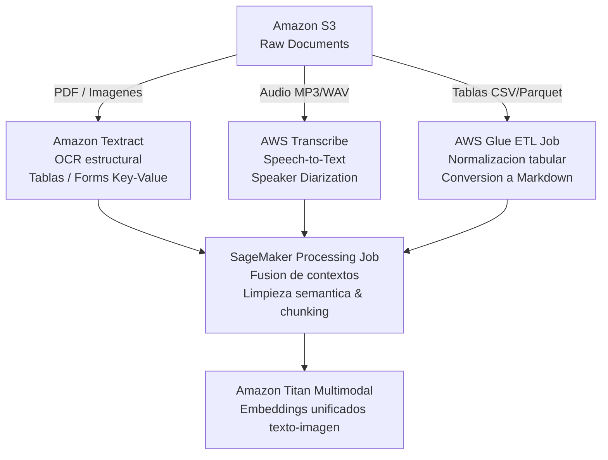

1. **Documentos Complejos e Imágenes:**
   - **Amazon Textract:** Extracción de texto preservando jerarquía de lectura (`Layout Analysis`), extracción de tablas en formato relacional o Markdown (`Tables API`) y formularios clave-valor (`Forms API`).
2. **Audio:**
   - **Amazon Transcribe:** Transcripción con identificación de locutores (*Speaker Diarization*), eliminación de PII en audio (*PII Redaction*) y generación de marcas de tiempo a nivel de palabra para indexación temporal.
3. **Datos Tabulares:**
   - Transformación de tablas en estructuras interpretables para LLMs: Serialización en formato Markdown o bloques JSON delimitados, evitando aplanamiento ciego que destruye las relaciones de filas y columnas.

---

## Skill 1.3.3: Formateo y Serialización de Entrada Específica por Modelo
Cada familia de modelos exige convenciones estrictas de serialización:

### 1. Amazon Bedrock Converse API Format (Estándar Multi-Modelo):
```json
{
  "modelId": "anthropic.claude-3-5-sonnet-20241022-v2:0",
  "messages": [
    {
      "role": "user",
      "content": [
        {"text": "Analiza las siguientes métricas de riesgo y resume las discrepancias:"},
        {
          "document": {
            "name": "AuditReport",
            "format": "pdf",
            "source": {
              "bytes": "JVBERi0xLjQKJ..."
            }
          }
        }
      ]
    }
  ],
  "system": [
    {"text": "Eres un auditor sénior. Responde estrictamente en formato JSON validado."}
  ],
  "inferenceConfig": {
    "maxTokens": 2048,
    "temperature": 0.0
  }
}
```

### 2. SageMaker AI Custom Endpoints:
Requiere empaquetado del script de servicio `inference.py`:
- `input_fn`: Deserializa JSON, Parquet o bytes crudos y valida esquemas con Pydantic.
- `predict_fn`: Ejecuta la tokenización con tensores distribuidos en GPU.
- `output_fn`: Serializa las probabilidades o textos generados en la respuesta HTTP esperada.

---

## Skill 1.3.4: Enriquecimiento, Normalización y Anonimización de Datos

1. **Detección y Enmascaramiento de PII con Amazon Comprehend:**
   - Identificación de entidades sensibles: Números de Seguridad Social (SSN), tarjetas de crédito, direcciones, teléfonos.
   - Enmascaramiento dinámico mediante Lambda antes de almacenar texto en la base de datos vectorial o enviarlo a la ventana de contexto de un FM externo.
2. **Re-formateo y Normalización Semántica con Modelos Compactos:**
   - Uso de modelos de bajo costo (Amazon Titan Text Express o Claude Haiku) como preprocesadores en línea:
     - Normalización de formatos de fecha inconsistentes a ISO 8601.
     - Expansión de acrónimos corporativos.
     - Extracción y adición de metadatos de clasificación taxonómica.

---

# 5. Task 1.4: Diseñar e Implementar Soluciones de Bases de Datos Vectoriales

## Skill 1.4.1: Arquitecturas Avanzadas de Vector Stores para Aumento de FMs

### Comparativa de Opciones de Almacenamiento Vectorial en AWS:

| Criterio | Amazon Bedrock Knowledge Bases (Managed) | Amazon OpenSearch Service / Serverless | Amazon Aurora PostgreSQL (pgvector) | Amazon DynamoDB + Vector Integration |
| :--- | :--- | :--- | :--- | :--- |
| **Paradigma** | Completamente administrado (Serverless) | Motor de búsqueda distribuido | Base de datos relacional transaccional | Clave-Valor NoSQL de latencia ultra baja |
| **Plugin / Motor** | Integrado (OpenSearch Serverless por defecto) | Vector Engine / Neural Search (HNSW / IVF) | Extensión nativa `pgvector` (HNSW / IVFFlat) | Almacén de metadatos + índice externo |
| **Caso de Uso Ideal** | Implementación ágil de RAG sin gestión de infra | Búsqueda a escala masiva, híbrida y logs | Aplicaciones corporativas con datos ACID relacionales | Búsqueda por clave de alta concurrencia |
| **Capacidades Híbridas** | Automáticas (BM25 + Dense) | Nativo altamente personalizable | Requiere joins relacionales + filtros vectoriales | Limitado a filtrado de atributos clave |

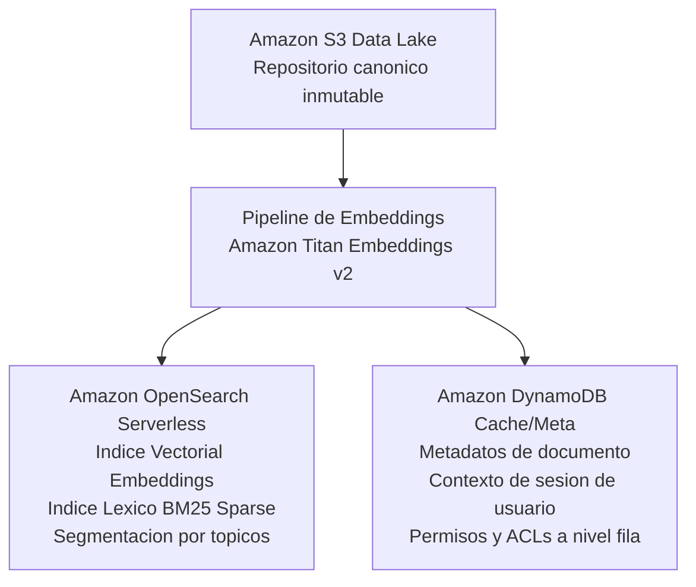

---

## Skill 1.4.2: Frameworks de Metadatos y Particionamiento Contextual
Un vector sin metadatos carece de contexto de gobernanza. Se debe estructurar un esquema unificado de atributos por documento:

### Estructura de Metadatos en Amazon Bedrock Knowledge Bases:
Para cada archivo `documento.pdf` en S3, se añade un archivo complementario `documento.pdf.metadata.json`:
```json
{
  "metadataAttributes": {
    "department": "Legal",
    "document_type": "Master Services Agreement",
    "classification_level": "Restricted",
    "effective_date": "2026-01-15",
    "owner_id": "usr-84920",
    "acl_groups": ["group-legal-core", "group-exec-audit"],
    "version": "3.1"
  }
}
```

### Pre-filtrado vs Post-filtrado de Metadatos:
- **Pre-filtrado (Recomendado):** La consulta vectorial se ejecuta exclusivamente sobre el subconjunto de vectores que cumplen el predicado booleano (`department == 'Legal' AND effective_date >= '2026-01-01'`). Garantiza aislamiento multi-inquilino (*multi-tenancy*), seguridad y reduce drásticamente el espacio de búsqueda.
- **Post-filtrado:** Se calculan los $K$ vecinos más cercanos sobre todo el espacio y luego se descartan los que no cumplen los atributos. **Anti-patrón:** Si los $K$ vectores más cercanos pertenecen a otro departamento, el filtrado posterior devolverá cero resultados útiles.

---

## Skill 1.4.3: Arquitecturas de Alto Rendimiento a Escala (Sharding, HNSW, IVF, Cuantización)

### Algoritmos de Indexación Vectorial:
1. **HNSW (Hierarchical Navigable Small World):**
   - Construye un grafo multicapa de proximidad.
   - **Ventajas:** Búsqueda extraordinariamente rápida ($O(\log N)$) con alto nivel de recall ($> 95\%$).
   - **Desventajas:** Alto consumo de memoria RAM para almacenar el grafo.
   - **Parámetros clave:**
     - `m` (Número máximo de conexiones bidireccionales por nodo: típicamente 16 a 64).
     - `efConstruction` (Profundidad de exploración durante la indexación: típicamente 100 a 512).
     - `efSearch` (Profundidad de exploración durante la consulta: controla el balance latencia vs recall).

2. **IVF (Inverted File Index):**
   - Agrupa los vectores en $C$ centroides mediante clustering k-means.
   - **Ventajas:** Menor huella de memoria.
   - **Desventajas:** Menor precisión si el número de sondas (*probes*) es muy bajo.

### Técnicas de Compresión y Cuantización:
- **Scalar Quantization (SQ8):** Convierte vectores flotantes de 32 bits (FP32) en enteros de 8 bits (INT8), reduciendo la memoria en un 75% con una pérdida despreciable de precisión.
- **Product Quantization (PQ):** Segmenta los vectores en sub-vectores y los asigna a cuantizadores vectoriales para datasets a escala de cientos de millones de vectores.


#### Configuración de Índice Vectorial HNSW en Amazon OpenSearch Service:
```json
PUT /enterprise_knowledge_index
{
  "settings": {
    "index": {
      "knn": true,
      "knn.algo_param.ef_search": 128,
      "number_of_shards": 3,
      "number_of_replicas": 2
    }
  },
  "mappings": {
    "properties": {
      "document_id": { "type": "keyword" },
      "department": { "type": "keyword" },
      "security_clearance": { "type": "keyword" },
      "created_at": { "type": "date" },
      "content": { 
        "type": "text",
        "analyzer": "standard"
      },
      "vector_embedding": {
        "type": "knn_vector",
        "dimension": 1024,
        "method": {
          "name": "hnsw",
          "space_type": "cosinesimil",
          "engine": "nmslib",
          "parameters": {
            "ef_construction": 256,
            "m": 24
          }
        }
      }
    }
  }
}
```

### Estrategias de Sharding en OpenSearch Service:
- Tamaño óptimo de shard para índices vectoriales: entre 10 GB y 30 GB.
- Distribución de réplicas en múltiples Zonas de Disponibilidad (Multi-AZ) con *Zone Awareness* para soportar concurrencias de lectura masivas.

---

## Skill 1.4.4: Conectores e Integración con Repositorios Empresariales
Amazon Bedrock Knowledge Bases provee conectores nativos gestionados:
- **Conectores de Datos:** Amazon S3, Confluence, Microsoft SharePoint Online, Salesforce, Web Crawler corporativo.
- **Mecanismos de Sincronización:** Extracción diferencial utilizando APIs de control de cambios de los proveedores SaaS, preservando permisos de acceso ACL nativos cuando se integran con identidades corporativas.

---

## Skill 1.4.5: Mantenimiento, Sincronización Incremental y Manejo de Tombstones
Una base vectorial desactualizada induce a alucinaciones críticas.

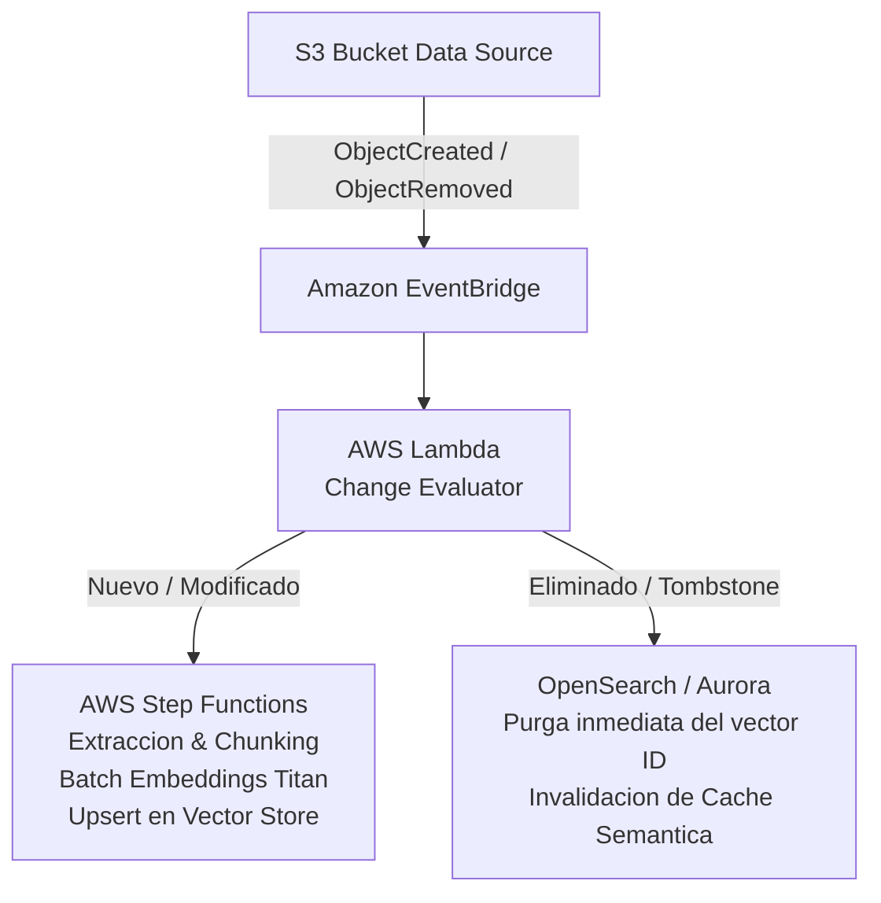

- **Manejo de Tombstones (Borrado Suave y Purga Dura):** Cuando un documento de origen se borra en S3, se emite un evento que dispara un proceso de purga inmediata en el almacén vectorial para eliminar todos los fragmentos (*chunks*) asociados al `document_id`.

---

# 6. Task 1.5: Diseñar Mecanismos de Recuperación para Aumento de FMs (RAG)

## Skill 1.5.1: Estrategias Avanzadas de Segmentación de Documentos (Chunking)

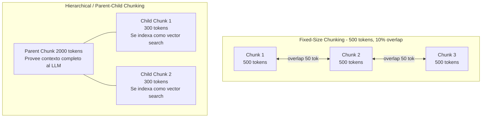

### Clasificación Técnica de Chunking:
1. **Fixed-Size Chunking con Overlap:**
   - Define un límite de tokens fijos (e.g. 512 tokens) con solapamiento (e.g. 10-20%). Simple pero puede romper tablas o fragmentar ideas semánticas a mitad de oración.
2. **Recursive Character Chunking:**
   - Intenta dividir jerárquicamente por separadores naturales en orden: saltos de párrafo (`

`), saltos de línea (`
`), puntos oracionales (`. `) y espacios.
3. **Hierarchical / Parent-Child Chunking (Nativo en Bedrock Knowledge Bases):**
   - Se indexan fragmentos hijos pequeños (e.g. 250 tokens) para maximizar la precisión de la similitud vectorial.
   - Al recuperarse el fragmento hijo, se extrae el fragmento padre completo (e.g. 1500 tokens) para alimentar la ventana de contexto del FM, resolviendo la disyuntiva entre especificidad de búsqueda y amplitud contextual.
4. **Semantic Chunking:**
   - Calcula la distancia coseno entre oraciones adyacentes. Cuando la distancia supera un percentil estadístico predeterminado, se genera un corte de chunk, garantizando coherencia temática intrínseca.

---

## Skill 1.5.2: Selección y Configuración de Modelos de Embeddings

### Modelos de Embeddings en Amazon Bedrock:
- **Amazon Titan Text Embeddings V2 (`amazon.titan-embed-text-v2:0`):**
  - Admite dimensiones configurables: **256, 512 o 1024** dimensiones. Reducir dimensiones a 512 ahorra hasta un 50% de memoria en el vector store con una pérdida de precisión inferior al 1.5%.
  - Longitud máxima de entrada: 8,192 tokens.
  - Normalización unitaria integrada para permitir búsqueda por producto punto ultrarrápida.
- **Cohere Embed English / Multilingual:**
  - Soporte de más de 100 idiomas con compresión nativa de embeddings e instrucciones específicas de tarea (`search_document` vs `search_query`).

---

## Skill 1.5.3: Despliegue y Configuración de Motores de Búsqueda Vectorial

### Configuración en Amazon Aurora PostgreSQL con pgvector:
```sql
-- Habilitar extensión
CREATE EXTENSION IF NOT EXISTS vector;

-- Creación de tabla con metadatos estructurados
CREATE TABLE enterprise_knowledge_base (
    id UUID PRIMARY KEY DEFAULT gen_random_uuid(),
    content TEXT NOT NULL,
    metadata JSONB NOT NULL,
    embedding vector(1024) -- Compatible con Titan V2
);

-- Creación de índice HNSW optimizado para distancia Coseno
CREATE INDEX idx_hnsw_embedding ON enterprise_knowledge_base 
USING hnsw (embedding vector_cosine_ops)
WITH (m = 24, ef_construction = 200);

-- Consulta con Pre-filtrado estricto
SELECT content, metadata, 1 - (embedding <=> $1) AS cosine_similarity
FROM enterprise_knowledge_base
WHERE metadata->>'department' = 'Engineering'
ORDER BY embedding <=> $1
LIMIT 5;
```

---

## Skill 1.5.4: Búsqueda Híbrida (Lexical + Semantic) y Reranking

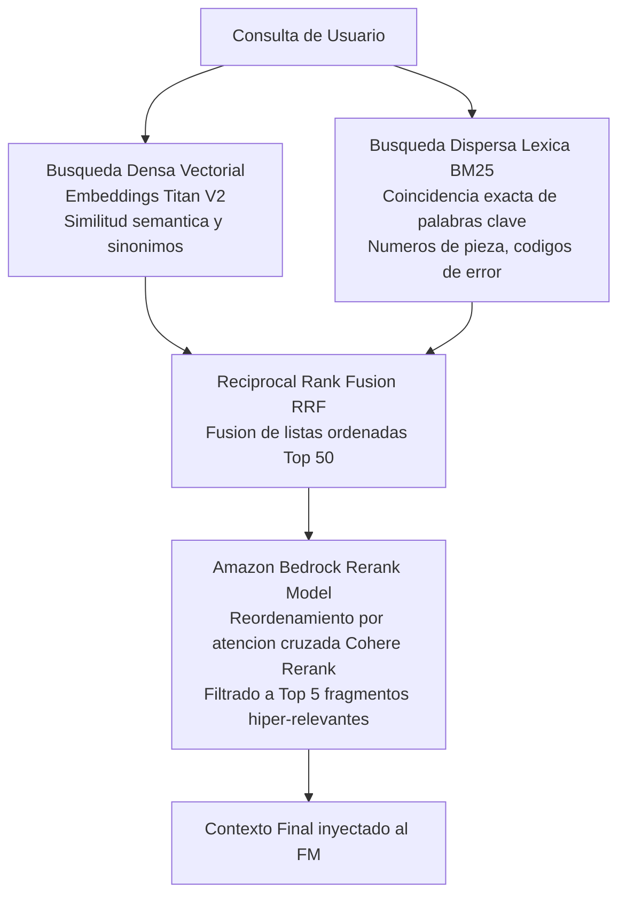

### Algoritmo Reciprocal Rank Fusion (RRF):
#### Implementación de Reciprocal Rank Fusion (RRF) y Bedrock Rerank en Python:
```python
import boto3
from typing import List, Dict, Any

bedrock_agent_runtime = boto3.client('bedrock-agent-runtime', region_name='us-east-1')

def reciprocal_rank_fusion(dense_results: List[Dict], sparse_results: List[Dict], k: int = 60) -> List[Dict]:
    rrf_scores = {}
    docs = {}
    
    # Puntuación densa (vectorial)
    for rank, doc in enumerate(dense_results):
        doc_id = doc['id']
        docs[doc_id] = doc
        rrf_scores[doc_id] = rrf_scores.get(doc_id, 0.0) + 1.0 / (k + rank + 1)
        
    # Puntuación dispersa (BM25)
    for rank, doc in enumerate(sparse_results):
        doc_id = doc['id']
        docs[doc_id] = doc
        rrf_scores[doc_id] = rrf_scores.get(doc_id, 0.0) + 1.0 / (k + rank + 1)
        
    # Ordenar por puntaje RRF descendente
    sorted_doc_ids = sorted(rrf_scores.keys(), key=lambda x: rrf_scores[x], reverse=True)
    return [docs[doc_id] for doc_id in sorted_doc_ids[:50]]

def apply_bedrock_rerank(query: str, candidate_docs: List[Dict], top_n: int = 5) -> List[Dict]:
    text_sources = [{"type": "INLINE", "inlineDocumentSource": {"type": "TEXT", "textDocument": {"text": d['content']}}} for d in candidate_docs]
    
    response = bedrock_agent_runtime.rerank(
        queries=[{"type": "TEXT", "textQuery": {"text": query}}],
        sources=text_sources,
        rerankingConfiguration={
            "type": "BEDROCK_RERANKING_MODEL",
            "bedrockRerankingConfiguration": {
                "numberOfResults": top_n,
                "modelConfiguration": {
                    "modelArn": "arn:aws:bedrock:us-east-1::foundation-model/cohere.rerank-v3-5:0"
                }
            }
        }
    )
    
    reranked_results = []
    for hit in response['results']:
        idx = hit['index']
        reranked_results.append({
            "content": candidate_docs[idx]['content'],
            "score": hit['relevanceScore'],
            "metadata": candidate_docs[idx].get('metadata', {})
        })
    return reranked_results
```

La puntuación combinada para un documento $d$ se calcula como:
$$RRF\_Score(d) = \sum_{m \in M} rac{1}{k + r_m(d)}$$
donde $M$ es el conjunto de métodos de búsqueda (léxica y vectorial), $r_m(d)$ es el rango del documento en el método $m$, y $k$ es una constante de suavizado (típicamente $60$).

---

## Skill 1.5.5: Sistemas Sofisticados de Manejo y Transformación de Consultas

1. **Query Expansion (Expansión de Consultas):**
   - Un modelo ligero genera sinónimos, acrónimos o términos alternativos para aumentar el recall de búsqueda.
2. **Query Decomposition (Descomposición de Consultas Complejas):**
   - Preguntas complejas en varios pasos (e.g. "¿Cómo cambiaron los ingresos de la división Cloud entre 2024 y 2025?") se descomponen en dos subconsultas atómicas ejecutadas en paralelo mediante AWS Step Functions.
3. **HyDE (Hypothetical Document Embeddings):**
   - El LLM genera una respuesta hipotética tentativa sin fuentes. Aunque contenga hechos no verificados, su vector semántico comparte el espacio de características de los documentos reales, mejorando la recuperación de pasajes relevantes.

---

## Skill 1.5.6: Interfaces Estandarizadas de Acceso, Tool Calling y Model Context Protocol (MCP)

### 1. Tool Calling Nativo (Bedrock Converse API):
Permite que el modelo invoque APIs externas o ejecute consultas en vector stores estructurados:
```json
{
  "toolConfig": {
    "tools": [
      {
        "toolSpec": {
          "name": "vector_search_tool",
          "description": "Recupera documentación interna de ingeniería",
          "inputSchema": {
            "json": {
              "type": "object",
              "properties": {
                "query": {"type": "string"},
                "department": {"type": "string"}
              },
              "required": ["query"]
            }
          }
        }
      }
    ]
  }
}
```

### 2. Adopción del Model Context Protocol (MCP):
- **Concepto:** Estándar de comunicación cliente-servidor abierto que normaliza la manera en que los modelos interactúan con repositorios de contexto, herramientas de desarrollo y bases de datos.
- **Implementación en AWS:** Creación de servidores MCP encapsulados en contenedores sobre AWS Fargate o microservicios Lambda, permitiendo que agentes de IA consuman recursos empresariales bajo un protocolo de seguridad y contexto uniforme.

---

# 7. Task 1.6: Implementar Estrategias de Ingeniería de Prompts y Gobernanza

## Skill 1.6.1: Frameworks de Instrucción y Amazon Bedrock Guardrails

```mermaid
graph TD
    Q["Consulta Usuario"] --> GI["Bedrock Guardrail Input<br/>Denied Topics Filter<br/>PII Masking / Redaction<br/>Prompt Attack / Jailbreak Detection"]
    GI -->|"Pasa validacion"| FM["Amazon Bedrock FM"]
    GI -->|"Viola politica"| BLK["Mensaje de Bloqueo Estandar"]
    FM --> GO["Bedrock Guardrail Output<br/>Contextual Grounding Hallucination<br/>Relevance Check<br/>Toxicity & Hate Speech Filter"]
    GO -->|"Pasa validacion"| RESP["Respuesta al Usuario"]
    GO -->|"Viola politica"| BLK
    style BLK fill:#3a1a1a,stroke:#f85149
```

### Amazon Bedrock Guardrails:
#### Especificación JSON de Amazon Bedrock Guardrail (Políticas de Seguridad y Grounding):
```json
{
  "name": "enterprise-compliance-guardrail",
  "description": "Protección corporativa contra fugas de PII, temas vetados y alucinaciones",
  "topicPolicyConfig": {
    "topicsConfig": [
      {
        "name": "FinancialAdvice",
        "definition": "Provisión de asesoramiento financiero directo o recomendaciones de compra de acciones.",
        "type": "DENY",
        "examples": ["¿Debería comprar acciones de Acme Corp hoy?", "¿Cómo invierto mi jubilación?"]
      }
    ]
  },
  "contentPolicyConfig": {
    "filtersConfig": [
      {"type": "HATE", "inputStrength": "HIGH", "outputStrength": "HIGH"},
      {"type": "INSULTS", "inputStrength": "MEDIUM", "outputStrength": "HIGH"},
      {"type": "SEXUAL", "inputStrength": "HIGH", "outputStrength": "HIGH"},
      {"type": "VIOLENCE", "inputStrength": "HIGH", "outputStrength": "HIGH"},
      {"type": "MISCONDUCT", "inputStrength": "HIGH", "outputStrength": "HIGH"}
    ]
  },
  "sensitiveInformationPolicyConfig": {
    "piiEntitiesConfig": [
      {"type": "CREDIT_DEBIT_CARD_NUMBER", "action": "BLOCK"},
      {"type": "US_SOCIAL_SECURITY_NUMBER", "action": "BLOCK"},
      {"type": "EMAIL", "action": "ANONYMIZE"},
      {"type": "PHONE", "action": "ANONYMIZE"}
    ],
    "regexesConfig": [
      {
        "name": "InternalProjectCodeRegex",
        "pattern": "PRJ-[0-9]{4}-[A-Z]{3}",
        "action": "BLOCK",
        "description": "Bloquea códigos de proyecto confidenciales de la compañía"
      }
    ]
  },
  "contextualGroundingPolicyConfig": {
    "filtersConfig": [
      {
        "type": "GROUNDING",
        "threshold": 0.80
      },
      {
        "type": "RELEVANCE",
        "threshold": 0.75
      }
    ]
  },
  "blockedInputMessaging": "La solicitud viola las directivas de seguridad corporativa.",
  "blockedOutputsMessaging": "La respuesta no pudo generarse de acuerdo a las políticas de cumplimiento ético."
}
```

1. **Filtros de Contenido:** Detección de Odio, Insultos, Contenido Sexual, Violencia y Mala Conducta con niveles de umbral configurables (Bajo, Medio, Alto).
2. **Temas Denegados (Denied Topics):** Reglas en lenguaje natural que definen fronteras de negocio (e.g. "Prohibido dar consejos de inversión financiera personalizados").
3. **Filtros de Información Confidencial (PII):** Enmascaramiento o bloqueo automático de tarjetas de crédito, emails, números de cuentas bancarias y patrones personalizados mediante expresiones regulares (Regex).
4. **Comprobación de Fundamentación Contextual (Contextual Grounding Check):**
   - **Groundedness Score:** Evalúa si la respuesta generada por el modelo se basa fielmente en el contexto de referencia recuperado (bloqueando alucinaciones).
   - **Relevance Score:** Evalúa si la respuesta es contextualmente relevante para la pregunta original del usuario.

---

## Skill 1.6.2: Sistemas Interactivos, Memoria Conversacional y Clasificación de Intenciones

### Manejo de Memoria Conversacional:
- **Almacenamiento:** Amazon DynamoDB con políticas de tiempo de vida (TTL) para expiración automática de sesiones.
- **Estrategias de Context Window Management:**
  - *Buffer Window Memory:* Mantiene los últimos $K$ intercambios conversacionales.
  - *Summary Memory:* Un modelo asíncrono sintetiza continuamente la conversación histórica cuando el total de tokens acumulados supera un umbral crítico (e.g., 4000 tokens), preservando entidades clave y descartando redundancias.
- **Detección de Intenciones:** Uso de Amazon Comprehend o clasificadores zero-shot de baja latencia para determinar si la consulta requiere recuperación RAG, ejecución de una acción transaccional o un flujo de clarificación guiado por Step Functions.

---

## Skill 1.6.3: Gobernanza de Prompts, Versionado, Auditoría y Trazabilidad

### 1. Amazon Bedrock Prompt Management:
- Creación de plantillas centralizadas de prompts con soporte de variables parametrizadas (`{{customer_name}}`, `{{context_document}}`).
- Versionado inmutable: Cada cambio en la plantilla genera una versión formalmente etiquetada (`v1`, `v2`).
- Soporte de Alias (`PROD`, `STAGING`, `DEV`), permitiendo promover nuevas versiones de prompts sin modificar el código de la aplicación.

### 2. Trazabilidad y Registro de Auditoría:
- **AWS CloudTrail:** Registra todas las llamadas a nivel de plano de control y API (`CreatePrompt`, `InvokeModel`, `UpdateGuardrail`).
- **Amazon Bedrock Model Invocation Logging:**
  - Registro exhaustivo del prompt de entrada, respuesta generada, llamadas a herramientas y metadatos de tokens.
  - Almacenamiento seguro en Amazon S3 y CloudWatch Logs cifrado con AWS KMS CMK.
  - Cumplimiento de normativas de auditoría legal y gobernanza de IA responsable.

---

## Skill 1.6.4: Aseguramiento de Calidad (QA), Pruebas de Regresión y Fuzzing
- **Pipeline de Pruebas de Regresión de Prompts:** Conjunto de pruebas doradas (*Golden Dataset*) ejecutadas automáticamente mediante AWS CodeBuild y Lambda tras cualquier modificación en los prompts o parámetros del modelo.
- **Pruebas de Inyección y Seguridad (Adversarial Fuzzing):** Evaluación sistemática contra técnicas de *Jailbreaking*, inyecciones indirectas de prompt en documentos RAG y fuga de instrucciones de sistema.

---

## Skill 1.6.5: Técnicas Avanzadas de Prompting y Bucles de Retroalimentación Humana

### Técnicas de Ingeniería de Prompts de Alto Desempeño:
1. **Chain-of-Thought (CoT):** Guía al modelo a explicitar su razonamiento paso a paso antes de emitir la conclusión final, elevando drásticamente el rendimiento en análisis de datos complejos.
2. **ReAct (Reasoning + Acting):** Ciclos continuos de Pensamiento (*Thought*) -> Acción (*Action*) -> Observación (*Observation*).
3. **Uso de Etiquetas Estructuradas XML:** Organización modular del prompt:
```xml
<instructions>
Eres un analista de contratos. Identifica las cláusulas de rescisión.
</instructions>

<context>
{{retrieved_context}}
</context>

<format_rules>
Retorna un objeto JSON con las claves: "clause_id", "risk_level", "mitigation".
</format_rules>
```

### Bucle de Retroalimentación Humana (RLHF / RLAIF en Producción):
- Captura de retroalimentación implícita y explícita (e.g. votos positivos/negativos, copiado de respuestas) persistida en DynamoDB.
- Los datos enriquecidos retroalimentan el repositorio de pocos ejemplos (*few-shot exemplars*) y pipelines de ajuste fino continuo.

---

## Skill 1.6.6: Orquestación Compleja: Amazon Bedrock Prompt Flows y Agentes Autónomos

### Amazon Bedrock Prompt Flows:
Herramienta visual y declarativa para orquestar pipelines de IA Generativa complejos sin código espagueti:
- **Nodos de Flujo:**
  - *Prompt Nodes:* Ejecución de modelos con plantillas predefinidas.
  - *Condition Nodes:* Bifurcación condicional basada en el resultado del nodo previo.
  - *Lambda Nodes:* Integración con lógica de negocio, validación y cómputo determinístico.
  - *Storage / Iterator Nodes:* Procesamiento sobre colecciones de fragmentos de información.
- **Amazon Bedrock Agents:** Agentes autónomos que combinan FMs, Bedrock Knowledge Bases y Action Groups (especificaciones OpenAPI vinculadas a funciones Lambda) para ejecutar planes multi-paso de forma autónoma con trazabilidad completa de razonamiento (*Rationale*).

---

# 8. Matrices de Decisión Técnicas de Referencia

### Matriz 1: Selección de Enfoque de Adaptación

| Enfoque | Cuándo Usarlo | Requisitos de Datos | Costo de Cómputo | Mantenibilidad |
| :--- | :--- | :--- | :--- | :--- |
| **Prompt Engineering** | Casos estándar, extracción, resumen general | 0 a 10 ejemplos | Mínimo | Inmediata |
| **RAG (Knowledge Bases)** | Datos corporativos dinámicos, fuentes actualizadas | Documentos crudos estructurados/no estructurados | Bajo a Medio | Alta (sincronización documental) |
| **PEFT / LoRA** | Adaptación de estilo corporativo, jerga o formato rígido | 1,000 a 50,000 pares prompt-respuesta | Medio (Horas GPU) | Moderada (gestión de adaptadores) |
| **Full Fine-Tuning** | Reentrenamiento de dominio muy especializado | > 100,000 pares curados | Muy Alto (Días GPU) | Compleja (reentrenamientos mayores) |

---

### Matriz 2: Selección de Motor Vectorial en AWS

| Solución | Latencia P95 | Complejidad Ops | Escalabilidad | Capacidad Máxima Recomendada |
| :--- | :--- | :--- | :--- | :--- |
| **Bedrock Knowledge Bases** | < 150 ms | Cero (Serverless) | Automática | Decenas de millones de fragmentos |
| **OpenSearch Serverless** | < 80 ms | Muy Baja | Auto-escalable | > 100 millones de vectores |
| **Aurora PostgreSQL (pgvector)** | < 30 ms | Media (DBA) | Cómputo escalable | Hasta 50 millones de vectores |
| **Amazon Neptune Analytics** | < 100 ms | Media | Gráficos de Conocimiento | Análisis de grafos interconectados |

---

# 9. Seguridad, Cifrado y Cumplimiento Normativo

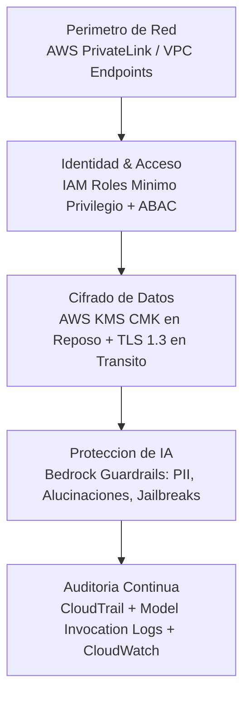

1. **Aislamiento Criptográfico:** Claves CMK dedicadas con rotación anual automática para buckets S3, índices de OpenSearch y registros de invocación.
2. **Protección de Datos en Tránsito y Reposo:** Uso exclusivo de TLS 1.3 con conjuntos de cifrado seguros y cifrado de volúmenes EBS/Aurora con AES-256.
3. **Cumplimiento de Privacidad y Residencialidad:** Configuración estricta de políticas de control de servicios (SCP) de AWS Organizations para restringir el uso de Bedrock a regiones geográficamente aprobadas (e.g. `eu-central-1` o `us-east-1`), garantizando conformidad con regulaciones GDPR, HIPAA y SOC 2.

---

# 10. Conclusiones y Guía de Operaciones en Producción

El Dominio 1 de AWS Generative AI demuestra que el éxito empresarial en IA Generativa no depende únicamente del modelo elegido, sino de la robustez de la arquitectura integral que lo soporta:
- **El desacoplamiento y la resiliencia** mediante Cross-Region Inference, Circuit Breakers y Bedrock Converse API blindan las aplicaciones ante fallos de servicio y cambios tecnológicos rápidos.
- **La calidad de los datos y la sofisticación del RAG** (chunking jerárquico, búsqueda híbrida y reranking) reducen las alucinaciones por debajo de umbrales críticos.
- **La gobernanza proactiva** mediante Bedrock Guardrails y Prompt Management garantiza que las soluciones sean éticas, auditables, conformes a la regulación y financieramente sostenibles.

---
*Fin del Informe Técnico de Referencia.*
