# Dominio 2 — Implementation and Integration
## Informe técnico completo y guía de estudio orientada al examen **AWS Certified Generative AI Developer – Professional (AIP-C01)**

> **Fecha de elaboración:** 23 de septiembre de 2026
> **Alcance:** Content Domain 2 completo — Task 2.1 (Skills 2.1.1–2.1.7), Task 2.2 (2.2.1–2.2.3), Task 2.3 (2.3.1–2.3.5), Task 2.4 (2.4.1–2.4.4), Task 2.5 (2.5.1–2.5.6)
> **Enfoque:** qué exige el examen, con qué servicios y patrones se implementa, cómo se conecta con sistemas existentes, y qué trampas aparecen en las preguntas.
> **Advertencia:** los precios y límites citados son **referencias de EE. UU. vigentes a septiembre de 2026**. Verificá siempre la documentación oficial; varios límites (payloads, timeouts, versiones de protocolo) cambian con frecuencia.

---

## Índice

1. [Resumen ejecutivo](#1-resumen-ejecutivo)
2. [El Dominio 2 en el contexto del examen AIP-C01](#2-el-dominio-2-en-el-contexto-del-examen-aip-c01)
3. [Marco conceptual: los tres planos de la implementación](#3-marco-conceptual-los-tres-planos-de-la-implementación)
4. [Task 2.1 — Soluciones agénticas e integración de herramientas](#4-task-21--soluciones-agénticas-e-integración-de-herramientas)
   - 4.1 [2.1.1 Sistemas autónomos con memoria y estado](#41-skill-211--sistemas-autónomos-con-memoria-y-gestión-de-estado)
   - 4.2 [2.1.2 Razonamiento estructurado (ReAct y CoT)](#42-skill-212--sistemas-de-resolución-de-problemas-complejos)
   - 4.3 [2.1.3 Workflows salvaguardados](#43-skill-213--workflows-de-ia-salvaguardados)
   - 4.4 [2.1.4 Coordinación de modelos](#44-skill-214--sistemas-de-coordinación-de-modelos)
   - 4.5 [2.1.5 Sistemas colaborativos con humanos](#45-skill-215--sistemas-colaborativos-ia--humano)
   - 4.6 [2.1.6 Integraciones de herramientas confiables](#46-skill-216--integraciones-de-herramientas-confiables)
   - 4.7 [2.1.7 Marcos de extensión de modelos y MCP](#47-skill-217--marcos-de-extensión-de-modelos-y-mcp)
5. [Task 2.2 — Estrategias de despliegue de modelos](#5-task-22--estrategias-de-despliegue-de-modelos)
   - 5.1 [2.2.1 Despliegue según la aplicación](#51-skill-221--desplegar-fms-según-la-necesidad-de-la-aplicación)
   - 5.2 [2.2.2 Desafíos propios de los LLM](#52-skill-222--desafíos-de-despliegue-específicos-de-llm)
   - 5.3 [2.2.3 Despliegues optimizados](#53-skill-223--despliegues-optimizados-de-fm)
6. [Task 2.3 — Arquitecturas de integración empresarial](#6-task-23--arquitecturas-de-integración-empresarial)
   - 6.1 [2.3.1 Conectividad con sistemas existentes](#61-skill-231--conectividad-empresarial)
   - 6.2 [2.3.2 Capacidades de IA integradas](#62-skill-232--capacidades-de-ia-integradas-en-aplicaciones-existentes)
   - 6.3 [2.3.3 Marcos de acceso seguro](#63-skill-233--marcos-de-acceso-seguro)
   - 6.4 [2.3.4 Soluciones entre entornos y jurisdicciones](#64-skill-234--soluciones-entre-entornos-y-jurisdicciones)
   - 6.5 [2.3.5 CI/CD y GenAI Gateway](#65-skill-235--cicd-y-arquitecturas-de-genai-gateway)
7. [Task 2.4 — Integraciones de API del FM](#7-task-24--integraciones-de-api-del-fm)
   - 7.1 [2.4.1 Sistemas flexibles de interacción](#71-skill-241--sistemas-flexibles-de-interacción-con-el-modelo)
   - 7.2 [2.4.2 Interacción en tiempo real y streaming](#72-skill-242--sistemas-de-interacción-en-tiempo-real)
   - 7.3 [2.4.3 Sistemas resilientes](#73-skill-243--sistemas-resilientes)
   - 7.4 [2.4.4 Routing inteligente de modelos](#74-skill-244--sistemas-de-routing-inteligente-de-modelos)
8. [Task 2.5 — Patrones de integración de aplicaciones y herramientas de desarrollo](#8-task-25--patrones-de-integración-de-aplicaciones-y-herramientas-de-desarrollo)
   - 8.1 [2.5.1 Interfaces de API para cargas GenAI](#81-skill-251--interfaces-de-api-para-cargas-genai)
   - 8.2 [2.5.2 Interfaces accesibles](#82-skill-252--interfaces-accesibles-para-acelerar-la-adopción)
   - 8.3 [2.5.3 Mejoras de sistemas de negocio](#83-skill-253--mejoras-de-sistemas-de-negocio)
   - 8.4 [2.5.4 Productividad del desarrollador](#84-skill-254--productividad-del-desarrollador)
   - 8.5 [2.5.5 Aplicaciones GenAI avanzadas](#85-skill-255--aplicaciones-genai-avanzadas)
   - 8.6 [2.5.6 Eficiencia de troubleshooting](#86-skill-256--eficiencia-en-troubleshooting-de-aplicaciones-fm)
9. [Arquitectura de referencia](#9-arquitectura-de-referencia)
10. [Cheat sheet: tablas de decisión para el examen](#10-cheat-sheet-tablas-de-decisión-para-el-examen)
11. [Patrones de pregunta y trampas frecuentes](#11-patrones-de-pregunta-y-trampas-frecuentes)
12. [Checklists operativos](#12-checklists-operativos)
13. [Anexos](#13-anexos)
    - A. [Snippets de código](#anexo-a-snippets-de-código)
    - B. [Plantillas de state machine, políticas y consultas](#anexo-b-plantillas-de-state-machine-políticas-y-consultas)
    - C. [Glosario](#anexo-c-glosario)
    - D. [Fuentes consultadas](#anexo-d-fuentes-consultadas)
14. [Plan de repaso y práctica (5 días)](#14-plan-de-repaso-y-práctica-5-días)

---

## 1. Resumen ejecutivo

El Dominio 2 pesa **26 % del contenido puntuado** (≈17 de las 65 preguntas puntuadas) y es el **más amplio en cantidad de skills (25)**. Mide si sabés **construir, desplegar e integrar** un sistema GenAI en una empresa real: agentes, herramientas, endpoints, eventos, gateways, streaming y CI/CD.

Las ocho ideas fuerza:

| # | Idea fuerza | Consecuencia práctica |
|---|---|---|
| 1 | **Un agente es modelo + herramientas + prompt, en un loop; el framework no reemplaza el diseño del loop.** Strands corre **en tu proceso** (sin plano de control); AgentCore es el **runtime administrado** con aislamiento por sesión. | Elegí según quién posee el loop y quién posee el aislamiento: biblioteca vs. plataforma. |
| 2 | **"Agentes proponen, código determinístico valida."** El patrón de 2026 es: el agente razona y propone; Step Functions orquesta, valida y **decide**. | Las acciones con consecuencias nunca salen del modelo directamente. |
| 3 | **La espera debe costar cero.** `waitForTaskToken` pausa la ejecución sin consumir cómputo; el anti-patrón es un Lambda bloqueado esperando al modelo. | Human-in-the-loop y agentes largos se orquestan con callbacks, no con polling ni con esperas facturadas. |
| 4 | **Sincrónico es para el usuario; asíncrono es para el trabajo.** Un LLM no es un API REST: si la generación tarda más que el timeout del borde, la arquitectura está mal. | 202 + job ID + notificación (WebSocket/SSE) o streaming token a token. |
| 5 | **El transporte define la viabilidad del streaming.** API Gateway REST **bufferiza**; WebSocket y Lambda response streaming **no**. | Si el requisito es "ver tokens en tiempo real", la elección del transporte es la respuesta. |
| 6 | **El costo de un endpoint no es el precio por token: es el patrón de tráfico.** Bedrock cuesta $0 en reposo; un endpoint real de SageMaker factura las 24 h. | Tokens vs. horas-instancia: el punto de cruce está en el volumen sostenido, no en el pico. |
| 7 | **La confiabilidad se compone en capas**: clasificar errores → reintentar con backoff+jitter → circuit breaker → bulkhead → fallback → escalar a humano. | "Reintentar" sin jitter es un generador de tormentas de reintentos contra tu propia cuota. |
| 8 | **El GenAI Gateway es el plano de control de la plataforma.** Centraliza routing, cuotas, costos, identidad, guardrails y auditoría. | Sin gateway, cada equipo reinventa la integración y la gobernanza no escala. |

**Mapa mínimo de servicios AWS para este dominio:**

- **Agentes:** Strands Agents (SDK), AgentCore (Harness, Runtime, Memory, Gateway, Identity, Code Interpreter, Browser, Policy, Observability, Evaluations, Registry, Optimization), AWS Agent Squad, Bedrock Agents Classic (en retirada para clientes nuevos).
- **Orquestación y durabilidad:** Step Functions (Standard/Express, `Parallel`, `Map`, `waitForTaskToken`, integración optimizada con Bedrock y AgentCore), Lambda (incl. **durable functions**), EventBridge (+ Pipes, Scheduler, API Destinations), SQS, SNS, DynamoDB Streams.
- **Herramientas:** MCP (servidores en Lambda, ECS, AgentCore Runtime o Gateway), Lambda, API Gateway (incl. **MCP Proxy**), OpenAPI/Smithy, Gateway targets.
- **Despliegue:** Bedrock (on-demand, Batch, PT, Reserved, CRIS), SageMaker AI (real-time, serverless, async, batch transform, multi-model, inference components), Lambda, ECS/EKS.
- **Integración empresarial:** API Gateway, EventBridge, AppSync, Amplify AI Kit, Bedrock Flows, Bedrock Data Automation, AppConfig, Prompt Management.
- **Entrega y gobierno:** CodePipeline/CodeBuild/CodeDeploy, CloudFormation/CDK, Lambda alias con peso, Bedrock Evaluations como *gate*, IAM Identity Center, Cognito, VPC endpoints, CloudWatch/X-Ray.

---

## 2. El Dominio 2 en el contexto del examen AIP-C01

### 2.1 Datos del examen

| Dato | Valor |
|---|---|
| Código | AIP-C01 · Nivel Professional |
| Pesos | D1 **31 %** · **D2 26 %** · D3 20 % · D4 12 % · D5 11 % |
| Preguntas | 65 puntuadas + ~10 no puntuadas (≈**17 preguntas** de este dominio) |
| Aprobación | 750/1000, modelo compensatorio |
| Tipo de pregunta | Elección múltiple (1 de 4) y respuesta múltiple (2+ de 5+, hay que acertar todas) |
| Perfil objetivo | 2+ años en aplicaciones productivas en AWS, ≈1 año hands-on en GenAI |

### 2.2 Qué evalúa el Dominio 2 (enunciado oficial agrupado)

**Task 2.1 — Implementar soluciones agénticas e integración de herramientas.** Sistemas autónomos con memoria y estado (Strands Agents, AWS Agent Squad, MCP); razonamiento estructurado (Step Functions para ReAct y chain-of-thought); workflows salvaguardados (condiciones de parada en Step Functions, timeouts en Lambda, límites de recursos con IAM, circuit breakers); coordinación de modelos (FMs especializados, lógica de agregación propia para ensambles, marcos de selección de modelos); sistemas colaborativos con humanos (Step Functions para revisión y aprobación, API Gateway para feedback, patrones de *human augmentation*); integración de herramientas confiable (Strands API, definiciones de función estandarizadas, Lambda para manejo de errores y validación de parámetros); marcos de extensión (Lambda para servidores MCP stateless livianos, ECS para MCP complejos, bibliotecas cliente MCP).

**Task 2.2 — Estrategias de despliegue de modelos.** Deployment según necesidad (Lambda para invocación on-demand, provisioned throughput de Bedrock, endpoints de SageMaker para híbridos); desafíos específicos de LLM (patrones de contenedores optimizados por memoria, utilización de GPU y capacidad de procesamiento de tokens; estrategias especializadas de carga de modelos); despliegues optimizados (selección de modelos, modelos pre-entrenados más chicos para tareas específicas, **cascading basado en API** para consultas rutinarias).

**Task 2.3 — Arquitecturas de integración empresarial.** Conectividad (integraciones API con sistemas legacy, arquitecturas event-driven para acoplamiento débil, patrones de sincronización de datos); capacidades integradas (API Gateway para microservicios, Lambda para webhooks, EventBridge para integraciones event-driven); acceso seguro (federación de identidad, RBAC para modelos y datos, acceso API con mínimo privilegio); soluciones cross-environment (Outposts para integración on-premises, Wavelength para despliegues en el borde, routing seguro entre nube y on-premises); CI/CD y GenAI Gateway (CodePipeline, CodeBuild, testing automatizado con escaneos de seguridad y rollback, capas de abstracción centralizadas, observabilidad y control).

**Task 2.4 — Integraciones de API del FM.** Interacción flexible (API de Bedrock para requests síncronos desde distintos entornos de cómputo, SDK y SQS para procesamiento asíncrono, API Gateway con validación de requests para clientes propios); interacción en tiempo real (streaming APIs de Bedrock, WebSockets o SSE, API Gateway con *chunked transfer encoding*); sistemas resilientes (backoff exponencial del SDK, rate limiting en API Gateway, fallbacks con degradación elegante, X-Ray para observabilidad entre fronteras de servicio); routing inteligente (routing estático en código, routing dinámico por contenido con Step Functions, routing basado en métricas, transformaciones de request en API Gateway).

**Task 2.5 — Patrones de integración y herramientas de desarrollo.** Interfaces de API para cargas GenAI (API Gateway manejando streaming, gestión de límites de tokens, estrategias de retry para timeouts); interfaces accesibles (Amplify para componentes declarativos, especificaciones OpenAPI, Prompt Flows para builders no-code); mejoras de sistemas de negocio (Lambda para CRM, Step Functions para procesamiento de documentos, Bedrock Data Automation); productividad del desarrollador (Q Developer para generar/refactorizar código, sugerencias de API, testing de componentes, optimización de performance); aplicaciones avanzadas (Strands + Agent Squad para orquestación nativa, Step Functions para patrones de diseño de agentes, Bedrock para prompt chaining); troubleshooting (Logs Insights para analizar prompts y respuestas, X-Ray para trazar llamadas, Q Developer para reconocimiento de patrones de error).

### 2.3 Servicios en alcance relevantes a este dominio

| Categoría | Servicios | Uso en D2 |
|---|---|---|
| **Machine Learning** | **Bedrock** (Runtime, Agents/AgentCore, Knowledge Bases, Flows, Prompt Management, Data Automation, Evaluations), **SageMaker AI** (Endpoints, JumpStart), **Comprehend**, **Transcribe**, **Textract**, **Rekognition**, Q Business | Inferencia, agentes, RAG, orquestación visual, despliegue propio |
| **Compute** | **Lambda** (+ response streaming, durable functions, alias), **ECS/Fargate**, **EKS**, **EC2**, AWS App Runner | Hosting de agentes, MCP servers, APIs |
| **Containers & IaC** | **ECR**, **CodeBuild** (imágenes), **CDK/CloudFormation**, **SAM** | Empaquetado y despliegue reproducible |
| **Application Integration** | **Step Functions**, **EventBridge** (+ Pipes, Scheduler, API Destinations), **SQS**, **SNS**, **AppSync**, **MQ**, **AppFlow** | Orquestación, eventos, colas, webhooks, GraphQL |
| **Networking & Content Delivery** | **API Gateway** (REST/HTTP/WebSocket, MCP Proxy), **CloudFront**, **ALB**, **PrivateLink/EVC**, **Route 53**, **Global Accelerator**, **Wavelength**, **Outposts**. | Exposición de APIs, streaming, edge, híbrido |
| **Developer Tools** | **CodePipeline**, **CodeBuild**, **CodeDeploy**, **CodeArtifact**, **Q Developer**, **X-Ray** | CI/CD, asistencia de código, trazas |
| **Security & Identity** | **IAM**, **IAM Identity Center**, **Cognito**, **KMS**, **Secrets Manager**, **PrivateLink**, **Directory Service** | Federación, mínimo privilegio, secretos |
| **Management** | **CloudWatch** (+ Logs, Live Tail), **AppConfig**, **CloudTrail**, **Systems Manager** | Configuración, observabilidad, flags |
| **Storage/DB** | **S3**, **DynamoDB**, **ElastiCache**, **Aurora**, **OpenSearch** | Estado, memoria, caché, sesiones |
| **Front-end/Mobile** | **Amplify** (AI Kit, Gen 2), **AppSync** | Apps full-stack con IA |

---

## 3. Marco conceptual: los tres planos de la implementación

### 3.1 Separar el "qué" del "quién lo corre"

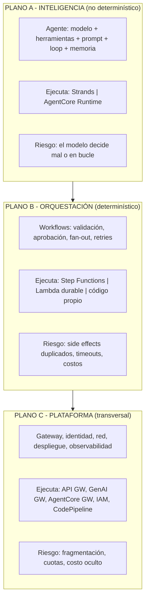

**La regla de oro del dominio:** *si el resultado puede estar mal, alguien más tiene que validarlo; si la espera es larga, la ejecución debe pausarse; si el acceso es compartido, debe pasar por un gateway.*

### 3.2 El espectro de control (elegir dónde pararse)

| Dimensión | Máximo control / más trabajo | Máxima simplicidad / menos control |
|---|---|---|
| **Ejecución del agente** | EC2/EKS con tu propio loop | **AgentCore Harness** (config-driven) → Runtime (tu código) → Strands (biblioteca) |
| **Herramientas** | Implementación propia + IAM | **AgentCore Gateway** (Lambda/OpenAPI/MCP → MCP tools) |
| **Inferencia** | SageMaker endpoint propio (instancias GPU) | **Bedrock on-demand** (tokens, serverless) |
| **Memoria** | DynamoDB/OpenSearch propios | **AgentCore Memory** (short + long-term con estrategias) |
| **Identidad** | IAM/IdP propios | **AgentCore Identity** (Credential provider, borkering OAuth) |
| **Orquestación** | Código propio | **Step Functions / Bedrock Flows** |
| **Gobernanza** | Controles por equipo | **GenAI Gateway centralizado** |

> **Cómo elegir en el examen:** buscá en el enunciado las palabras que indican el eje. "Control total sobre el stack de inferencia" → SageMaker. "Menos administración, pago por token" → Bedrock. "Aislar cada sesión de usuario" → AgentCore Runtime. "Código existente con framework propio (LangGraph/CrewAI)" → AgentCore Runtime (lo soporta). "Sin escribir el loop" → Harness.

### 3.3 Estado: los cuatro tipos que hay que distinguir

| Tipo de estado | Duración | Dónde vive | Ejemplo |
|---|---|---|---|
| **Estado de sesión efímero** | minutos-horas | AgentCore Runtime microVM (hasta 8 h; 15 min de inactividad → terminado), contenedor, Lambda (stateless) | Variables de la sesión, archivos temporales del sandbox |
| **Historial de conversación (short-term memory)** | la sesión | AgentCore Memory (eventos por `sessionId`), DynamoDB, ElastiCache | Turnos del chat |
| **Memoria de largo plazo (long-term)** | persistente | AgentCore Memory (estrategias: semántica, resumen, preferencias, episódica), vector store | Preferencias del usuario, hechos aprendidos, historial entre sesiones |
| **Estado de workflow** | hasta 1 año | Step Functions (historial de ejecución) | Paso en el que va un proceso de aprobación |

> **Trampa:** el estado de sesión **no es durabilidad**. Si el microVM se termina, la sesión termina. La durabilidad requiere Memory, DynamoDB o S3. Frase de AWS: *"los microVMs se terminan y la memoria se sanitiza"*.

### 3.4 El patrón que resume el dominio

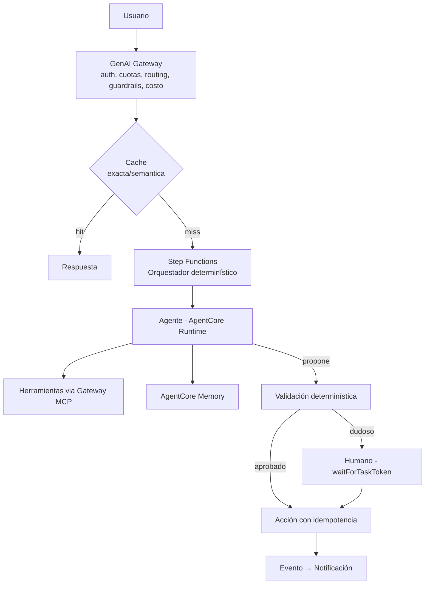

---

## 4. Task 2.1 — Soluciones agénticas e integración de herramientas

### 4.1 Skill 2.1.1 — Sistemas autónomos con memoria y gestión de estado

> *"Strands Agents y AWS Agent Squad para sistemas multi-agente, MCP para interacciones agente-herramienta."*

#### 4.1.1.1 Los tres frameworks que el examen menciona

| Framework | Qué es | Cuándo elegirlo | Notas |
|---|---|---|---|
| **Strands Agents** | SDK open source (Python y TypeScript) de AWS. **Model-driven**: el modelo decide el loop (think → act → observe). Corre **en tu proceso**, sin plano de control hospedado | Querés control total del loop y portabilidad (cualquier modelo, cualquier nube) | Incluye tools (`@tool`), MCP nativo, multi-agente (Graph/Swarm/Workflow), sessions/memory, hooks, streaming, structured output, guardrails, tracing, evals. Hay **Strands harness** (`create_harness()`) con defaults optimizados |
| **AWS Agent Squad** | Framework de orquestación multi-agente (parte del toolkit agéntico de AWS): enruta el pedido al agente más apropiado y coordina clasificación, enrutamiento y ejecución | Varios agentes especializados detrás de una única entrada; el **router decide** | Complementa a Strands: Strands construye el agente, Agent Squad los coordina |
| **Amazon Bedrock Agents (Classic)** | La primera generación de agentes administrados (action groups + prompt templates) | Solo si tenés algo ya desplegado | ⚠️ **Entra en modo mantenimiento para clientes nuevos después del 30 de julio de 2026.** Los builds nuevos deben empezar en **AgentCore** |

#### 4.1.1.2 Strands en una página

```python
from strands import Agent, tool
from strands.models import BedrockModel

@tool
def consultar_pedido(pedido_id: str) -> dict:
    """Devuelve el estado de un pedido. Usar cuando el usuario pide su pedido."""
    return api.get(f"/orders/{pedido_id}")

agent = Agent(
    model=BedrockModel(model_id="us.anthropic.claude-sonnet-4-5-20250929-v1:0"),
    tools=[consultar_pedido],
    system_prompt="Sos un asistente de soporte. Verificá el estado antes de responder.",
    # lifecycle controls: límites de turnos, presupuesto de tokens, cancelación
)
result = agent("¿Dónde está mi pedido 4412?")
```

**Piezas que se preguntan:**
- **`@tool`**: la firma y el docstring del Python **son** el esquema de la herramienta (los type hints generan el JSON Schema). Documentación = calidad de selección de herramienta.
- **Lifecycle controls**: límite de turnos, presupuesto de tokens, cancelación, *stop reasons* — evitan el bucle infinito y la quema de tokens.
- **Hooks**: intercepción en puntos del ciclo de vida (`BeforeToolCallEvent`, `AfterToolCallEvent`, `BeforeNodeCallEvent`, handoffs, errores). Es el punto donde se enganchan **guardrails, políticas, métricas, memoria y reintentos**.
- **Sessions**: `FileSessionManager` (local), `S3SessionManager` (distribuido), persistencia del historial y de las invocaciones de herramientas; permite **reanudar** un workflow interrumpido.
- **Memory**: memoria de largo plazo con estrategias (FAISS/OpenSearch local, Mem0) o **AgentCore Memory** administrada.
- **Structured output**: salida tipada con Zod (TS) o Pydantic (Python).
- **Model providers**: Bedrock, Anthropic, OpenAI, Google, Ollama — portabilidad real.

#### 4.1.1.3 Patrones multi-agente de Strands (los cuatro que hay que conocer)

| Patrón | Quién decide el flujo | Estructura | Cuándo usarlo |
|---|---|---|---|
| **Agents as Tools** | El agente orquestador | Un agente principal usa a otros como herramientas | El patrón más simple y el más subestimado; buen punto de partida |
| **Graph** | El **desarrollador** define nodos y aristas; el LLM decide ramas dentro de ellas | Grafo dirigido, admite ciclos, estado compartido | Proceso con etapas conocidas y ramificaciones condicionales |
| **Swarm** | **Los agentes**, que se pasan el control entre pares | Grupo de agentes que hacen *handoff* autónomo | Soporte multi-dominio, agentes especialistas que colaboran |
| **Workflow** | El desarrollador (DAG fijo) | Tareas con dependencias, ejecución paralela, **se expone como una herramienta** | Operaciones repetibles y determinísticas |

| Campo | Graph | Swarm | Workflow |
|---|---|---|---|
| Concepto | Flujograma definido por el dev; el agente elige el camino | Equipo dinámico; los agentes hacen handoff | DAG predefinido, ejecutado como herramienta no conversacional |
| ¿Permite ciclos? | **Sí** | **Sí** | No |
| Estado compartido | Objeto de estado compartido (lectura/escritura libre) | Contexto/memoria de trabajo con historial de handoffs | Salidas de tareas pasadas como entrada de las dependientes |
| Historial | Transcript completo | Transcript compartido | Contexto por tarea (resumen curado) |
| Manejo de errores | Aristas explícitas de "error" hacia un nodo de manejo | El agente puede derivar a un especialista; se acotan con timeouts y límite de handoffs | Sistémico: el fallo detiene las tareas dependientes |
| Escala bien con | Complejidad del proceso | Cantidad de especialistas | Operaciones repetibles complejas |

> **Regla de examen:** si el enunciado pide *camino previsible y auditable* → **Graph** (o directamente Step Functions). Si pide *agentes que deciden a quién delegar* → **Swarm**. Si pide *una secuencia fija y reutilizable* → **Workflow**. Si pide *"un agente que consulta a especialistas"* → **Agents as Tools**.

#### 4.1.1.4 AgentCore: los servicios que hay que saber nombrar

| Servicio | Qué hace | Detalle que se pregunta |
|---|---|---|
| **Runtime** | Hosting serverless de agentes y herramientas; soporta Strands, LangGraph, CrewAI, LlamaIndex, OpenAI Agents SDK, Google ADK y contenedor propio; MCP y A2A | **Aislamiento por sesión en microVM** (CPU, memoria y filesystem aislados; al terminar la sesión, el microVM se destruye y la memoria se sanitiza); sesiones de **hasta 8 h**; payloads de **hasta 100 MB**; facturación por **cómputo activo** (sin cargo durante la espera de I/O, típicamente la espera del LLM) |
| **Memory** | Memoria de corto plazo (turnos, por `sessionId`) y de largo plazo (entre sesiones, compartible entre agentes) con estrategias extraíbles (semántica, resumen, preferencias, episódica) | Es **complementaria** a Knowledge Bases: KB = biblioteca de referencia; Memory = cuaderno de notas |
| **Gateway** | Convierte APIs, Lambdas y **servidores MCP** en **herramientas MCP**, con autenticación entrante OAuth y saliente (IAM/SigV4/API key), y **Policy** que intercepta cada *tool call* (reglas en **Cedar**, o lenguaje natural→Cedar) | Es el punto donde se aplica autorización **antes** de ejecutar la herramienta; expone observabilidad por herramienta (invocaciones, errores, latencias, `TargetExecutionTime`) |
| **Identity** | Identidad de usuario y de workload; compatible con Cognito, Okta, Entra ID, Auth0; *credential brokering* (canje de tokens) e identidades de agentes | Elimina credenciales de largo plazo en el código del agente |
| **Code Interpreter** | Sandbox administrado para ejecutar código (Python, JS, TS) con **estado persistente dentro de la sesión y aislamiento por sesión** | Modos de red: **Sandbox** (sin red, con acceso a S3), **Public** (internet) y **VPC** (recursos privados) |
| **Browser** | Navegador headless administrado (Playwright/BrowserUse) con sesiones aisladas y *session replay* | Cada sesión de usuario tiene su propio navegador aislado (cookies, caché y filesystem independientes) |
| **Observability** | Telemetría OTEL-compatible hacia CloudWatch (y exportable a terceros) | Trazas de sesión → spans por paso (LLM, herramienta, memoria) |
| **Evaluations** | Evaluación continua de calidad sobre sesiones/trazas | Complementa (no reemplaza) a las trazas: la traza no es un *gate* de calidad |
| **Registry** | Catálogo gobernado de agentes, MCP servers, skills y recursos, con búsqueda semántica y keywords | ⚠️ Estar listado **no implica** que el recurso haya sido evaluado en seguridad: es descubrimiento, no certificación |
| **Policy / Optimization / Payments** | Control determinístico de acciones; mejora continua con A/B testing de prompts y descripciones de herramientas; micropagos de agentes (x402/MPP) | Policy es el control; Optimization es el bucle de mejora |

**Precios de referencia (us-east-1, julio 2026):** ~**USD 0,0895 por vCPU-hora** y ~**USD 0,00945 por GB-hora** para las líneas de cómputo (Runtime/Harness/Browser/Code Interpreter). Memory factura por eventos y retrievals; Gateway, por invocaciones, consultas de búsqueda y herramientas indexadas. **Los tokens del modelo son una línea aparte** (Bedrock) y suelen ser el componente mayor.

> **Criterio de examen sobre AgentCore:** no es "un wrapper de Bedrock Agents". Es una **plataforma modular**: si la pregunta menciona *aislamiento de sesión por usuario*, *trazas por paso*, *herramientas vía MCP con control central*, *memoria entre sesiones* o *agentes por 8 horas*, AgentCore es la respuesta.

---

### 4.2 Skill 2.1.2 — Sistemas de resolución de problemas complejos

> *"Usar Step Functions para implementar patrones ReAct y enfoques de razonamiento chain-of-thought."*

#### 4.2.1 ReAct: el loop, explícito y auditable

**ReAct = Reason + Act.** El ciclo es: *pensar → elegir acción → observar resultado → repetir* hasta tener respuesta.

| Dónde vive el loop | Cómo se implementa | Ventaja | Desventaja |
|---|---|---|---|
| **Dentro del modelo** (tool use nativo) | `Converse` con `toolConfig`; Strands maneja el loop | Menos latencia por paso, más simple | Opaco: hay que instrumentarlo para auditarlo |
| **En tu código** (Strands/otro SDK) | Loop explícito con hooks | Control total, instrumentación | Es código que hay que mantener y testear |
| **En Step Functions** (loop externo) | Estado `Choice` que vuelve a un estado anterior según el resultado; límite de iteraciones | **Cada paso queda registrado**; aprobaciones y timeouts declarativos; el estado sobrevive a fallos | Más latencia (transiciones); overhead de diseño |

**Cuándo el examen espera Step Functions para ReAct:** cuando el requisito es **auditabilidad**, **límite duro de iteraciones**, **aprobación humana intercalada**, **reanudabilidad** o **workflows de horas**. Cuando el requisito es solo "que el agente decida y use herramientas", la respuesta es el loop del SDK (tool use nativo).

#### 4.2.2 Chain-of-thought y prompt chaining

| Técnica | Qué es | Implementación AWS |
|---|---|---|
| **CoT (cadena de pensamiento)** | Pedirle al modelo que razone paso a paso antes de responder; mejora tareas multi-paso | Prompt engineering; modelos con "thinking"/reasoning budget |
| **Prompt chaining** | Descomponer una tarea en **pasos secuenciales de prompts**, donde la salida de uno alimenta el siguiente | **Bedrock Flows** (nodos de prompt encadenados), Step Functions, o código |
| **Chain > 2 pasos con lógica** | Cuando hay ramificaciones, reintentos, validaciones o paralelismo | **Step Functions** (es el patrón recomendado más allá de 2-3 pasos simples) |
| **Descomposición de tareas** | Dividir en subtareas verificables | Agentes as-tools, `Parallel`/`Map` en Step Functions |
| **Verificación explícita** | Un paso valida el anterior (esquema, reglas, juez) | Lambda de validación; structured outputs |

**Ventajas del chaining:** cada paso es más simple de evaluar, se puede cachear y auditar por separado, y permite usar **modelos distintos por paso** (chico para extraer, grande para razonar).
**Riesgos:** más latencia total, propagación de errores entre pasos y más tokens (cada paso repite contexto). Mitigación: structured outputs entre pasos (contrato tipado) y validación temprana.

#### 4.2.3 El patrón "agente propone, código valida" (el más importante de 2026)

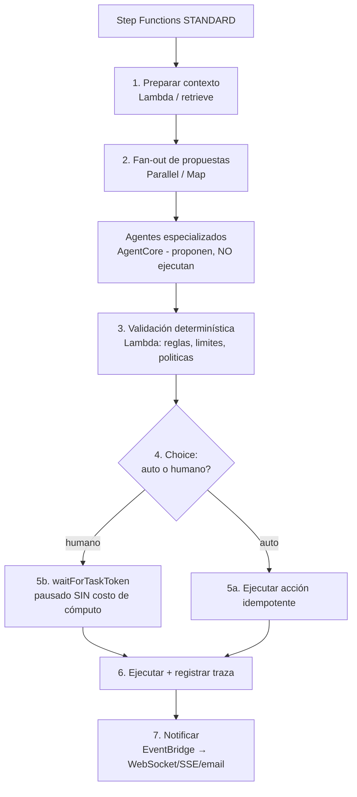

**Los tres principios que el examen premia:**
1. **Ninguna acción con consecuencias se ejecuta directamente desde la salida del modelo.**
2. **Los casos claros se auto-confirman; los ambiguos van a un humano** (no al revés: no se ruega atención humana para todo).
3. **La espera es gratis:** `waitForTaskToken` mantiene la ejecución abierta sin consumir cómputo (podés "estacionar" miles de aprobaciones durante la noche).

---

### 4.3 Skill 2.1.3 — Workflows de IA salvaguardados

> *"Step Functions para condiciones de parada, Lambda para timeouts, políticas IAM para límites de recursos, circuit breakers para mitigar fallos."*

#### 4.3.1 El catálogo de salvaguardas (mapeadas a su lugar de implementación)

| Salvaguarda | Dónde se implementa | Detalle |
|---|---|---|
| **Límite de iteraciones / turnos** | Step Functions (`Choice` + contador), Strands (turn limits) | Evita el bucle infinito del agente; es la salvaguarda #1 |
| **Presupuesto de tokens/costo** | Contador en DynamoDB/ElastiCache + `Choice`; Strands token budget | Corta el workflow cuando se supera el umbral |
| **Timeout por paso** | `TimeoutSeconds` en cada estado de Step Functions | Ningún paso espera indefinidamente |
| **Heartbeat** | `HeartbeatSeconds` en tareas con callback | Detecta callbacks que nunca llegan |
| **Timeout de función** | Lambda `Timeout` + `context.get_remaining_time_in_millis()` | Lambda máx. 15 min; en streaming, fijar el mínimo viable |
| **Límite de recursos del agente** | **IAM policies / SCP**: qué modelos, qué buckets, qué acciones de herramienta | El límite real: el modelo no puede llamar lo que IAM no permite |
| **Validación de entrada y parámetros** | Lambda antes de ejecutar la herramienta | Evita inyección de parámetros y llamadas malformadas |
| **Condiciones de parada semánticas** | Validación de la salida (¿respondió la pregunta? ¿tiene citas? ¿es válido el esquema?) | Corta cuando el objetivo ya se cumplió |
| **Circuit breaker** | Estado en DynamoDB o ElastiCache + verificación previa a la llamada | Corta la cadena cuando el proveedor está fallando |
| **Idempotencia** | Clave determinística por unidad de trabajo (DynamoDB conditional write) | Los eventos son **at-least-once**: sin idempotencia, pagás dos veces el mismo prompt |
| **Kill switch** | Flag en AppConfig consultado al inicio del workflow | Permite detener el sistema sin desplegar |

#### 4.3.2 Step Functions: los detalles que se preguntan

| Concepto | Detalle |
|---|---|
| **Standard vs Express** | Standard: hasta **1 año**, ejecución *exactly-once*, **soporta callbacks** (`waitForTaskToken`) y `.sync`, historial completo 90 días, factura por transición. Express: hasta **5 min**, *at-least-once* (async) / *at-most-once* (sync), **no soporta callbacks** ni `.sync`, logs a CloudWatch, factura por ejecución+duración+memoria |
| **Integración optimizada con Bedrock** | `arn:aws:states:::bedrock:invokeModel` **sin Lambda**. ⚠️ **`Converse` y las APIs de streaming NO están en la integración optimizada** — requieren Lambda |
| **Integración con AgentCore** | Invocación directa (`invokeAgentRuntime`) con timeout por tarea de **15 minutos**, **request-response only**: no hay `.sync` ni `.waitForTaskToken` sobre el paso del agente, y solo se devuelve el **último mensaje del asistente** |
| **Framework de callback** | `.waitForTaskToken`: el token va en `$$.Task.Token`; se retorna con `SendTaskSuccess`/`SendTaskFailure`; **debe enviarse desde la misma cuenta**; **si una tarea reintenta, se genera un token nuevo** (el viejo deja de servir) |
| **Límite de payload** | **256 KiB** por estado → patrón *claim check*: guardar el payload en S3 y pasar la referencia |
| **Paralelismo** | `Parallel` (ramas fijas), `Map` en modo **Inline** (≤40 ítems) o **Distributed** (miles de ítems, hasta 10.000 concurrencia configurable con `MaxConcurrency`) |
| **Resiliencia** | `Retry` (con `BackoffRate`, `MaxAttempts`, `IntervalSeconds`) y `Catch`/`ResultPath` declarativos por estado |
| **Idempotencia** | Ojo: los **`Map` distribuidos y las llamadas a servicios externos no son automáticamente idempotentes**; usar `ItemBatcher` + claves determinísticas |

#### 4.3.3 Manejo de errores del modelo (no todos los errores son iguales)

| Clase | Ejemplos | Acción correcta |
|---|---|---|
| **Transitorio** | `ThrottlingException` (429), 5xx, timeout de red | Reintentar con **backoff exponencial + jitter**; respetar `Retry-After` |
| **Permanente** | 400 (request mal formado), 401/403 (credenciales), `ValidationException` | **No reintentar**: falla rápido y alerta |
| **Semántico** | Respuesta válida pero incorrecta / sin citas / fuera de política | Validar y decidir: regenerar con corrección, degradar o escalar a humano |
| **De cuota** | `ThrottlingException` sostenido pese a reintentos | Circuit breaker + fallback a otro modelo/región + revisar cuota |
| **De estado** | El agente asume datos que no existen | Verificación de estado y checkpointing |

> **Anti-patrón de examen:** reintentar **todo** con el mismo intervalo fijo. Crea tormentas de reintentos sincronizadas, multiplica el consumo de cuota y convierte una degradación en una caída.

---

### 4.4 Skill 2.1.4 — Sistemas de coordinación de modelos

> *"FMs especializados para tareas complejas, lógica de agregación propia para ensambles, marcos de selección de modelos."*

#### 4.4.1 Cuatro formas de coordinar modelos (de simple a complejo)

| # | Patrón | Descripción | Costo/latencia | Cuándo |
|---|---|---|---|---|
| 1 | **Routing** | Elegir **un** modelo según la tarea (reglas, complejidad o métricas) | 1× | Mayoría de producción: es el de mejor relación costo/beneficio |
| 2 | **Cascade / escalado** | Modelo chico primero; si falla un chequeo, escalar al grande | ~1,1–0,4× (ahorra) | Clasificación, FAQ, extracción simple |
| 3 | **Ensemble (votación)** | Varios modelos responden; lógica propia agrega (voto mayoritario, consenso, mejor score) | 3–5× costo | Alta criticidad donde el error es caro |
| 4 | **Debate / verificación cruzada** | Un modelo responde y otro critica/verifica; el de verificación **debe ser de otra familia** | 2× | Dominios regulados, cuando importa la explicabilidad |

**Lógica de agregación propia (lo que pide la skill):** definir explícitamente la función de agregación y sus reglas de desempate:
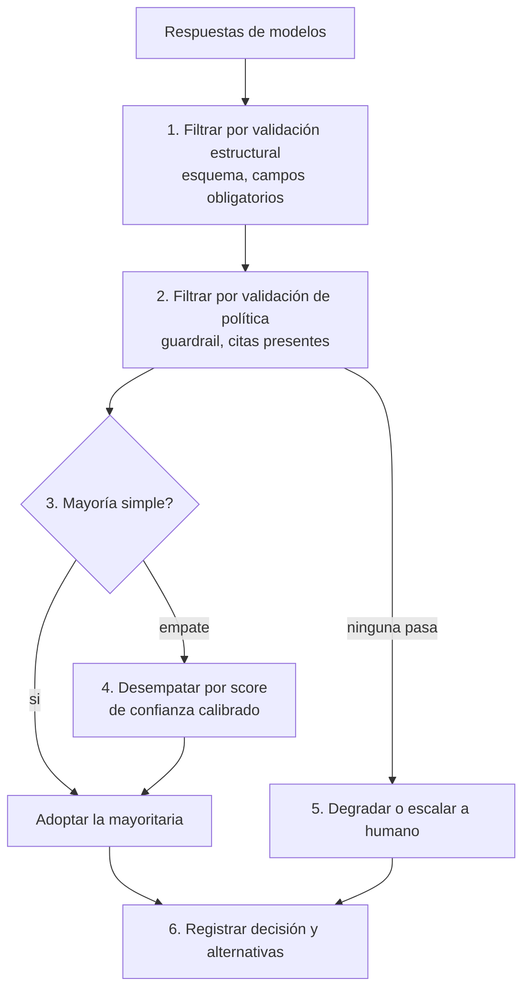

#### 4.4.2 Marcos de selección de modelos

El marco de decisión se desarrolla en el informe del Dominio 4 (§4.2); para este dominio, lo que importa es **dónde vive la decisión de routing**:

| Dónde | Mecanismo | Ventaja |
|---|---|---|
| **En el código** | `if/else` sobre la tarea o el tenant | Determinístico, sin latencia extra |
| **En configuración** | **AppConfig** (features flags/rollout) | Cambiar sin desplegar; auditoría y rollback |
| **En el gateway** | Reglas del GenAI Gateway / routing por modelo | Centralizado para toda la organización |
| **En Step Functions** | `Choice` según contenido (routing por contenido) | Visible y trazable por paso |
| **En el servicio** | **Intelligent Prompt Routing** (misma familia) | Sin código, hasta 30 % de ahorro |
| **En API Gateway** | Transformaciones de request que seleccionan el backend | En el borde, con validación y cuotas |

> **Regla para ensambles:** el coste/beneficio de un ensemble hay que justificarlo con la **tasa de error del caso de uso**, no con la intuición. En la mayoría de los casos, *routing + validación determinística* da el 90 % del beneficio a una fracción del costo.

---

### 4.5 Skill 2.1.5 — Sistemas colaborativos IA + humano

> *"Step Functions para orquestar revisión y aprobación, API Gateway para recopilar feedback, patrones de human augmentation."*

#### 4.5.1 Human-in-the-loop: los cuatro patrones

| Patrón | Mecanismo | Latencia/costo | Cuándo |
|---|---|---|---|
| **Aprobación con token (bloqueante)** | `Task` con `.waitForTaskToken` → notificación (SQS/SNS/email/ticket) → humano llama `SendTaskSuccess` | Espera sin costo de cómputo; hasta 1 año en Standard | Acciones con consecuencias financieras o legales |
| **Human-on-the-loop (async, no bloqueante)** | El agente actúa **con límites** y un humano supervisa y corrige después | Sin latencia extra | Volumen alto con riesgo controlado y reversible |
| **Interrupt & resume** | El agente pausa cuando detecta ambigüedad y reanuda con la respuesta del humano (durable function `waitForCallback`, o AgentCore con callback) | Medio | Diálogos con preguntas de clarificación |
| **Aprendizaje por feedback** | El humano **corrige** la respuesta; la corrección se convierte en dato de evaluación/ajuste | Sin impacto en el camino crítico | Mejora continua del sistema |

#### 4.5.2 Cómo se recolecta el feedback (API Gateway y más)

| Canal | Uso | Detalle |
|---|---|---|
| **API Gateway (REST/HTTP)** | Endpoint de feedback (thumbs, rating, corrección) | Validación de request con modelos de esquema; autorización por Cognito; throttling; logging a CloudWatch |
| **AppSync / Amplify** | Feedback en tiempo real desde la app | Suscripciones GraphQL; integra bien con el UI kit de Amplify |
| **EventBridge** | Evento `feedback.received` → pipeline de evaluación | Desacopla el feedback del procesamiento |
| **S3 + Athena/Quick Sight** | Analítica de feedback por versión de prompt/modelo | Permite atribuir mejoras/regresiones a cambios concretos |
| **SageMaker Ground Truth** | Anotación y revisión a escala con *work teams* | Cuando el volumen de revisión humana es grande y estructurado |

**Diseño del gate humano (buenas prácticas):**
- **Enrutar a humano solo las excepciones** (baja confianza, alto impacto, ambigüedad): el trabajo humano es caro y escaso.
- **Dar contexto accionable:** el aprobador debe ver la propuesta, la evidencia (citas), el riesgo detectado y la acción a ejecutar.
- **Timeouts con default explícito:** si nadie aprueba en N horas, ¿se cancela o se aplica la opción conservadora? Definirlo (y comunicarlo) evita ejecuciones fantasma.
- **Registrar la decisión humana** (quién, cuándo, qué cambió) — es evidencia de gobernanza y alimenta el dataset de evaluación.

#### 4.5.3 Human augmentation: dónde el humano aporta más

| El modelo hace bien | El humano hace mejor |
|---|---|
| Recuperar, resumir, redactar borradores, clasificar a escala | Decidir con consecuencias, juzgar excepciones, negociar, responsabilizarse |
| Proponer opciones y explicitar supuestos | Elegir entre opciones con contexto organizacional |
| Detectar patrones en volumen | Manejar la ambigüedad y el caso "que nunca se vio" |

**Patrón recomendado:** *el humano define el criterio y valida; el modelo ejecuta el volumen*. Se implementa como **rúbrica explícita + muestreo + revisión de excepciones**, no como revisión total.

---

### 4.6 Skill 2.1.6 — Integraciones de herramientas confiables

> *"Strands API para comportamientos propios, definiciones de función estandarizadas, Lambda para manejo de errores y validación de parámetros."*

#### 4.6.1 Anatomía de una herramienta de calidad

```python
@tool
def create_support_ticket(
    customer_id: str,          # identificador validado contra el sistema
    summary: str,              # texto libre (se valida longitud y contenido)
    severity: Literal["low","medium","high"],   # enum → el modelo no puede inventar valores
) -> dict:
    """
    Crea un ticket de soporte para un cliente.

    Usar SOLO cuando el usuario pide explícitamente abrir un caso y ya se
    confirmó el customer_id. No usar para consultas informativas.
    """
    # 1) Validación de parámetros (antes de tocar sistemas externos)
    if not re.fullmatch(r"CUST-\d{6}", customer_id):
        raise ToolInputError("customer_id inválido")        # error tipado y accionable
    # 2) Idempotencia (evita duplicados por reintentos)
    key = f"{customer_id}:{hash(summary)}"
    # 3) Timeout + reintento acotado con backoff en la dependencia
    # 4) Respuesta acotada: lo que devolvés vuelve al contexto del modelo
    return {"ticket_id": tid, "status": "open"}
```

**Los siete requisitos de una herramienta confiable:**

| # | Requisito | Por qué |
|---|---|---|
| 1 | **Descripción precisa** (cuándo usar / cuándo NO) | La selección de herramienta depende del texto, no del código |
| 2 | **Tipos estrictos y enums** | Reducen el espacio de parámetros inválidos |
| 3 | **Validación antes de ejecutar** | Nunca confiar en parámetros generados por un modelo |
| 4 | **Idempotencia** | Los reintentos y los eventos *at-least-once* duplican llamadas |
| 5 | **Timeouts y reintentos acotados** | Una herramienta lenta contamina todo el workflow |
| 6 | **Respuesta pequeña y estructurada** | Todo lo que devolvés se paga como contexto en el siguiente turno |
| 7 | **Errores accionables** (no stack traces) | El modelo puede corregir su plan si el error le dice qué hacer |

#### 4.6.2 Errores y validación: dónde vive cada control

| Control | Implementación | Ejemplo |
|---|---|---|
| Validación de esquema | Lambda antes de la herramienta; *request validation* en API Gateway | Rechazar payload sin campos obligatorios antes de gastar cómputo |
| Validación de negocio | Lambda | Monto dentro del rango autorizado para ese usuario |
| Autorización de la acción | IAM (rol de mínimo privilegio por herramienta) + **AgentCore Policy** | El agente no puede escribir en tablas fuera de su dominio |
| Errores transitorios | Backoff exponencial + jitter dentro de la herramienta | Reintentos locales que no rompen el workflow |
| Errores de negocio | Respuesta estructurada que el modelo entiende | `{"error": "ID_NOT_FOUND", "hint": "verificar el número"}` |
| Errores fatales | Excepción → `Catch` en Step Functions → DLQ + alerta | No se reintenta lo imposible |

---

### 4.7 Skill 2.1.7 — Marcos de extensión de modelos y MCP

> *"Lambda para servidores MCP stateless livianos, ECS para MCP complejos, bibliotecas cliente MCP para patrones de acceso consistentes."*

#### 4.7.1 MCP en una página (y el cambio de 2026)

**MCP (Model Context Protocol)** estandariza cómo un modelo descubre e invoca herramientas y recursos externos. Actores: **host** (la app), **client** (mantiene una conexión por servidor), **server** (expone capacidades: *tools*, *resources*, *prompts*).

**Cambio estructural:** la revisión **2026-07-28** hizo el protocolo **stateless**. Se eliminaron el *handshake* de inicialización y el `Mcp-Session-Id` del transporte central; cada request es autocontenido (versión de protocolo y capacidades del cliente viajan en `_meta`). **Consecuencia práctica:** desaparecen el *sticky load balancing* y el almacén de sesiones compartido; cualquier instancia puede atender cualquier request ⇒ **se alinea perfecto con Lambda**. ⚠️ Pero *stateless en el transporte no significa sin estado en la aplicación*: si hay efectos secundarios, hace falta idempotencia propia (DynamoDB).

#### 4.7.2 Las cuatro rutas de hosting (y cuándo usar cada una)

| Ruta | Cuándo | Consideraciones |
|---|---|---|
| **Lambda + Function URL** | Prototipo interno, cliente conocido, volumen bajo | ⚠️ `AuthType=NONE` **no es productivo**: sin capa de autorización no lo expongas a terceros |
| **Lambda + API Gateway** | MCP remoto para clientes externos/partners | Autorizador OAuth 2.1 (Cognito u otro IdP) con Lambda Authorizer; el costo por millón de requests es marginal frente a reconstruir las features de API Gateway |
| **ECS/Fargate (o EKS)** | Workload de tráfico sostenido, runtimes no-Python, control del entorno | Pagás capacidad ociosa en reposo, pero el costo es predecible y el entorno es tuyo; ALB + OIDC para auth |
| **AgentCore Runtime / Gateway** | Estado por sesión, aislamiento microVM, múltiples agentes consumiendo las mismas herramientas | El Gateway convierte **cualquier** API/Lambda/MCP existente en herramienta MCP con OAuth entrante y credenciales salientes gestionadas |
| **(variante) Lambda Web Adapter** | Ya tenés un servidor MCP en Express/Node y querés correrlo en Lambda sin reescribir | Traduce HTTP ↔ evento Lambda |

**Requisitos de protocolo al hostear MCP en AgentCore Runtime:** transporte **Streamable HTTP stateless**; el servicio agrega el header `Mcp-Session-Id` para aislar sesiones, así que el servidor **debe tolerar ese header y no rechazarlo**.

#### 4.7.3 Cuándo Lambda y cuándo contenedor (la decisión que el examen pregunta)

| Criterio | Lambda (stateless) | Contenedor (ECS/EKS) |
|---|---|---|
| Patrón de tráfico | Ráfagas con valles (pagás por uso) | Sostenido o alto volumen |
| Duración por request | Corta (≤15 min; normalmente ms) | Larga o sin límite práctico |
| Runtime | Python/Node/Java/… (no arbitrario) | Cualquier runtime (Go, Rust, binarios con GPU) |
| Estado | Ninguno (hay que externalizarlo) | Puede mantener estado/GPU/streaming continuo |
| Cold start | Decenas a cientos de ms | Permanente (sin cold start) |
| Costo en reposo | ~0 | Pagás la capacidad |
| Caso típico en MCP | Herramientas livianas, CRUD, consultas | Herramientas pesadas (modelos locales, procesamiento de archivos, browser) |

**El cliente MCP (para "patrones de acceso consistentes"):** usá una **biblioteca cliente única** en toda la organización (SDK oficial de MCP, adaptadores de AWS como el paquete de `run-model-context-protocol-servers-with-aws-lambda`) para que todos los agentes descubran e invoquen herramientas del mismo modo: mismo manejo de errores, mismos timeouts, misma telemetría, mismos reintentos.

---

## 5. Task 2.2 — Estrategias de despliegue de modelos

### 5.1 Skill 2.2.1 — Desplegar FMs según la necesidad de la aplicación

> *"Lambda para invocación on-demand, configuraciones de provisioned throughput de Bedrock, endpoints de SageMaker para soluciones híbridas."*

#### 5.1.1 La matriz de opciones de inferencia

| Opción | Modelo de facturación | Latencia | Ideal para | Límites clave |
|---|---|---|---|---|
| **Bedrock on-demand** | Por token | 300 ms – varios s de TTFT | Todo lo variable; el default | Cuotas RPM/TPM; reserva por `maxTokens` |
| **Bedrock Batch** | −50 % | Hasta 24 h | Volúmenes no interactivos | JSONL en S3 |
| **Bedrock Provisioned Throughput** | Por hora (model units) | Dedicada | Carga sostenida; **obligatorio para modelos custom** | Se paga ocioso |
| **Bedrock Reserved** | Fijo mensual (1–3 meses) | Garantizada (99,5 %) | Tráfico predecible | Excedente desborda a Standard |
| **Lambda (para invocar Bedrock)** | Por invocación + ms | +cold start (1–3 s) | On-demand, glue, jobs cortos, **streaming con function URL** | 15 min de timeout; sin GPU |
| **Lambda (modelo propio chico)** | Por invocación + ms | 1–3 s cold start | Modelos pequeños en CPU, prototipos | Sin GPU; memoria máx. ~10 GB |
| **SageMaker real-time endpoint** | Por hora-instancia | Muy baja y estable | Tráfico sostenido, control total, modelos propios grandes | **Pagás 24/7**; tú administras el serving stack |
| **SageMaker Serverless** | Por uso (vCPU/GB-ms) | Cold start 30–80 s | Picos con valles grandes, sin GPU | **6 GB RAM máx · 4 MB payload · 60 s timeout · CPU only** |
| **SageMaker Async inference** | Por hora-instancia (autoscaling a 0) | Cola + procesamiento | Payloads hasta **1 GB** y hasta **1 hora** de proceso | Encolamiento, resultados en S3 |
| **SageMaker Batch Transform** | Por instancia-minuto | Offline | Datasets completos sin endpoint persistente | No hay servicio en vivo |
| **ECS/EKS propio** | Por hora de cómputo | La que configures | Control total, GPU, costos muy bajos a gran escala | Todo el stack es tuyo |

#### 5.1.2 La decisión económica (memorizar la forma de la curva)

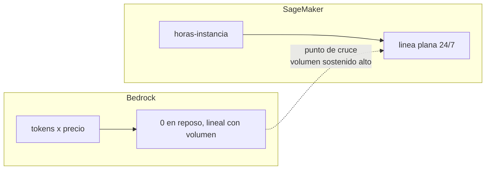
- Un caso medido públicamente: **USD 3.432/mes en Bedrock** vs **USD 5.176/mes** en un endpoint único (y 10.351 con HA) para una carga *bursty* que queda ociosa ~70 % del tiempo. Con esa forma de tráfico, **Bedrock gana**.
- Regla gruesa de la industria: por debajo de decenas de millones de tokens diarios, Bedrock suele ser más barato; por encima de ~200 M tokens/día sostenidos (o ~USD 10 k/mes), el endpoint dedicado empieza a ganar. **El número exacto depende del modelo, la GPU y la utilización** — el examen evalúa el *criterio*, no la cifra.
- **Factores que mueven el punto de cruce:** utilización sostenida (>70–80 %), modelo open-weights, necesidad de control del stack (versión, cuantización, adaptadores), requisitos de latencia muy estrictos.

#### 5.1.3 Arquitecturas híbridas (lo que el examen llama "soluciones híbridas")

| Patrón | Descripción | Cuándo |
|---|---|---|
| **Prototipo en Bedrock → optimizar en SageMaker** | Validás con API; si el volumen crece y el modelo es adaptable, migrás a endpoint propio | Cuando el costo por token se vuelve dominante |
| **Bedrock para la interfaz, SageMaker para habilidades** | El agente (Bedrock/AgentCore) razona y el endpoint propio provee modelos especializados (churn, visión, forecasting) como herramientas | Muy común en empresas con ML propio |
| **Multi-modelo + routing** | Consultas simples a modelos chicos de Bedrock; dominio específico a un modelo ajustado en SageMaker | Optimización de costo/calidad |
| **Bedrock Custom Model Import** | Ajustás afuera y desplegás en Bedrock con PT | Cuando querés modelo propio **sin** administrar infraestructura |

---

### 5.2 Skill 2.2.2 — Desafíos de despliegue específicos de LLM

> *"Patrones de contenedores optimizados por memoria, utilización de GPU y capacidad de procesamiento de tokens; estrategias especializadas de carga de modelos."*

#### 5.2.1 La ecuación de memoria GPU (la cuenta que hay que saber hacer)

```
Memoria GPU necesaria =
     pesos del modelo
   + caché KV (crece con: batch × longitud de contexto × capas × heads)
   + activaciones y overhead del runtime
   + overhead del framework (10–20 %)
```
- Los pesos en fp16 ≈ **2 GB por cada 1.000 millones de parámetros**; int8 ≈ la mitad. Un 7B cuantizado a int8 ronda **~7–8 GB** (no cabe cómodo en una T4 de 16 GB si querés batch y contexto largo).
- La **caché KV** es la que se come la memoria en producción: por eso "cabe el modelo" ≠ "cabe la carga".
- Ejemplo típico: Llama 13B int8 ≈ 15 GB → **A10G/A100 sí, T4 no**.

**Estrategias cuando no cabe:**

| Técnica | Efecto | Costo |
|---|---|---|
| **Cuantización** (int8/fp16/4-bit) | Reduce memoria y acelera la carga; precisión afectada < 1 % en la mayoría de tareas | Requiere validar calidad |
| **Tensor parallelism / sharding** | Reparte el modelo entre varias GPU | Más GPUs, más latencia de comunicación |
| **Batching continuo (continuous batching)** | Mejora el throughput reutilizando el batch entre requests | Requiere motor (vLLM/TGI/SGLang) |
| **Reducir longitud de secuencia / batch** | Baja el uso de KV cache | Puede afectar el caso de uso |
| **Speculative decoding** | Modelo *draft* chico propone, el grande valida | Complejidad; mejora la latencia de generación |
| **Compilación / optimización de kernel** | Mejora throughput | Específico por hardware |

#### 5.2.2 Carga de modelo (la parte que explica los cold starts de 30–80 s)

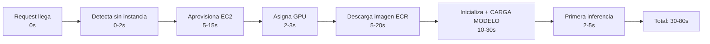

**Cómo se acorta:**
1. **Imagen liviana** (<2 GB idealmente): base `nvidia/cuda` mínima, sin dependencias no usadas, **sin los pesos dentro de la imagen** (cargalos desde S3 al arrancar, o usá caché de ECR).
2. **Carga rápida de modelos**: SageMaker **shardea** el modelo y guarda los pesos en **chunks de igual tamaño que se cargan concurrentemente** en las GPU (en lugar de secuencialmente).
3. **Cuantizar** antes de empaquetar.
4. **Provisioned concurrency** para mantener contenedores calientes (elimina el cold start; agrega costo fijo).
5. **Una sola copia del modelo por contenedor** en serverless (a diferencia de real-time, donde puede haber un worker por vCPU); ajustar `model_server_workers`.
6. **Calentar** los endpoints antes de los picos conocidos.

#### 5.2.3 Otros patrones de contenedor que importan

| Patrón | Uso |
|---|---|
| **Multi-model endpoints (MME)** | Muchos modelos con el mismo contenedor y flota compartida; SageMaker descarga/carga el modelo bajo demanda. Ideal para **cientos de modelos pequeños o adaptadores** |
| **Inference components** | Agrupar modelos que comparten recursos con asignación explícita de capacidad; **multi-adapter (LoRA)** para servir cientos de adaptadores sobre una base |
| **Multi-container endpoints** | Varios contenedores en una misma instancia (pre/post-proceso junto al modelo) |
| **Inference pipelines** | Encadenar contenedores de pre-proceso → modelo → post-proceso dentro del endpoint |
| **Serverless GPU** | Disponible y útil para cargas *bursty*, pero con cold starts altos: **para <10 s de latencia estricta, instancia dedicada o warm capacity** |
| **Escalado a cero** | Para endpoints real-time que no necesitan estar siempre arriba (dev/test, cargas intermitentes) |

> **Trampa de examen:** SageMaker Serverless Inference **no soporta GPU** y tiene **6 GB de RAM máxima, 4 MB de payload y 60 s de timeout**. Si el escenario pide un LLM grande con latencia baja, esa opción es incorrecta; si el escenario pide "picos con valles largos y tolera cold start", Serverless es correcto (o bien Bedrock, si el modelo está en el catálogo).

---

### 5.3 Skill 2.2.3 — Despliegues optimizados de FM

> *"Seleccionar modelos adecuados, usar modelos pre-entrenados más chicos para tareas específicas, usar cascading basado en API para consultas rutinarias."*

#### 5.3.1 Las tres palancas de esta skill

**1) Selección de modelo.** El modelo más barato que pase el piso de calidad, por tarea (no un modelo para todo). Incluye elegir **modelo abierto + endpoint propio** cuando el volumen y el control lo justifican.

**2) Modelos chicos especializados.** Opciones, de menos a más esfuerzo:
| Opción | Esfuerzo | Cuándo |
|---|---|---|
| Prompt engineering + structured outputs sobre un modelo chico | Bajo | Extracción, clasificación, formato |
| **Distilación** (Bedrock Model Distillation) | Medio | Tareas donde un modelo grande acierta y querés replicar su comportamiento en uno chico (hasta 500 % más rápido, −75 % costo, <2 % de pérdida en RAG) |
| Fine-tuning / continued pre-training | Medio-alto | Vocabulario y estilo propios; requiere **PT** para servirlo en Bedrock |
| Modelo clásico (no LLM) para la tarea | Bajo | Cuando un clasificador tradicional hace el trabajo más barato y determinístico |
| Embeddings + similitud en lugar de generación | Bajo | Preguntas frecuentes con respuestas fijas |

**3) Cascading basado en API (routing en cascada).** El patrón:
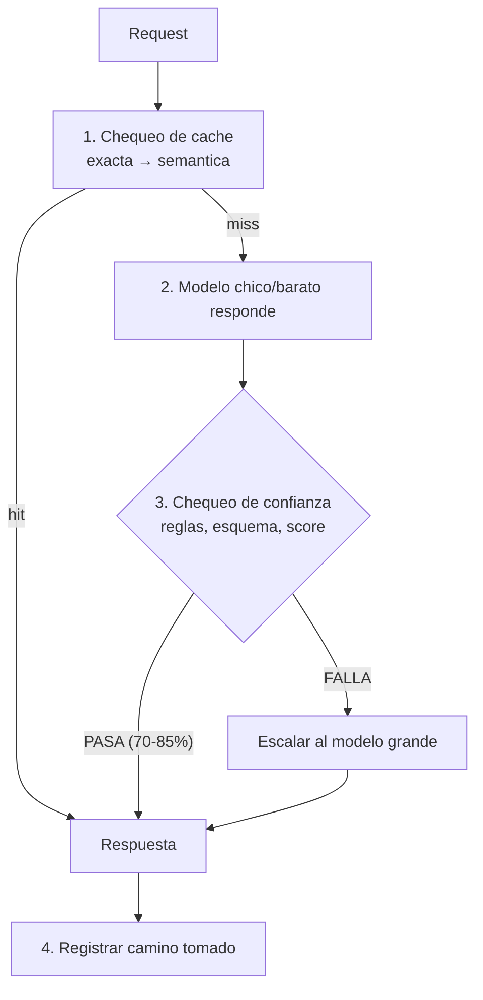
**Ventaja real:** el 80 % del tráfico es rutinario; el ahorro del cascade es del orden de **40–60 %** del costo mezclado, siempre que el **chequeo de confianza** sea bueno. Si el chequeo deja pasar errores, el ahorro se paga en calidad.

#### 5.3.2 Optimizaciones de despliegue por tipo de carga

| Carga | Despliegue recomendado | Optimización principal |
|---|---|---|
| Chat interactivo | Bedrock on-demand + streaming | Prompt caching, modelo chico con escalado |
| RAG con muchos documentos | Bedrock + Knowledge Bases | Retrieval selectivo (k pequeño + rerank), caché de respuestas |
| Procesamiento por lotes | **Batch** (−50 %) o Async inference | Idempotencia y reintentos por registro |
| Extracción estructurada a escala | Modelo chico + structured outputs | Sin reintentos por JSON inválido |
| Modelo propio grande con SLA estricto | SageMaker real-time con autoscaling | Cuantización, batching continuo, warm capacity |
| Picos imprevisibles de modelo propio | SageMaker Serverless (si tolera cold start) o Async | Provisioned concurrency si el cold start es inaceptable |
| Cientos de adaptadores LoRA | Inference components / MME | Carga dinámica de adaptadores |

---

## 6. Task 2.3 — Arquitecturas de integración empresarial

### 6.1 Skill 2.3.1 — Conectividad empresarial

> *"Integraciones API con sistemas legacy, arquitecturas event-driven para acoplamiento débil, patrones de sincronización de datos."*

#### 6.1.1 Integrar lo que ya existe (y no se puede cambiar)

| Sistema legacy | Patrón de integración | Nota |
|---|---|---|
| Mainframe / ERP con SOAP | **API Gateway** como fachada REST + Lambda adaptador | Traducís una vez, exponés estable |
| Base de datos con acceso restringido | Lambda con rol de solo lectura + vistas enmascaradas | El modelo nunca ve columnas sensibles |
| Aplicación on-premises | **PrivateLink** (+ Direct Connect) o **Outposts** | Sin exponer a internet |
| SaaS (Salesforce, ServiceNow, Jira, Slack) | **AgentCore Gateway** (targets a APIs/OpenAPI), **AppFlow**, EventBridge partner buses, MCP servers oficiales | Menos código de integración; auditoría centralizada |
| Servicios internos internos de la organización | Gateway con targets OpenAPI/Smithy o MCP | Convierte el catálogo de APIs en herramientas para agentes |
| Sistemas sin API (batch files) | S3 como zona de intercambio + eventos | Sigue siendo event-driven |

#### 6.1.2 Event-driven: por qué y cuándo

| Contexto | Solución | Por qué |
|---|---|---|
| **1 productor → N consumidores** | **SNS** (fan-out) o **EventBridge** (routing con filtros) | Desacopla; los consumidores nuevos no tocan al productor |
| **Routing por contenido** | **EventBridge** (event patterns con comparadores numéricos, prefijos, `anything-but`, `exists`) | No invocás cómputo para eventos que no interesan |
| **Buffer y control de la tasa del consumidor** | **SQS** (+ DLQ) | Absorbe picos; backpressure natural |
| **Conectar una fuente y un target sin Lambda glue** | **EventBridge Pipes** (source → filter → enrichment → target) | Menos código, menos IAM, menos observabilidad que mantener |
| **Jobs en horario/cron** | **EventBridge Scheduler** | Escalable, con reintentos y DLQ |
| **Llamar a un SaaS con credenciales** | **EventBridge API Destinations** | La connection maneja la autenticación |
| **Reprocesar eventos históricos** | **EventBridge archive & replay** | Recuperación ante fallos del consumidor |

**Límites y reglas que se preguntan:**
- **Payload máximo de EventBridge: 256 KB** → **patrón *claim check***: el evento lleva la referencia a S3 y el consumidor baja el payload.
- **Pipes: la etapa de enriquecimiento es síncrona, con techo de 5 minutos** end-to-end.
- **Entrega at-least-once** ⇒ **diseño idempotente obligatorio** (esto aplica también a SQS y a DynamoDB Streams).
- **EventBridge vs SNS vs SQS:** EventBridge = bus con routing enriquecido, esquemas, replay e integración SaaS; SNS = fan-out simple (+ SMS/email); SQS = cola punto-a-punto con buffer y retry.
- **Enrutar hacia Bedrock:** un **Enrichment Lambda** en Pipes puede llamar a Bedrock y devolver el resultado enriquecido (patrón "AI-augmented routing"). Cuidado: el enriquecimiento tiene el techo de 5 min.

#### 6.1.3 Patrones de sincronización de datos

| Patrón | Descripción | Cuándo |
|---|---|---|
| **CDC (Change Data Capture)** | DynamoDB Streams / Kinesis / DMS capturan cambios y los propagan | Mantener el índice vectorial o la caché al día |
| **Claim check** | El evento lleva referencia a S3 | Payloads > 256 KB |
| **Idempotent consumer** | Clave de idempotencia en DynamoDB con *conditional write* | Todo consumidor de eventos |
| **Outbox** | Escribir el evento en la misma transacción del dato; un proceso lo publica | Consistencia entre base y bus |
| **Saga / compensación** | Pasos con acciones compensatorias si un paso posterior falla | Procesos multi-servicio con efectos externos |
| **Sincronización bidireccional** | Con eventos, no con polling | Integración con CRM/ERP |
| **Snapshot + delta** | Carga completa inicial y luego incrementos | Indexado inicial de un corpus grande |

> **Regla de examen sobre idempotencia en GenAI:** un evento duplicado no solo es un bug de datos, es **un prompt pagado dos veces** y, potencialmente, **un correo enviado dos veces**. La verificación de estado (`ConditionCheck` de Step Functions o `attribute_not_exists` en DynamoDB) antes de invocar el modelo es el patrón estándar.

---

### 6.2 Skill 2.3.2 — Capacidades de IA integradas en aplicaciones existentes

> *"API Gateway para microservicios, Lambda para webhooks, EventBridge para integraciones event-driven."*

#### 6.2.1 Los tres patrones de "agregar IA a una app que ya existe"

| Patrón | Cómo | Cuándo | Riesgo a manejar |
|---|---|---|---|
| **Strangler / fachada** | El sistema viejo llama a una **API nueva de IA** (API Gateway + Lambda); nada del legacy cambia | Lo más común y de menor riesgo | Duplicación de lógica mientras conviven |
| **Sidecar / copiloto** | La IA observa el flujo existente y sugiere; el humano aplica | Adopción temprana en procesos críticos | Iteración, permisos |
| **Incrustado en el flujo** | La IA pasa a ser parte del proceso (con guardrails y validación) | Proceso ya validado | Dependencia y latencia |

#### 6.2.2 Los componentes y su rol exacto

| Componente | Rol en la integración | Detalle a recordar |
|---|---|---|
| **API Gateway (REST/HTTP)** | Fachada de microservicios y GenAI: autenticación, validación de request, throttling/usage plans, transformaciones, integraciones directas a servicios AWS (Lambda, EventBridge `PutEvents`, Step Functions) | HTTP API es más barato/simple; REST API tiene más features (WAF, API keys, caching, request validation) |
| **API Gateway (WebSocket)** | Canal bidireccional persistente para notificaciones y streaming | Rutas `$connect`/`$disconnect`/`$default`; **límite de 128 KB por mensaje**; idle timeout ~10 min; conexión máxima 2 h; `GoneException` = cliente desconectado |
| **Lambda (webhooks)** | Recibir webhooks de terceros: verificar firma, validar, encolar y responder rápido (200 en < 1 s si el emisor es impaciente) | Nunca procesar el webhook completo de forma sincrónica; encolar y procesar |
| **EventBridge** | Bus de eventos del dominio: publicar `document.received`, `agent.proposal.created`, `approval.granted` | Filtros antes del cómputo; DLQ siempre; archive para replay |
| **AppSync** | API GraphQL con **suscripciones en tiempo real** y autorización declarativa | Base de Amplify AI Kit; ideal para apps con datos y suscripciones |
| **Step Functions** | Proceso de negocio explícito que envuelve a la IA | El lugar donde vive la lógica de negocio auditable |
| **Bedrock Flows** | Orquestación **no-code** de prompts, KB, agentes, Lambda y condiciones | El examen lo asocia a "construir rápido sin código" y a builders ciudadanos |

#### 6.2.3 El patrón asíncrono de referencia (2026)

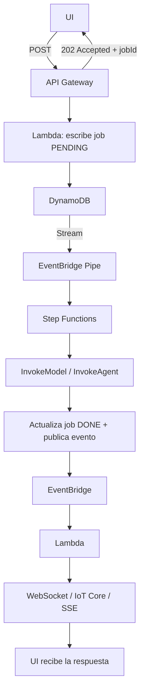
**Por qué es el patrón correcto:** el usuario no espera a un modelo; no hay timeouts del borde; el trabajo es reintentable y auditable; y la notificación llega cuando está lista. **Requisitos técnicos:** propagar el **Trace ID** de X-Ray desde el API inicial hasta el workflow (si no, depurar en un sistema asíncrono es imposible) e **implementar idempotencia** (la entrega es at-least-once).

---

### 6.3 Skill 2.3.3 — Marcos de acceso seguro

> *"Federación de identidad entre servicios de FM y sistemas empresariales, RBAC para acceso a modelos y datos, acceso API con mínimo privilegio a los FMs."*

#### 6.3.1 Federación de identidad: las dos identidades que hay que separar

| Identidad | Qué representa | Servicio | Qué resuelve |
|---|---|---|---|
| **Identidad de usuario** | La persona que usa la app | **IAM Identity Center** (SSO corporativo), **Cognito** (clientes externos), Okta/Entra/Auth0 | Quién puede invocar la app y con qué datos (RBAC + filtros en recuperación) |
| **Identidad de workload / agente** | El agente actuando en nombre del usuario | **AgentCore Identity** (credential brokering), roles IAM por agente, roles de ejecución de Lambda | El agente obtiene credenciales **de corta duración y alcance mínimo** para llamar sistemas, sin secretos en el código |

**Flujo típico de una acción del agente en nombre del usuario:**
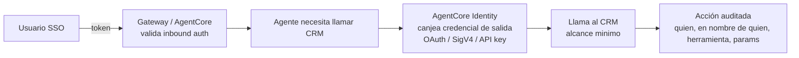

#### 6.3.2 RBAC para modelos y datos

| Nivel | Control | Implementación |
|---|---|---|
| Modelo | Qué modelos puede invocar cada rol | IAM sobre ARNs de modelo; **SCP** como techo organizacional; `bedrock:InferenceProfileArn` para limitar perfiles |
| Guardrail | Que se aplique el guardrail corporativo | Condición `bedrock:GuardrailIdentifier` en una política de **Deny** |
| Datos | Qué datos puede ver el agente | **Metadata filtering** en la recuperación (KB), **Lake Formation** (row/column level), vistas enmascaradas, filtros por tenant en la caché |
| Herramienta | Qué acciones puede ejecutar | **AgentCore Policy (Cedar)** interceptando *tool calls* en el Gateway; IAM por rol de herramienta; aprobación humana para acciones destructivas |
| Cuota | Cuánto puede consumir | Throttling/usage plans en API Gateway; cuotas por equipo en el gateway; presupuestos |
| Sesión | Aislamiento entre usuarios | MicroVM por sesión (AgentCore); namespace por tenant en vector store y caché |

**Mínimo privilegio aplicado a Bedrock (los cuatro errores frecuentes):**
1. `Resource: "*"` en `bedrock:InvokeModel` → acceso a **todos** los modelos de la región.
2. Olvidar `bedrock:InvokeModelWithResponseStream` y romper el streaming.
3. Olvidar que **`Converse` no es una acción IAM separada** (se autoriza con `bedrock:InvokeModel`).
4. No alinear **SCP y IAM** con los perfiles de inferencia cross-region (fallos intermitentes de `AccessDenied` cuando la petición se enruta a una región que la política no permite).

---

### 6.4 Skill 2.3.4 — Soluciones entre entornos y jurisdicciones

> *"AWS Outposts para integrar datos on-premises, AWS Wavelength para despliegues en el borde, routing seguro entre cloud y on-premises."*

#### 6.4.1 Opciones de despliegue fuera de la región "estándar"

| Opción | Qué es | Caso de uso GenAI | Limitación |
|---|---|---|---|
| **AWS Outposts** | Rack de AWS en tu datacenter; servicios AWS con baja latencia local | **Procesar datos on-premises** (imágenes médicas, planta industrial) y enviar solo lo necesario a la nube; mantener datos regulados localmente | Inventario acotado de servicios; capacidad fija |
| **AWS Wavelength** | Infraestructura AWS en la red del operador 5G | Inferencia **en el borde** para latencia ultra-baja (AR/VR, inspección móvil) | Modelos chicos/optimizados; no todos los servicios |
| **Local Zones** | Cómputo AWS en metros grandes | Latencia baja para una ciudad/región | Subconjunto de servicios |
| **Regiones asiáticas/europeas específicas** | Residencia de datos por geografía | Cumplir GDPR, soberanía de datos | Verificar disponibilidad del modelo |

**Patrón híbrido recomendado:** *capturar y pre-procesar en el borde; razonar en el centro*. El edge hace OCR/validación/enmascarado; la nube hace el razonamiento con el modelo grande. Así se reducen costos de egreso, se cumple residencia y se mantiene la calidad.

#### 6.4.2 Cross-Region Inference (CRIS) y residencia de datos

**Los tres modos de ejecución de una request de Bedrock:**

| Modo | Prefijo | Qué hace | Residencia |
|---|---|---|---|
| **En región** | — | Se ejecuta en la región que llamás | Máxima |
| **Geográfico (geo-CRIS)** | `us.`, `eu.`, `apac.`, `jp.`, `au.`… | Reparte dentro de **una geografía** | Datos **en reposo** quedan en la región de origen; **prompt y salida** pueden moverse dentro de la geografía |
| **Global (global-CRIS)** | `global.` | Cualquier región comercial con capacidad | **No apto** si hay requisitos de residencia (AWS lo advierte explícitamente) |

**Los tres hechos que hay que memorizar:**
1. **CRIS no mueve tus datos en reposo.** El corpus, el índice vectorial y los logs de invocación quedan en la región de origen. Lo que se mueve es el **cómputo transitorio** (prompt y salida).
2. **SCP e IAM deben alinearse con las regiones destino.** Toda política con `aws:RequestedRegion` restrictivo bloquea CRIS intermitentemente; el patrón recomendado es **exceptuar** usando la condición `bedrock:InferenceProfileArn` en lugar de ampliar la allowlist de regiones. Detalle fino: **global-CRIS presenta `aws:RequestedRegion` como `unspecified`**.
3. **Los guardrails también tienen perfiles cross-region** (`us.guardrail.v1:0`, `eu.guardrail.v1:0`, etc.), y su evaluación ocurre dentro de la misma geografía que el ruteo del modelo. El **tier Standard de guardrails requiere perfiles cross-region**.

**La frase que resume la postura correcta (y que el examen premia):** *ninguna configuración por sí sola vuelve "compliant" a tu workload*. Lo que las geo-perfiles garantizan es una **propiedad técnica verificable**: los datos en reposo quedan en la región de origen y todo el procesamiento (incluido el almacenamiento de detección de abuso específico del modelo) ocurre **dentro de la geografía**.

**Diseño para múltiples geografías:** **una Knowledge Base contenida por región/geografía**, no una compartida. Y verificar en la documentación del modelo elegido su comportamiento de retención y su conjunto de regiones destino (`GetInferenceProfile`).

---

### 6.5 Skill 2.3.5 — CI/CD y arquitecturas de GenAI Gateway

> *"CodePipeline, CodeBuild, testing automatizado con escaneos de seguridad y rollback; capas de abstracción centralizadas; observabilidad y control."*

#### 6.5.1 Qué cambia en un pipeline de CI/CD cuando hay GenAI

| Artefacto | Cómo cambia el pipeline |
|---|---|
| **Código** | Igual que siempre: build, unit tests, escaneo de dependencias/imágenes |
| **Prompts** | Se versionan como artefactos (**Prompt Management** o repositorio); cambios de prompt requieren **evaluación** antes de promover |
| **Configuración de modelo** | Parámetros y modelo en **AppConfig** (rollout y rollback sin desplegar código) |
| **Guardrails** | Versionados (DRAFT → versión numerada) con pruebas de regresión |
| **Índices/knowledge bases** | La ingesta es parte del pipeline; se valida calidad de datos y se reindexa de forma controlada |
| **Evaluación** | **Gate obligatorio**: dataset dorado + métricas de calidad, seguridad y costo |

**Pipeline de 5 gates (patrón que el examen puede describir):**
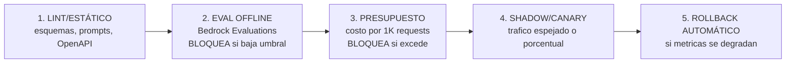
**Herramientas AWS:** CodePipeline (orquestación), CodeBuild (build + evaluación + escaneos), CodeDeploy (despliegue), **Lambda alias con routing ponderado** (canary), **SageMaker deployment guardrails** (all-at-once, canary, linear con auto-rollback), CloudWatch (métricas que disparan el rollback), CloudFormation/CDK (infraestructura como código), Inspector/Guard (seguridad).

**Práctica de promoción:** el pipeline **no despliega** una versión sin: evaluación aprobada + revisión de guardrails + aprobación humana (comentario de aprobación en CodePipeline o ticket).

#### 6.5.2 GenAI Gateway: el plano de control centralizado

**Qué es:** una capa de abstracción entre las aplicaciones y los modelos (de cualquier proveedor) que centraliza las preocupaciones transversales.

| Capacidad | Qué resuelve |
|---|---|
| **Normalización de API** | Los equipos usan **una** interfaz aunque el backend cambie (Bedrock, SageMaker, OpenAI, Gemini) |
| **Routing y fallback** | Elegir modelo por costo/complejidad/disponibilidad y degradar a alternativa ante fallas |
| **Rate limiting y cuotas** | Evitar que un equipo consuma la cuota de todos |
| **Atribución de costo** | Costo por equipo, app, usuario y caso de uso (etiquetas + inference profiles) |
| **Guardrails y PII** | Política de contenido **uniforme**, aplicada a cualquier proveedor (Guardrails se aplica vía `ApplyGuardrail`) |
| **Caché** | Exacta/semántica y prompt caching, centralizados |
| **Identidad y autorización** | Quién puede usar qué modelo, con federación (Identity Center/Cognito) |
| **Observabilidad y auditoría** | Logs de invocación, trazas y métricas en un solo lugar |
| **Registro de modelos aprobados** | Solo se puede invocar lo que está aprobado y catalogado |

**Implementaciones:** (a) **AWS Guidance for Multi-Provider Generative AI Gateway** basado en **LiteLLM** (soporta Bedrock, SageMaker JumpStart y proveedores externos; admin UI con usuarios/equipos/RBAC; despliegue en ECS o EKS; soporta guardrails de Bedrock para cualquier proveedor); (b) construcción propia con **API Gateway + Lambda + DynamoDB** (más control, más trabajo); (c) **AgentCore Gateway** para el plano de herramientas/agentes.

**Trade-off que hay que saber declarar:** el gateway agrega **una capa de latencia y un punto de fallo**. Se mitiga con caché local, conexiones persistentes, despliegue regional y diseño sin estado. Pero para cualquier organización con más de un equipo usando IA, **el control centralizado pesa más que los pocos milisegundos**.

**Patrón de despliegue:** un gateway **por entorno** (dev/pre-prod/prod), y los cambios de configuración del gateway **también pasan por el pipeline de CI/CD**.

---

## 7. Task 2.4 — Integraciones de API del FM

### 7.1 Skill 2.4.1 — Sistemas flexibles de interacción con el modelo

> *"API de Bedrock para requests síncronos desde varios entornos de cómputo, SDK por lenguaje y SQS para asíncrono, API Gateway para validación de requests."*

#### 7.1.1 Síncrono: cuándo y desde dónde

| Entorno de cómputo | Patrón | Consideración |
|---|---|---|
| **Lambda** | Invocación directa con boto3; cliente **fuera** del handler (reutilizado entre invocaciones) | Cuidado con el timeout de 15 min; ideal para requests cortos y streaming |
| **ECS/EKS/Fargate** | Cliente persistente, connection pooling, concurrencia controlada | Mejor para alto volumen sostenido |
| **EC2** | Igual que contenedores | Control total |
| **On-premises** | PrivateLink/Direct Connect + credenciales IAM (roles anyware/Identity Center) | Aprovechar endpoints privados |
| **Edge** | Modelos chicos o proxies a la nube | Ver 6.4.1 |

**Reglas de implementación del cliente (que se preguntan):**
- `Config(retries={"mode": "adaptive"}, tcp_keepalive=True, max_pool_connections=N)`: backoff adaptativo y reutilización de conexiones (~25 % menos TTFT en benchmarks).
- **Semáforo por modelo**: límite de concurrencia antes de llegar a la cuota.
- `maxTokens` ajustado: afecta costo, latencia **y reserva de cuota**.
- Cliente de mayor alcance (Converse) para portabilidad entre modelos; `InvokeModel` cuando necesitás campos específicos del proveedor.

#### 7.1.2 Asíncrono: cuándo y cómo

| Patrón | Uso |
|---|---|
| **SQS + worker** | Desacoplar la recepción del procesamiento; absorbe picos; DLQ para fallos |
| **Batch inference (Bedrock)** | Volúmenes grandes no interactivos (−50 %, hasta 24 h) |
| **Step Functions + callbacks** | Procesos multi-paso con aprobación o esperas largas |
| **Durable functions (Lambda)** | Orquestación como código con suspensiones sin facturación |
| **API Gateway + 202** | Devolver un job ID y notificar después (patrón de 6.2.3) |

**Decisión:** ¿el usuario está esperando mirando la pantalla? → síncrono (con streaming si es largo). ¿No? → asíncrono, siempre.

#### 7.1.3 API Gateway como fachada con validación

| Feature | Para qué sirve en GenAI |
|---|---|
| **Request validation** (modelos de esquema en REST API) | Rechazar payloads inválidos **antes** de invocar Lambda/Bedrock: ahorra dinero y protege del abuso |
| **Throttling y usage plans** | Cuotas por cliente/API key: el primer control de gasto |
| **Authorizers** (Cognito/Lambda) | Validar JWT y derivar identidad/tenant |
| **Transformaciones de request/response** | Adaptar contratos y enrutar a distintos backends |
| **Integraciones directas a servicios AWS** | `PutEvents` a EventBridge, Step Functions, etc., sin Lambda glue |
| **WAF** | Filtrado de ataques web, rate limiting por IP |
| **Logging y métricas** | Acceso, latencia, errores, `timeToFirstContent` en streaming |

---

### 7.2 Skill 2.4.2 — Sistemas de interacción en tiempo real

> *"Streaming APIs de Bedrock para entrega incremental, WebSockets o SSE para generar texto en tiempo real, API Gateway con chunked transfer encoding."*

#### 7.2.1 El lado del modelo: `ConverseStream`

**Secuencia de eventos (memorizar el orden):**
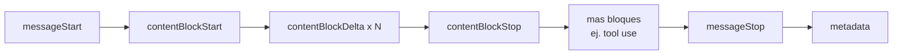
- **Solo los `contentBlockDelta` con `text`** son lo que se muestra al usuario.
- **`messageStop.stopReason`** distingue fin natural (`end_turn`) de truncamiento (`max_tokens`): hay que mirarlo siempre.
- **`metadata`** (al final) trae los conteos de tokens y la latencia: no se puede leer antes.
- **Eventos de excepción del stream** (`throttlingException`, `modelStreamErrorException`) hay que tratarlos como ciudadanos de primera: **enviar un frame de error tipado** al cliente. Un stream que se corta en silencio sin error es el bug clásico.
- **IAM:** `ConverseStream` e `InvokeModelWithResponseStream` se autorizan con **una única acción: `bedrock:InvokeModelWithResponseStream`**.
- **Guardrails y streaming:** la evaluación de salida se hace **por chunks** (con modo `sync` para bloquear antes de entregar o `async` para priorizar latencia). El trade-off **latencia ↔ seguridad** es explícito.

#### 7.2.2 Los cuatro transportes hacia el cliente (y cuál elegir)

| Transporte | Cómo funciona | Ventajas | Limitaciones |
|---|---|---|---|
| **Lambda response streaming** (+ Function URL o API Gateway REST con `responseTransferMode: STREAM`) | El handler escribe chunks en un stream (`streamifyResponse` / `HttpResponseStream.from`), con delimitador de metadata | **El más simple para un request → un stream**; soporta respuestas >10 MB y hasta ~15 min | No sirve para push server-initiated fuera de la request; el streaming **no se cancela** si el cliente se va (ajustar timeout) |
| **API Gateway WebSocket** | Conexión persistente; el relay Lambda empuja cada token con la **Management API** (`post_to_connection`) | Bidireccional, notificaciones asíncronas, el patrón de la arquitectura asíncrona | **128 KB por mensaje** (¡no batchear tokens!), idle timeout ~10 min, máximo 2 h por conexión; hay que autenticar en `$connect` **y** autorizar cada acción |
| **AppSync subscriptions (GraphQL)** | Mutación publica, el cliente recibe por suscripción | Integrado con Amplify y datos; ideal para apps con modelo de datos | Menos control fino del framing |
| **SSE sobre ALB/CloudFront/ECS** | HTTP con `text/event-stream` | Estándar, atraviesa proxies (con cuidado de buffering) | Requiere backend que soporte streaming |

**Reglas de oro del streaming (todas aparecen en preguntas):**
1. **API Gateway REST tradicional bufferiza**: si necesitás verdadero token-a-token, cambiá de transporte o activá el modo de transferencia en streaming.
2. **No batchear tokens "para optimizar":** empeora el TTFT y puede superar el límite de mensaje (WebSocket cierra con código 1009 si pasás 128 KB).
3. **Manejar la desconexión:** `GoneException` significa cliente ausente → dejar de empujar. Con Lambda response streaming, el contenedor sigue corriendo: poné timeouts cortos.
4. **Reconexión:** al reconectar, el cliente puede recibir tokens duplicados → **numerar cada chunk** y descartar los ya aplicados.
5. **Streaming no abarata:** el precio por token es el mismo; el beneficio es latencia **percibida**.
6. **Observabilidad:** activá las variables de access log para streaming (`responseTransferMode`, `timeToAllHeaders`, `timeToFirstContent`) y medí **TTFT** de punta a punta.

---

### 7.3 Skill 2.4.3 — Sistemas resilientes

> *"Backoff exponencial del SDK, API Gateway para rate limiting, mecanismos de fallback con degradación elegante, X-Ray para observabilidad entre fronteras de servicio."*

#### 7.3.1 La jerarquía de resiliencia (de barata a costosa)

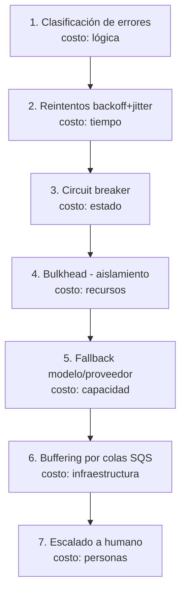

#### 7.3.2 Circuit breaker: el detalle que se pregunta

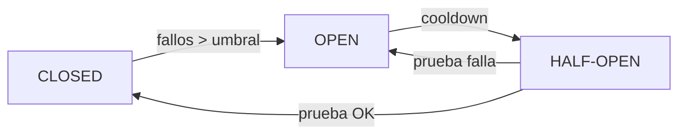
| Parámetro | Valor típico |
|---|---|
| Umbral de fallos | 3–5 fallos |
| Ventana de detección | ~5 minutos |
| Cooldown inicial | ~5 minutos (extendido a 15 si vuelve a fallar) |
| Estado | DynamoDB (simple) o **ElastiCache** (sub-milisegundo, para alta frecuencia) |

**Extensión importante en GenAI:** el breaker no solo debe dispararse por **errores HTTP**, también por **degradación de calidad** (si las respuestas empiezan a no cumplir el umbral de calidad en la ventana, se corta y se pasa a fallback).

#### 7.3.3 Fallbacks y degradación elegante

| Fallback | Implementación | Nota |
|---|---|---|
| **Modelo alterno (misma familia)** | Configuración por tipo de tarea | Mantener el contrato de salida compatible |
| **Otra región** | **CRIS** (automático) o clientes por región | Sin código extra; alinear IAM/SCP |
| **Otra familia/proveedor** | Fallback chain en el gateway | Solo si el prompt es portable |
| **Respuesta en caché** | Devolver la última respuesta válida conocida con marca de "desactualizado" | Debe comunicarse al usuario |
| **Modo degradado** | Desactivar features no críticas (resumen → texto crudo; búsqueda → resultados planos) | **Degradación explícita, nunca silenciosa** |
| **Cola diferida** | Aceptar el trabajo y procesarlo cuando el proveedor se recupere (202 + notificación) | Mejor que fallar en el pico |
| **Escalado humano** | Derivar a un humano con el contexto completo | Última línea, siempre disponible |

**Regla:** *la degradación silenciosa es peor que el error*. Si el sistema entrega una respuesta de menor calidad, debe decirlo (o marcar la fuente de la respuesta).

#### 7.3.4 Rate limiting y observabilidad

- **Rate limiting en API Gateway:** throttling por método/ruta, usage plans por API key (cuota + tasa), WAF a nivel IP. Es el control de gasto más barato y el que evita que un cliente afecte a todos.
- **Backoff del SDK:** `mode=adaptive` (incluye *client-side rate limiting*) es la configuración recomendada; complementarla con semáforos propios por modelo.
- **X-Ray:** imprescindible **con arquitecturas asíncronas**, donde el punto de fallo puede estar en el API, el stream de DynamoDB, la regla de EventBridge, el `Map` de Step Functions, el Paso del agente o el proveedor. **Propagar el Trace ID** desde el primer request hasta el workflow (p. ej. escribirlo en el ítem de DynamoDB). Con GenAI Observability y agentes, la traza muestra además los **spans por paso** (LLM, herramienta, memoria).

---

### 7.4 Skill 2.4.4 — Sistemas de routing inteligente de modelos

> *"Routing estático en código, routing dinámico por contenido con Step Functions, routing inteligente basado en métricas, transformaciones de request en API Gateway."*

#### 7.4.1 Las cinco capas donde puede vivir el routing

| Capa | Mecanismo | Ventaja | Limitación |
|---|---|---|---|
| **Código de la aplicación** | `if/else` por tipo de tarea, tenant o longitud | Determinístico, cero latencia extra, fácil de testear | Requiere despliegue para cambiar |
| **Configuración (AppConfig)** | Reglas externalizadas con rollout y rollback | Cambio sin desplegar; auditable | Necesita disciplina de configuración |
| **API Gateway** | Transformaciones de request / mapeos / rutas distintas → backends distintos | En el borde, antes de gastar cómputo; se combina con validación y cuotas | Lógica limitada (no semántica) |
| **Step Functions** | Estado `Choice` según el contenido, la confianza o el tenant; `Map` de escalado en cascada | **Visible y trazable paso a paso**; permite reintentos y fallbacks declarativos | Más latencia; más piezas |
| **Gateway / servicio** | Reglas centrales + **Intelligent Prompt Routing** (Bedrock, misma familia) | Sin código, gobernanza centralizada | IPR no cruza familias |

#### 7.4.2 Routing basado en métricas (lo más "inteligente")

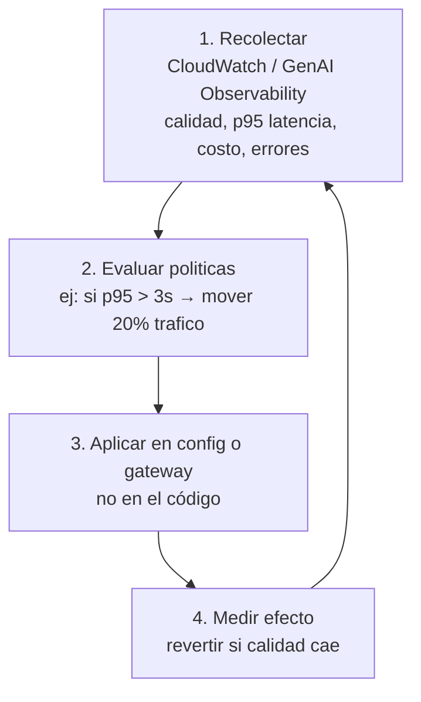
**Fuentes de señal:** métricas propias por modelo, evaluaciones continuas, canary suite, y (a nivel organización) el análisis de costo por modelo desde CUR.

#### 7.4.3 Patrón completo de routing + fallback

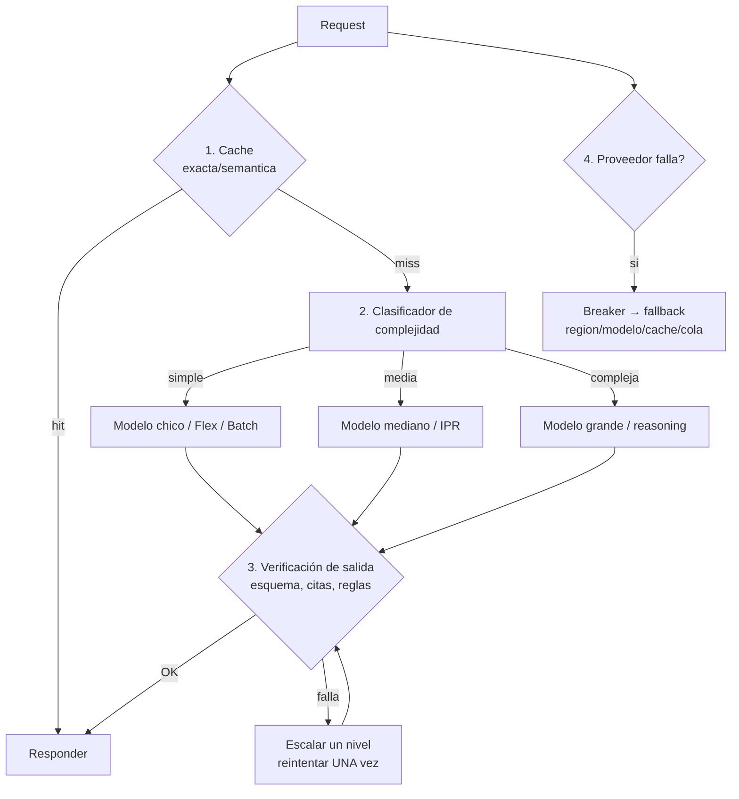

---

## 8. Task 2.5 — Patrones de integración de aplicaciones y herramientas de desarrollo

### 8.1 Skill 2.5.1 — Interfaces de API para cargas GenAI

> *"API Gateway para manejar streaming, gestión de límites de tokens, estrategias de retry para timeouts de modelo."*

#### 8.1.1 Los cuatro requisitos específicos de una API de GenAI

| Requisito | Implementación |
|---|---|
| **Respuestas largas / streaming** | Lambda response streaming o WebSocket (ver 7.2.2). Si usás API Gateway REST clásico, el buffering rompe la UX |
| **Timeouts de modelo** | Timeout de integración **>** p99 del modelo (o mejor: **no esperar** — patrón asíncrono + callback); timeouts separados por capa (cliente, gateway, Lambda, SDK) |
| **Gestión de límites de tokens** | Truncar/validar el input antes de enviarlo (`CountTokens`); limitar `maxTokens`; degradar el historial de conversación; rechazar con 413/422 explicativo en vez de dejar que el modelo falle |
| **Retry seguro** | Idempotencia por `requestId`; retry **solo** en errores transitorios; backoff+jitter; nunca reintentar un POST con efectos sin clave de idempotencia |

#### 8.1.2 Contrato de API para GenAI (diseño recomendado)

```
POST /v1/assist                       # síncrono, respuestas cortas
POST /v1/assist/stream                # SSE / response streaming
POST /v1/jobs                         # 202 Accepted + jobId  (trabajos largos)
GET  /v1/jobs/{jobId}                 # estado/resultado
POST /v1/jobs/{jobId}/feedback        # thumbs / corrección
WS   /v1/notifications                # notificaciones asíncronas
```
Cada endpoint con: autenticación, validación de esquema, cuota por cliente, `X-Request-Id` para idempotencia y correlación, y logging estructurado.

---

### 8.2 Skill 2.5.2 — Interfaces accesibles para acelerar la adopción

> *"AWS Amplify para componentes de UI declarativos, especificaciones OpenAPI para desarrollo API-first, Amazon Bedrock Prompt Flows para builders no-code."*

#### 8.2.1 Las tres audiencias y su herramienta

| Audiencia | Herramienta | Qué obtiene |
|---|---|---|
| **Desarrolladores full-stack / front-end** | **Amplify AI Kit** | Componente React de chat **con streaming**, hook `useAIConversation`, cliente type-safe, historial y conversaciones reanudables; el acceso a Bedrock es **server-side y seguro**; **el LLM solo puede acceder a los datos que el usuario final puede ver** (los permisos del esquema de datos se aplican); soporta **herramientas** y **UI generativa** (el modelo puede responder con componentes definidos por vos) |
| **Equipos de plataforma / integradores** | **OpenAPI (API-first)** | Contrato primero: generar SDKs, validar requests en API Gateway, importar APIs como **herramientas** (incluido el **MCP Proxy** de API Gateway y los targets OpenAPI de AgentCore Gateway) |
| **Builders no-code / analistas** | **Bedrock Flows** | Constructor visual: nodos de orquestación (prompts, agentes, KB), datos (S3, KB), lógica (condiciones) y código (Lambda/Lex); versionado, pruebas en consola y gestión por API/CDK; integra guardrails |

**Detalle de arquitectura de Amplify AI Kit (se pregunta):** el flujo es UI → **AppSync** (que actúa como gateway seguro, incluidas las llamadas del LLM a los datos) → Lambda → **converse_stream** de Bedrock; el historial se guarda como datos con las reglas de autorización del esquema.

---

### 8.3 Skill 2.5.3 — Mejoras de sistemas de negocio

> *"Lambda para mejoras de CRM, Step Functions para orquestar procesamiento de documentos, Bedrock Data Automation para workflows de procesamiento automático de datos."*

| Sistema | Patrón | Implementación |
|---|---|---|
| **CRM (Salesforce, Dynamics, HubSpot)** | Enriquecimiento, resumen de cuentas, siguiente mejor acción, redacción de correos | Lambda + API del CRM; **idempotencia por registro**; aprobación humana antes de enviar |
| **Procesamiento de documentos** | Ingesta → clasificación → extracción → validación → carga al sistema de registro | **Step Functions**: `Map` para paralelizar documentos, `Choice` por tipo, espera humana en excepciones, DLQ para fallos |
| **Extracción de datos no estructurados** | Facturas, formularios, contratos, imágenes | **Bedrock Data Automation**: extracción multimodales con **visual grounding y confidence scores** para explicabilidad, salida con formato consistente, y mitigación de alucinación integrada |
| **Sistemas de tickets** | Clasificación, enrutamiento, borrador de respuesta | Lambda + Bedrock; el humano aprueba (patrón de 4.5) |
| **ERP/legacy** | Traducción de contratos | API Gateway + Lambda adaptador |
| **Contact center** | Transcripción, resumen, análisis de sentimiento | Transcribe + Comprehend + Bedrock; datos en S3 con lifecycle |

**Regla de oro:** cuando el output de la IA **escribe en un sistema de registro**, la validación determinística y el registro de auditoría **no son opcionales**.

---

### 8.4 Skill 2.5.4 — Productividad del desarrollador

> *"Amazon Q Developer para generar y refactorizar código, sugerencias, testing de componentes de IA, optimización de performance."*

| Capacidad | Uso concreto en un proyecto GenAI |
|---|---|
| Generación y **refactorización** | Convertir prototipos en módulos testeables; migrar SDKs; extraer un cliente de Bedrock reutilizable |
| Sugerencias en el IDE / **API assistance** | Completar llamadas de boto3 a Bedrock, parámetros de `Converse`, tipos de eventos de streaming |
| **Testing** | Generar tests unitarios, mocks del cliente de Bedrock y casos de regresión para prompts y herramientas |
| **Optimización de performance** | Detectar código ineficiente en el camino caliente (serialización, timeouts, conexiones) |
| **Seguridad** | Escaneos de seguridad en el IDE y en el pipeline |
| **Modernización** | Actualizar aplicaciones Java/.NET para integrar servicios de IA |
| **Análisis de logs (CLI)** | Q Developer CLI analiza CloudWatch Logs y propone causas/arreglos (ver 8.6) |
| **CI/CD** | Sugerencias dentro de CodeCatalyst/CodePipeline |

**Uso responsable:** el código generado se revisa como cualquier otro (los mismos gates de CI/CD y el mismo escrutinio en rutas de seguridad).

---

### 8.5 Skill 2.5.5 — Aplicaciones GenAI avanzadas

> *"Strands Agents y AWS Agent Squad para orquestación nativa de AWS, Step Functions para orquestar patrones de diseño de agentes, Amazon Bedrock para patrones de prompt chaining."*

#### 8.5.1 Cómo se combinan las tres piezas

| Capa | Herramienta | Responsabilidad |
|---|---|---|
| **Loop del agente** | Strands / Agent Squad | Razonar, elegir herramientas, mantener contexto |
| **Orquestación del proceso** | Step Functions | Fan-out, validación, aprobación humana, retries, compensaciones, límites |
| **Ensamblado de prompts** | Bedrock Prompt Management / Prompt Flows | Prompts versionados, chaining, parámetros, guardrails |

**Los patrones de diseño de agentes que Step Functions puede orquestar:** ReAct (loop con límite), *prompt chaining*, *routing* por especialista, *parallel fan-out + agregación*, *reflection* (un paso critica al anterior antes de continuar), *human-in-the-loop*, y *saga* con compensaciones.

**Ejemplo de reparto correcto:**
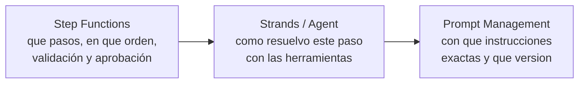

#### 8.5.2 Prompt chaining bien hecho

- **Un contrato por paso:** cada paso devuelve **structured output** (JSON Schema) que el siguiente valida.
- **Versionado:** cada prompt del chain tiene versión; un cambio se promueve con evaluación.
- **Límites:** número máximo de pasos, presupuesto de tokens por chain, timeout total.
- **Trazabilidad:** cada paso emite un span con la versión de prompt usada (si no, no podés atribuir una regresión).

---

### 8.6 Skill 2.5.6 — Eficiencia en troubleshooting de aplicaciones FM

> *"CloudWatch Logs Insights para analizar prompts y respuestas, X-Ray para trazar llamadas a la API del FM, Q Developer para reconocimiento de patrones de error específicos de GenAI."*

#### 8.6.1 Las tres herramientas y qué responde cada una

| Pregunta | Herramienta | Qué mirar |
|---|---|---|
| ¿**Qué** se envió y qué volvió? | **Model Invocation Logging + Logs Insights** | `inputTokenCount`, `outputTokenCount`, `stopReason`, prompts/responses, `errorCode`. ⚠️ El logging está **apagado por defecto** |
| ¿**Dónde** se fue el tiempo y qué falló en el camino? | **X-Ray / GenAI Observability** | Spans por paso: retrieval, LLM, herramienta, guardrail; mapa de servicio; errores por segmento |
| ¿**Por qué** falla y cómo se arregla? | **Q Developer (IDE/CLI)** | Análisis de logs de CloudWatch, reconocimiento de patrones de error (throttling, token limit, formato inválido) y sugerencia de corrección |

#### 8.6.2 Recetas de troubleshooting (las que aparecen en el examen)

| Síntoma | Diagnóstico | Arreglo |
|---|---|---|
| `ThrottlingException` intermitente | Revisar `InvocationThrottles`, `EstimatedTPMQuotaUsage`, y **reserva de cuota por `maxTokens`** | Bajar `maxTokens`, acotar concurrencia, CRIS, cuota o Reserved/PT |
| Respuesta truncada | `stopReason == max_tokens` en los logs | Subir `maxTokens` o acortar la instrucción |
| Salida inválida para el parser | Falta structured outputs | JSON Schema + revisar truncamiento |
| Latencia alta sin cambio de tráfico | Separar TTFT vs generación; revisar tool calls y retrieval en la traza | Optimizar el paso culpable (herramienta lenta, k alto, contexto inflado) |
| Respuestas que empeoraron "de golpe" | Comparar `prompt_version`/`model_version` en las trazas; correr el canary suite | Revertir la versión (AppConfig/Prompt Management) y evaluar |
| Stream que se corta silenciosamente | Faltó propagar los eventos de excepción del stream | Emitir frames de error tipados al cliente |
| Workflow asíncrono "perdido" | Falta de propagación del Trace ID | Corregir la propagación y revisar DLQs |
| Costo por request subió | Tokens por tarea en los logs (típicamente prompt bloat o tool outputs grandes) | Poda de contexto / límite de resultados de herramientas |

**Práctica básica (casi obligatoria en producción):** loguear **estructuradamente** por request `{trace_id, session_id, app, model, prompt_version, guardrail_version, tokens_in, tokens_out, ttft_ms, total_ms, stop_reason, error_code}` y poner **alarmas por patrón**, no solo por umbral.

---

## 9. Arquitectura de referencia

```mermaid
graph TD
    subgraph C6["CAPA 6 - ENTREGA Y GOBERNANZA"]
        C6a["CI/CD: CodePipeline + CodeBuild + CodeDeploy con 5 gates"]
        C6b["GenAI Gateway: routing, cuotas, costo, guardrails"]
        C6c["Prompt Management + AppConfig + Model Registry"]
    end
    subgraph C5["CAPA 5 - OBSERVABILIDAD Y OPERACIÓN"]
        C5a["X-Ray / Transaction Search: trazas end-to-end"]
        C5b["CloudWatch: metricas, alarmas, Logs Insights"]
        C5c["Model Invocation Logging + agent traces"]
    end
    subgraph C4["CAPA 4 - EXPERIENCIA"]
        C4a["Web/Movil: Amplify AI Kit, AppSync"]
        C4b["API Gateway: REST/HTTP/WS + MCP Proxy"]
        C4c["SSE/WebSocket/streaming + feedback loop"]
    end
    subgraph C3["CAPA 3 - ORQUESTACIÓN DETERMINÍSTICA"]
        C3a["Step Functions Standard: waits/callbacks/humano"]
        C3b["Lambda durable + EventBridge + SQS/SNS"]
        C3c["Map/Parallel + limites"]
    end
    subgraph C2["CAPA 2 - INTELIGENCIA"]
        C2a["AgentCore Runtime + Harness + Strands/Agent Squad"]
        C2b["AgentCore Memory: short + long term"]
        C2c["Bedrock models + SageMaker endpoints"]
    end
    subgraph C1["CAPA 1 - HERRAMIENTAS Y DATOS"]
        C1a["AgentCore Gateway: MCP tools + Policy Cedar"]
        C1b["Knowledge Bases + vector store"]
        C1c["APIs internas + SaaS: CRM/ERP/ticketing"]
    end
    subgraph C0["CAPA 0 - IDENTIDAD, RED Y SECRETOS"]
        C0a["IAM Identity Center + AgentCore Identity + Cognito"]
        C0b["VPC endpoints / PrivateLink + KMS + Secrets Manager"]
    end
    C6 --> C5 --> C4 --> C3 --> C2 --> C1 --> C0
```

**Recorrido de una petición "bien integrada":**
1. El usuario se autentica (SSO/Cognito) → el gateway valida el JWT y aplica cuota y routing.
2. Se busca en caché; si no hay, la API responde **202 con jobId** o abre un stream.
3. Step Functions toma el trabajo: recupera contexto, invoca al agente (AgentCore) con herramientas vía Gateway.
4. El agente propone; **la validación determinística** decide; si el caso es dudoso, un humano aprueba vía `waitForTaskToken` (sin costo de cómputo mientras espera).
5. La acción se ejecuta con **clave de idempotencia** y se registra en el audit trail.
6. El resultado se notifica (WebSocket/SSE) y se guarda en la memoria de largo plazo si aporta valor.
7. Trazas, métricas, tokens y costo quedan atribuidos; el feedback del usuario alimenta el dataset de evaluación; el pipeline de mejora corre con gates.

---

## 10. Cheat sheet: tablas de decisión para el examen

### 10.1 "Si el escenario dice… → elegí…"

| El escenario dice | Respuesta esperada |
|---|---|
| Necesito un agente y quiero controlar el loop, corriendo en mi propio proceso | **Strands Agents SDK** (model-driven, multi-agente, MCP, hooks, sessions) |
| Necesito agentes administrados con aislamiento de sesión por usuario, 8 h de ejecución y trazas | **AgentCore Runtime** |
| Quiero un agente sin escribir el loop de orquestación | **AgentCore Harness** (`create_harness`) |
| Varios agentes especializados detrás de una única entrada; un router decide | **AWS Agent Squad** (o patrón **Agents as Tools**/**Swarm** en Strands) |
| El camino de ejecución debe ser previsible y auditable, con ramas | **Strands Graph** o **Step Functions** |
| El flujo es una secuencia fija y reutilizable | **Strands Workflow** o **Bedrock Flow** (si no-code) |
| El agente debe recordar entre sesiones y entre agentes | **AgentCore Memory** (long-term con estrategias) |
| Necesito que el agente recuerde durante la conversación pero no después | Memoria de corto plazo por `sessionId` (**AgentCore Memory** short-term o DynamoDB) |
| El usuario debe aprobar antes de ejecutar una acción con impacto financiero | **Step Functions `waitForTaskToken`** (+ SQS/SNS/ITS) — pausa **sin costo de cómputo** |
| El workflow puede durar horas o días | **Step Functions Standard** (hasta 1 año) — Express **no** soporta callbacks |
| Necesito orquestación como código dentro de Lambda, con esperas sin facturar | **Lambda durable functions** (`waitForCallback`) |
| Tengo que invocar Bedrock desde un state machine **sin Lambda** | Integración optimizada **`bedrock:invokeModel`** (⚠️ no aplica a `Converse` ni streaming) |
| Necesito invocar un agente AgentCore con timeout de 15 min desde Step Functions | Integración directa con AgentCore (request-response, **sin** `.waitForTaskToken` sobre el paso del agente) |
| El payload del estado supera 256 KB | **Claim check**: guardar en S3 y pasar la referencia |
| Procesar 50.000 documentos en paralelo | **Step Functions `Map` (Distributed)** con `MaxConcurrency` acotado a la cuota |
| El agente entra en bucle | Límite de iteraciones: `Choice` + contador en Step Functions, o **turn limits de Strands** |
| El proveedor está caído y quiero dejar de golpearlo | **Circuit breaker** (DynamoDB/ElastiCache) + fallback |
| Necesito degradar elegantemente ante fallo del modelo | **Fallback chain** + respuesta en caché marcada + modo degradado comunicado |
| Reintentos que no generen tormenta | **Backoff exponencial + jitter** (botocore `mode=adaptive`), solo errores transitorios |
| Exponer herramientas internas (Lambda/API) a agentes con control central | **AgentCore Gateway** (targets Lambda u OpenAPI → herramientas MCP + **Policy en Cedar**) |
| Mi servidor MCP es liviano y el tráfico es en ráfagas | **Lambda** (+ API Gateway o Function URL con OAuth) |
| Mi servidor MCP es pesado, con GPU o runtime no-Python | **ECS/Fargate** (o EKS) detrás de ALB |
| Tengo un MCP server en stdio y quiero exponerlo remoto | Adaptador de **`run-model-context-protocol-servers-with-aws-lambda`** + API Gateway/AgentCore Gateway |
| Quiero que un cliente MCP externo (Claude Desktop, IDE) se conecte con una URL | MCP remoto con **OAuth 2.1** (Cognito) + **AgentCore Gateway** o API Gateway MCP Proxy |
| Necesito streaming token a token con API Gateway REST | Activar **response transfer mode = STREAM** (probablemente con Lambda response streaming) |
| Necesito streaming bidireccional y notificaciones asíncronas | **API Gateway WebSocket** (`@connections`) |
| El cliente debe ver la primera palabra en <1 s | **Streaming** (ConverseStream + SSE/WebSocket) — **no** cambia el costo total |
| Necesito que el sistema no dependa del timeout del borde | **Patrón asíncrono**: 202 + jobId + notificación (DynamoDB → Pipes → Step Functions → WebSocket) |
| Conectar un productor con un target sin Lambda glue | **EventBridge Pipes** (source → filter → enrichment → target; ojo: 5 min de techo en enrichment) |
| Enrutar eventos por contenido y reproducirlos después | **EventBridge** (event patterns + archive/replay) |
| El evento supera 256 KB | **Claim check** a S3 |
| Necesito idempotencia en un workflow de IA | Clave determinística en **DynamoDB** (`attribute_not_exists`) o `ConditionCheck` en Step Functions |
| Modelo chico para tareas simples, grande para complejas, sin código complejo | **Cascading** + **Intelligent Prompt Routing** (misma familia) |
| Routing basado en el contenido, visible paso a paso | **Step Functions `Choice`** |
| Routing basado en métricas (latencia/calidad/costo) | Configuración (**AppConfig**) o **gateway**, alimentado por CloudWatch |
| Cambiar el modelo sin desplegar código | **AppConfig** (rollout y rollback) |
| Cambiar el prompt sin desplegar y con versiones | **Bedrock Prompt Management** (o Flows) |
| Un no-code builder para el equipo de negocio | **Bedrock Flows** |
| Que un LLM acceda solo a los datos que el usuario final puede ver | **RBAC del esquema de datos + metadata filtering** (patrón de Amplify AI Kit: todo pasa por AppSync) |
| Que el agente llame sistemas externos sin guardar credenciales | **AgentCore Identity** (credential brokering, tokens de corta duración) |
| Impedir que cualquier equipo invoque modelos sin guardrail | Condición IAM **`bedrock:GuardrailIdentifier`** en un **Deny** |
| Cumplir residencia de datos **y** escalar capacidad | **Geo-CRIS** (`eu.`, `us.`…) + alinear **SCP e IAM** con las regiones destino (exceptuar con `bedrock:InferenceProfileArn`) |
| Latencia ultra-baja en el borde | **Wavelength** (5G) o **Local Zones**; modelos optimizados |
| Procesar datos que no pueden salir del datacenter | **AWS Outposts** + PrivateLink/Direct Connect |
| Costo por token demasiado alto con volumen sostenido | Migrar a **endpoint dedicado de SageMaker** (o PT/Reserved) tras validar la utilización |
| Picos con valles, sin GPU y tolerando cold start | **SageMaker Serverless** (≤6 GB RAM, 4 MB, 60 s) |
| Payloads de hasta 1 GB y hasta 1 hora de proceso | **SageMaker Async Inference** |
| Servir cientos de adaptadores LoRA sobre un modelo base | **Inference components** / multi-adapter / MME |
| Cold start de 60 s inaceptable en serverless | **Provisioned concurrency** (o endpoint real-time) |
| Cientos de modelos chicos, flota compartida | **Multi-model endpoints** |
| Estandarizar el acceso a modelos de varios proveedores con costos y cuotas | **GenAI Gateway** (guía AWS con LiteLLM) o construir con API Gateway |
| Desplegar con canary y rollback automático | **Lambda alias ponderado** / **SageMaker deployment guardrails** + CloudWatch alarms |
| Que un cambio de prompt no llegue a producción sin evaluación | **Gate de evaluación** en CI/CD con Bedrock Evaluations |
| Depurar un workflow asíncrono | **X-Ray** con propagación del Trace ID desde el primer request |
| Entender por qué falla un prompt concreto | **Model Invocation Logging + Logs Insights** (habilitar; está off por defecto) |
| Sugerencias automáticas de arreglo a partir de logs | **Amazon Q Developer** (análisis de CloudWatch Logs) |
| Reducir el trabajo de integración en el front-end | **Amplify AI Kit** (componente de chat con streaming, type-safe, permisos por datos) |

### 10.2 Límites numéricos que conviene tener a mano

| Límite | Valor |
|---|---|
| Lambda | 15 min de timeout; payload de evento ~6 MB; streaming de respuesta hasta ~20 MB |
| Step Functions | **256 KiB** por payload de estado; Standard hasta **1 año**; Express hasta **5 min** |
| Step Functions `Map` | Inline ≤40 ítems; Distributed hasta **10.000** de concurrencia |
| EventBridge | **256 KB** por evento; 5 targets por regla; entrega *at-least-once* |
| EventBridge Pipes (enrichment) | Techo síncrono de **5 min** |
| API Gateway WebSocket | **128 KB** por mensaje (frame 32 KB); idle ~10 min; conexión máx. **2 h** |
| API Gateway REST (integración) | Timeout por defecto 29 s (ajustable hasta 15 min en algunos tipos) |
| SageMaker Serverless | **6 GB RAM**, **4 MB** payload, **60 s** timeout, **200** concurrencia, **sin GPU** |
| SageMaker Async | Payload hasta **1 GB**; timeout configurable hasta **3600 s** (default 15 min) |
| AgentCore Runtime | Sesión hasta **8 h**; **15 min** de inactividad termina la sesión; payload **100 MB** |
| AgentCore Runtime ↔ Step Functions | Timeout por tarea de **15 min**; sin callbacks sobre el paso del agente |
| ConverseStream (IAM) | Se autoriza con `bedrock:InvokeModelWithResponseStream` |

---

## 11. Patrones de pregunta y trampas frecuentes

### 11.1 Las dieciséis trampas

1. **Elegir Step Functions para "el agente" cuando el enunciado solo pide un agente que use herramientas.** Step Functions es el **loop externo**; si no hay requisitos de auditoría, pausa o duración, el loop del SDK es la respuesta.
2. **Usar Express Workflows donde hace falta un callback humano.** Express **no soporta** `waitForTaskToken`. Si hay aprobación, es **Standard**.
3. **Esperar al modelo dentro de Lambda.** Un Lambda bloqueado 40 s esperando al modelo paga cómputo por nada y puede exceder el timeout del borde. El patrón correcto es dispatch + callback (o durable function).
4. **Creer que el paso del agente en Step Functions admite `.waitForTaskToken`.** La integración con AgentCore es **request-response, 15 min, sin callbacks**; la espera humana va en un **Task separado**.
5. **Suponer que API Gateway REST hace streaming por defecto.** **Bufferiza** la respuesta: hay que usar response streaming (transfer mode), WebSocket, SSE o Function URL.
6. **Batcher tokens en un WebSocket.** Supera los 128 KB ⇒ cierre con código 1009. Se envían en frames pequeños y frecuentes.
7. **Olvidar la idempotencia en arquitecturas event-driven.** DynamoDB Streams y EventBridge son *at-least-once*: sin clave de idempotencia, pagás (y ejecutás acciones) dos veces.
8. **Routing estático en código cuando el requisito es cambiarlo sin desplegar.** La respuesta es **AppConfig** o el **gateway**.
9. **Usar IPR para enrutar entre familias distintas de modelos.** No está soportado (solo dentro de la misma familia).
10. **Ignorar que SCP e IAM deben permitir las regiones destino de CRIS.** Síntoma: `AccessDenied` intermitente. Solución: exceptuar con `bedrock:InferenceProfileArn`, no ampliar la allowlist.
11. **Creer que SageMaker Serverless sirve un LLM grande.** Sin GPU, 6 GB de RAM y 60 s de timeout: no es una opción para ese caso.
12. **Comparar Bedrock y SageMaker solo por precio por token.** El eje real es **tokens vs. horas-instancia**: Bedrock cuesta $0 en reposo; un endpoint real paga 24/7.
13. **Poner la lógica de negocio dentro del prompt.** La validación determinística va en código (Lambda/Step Functions); el prompt propone, no decide.
14. **Suponer que el estado de sesión es duradero.** El microVM se destruye al terminar la sesión; la durabilidad requiere Memory/DynamoDB/S3.
15. **Creer que AgentCore Registry certifica la seguridad de lo listado.** Es un **catálogo de descubrimiento**, no una evaluación.
16. **No propagar el Trace ID en flujos asíncronos.** Sin trazabilidad, depurar un pipeline de eventos es adivinanza.

### 11.2 Frases que suelen indicar la respuesta correcta

- **"sin consumir cómputo mientras espera"** → `waitForTaskToken` (o durable function).
- **"agentes proponen, el código valida"** → orquestación determinística alrededor del agente.
- **"ver los tokens a medida que se generan"** → transporte de streaming (y el modelo correcto de `ConverseStream`).
- **"desacoplar el productor del consumidor"** → EventBridge/SQS (con idempotencia).
- **"sin escribir código"** → Bedrock Flows (o Prompt Management para prompts versionados).
- **"un único punto de control para todos los equipos"** → GenAI Gateway.
- **"aislamiento por usuario/sesión"** → AgentCore Runtime (microVM).
- **"herramientas descubribles y autorizadas de forma central"** → AgentCore Gateway + Policy.
- **"cambiar de modelo sin tocar el código de la aplicación"** → gateway o AppConfig.
- **"reanudar donde quedó"** → session manager / durable execution / Step Functions.
- **"el agente no debe poder llamar a X"** → IAM del rol del agente (+ Policy en el Gateway), no una instrucción en el prompt.

---

## 12. Checklists operativos

### 12.1 Diseño de agentes (2.1)
- [ ] Definido quién posee el loop (Strands SDK vs AgentCore Runtime vs Harness) y por qué.
- [ ] Patrón multi-agente elegido explícitamente (Agents-as-Tools / Graph / Swarm / Workflow).
- [ ] Límite de iteraciones, presupuesto de tokens y timeouts configurados.
- [ ] Herramientas con descripciones precisas, tipos estrictos, validación, idempotencia y respuesta acotada.
- [ ] Memoria: qué se guarda, dónde, por cuánto, con qué aislamiento por usuario/tenant.
- [ ] Salvaguardas de workflow: condiciones de parada, circuit breaker, kill switch, idempotencia.
- [ ] Decisiones críticas validadas por código determinístico (no por el prompt).
- [ ] Canal de feedback humano implementado y conectado a evaluación.

### 12.2 Herramientas y MCP (2.1.6–2.1.7)
- [ ] Ruta de hosting elegida (Lambda / Lambda+API Gateway / ECS / AgentCore) según tráfico, duración y runtime.
- [ ] OAuth 2.1 (o IAM) configurado; **nunca** `AuthType=NONE` en exposición externa.
- [ ] Versión de protocolo MCP declarada y compatible (y tolerancia al header `Mcp-Session-Id` si es AgentCore).
- [ ] Idempotencia en herramientas con efectos secundarios.
- [ ] Errores tipados y accionables (no stack traces).
- [ ] Biblioteca cliente MCP única en la organización (timeouts, retries y telemetría homogéneos).
- [ ] Telemetría por herramienta (invocaciones, errores, latencia, `TargetExecutionTime`).

### 12.3 Despliegue (2.2)
- [ ] Decisión tokens vs. horas-instancia documentada con el patrón de tráfico real.
- [ ] Uso de Batch/Flex para todo lo no interactivo.
- [ ] Cuenta de memoria GPU hecha (pesos + KV cache + overhead) antes de elegir instancia.
- [ ] Imagen liviana, pesos fuera de la imagen, carga concurrente/shardeada.
- [ ] Provisioned concurrency o warm capacity si el cold start es inaceptable.
- [ ] Autoscaling por concurrencia/latencia, no por CPU.
- [ ] Cascada y/o modelos chicos implementados para consultas rutinarias.
- [ ] Deployment guardrails / canary con rollback automático.

### 12.4 Integración empresarial (2.3)
- [ ] Contrato de API versionado (OpenAPI) y validación de requests en el gateway.
- [ ] Integraciones legacy encapsuladas detrás de una fachada estable.
- [ ] Event-driven con DLQ, archive/replay e **idempotencia** en cada consumidor.
- [ ] Payloads grandes por referencia a S3 (claim check).
- [ ] Identidad de usuario y de workload separadas; credenciales de corta duración.
- [ ] RBAC aplicado en modelos, datos (filtros en recuperación) y herramientas (Policy).
- [ ] Residencia de datos verificada (perfil de inferencia y de guardrail, regiones destino, SCP/IAM alineados).
- [ ] Edge/on-premises resuelto con el patrón correcto (Outposts/Wavelength/Local Zones).
- [ ] GenAI Gateway desplegado por entorno, con cuotas, costos y guardrails centralizados.

### 12.5 CI/CD (2.3.5)
- [ ] Prompts y configuración de modelos versionados (Prompt Management / AppConfig), no hardcodeados.
- [ ] Gate de evaluación con dataset dorado y umbrales bloqueantes.
- [ ] Gate de costo estimado por 1.000 requests.
- [ ] Escaneos de seguridad (dependencias, imágenes, IaC) en el pipeline.
- [ ] Canary/shadow antes del 100 % del tráfico y rollback automatizado.
- [ ] Aprobación humana registrada para cambios de alto impacto.
- [ ] Los cambios del gateway también pasan por CI/CD.

### 12.6 API y tiempo real (2.4)
- [ ] Endpoints separados para sync, streaming y jobs asíncronos.
- [ ] Transporte de streaming elegido según requisito (y probado contra buffering).
- [ ] `stopReason` y eventos de excepción del stream manejados y propagados al cliente.
- [ ] Reconexión con deduplicación por número de secuencia.
- [ ] Límite de tokens de entrada validado antes de invocar (`CountTokens`).
- [ ] Throttling/usage plans por cliente y `X-Request-Id` para idempotencia.
- [ ] Backoff adaptativo configurado en el SDK + semáforo por modelo.
- [ ] X-Ray activo con propagación de Trace ID a través de asincronía.
- [ ] Estrategia de fallback y degradación definida y **comunicada al usuario**.

### 12.7 Aplicaciones y productividad (2.5)
- [ ] Interfaz adecuada por audiencia (Amplify AI Kit / OpenAPI / Flows).
- [ ] Permisos de datos aplicados en el acceso del LLM (no solo en la UI).
- [ ] Procesos de documentos orquestados con Step Functions (paralelismo + validación + DLQ).
- [ ] Q Developer usado con revisión de código equivalente a la de código humano.
- [ ] Prompt chaining con contratos tipados entre pasos y versionado por paso.
- [ ] Alarmas por patrón de error (no solo por umbral) y logging estructurado por request.

---

## 13. Anexos

### Anexo A. Snippets de código

**A.1 — Agente Strands con herramientas, límites y hooks**

```python
from strands import Agent, tool
from strands.models import BedrockModel
from strands.hooks import HookProvider, HookRegistry, BeforeToolCallEvent, AfterToolCallEvent

@tool
def buscar_cliente(email: str) -> dict:
    """Busca un cliente por email. Usar solo si el usuario dio un email."""
    return crm.find_by_email(email)

class PoliticaDeHerramientas(HookProvider):
    """Bloquea herramientas fuera de la allowlist según el rol del usuario."""
    def __init__(self, allowlist: set[str]):
        self.allowlist = allowlist

    def register_hooks(self, registry: HookRegistry) -> None:
        registry.add_callback(BeforeToolCallEvent, self.validar)

    def validar(self, event: BeforeToolCallEvent) -> None:
        if event.tool_name not in self.allowlist:
            raise PermissionError(f"herramienta no permitida: {event.tool_name}")

agent = Agent(
    model=BedrockModel(model_id="us.anthropic.claude-sonnet-4-5-20250929-v1:0"),
    tools=[buscar_cliente],
    system_prompt="Sos un asistente de soporte. No inventes datos: si no lo encontrás, decilo.",
    hooks=[PoliticaDeHerramientas({"buscar_cliente"})],
    # límites de ciclo de vida: turnos, tokens, cancelación
)
print(agent("¿Tenés el registro del cliente ana@ejemplo.com?"))
```

**A.2 — Multi-agente con Graph (camino auditable) y estado compartido**

```python
from strands.multiagent import GraphBuilder

builder = GraphBuilder()
builder.add_node(analista, "analizar")
builder.add_node(redactor, "redactar")
builder.add_node(revisor,  "revisar")
builder.add_node(manejo_error, "error")

builder.add_edge("analizar", "redactar")
builder.add_edge("redactar", "revisar")
builder.add_edge("analizar", "error")     # arista explícita de error

workflow = builder.build()
resultado = workflow.execute(
    "Analizá los reclamos del mes y redactá un informe",
    invocation_state={"tenant": "acme", "user_id": "u-4412"},   # estado compartido (no va al LLM)
)
```

**A.3 — Step Functions: salto de payload con S3 (claim check) + paso de Bedrock sin Lambda**

```python
# En el state machine (ASL), en lugar de pasar el documento completo:
#   "StoreDocument": { "Type": "Task", "Resource": "arn:aws:states:::aws-sdk:s3:putObject", ... }
#   y luego pasar sólo { "bucket": ..., "key": ... } a los estados siguientes.
# El paso de inferencia puede ser sin Lambda:
#   "Extract": {
#     "Type": "Task",
#     "Resource": "arn:aws:states:::bedrock:invokeModel",
#     "Parameters": {
#        "ModelId": "us.amazon.nova-lite-v1:0",
#        "ContentType": "application/json",
#        "Body": { "messages": [{"role":"user","content":[{"text.$":"$.prompt"}]}],
#                  "inferenceConfig": {"maxTokens": 512} }
#     },
#     "Retry": [{"ErrorEquals":["Bedrock.ThrottlingException"],
#                "IntervalSeconds":2,"MaxAttempts":5,"BackoffRate":2.0}],
#     "Next": "Validate"
#   }
# NOTA: Converse y las APIs de streaming NO están en la integración optimizada.
```

**A.4 — Patrón asíncrono completo: dispatch + callback (sin Lambda bloqueado)**

```python
# === Dispatcher (invocado con lambda:invoke.waitForTaskToken) ===
import json, os, boto3
agentcore = boto3.client("bedrock-agentcore")
def lambda_handler(event, context):
    task_token = event["taskToken"]                # $$.Task.Token
    payload = {"taskToken": task_token, "document": event["document"]}
    agentcore.invoke_agent_runtime(
        agentRuntimeArn=os.environ["AGENT_ARN"],
        runtimeSessionId=event["sessionId"],
        payload=json.dumps(payload).encode(),
    )
    return {"dispatched": True}      # la Lambda MUERE; Step Functions sigue pausado

# === Herramienta del agente: avisa a Step Functions cuando termina ===
import json, boto3
sfn = boto3.client("stepfunctions")

@tool
def conclude_validation(approved: bool, issues: list, summary: str) -> str:
    """Cierra la validación y despierta al workflow."""
    verdict = {"approved": approved, "issues": issues, "summary": summary}
    if (token := ctx.task_token):
        sfn.send_task_success(taskToken=token, output=json.dumps(verdict))
    return "workflow reanudado"

# ASL:
# "Validate": {
#   "Type": "Task",
#   "Resource": "arn:aws:states:::lambda:invoke.waitForTaskToken",
#   "Parameters": {"FunctionName": "${Dispatcher}",
#                  "Payload": {"taskToken.$":"$$.Task.Token","document.$":"$.document"}},
#   "TimeoutSeconds": 900, "HeartbeatSeconds": 120,
#   "Next": "ApplyResult"
# }
```

**A.5 — Cliente resiliente: backoff adaptativo, semáforo y fallback en cascada**

```python
import asyncio, boto3
from botocore.config import Config

CFG = Config(
    retries={"max_attempts": 5, "mode": "adaptive"},   # backoff + client-side rate limiting
    tcp_keepalive=True, max_pool_connections=50, read_timeout=120,
)
rt = boto3.client("bedrock-runtime", config=CFG)
SEM = asyncio.Semaphore(8)                            # concurrencia POR modelo

MODELOS = [                                           # cascada
    "us.anthropic.claude-haiku-4-5-20251001-v1:0",    # barato primero
    "us.anthropic.claude-sonnet-4-5-20250929-v1:0",   # escalado
]

async def responder(prompt: str) -> str:
    for i, modelo in enumerate(MODELOS):
        try:
            async with SEM:
                resp = await asyncio.to_thread(
                    rt.converse, modelId=modelo,
                    messages=[{"role": "user", "content": [{"text": prompt}]}],
                    inferenceConfig={"maxTokens": 700, "temperature": 0.2},
                )
            texto = resp["output"]["message"]["content"][0]["text"]
            # Chequeo de confianza: si el paso 1 no pasa la validación, escalamos
            if i == 0 and not pasa_validacion(texto):
                continue
            return texto
        except rt.exceptions.ThrottlingException:
            continue                                   # cuota: probar el siguiente modelo
        except Exception:
            if i == len(MODELOS) - 1:
                raise
    return "No pude completar la respuesta en este momento. Un especialista te contactará."
```

**A.6 — Streaming con ConverseStream: solo deltas, errores tipados y stopReason**

```python
def stream_al_cliente(prompt: str, emit):
    """emit(tipo, payload) envía al transporte (WebSocket, SSE, etc.)."""
    try:
        resp = rt.converse_stream(
            modelId="us.anthropic.claude-sonnet-4-5-20250929-v1:0",
            messages=[{"role": "user", "content": [{"text": prompt}]}],
            inferenceConfig={"maxTokens": 1024, "temperature": 0.3},
        )
        seq = 0
        for ev in resp["stream"]:
            if "contentBlockDelta" in ev:
                texto = ev["contentBlockDelta"]["delta"].get("text")
                if texto:
                    seq += 1
                    emit("token", {"seq": seq, "text": texto})      # numerado ⇒ deduplicable
            elif "messageStop" in ev:
                emit("done", {"stopReason": ev["messageStop"]["stopReason"]})
            elif "throttlingException" in ev or "modelStreamErrorException" in ev:
                emit("error", {"code": "stream_error"})             # NUNCA cortar en silencio
                return
            elif "metadata" in ev:
                emit("usage", ev["metadata"].get("usage", {}))      # tokens al final
    except Exception as e:
        emit("error", {"code": "fatal", "message": type(e).__name__})
```

**A.7 — Idempotencia en consumidor de eventos (evita pagar dos veces el mismo prompt)**

```python
import boto3
ddb = boto3.client("dynamodb")

def procesar(record):
    job_id = record["detail"]["jobId"]
    try:
        ddb.put_item(
            TableName="jobs",
            Item={"pk": {"S": f"job#{job_id}"}, "status": {"S": "processing"}},
            ConditionExpression="attribute_not_exists(pk)",   # <-- idempotencia
        )
    except ddb.exceptions.ConditionalCheckFailedException:
        return {"skipped": True, "reason": "duplicado"}       # ya procesado: no invocar el modelo
    # ... aquí recién se llama a Bedrock
```

**A.8 — Circuit breaker con ElastiCache (fail-fast antes de llamar al modelo)**

```python
import time, redis
r = redis.Redis(host=REDIS_HOST, ssl=True)
UMBRAL, COOLDOWN = 5, 300

def llamar_con_breaker(modelo, fn, *args):
    key_open    = f"cb:{modelo}:open"
    key_fails   = f"cb:{modelo}:fails"
    if r.get(key_open):
        raise CircuitOpenError(f"{modelo} en cooldown")
    try:
        out = fn(*args)
        r.delete(key_fails)
        return out
    except (TransientError, ThrottlingError):
        fallos = r.incr(key_fails)
        r.expire(key_fails, 300)
        if fallos >= UMBRAL:
            r.setex(key_open, COOLDOWN, "1")      # abre el breaker
        raise
```

**A.9 — Infra mínima de un GenAI Gateway (routing + cuota + costo + guardrail)**

```python
# Lambda detrás de API Gateway: fachada única para todos los equipos
import json, os, boto3, hashlib, time
rt = boto3.client("bedrock-runtime")
dynamodb = boto3.resource("dynamodb")
uso = dynamodb.Table(os.environ["USAGE_TABLE"])

MODELOS = {                                    # modelo aprobado por tipo de tarea
    "clasificar": "us.amazon.nova-lite-v1:0",
    "responder":  "us.anthropic.claude-sonnet-4-5-20250929-v1:0",
}

def lambda_handler(event, context):
    tenant  = event["requestContext"]["authorizer"]["jwt"]["claims"]["sub"]
    body    = json.loads(event["body"])
    tarea   = body.get("task", "responder")

    # 1) Cuota por tenant (mes/hora)
    hoy = time.strftime("%Y-%m-%d")
    item = uso.get_item(Key={"pk": f"{tenant}#{hoy}"}).get("Item", {"tokens": 0})
    if item["tokens"] > int(os.environ["DAILY_TOKEN_LIMIT"]):
        return {"statusCode": 429, "body": json.dumps({"error": "cuota diaria excedida"})}

    # 2) Invocación con guardrail corporativo obligatorio
    resp = rt.converse(
        modelId=MODELOS[tarea],
        messages=[{"role": "user", "content": [{"text": body["prompt"]}]}],
        guardrailConfig={"guardrailIdentifier": os.environ["GUARDRAIL_ID"],
                         "guardrailVersion": os.environ["GUARDRAIL_VERSION"]},
    )
    u = resp["usage"]

    # 3) Atribución de costo (por tenant, app y tarea)
    uso.update_item(
        Key={"pk": f"{tenant}#{hoy}"},
        UpdateExpression="ADD tokens :t",
        ExpressionAttributeValues={":t": u["inputTokens"] + u["outputTokens"]},
    )
    return {"statusCode": 200, "body": json.dumps({
        "text": resp["output"]["message"]["content"][0]["text"],
        "usage": u, "model": MODELOS[tarea],
    })}
```

**A.10 — Configuración del cliente de Bedrock dentro de Lambda (reutilizada)**

```python
import boto3
from botocore.config import Config

# ⚠️ Fuera del handler: se reutiliza entre invocaciones (menos latencia, menos conexiones)
CFG = Config(retries={"max_attempts": 5, "mode": "adaptive"}, tcp_keepalive=True)
rt = boto3.client("bedrock-runtime", config=CFG)

def lambda_handler(event, context):
    # margen para no morir por timeout
    return procesar(event, timeout_ms=context.get_remaining_time_in_millis() - 2000)
```

### Anexo B. Plantillas de state machine, políticas y consultas

**B.1 — Esqueleto de state machine con validación, límite de iteraciones y aprobación humana**

```json
{
  "Comment": "Agente propone, código valida, humano aprueba si hace falta",
  "StartAt": "Inicializar",
  "States": {
    "Inicializar": {
      "Type": "Pass",
      "Result": {"intentos": 0, "tokens_gastados": 0},
      "ResultPath": "$.control",
      "Next": "InvocarAgente"
    },
    "InvocarAgente": {
      "Type": "Task",
      "Resource": "arn:aws:states:::aws-sdk:bedrockagentcore:invokeAgentRuntime",
      "Parameters": {
        "AgentRuntimeArn.$": "$.agentArn",
        "RuntimeSessionId.$": "$.sessionId",
        "Payload.$": "States.JsonToString($.peticion)"
      },
      "TimeoutSeconds": 900,
      "Retry": [{"ErrorEquals": ["States.TaskFailed"], "IntervalSeconds": 5,
                 "MaxAttempts": 3, "BackoffRate": 2.0, "JitterStrategy": "FULL"}],
      "Catch": [{"ErrorEquals": ["States.ALL"], "Next": "FalloDefinitivo"}],
      "Next": "ValidarPropuesta"
    },
    "ValidarPropuesta": {
      "Type": "Task",
      "Resource": "arn:aws:lambda:us-east-1:111122223333:function:validar-propuesta",
      "Next": "DecidirRuta"
    },
    "DecidirRuta": {
      "Type": "Choice",
      "Choices": [
        {"And": [{"Variable": "$.validacion.valida", "BooleanEquals": true},
                 {"Variable": "$.validacion.autoConfirmable", "BooleanEquals": true}],
         "Next": "EjecutarAccion"},
        {"Variable": "$.control.intentos", "NumericGreaterThanEquals": 3, "Next": "EscalarHumano"}
      ],
      "Default": "AprobarHumano"
    },
    "AprobarHumano": {
      "Type": "Task",
      "Resource": "arn:aws:states:::sqs:sendMessage.waitForTaskToken",
      "Parameters": {
        "QueueUrl": "https://sqs.us-east-1.amazonaws.com/111122223333/aprobaciones",
        "MessageBody": {
          "taskToken.$": "$$.Task.Token",
          "propuesta.$": "$.propuesta",
          "evidencia.$": "$.validacion.evidencia"
        }
      },
      "TimeoutSeconds": 14400,
      "HeartbeatSeconds": 3600,
      "Next": "EjecutarAccion"
    },
    "EscalarHumano": {
      "Type": "Task",
      "Resource": "arn:aws:states:::sns:publish",
      "Parameters": {"TopicArn": "arn:aws:sns:us-east-1:111122223333:revision-humana",
                     "Message.$": "$.peticion"},
      "End": true
    },
    "EjecutarAccion": {
      "Type": "Task",
      "Resource": "arn:aws:lambda:us-east-1:111122223333:function:ejecutar-accion-idempotente",
      "Parameters": {"idempotencyKey.$": "$.propuesta.claveIdempotencia",
                     "accion.$": "$.propuesta.accion"},
      "End": true
    },
    "FalloDefinitivo": {
      "Type": "Fail", "Error": "AgenteNoDisponible",
      "Cause": "Se agotaron los reintentos de la invocación al agente"
    }
  }
}
```

**B.2 — Política IAM: modelos aprobados + guardrail obligatorio + endpoint privado por condición**

```json
{
  "Version": "2012-10-17",
  "Statement": [
    {
      "Sid": "GuardrailObligatorio",
      "Effect": "Deny",
      "Action": ["bedrock:InvokeModel", "bedrock:InvokeModelWithResponseStream"],
      "Resource": "*",
      "Condition": {
        "StringNotEquals": {
          "bedrock:GuardrailIdentifier": "arn:aws:bedrock:us-east-1:111122223333:guardrail/gr-corp-001"
        }
      }
    },
    {
      "Sid": "SoloModelosAprobadosYCrisAlineado",
      "Effect": "Allow",
      "Action": ["bedrock:InvokeModel", "bedrock:InvokeModelWithResponseStream"],
      "Resource": [
        "arn:aws:bedrock:us-east-1::foundation-model/anthropic.claude-sonnet-4-5-*",
        "arn:aws:bedrock:us-east-2::foundation-model/anthropic.claude-sonnet-4-5-*",
        "arn:aws:bedrock:us-west-2::foundation-model/anthropic.claude-sonnet-4-5-*",
        "arn:aws:bedrock:::inference-profile/us.anthropic.claude-sonnet-4-5-*"
      ],
      "Condition": {
        "StringLike": {"bedrock:InferenceProfileArn": "arn:aws:bedrock:::inference-profile/us.*"}
      }
    }
  ]
}
```
*Recordatorios: `Converse` no es una acción IAM separada; para streaming hay que incluir `bedrock:InvokeModelWithResponseStream`; las regiones destino del perfil CRIS deben estar permitidas también en la SCP.*

**B.3 — Política de endpoint VPC (restringe qué modelos son alcanzables por ese endpoint)**

```json
{
  "Statement": [{
    "Effect": "Allow",
    "Principal": "*",
    "Action": ["bedrock:InvokeModel", "bedrock:InvokeModelWithResponseStream"],
    "Resource": ["arn:aws:bedrock:us-east-1::foundation-model/anthropic.claude-sonnet-4-5-*"]
  }]
}
```

**B.4 — Consultas de diagnóstico (Logs Insights y CloudTrail)**

```sql
-- B.4.1 Errores de GenAI agrupados por tipo y modelo
fields @timestamp, modelId, errorCode, errorMessage, app
| filter ispresent(errorCode)
| stats count() as n by errorCode, modelId, app
| sort n desc

-- B.4.2 Truncamientos (respuestas cortadas) por versión de prompt
fields @timestamp, promptVersion, modelId, stopReason, output.outputTokenCount
| filter stopReason = "max_tokens"
| stats count() as truncados, avg(output.outputTokenCount) as tokens by promptVersion, modelId
| sort truncados desc

-- B.4.3 Latencia y tokens por aplicación (última hora)
fields @timestamp, app, modelId, latencyMs, input.inputTokenCount, output.outputTokenCount
| stats count() as reqs,
        avg(latencyMs) as lat_media, pct(latencyMs, 95) as lat_p95,
        sum(input.inputTokenCount) as tok_in, sum(output.outputTokenCount) as tok_out
        by app, modelId
| sort lat_p95 desc

-- B.4.4 Sesiones de agentes con más pasos (posibles bucles)
fields attributes.session.id as sessionId, traceId, spanId, durationNano/1000000 as ms
| filter resource.attributes.aws.service.type = "gen_ai_agent"
| stats count(spanId) as pasos, max(ms) as ms_max by sessionId
| sort pasos desc | limit 20
```

```bash
# B.4.5 ¿Quién invocó el modelo en la última hora? (metadata, sin contenido)
aws cloudtrail lookup-events \
  --lookup-attributes AttributeKey=EventName,AttributeValue=InvokeModel \
  --start-time "$(date -u -d '1 hour ago' +%Y-%m-%dT%H:%M:%SZ)"

# B.4.6 Regiones destino de un perfil de inferencia (para validar residencia)
aws bedrock get-inference-profile --region eu-central-1 \
  --inference-profile-identifier eu.anthropic.claude-sonnet-4-5-20250929-v1:0 \
  --query 'models[].modelArn'
```

### Anexo C. Glosario

| Término | Definición |
|---|---|
| **Agente** | Modelo + herramientas + prompt en un loop que decide acciones; el framework no reemplaza el diseño de límites y validaciones |
| **Agent loop / harness** | El código (o servicio administrado) que ejecuta el ciclo razonar-actuar-observar |
| **Agents as Tools** | Patrón donde agentes especialistas se exponen como herramientas de un agente orquestador |
| **Handoff** | Transferencia de control de un agente a otro conservando el contexto |
| **Swarm / Graph / Workflow** | Patrones multi-agente de Strands: autónomo, grafo definido por el dev, y DAG como herramienta |
| **ReAct** | Patrón Reason + Act: razonar, elegir herramienta, observar, repetir |
| **Prompt chaining** | Encadenar prompts donde la salida de uno alimenta al siguiente, con contrato tipado entre pasos |
| **MicroVM** | Máquina virtual liviana (Firecracker) que aísla cada sesión en AgentCore Runtime |
| **Sesión (AgentCore Runtime)** | Contexto de interacción aislado; hasta 8 h de vida; termina por inactividad (15 min) o por límite |
| **Memory (short/long term)** | Memoria por sesión y entre sesiones; complementa (no reemplaza) a Knowledge Bases |
| **MCP** | Protocolo abierto para exponer herramientas/recursos a modelos; stateless desde la revisión 2026-07-28 |
| **Stateless (MCP)** | Cada request es autocontenido: sin handshake ni sesión de transporte; habilita escalado horizontal |
| **Tool call** | Invocación de una herramienta por el modelo, con parámetros generados |
| **Idempotencia** | Propiedad de que repetir la misma operación no duplica el efecto (crítica con entrega at-least-once) |
| **Clave de idempotencia** | Identificador determinístico de una unidad de trabajo |
| **Claim check** | Patrón de guardar el payload grande en S3 y pasar la referencia en el evento/estado |
| **Circuit breaker** | Interruptor que corta las llamadas a una dependencia fallida (closed/open/half-open) |
| **Bulkhead** | Aislamiento de recursos por dependencia para evitar que un fallo consuma todos |
| **Backoff exponencial con jitter** | Espera creciente y aleatorizada entre reintentos; evita tormentas sincronizadas |
| **Degradación elegante** | Entregar funcionalidad reducida (y explícitamente señalada) en lugar de fallar |
| **TTFT** | Time To First Token: latencia hasta el primer token; lo que percibe el usuario en streaming |
| **Response streaming** | Escritura incremental de la respuesta desde Lambda, sin bufferizar |
| **`waitForTaskToken`** | Patrón de Step Functions que pausa la ejecución sin consumo de cómputo hasta que un actor externo devuelve el token |
| **Durable function** | Función de Lambda que puede suspenderse (con `waitForCallback`) y reanudarse sin facturar durante la espera |
| **Standard vs Express (Step Functions)** | Standard: 1 año, exactly-once, soporta callbacks. Express: 5 min, at-least-once, sin callbacks |
| **GenAI Gateway** | Capa centralizada de acceso a modelos: routing, cuotas, costos, guardrails, identidad y auditoría |
| **Model abstraction layer** | Registro de endpoints aprobados que desacopla la app del proveedor del modelo |
| **At-least-once** | Garantía de entrega que puede duplicar el evento; exige consumidores idempotentes |
| **Shadow test / canary** | Enviar tráfico a la versión nueva (sin servir o sirviendo un %) antes de promoverla |
| **Prompt Management** | Almacenamiento y versionado de prompts y su configuración |
| **AppConfig** | Configuración con versionado, rollout gradual y rollback |
| **CRIS** | Cross-Region Inference: perfiles que reparten la inferencia dentro de una geografía o globalmente |
| **Outposts / Wavelength / Local Zones** | Extensiones de AWS on-premises, en redes 5G y en metros específicos, respectivamente |
| **Cedar** | Lenguaje de políticas de AWS usado por AgentCore Policy para autorizar *tool calls* |

### Anexo D. Fuentes consultadas

**Documentación y guías oficiales de AWS**
- Dominio 2 del examen AIP-C01 — https://docs.aws.amazon.com/aws-certification/latest/ai-professional-01/ai-professional-01-domain2.html
- Amazon Bedrock AgentCore: Overview — https://docs.aws.amazon.com/bedrock-agentcore/latest/devguide/what-is-bedrock-agentcore.html
- AgentCore: aislamiento de sesión en las herramientas integradas — https://docs.aws.amazon.com/bedrock-agentcore/latest/devguide/built-in-tools-how-it-works.html
- AgentCore: ver datos de observabilidad — https://docs.aws.amazon.com/bedrock-agentcore/latest/devguide/observability-view.html
- AgentCore: métricas del Gateway — https://docs.aws.amazon.com/bedrock-agentcore/latest/devguide/observability-gateway-metrics.html
- AgentCore FAQs — https://aws.amazon.com/bedrock/agentcore/faqs/
- SageMaker AI: desplegar modelos para inferencia — https://docs.aws.amazon.com/sagemaker/latest/dg/deploy-model.html
- SageMaker AI: opciones de despliegue — https://docs.aws.amazon.com/sagemaker/latest/dg/how-it-works-deployment.html
- SageMaker AI: multi-model endpoints — https://docs.aws.amazon.com/sagemaker/latest/dg/multi-model-endpoints.html
- Solución de problemas de memoria en endpoints de SageMaker — https://repost.aws/knowledge-center/sagemaker-endpoint-memory-issues
- Bedrock: inferencia cross-region geográfica — https://docs.aws.amazon.com/bedrock/latest/userguide/geographic-cross-region-inference.html
- Bedrock: distribuir la inferencia de guardrails entre regiones — https://docs.aws.amazon.com/bedrock/latest/userguide/guardrails-cross-region.html
- Bedrock: regiones soportadas para guardrails cross-region — https://docs.aws.amazon.com/bedrock/latest/userguide/guardrails-cross-region-support.html
- Amazon Bedrock Flows — https://aws.amazon.com/bedrock/flows/
- Guidance for Multi-Provider Generative AI Gateway — https://aws.amazon.com/solutions/guidance/multi-provider-generative-ai-gateway-on-aws/
- Generative AI Application Builder on AWS (GAAB) — https://docs.aws.amazon.com/solutions/generative-ai-application-builder-on-aws/
- Well-Architected ML Lens: elegir la opción de despliegue (MLPER-12) — https://docs.aws.amazon.com/wellarchitected/latest/machine-learning-lens/mlper-12.html
- Well-Architected Agentic AI Lens: performance y planificación — https://docs.aws.amazon.com/wellarchitected/latest/agentic-ai-lens/agentperf01.html

**Blogs y anuncios de AWS**
- Patrones asíncronos para invocar agentes de AgentCore en pipelines serverless — https://aws.amazon.com/blogs/machine-learning/asynchronous-patterns-for-calling-amazon-bedrock-agentcore-agents-in-serverless-pipelines/
- Validar decisiones multi-agente con Step Functions y AgentCore — https://aws.amazon.com/blogs/compute/validating-multi-agent-decisions-with-step-functions-and-bedrock-agentcore/
- Estrategias serverless para streaming de respuestas de LLM — https://aws.amazon.com/blogs/compute/serverless-strategies-for-streaming-llm-responses/
- Construir agentes GenAI resilientes — https://aws.amazon.com/blogs/architecture/build-resilient-generative-ai-agents/
- Crear un Generative AI Gateway seguro y conforme — https://aws.amazon.com/blogs/machine-learning/create-a-generative-ai-gateway-to-allow-secure-and-compliant-consumption-of-foundation-models/
- Operacionalizar cargas GenAI a escala: GenAIOps (parte 1) — https://aws.amazon.com/blogs/machine-learning/operationalize-generative-ai-workloads-and-scale-to-hundreds-of-use-cases-with-amazon-bedrock-part-1-genaiops/
- Operacionalizar aplicaciones GenAI en AWS: arquitectura (parte II) — https://aws.amazon.com/blogs/gametech/operationalize-generative-ai-applications-on-aws-part-ii-architecture-deep-dive/
- Amplify AI Kit GA — https://aws.amazon.com/about-aws/whats-new/2024/11/aws-amplify-full-stack-ai-kit-amazon-bedrock/ y https://aws.amazon.com/blogs/mobile/build-fullstack-ai-apps-in-minutes-with-the-new-amplify-ai-kit/
- Streaming de respuestas de Bedrock a través de API Gateway y Lambda — https://dev.to/gunnargrosch/streaming-bedrock-responses-through-api-gateway-and-lambda-2lj9
- Transformar funciones Lambda en herramientas MCP con AgentCore Gateway — https://thecraftman.medium.com/transform-aws-lambda-functions-into-mcp-tools-with-agentcore-gateway-a3c2f9f45471
- Remote MCP con API Gateway + AgentCore Gateway para SaaS multi-tenant — https://builder.aws.com/content/3CXOVWhy1k4erDLCgT44I2qTtUu/remote-mcp-with-api-gateway-agentcore-gateway-for-multi-tenant-saas
- Introducir el Code Interpreter de AgentCore — https://aws.amazon.com/blogs/machine-learning/introducing-the-amazon-bedrock-agentcore-code-interpreter/

**Strands Agents, MCP y patrones**
- Strands Agents (sitio del proyecto, SDK y harness) — http://strandsagents.com/ y https://github.com/strands-agents/harness-sdk
- Strands: coordinar múltiples agentes (Graph/Swarm/Workflow) — https://strandsagents.com/docs/user-guide/sdk/multi-agent/multi-agent-patterns/
- Strands Agents TypeScript SDK — https://www.npmjs.com/package/@strands-agents/sdk
- awslabs: correr servidores MCP en Lambda (transports y ejemplos) — https://github.com/awslabs/run-model-context-protocol-servers-with-aws-lambda
- Guía completa de MCP server en AWS Lambda (Streamable HTTP, OAuth 2.1, Lambda Web Adapter) — https://hidekazu-konishi.com/entry/mcp_server_aws_lambda_complete_guide.html
- Nuevas especificaciones de MCP en práctica (stateless en AgentCore Gateway) — https://dev.to/mgonzalezo/mcp-new-specs-in-practice-testing-the-stateless-revolution-on-aws-agentcore-gateway-5d49
- Hosting de un MCP server en AWS en 2026: cuatro rutas y cómo elegir — https://awstip.com/hosting-an-mcp-server-on-aws-in-2026-four-paths-and-how-to-choose-f3510ae378b8
- Desplegar servidores MCP 2026-07-28 en AWS: arquitectura serverless de referencia — https://aaif.io/blog/deploying-mcp-2026-07-28-servers-on-aws-a-serverless-reference-architecture
- Guía de producción de AgentCore (2026) — https://www.factualminds.com/blog/amazon-bedrock-agentcore-production/
- Guía para principiantes de AgentCore (servicios, aislamiento, precios) — https://hidekazu-konishi.com/entry/amazon_bedrock_agentcore_beginners_guide.html
- Revisión de seguridad de AgentCore (aislamiento, Identity, Registry) — https://drel.ai/blog/aws-bedrock-agentcore-security-review
- ADR: adoptar AgentCore en producción (AgentCore vs Step Functions) — https://dev.to/fernando_azevedo_6844e930/adr-adopting-amazon-bedrock-agentcore-in-production-12ll

**Orquestación, resiliencia y despliegue**
- Patrones de orquestación de Step Functions para GenAI (integración directa, paralelismo, callbacks, límites de payload) — https://hidekazu-konishi.com/entry/step_functions_orchestration_patterns_for_generative_ai.html
- Step Functions como loop externo para workflows de IA de larga duración — https://builder.aws.com/content/3Bfg6PkDQJPTWMK4mdVicc2TtVY/step-functions-as-the-outer-loop-for-long-running-ai-workflows
- Muestras: AgentCore asíncrono con Step Functions (tres estrategias) — https://github.com/aws-samples/sample-bedrock-agentcore-async-stepfunctions
- Muestras: workflows multi-agente durables con Step Functions y AgentCore — https://github.com/aws-samples/sample-durable-multi-agent-step-functions-agentcore
- Arquitectura end-to-end de streaming de respuestas en AWS (WebSocket, Lambda streaming, AppSync) — https://hidekazu-konishi.com/entry/generative_ai_response_streaming_architecture_on_aws.html
- Patrones de error y recuperación en agentes de IA — https://zylos.ai/research/2026-01-12-ai-agent-error-handling-recovery/
- Patrones de degradación elegante en sistemas de agentes — https://zylos.ai/research/2026-02-20-graceful-degradation-ai-agent-systems/
- Patrones de manejo de errores en IA 2026 (circuit breakers, fallbacks, sagas, presupuestos) — https://valuestreamai.com/blog/ai-error-handling-patterns-2026
- Patrones de arquitectura event-driven con EventBridge Pipes — https://hidekazu-konishi.com/entry/eventbridge_pipes_event_driven_architecture_patterns.html
- El patrón GenAI event-driven: orquestación asíncrona de Bedrock con EventBridge — https://www.dataa.dev/2026/03/31/the-event-driven-genai-pattern-asynchronous-bedrock-orchestration-via-amazon-eventbridge/
- Patrones de arquitectura de aplicaciones GenAI (2026) — https://architecturediagram.ai/blog/genai-application-architecture
- LLM Gateway (AWS Generative AI Atlas) — https://awslabs.github.io/generative-ai-atlas/topics/3_0_architecture_and_design_patterns/3_1_system_and_application_design_patterns_for_genai/3_1_1_foundation_architecture_components/3_1_1_4_llm_gateway/index.html
- Por qué necesitás un GenAI Gateway — https://www.ml6.eu/en/blog/why-you-need-a-genai-gateway
- SageMaker vs Bedrock en 2026: guía de decisión — https://www.exploreagentic.ai/insights/bedrock-vs-sagemaker/
- SageMaker Serverless Inference con GPU (2026) — https://deploybase.ai/articles/sagemaker-serverless-inference-gpu
- Correr inferencia de LLM en AWS: Bedrock vs SageMaker vs EKS propio — https://devopsity.com/blog/running-llm-inference-on-aws-bedrock-vs-sagemaker-vs-self-hosted-eks/
- CI/CD nativo de IA para features de LLM (gates, eval, canary) — https://appscale.blog/en/blog/ai-native-cicd-for-llm-features-eval-gates-prompt-diff-canary-rollouts-2026
- Buenas prácticas de despliegue de LLM (checklist 2026) — https://futureagi.com/blog/llm-deployment-best-practices-2026/
- Cross-Region Inference y diseño de residencia de datos en Bedrock — https://hidekazu-konishi.com/entry/amazon_bedrock_cross_region_inference_and_data_residency.html
- Mantener las cargas de IA soberanas en AWS (perfiles de inferencia) — https://sjramblings.io/keeping-ai-workloads-sovereign-on-aws/

---

## 14. Plan de repaso y práctica (5 días)

| Día | Foco | Lectura | Práctica hands-on |
|---|---|---|---|
| **1** | Agentes y multi-agente | §4.1, §4.2, A.1, A.2 | Construir un agente Strands con 3 herramientas tipadas y **un hook** que bloquee una herramienta; ejecutar el patrón **Agents-as-Tools** y luego el mismo caso como **Graph**; comparar trazabilidad y latencia |
| **2** | Orquestación, salvaguardas y humano | §4.3, §4.4, §4.5, A.4, B.1 | Implementar un state machine con `Choice` (límite de iteraciones) + `waitForTaskToken` + validación Lambda; **demostrar** con los eventos de la ejecución que el Lambda murió antes y que la espera no consumió cómputo |
| **3** | Herramientas y MCP | §4.6, §4.7, A.9 | Exponer una Lambda como herramienta vía **AgentCore Gateway** (o publicarla como MCP con API Gateway + OAuth); invocar desde un agente; revisar la telemetría por herramienta y aplicar una **política** que bloquee una acción |
| **4** | Despliegue e integración | §5, §6, §7.1–7.2, A.5, A.6, A.10 | Medir la cuenta de memoria GPU de un modelo y elegir instancia; implementar streaming con `converse_stream` hacia **WebSocket** (y verificar el límite de 128 KB); montar el patrón asíncrono 202 + jobId + notificación |
| **5** | Resiliencia, routing y cierre | §7.3, §7.4, §8, §10, §11 | Implementar circuit breaker + fallback chain y **provocar** throttling con paralelismo para ver el breaker abrir; montar dos rutas de routing (AppConfig + Step Functions `Choice`); repasar la cheat sheet en voz alta |

**Ejercicio de cierre (el que cierra el dominio):** tomá un caso de uso y dibujá, en una página: (1) el agente y su loop (con límites); (2) el orquestador y **dónde se valida**; (3) dónde vive el estado (sesión, historial, memoria, workflow); (4) el transporte hasta el usuario y qué pasa si tarda 90 segundos; (5) las dependencias externas con sus timeouts, reintentos, breaker y fallback; (6) el punto de entrada único (gateway) y cómo se atribuye el costo; (7) los gates de CI/CD. Si podés defender cada decisión con una frase, el Dominio 2 está cerrado.

### Cierre

En una frase: **el agente propone, el workflow decide y valida, la plataforma gobierna** — separá la inteligencia (no determinística) de la orquestación (determinística), hacé que la espera cueste cero, tratá cada evento como si pudiera llegar dos veces, elegí el transporte antes que el modelo, y no dejes que ningún equipo llame a un modelo por fuera del gateway: ahí viven el costo, el control y la evidencia.
