# Dominio 3 — AI Safety, Security, and Governance
## Informe técnico completo y guía de estudio orientada al examen **AWS Certified Generative AI Developer – Professional (AIP-C01)**

> **Fecha de elaboración:** 23 de septiembre de 2026
> **Alcance:** Content Domain 3 completo (Task 3.1, Skills 3.1.1–3.1.5; Task 3.2, Skills 3.2.1–3.2.3; Task 3.3, Skills 3.3.1–3.3.4; Task 3.4, Skills 3.4.1–3.4.3)
> **Enfoque:** qué exige el examen, qué controles de AWS lo resuelven, cómo se implementan, qué métricas y evidencias producen, y qué trampas aparecen en las preguntas.
> **Advertencia sobre precios y fechas:** las tarifas y capacidades citadas son **referencias de EE. UU. vigentes a septiembre de 2026**. Guardrails cambió de precio varias veces (hubo una reducción de hasta 85 % en diciembre de 2024), así que muchos artículos citan tarifas obsoletas. Verificá siempre la página de precios oficial.

---

## Índice

1. [Resumen ejecutivo](#1-resumen-ejecutivo)
2. [El Dominio 3 en el contexto del examen AIP-C01](#2-el-dominio-3-en-el-contexto-del-examen-aip-c01)
3. [Marco conceptual: los cinco planos de control](#3-marco-conceptual-los-cinco-planos-de-control)
4. [Task 3.1 — Controles de seguridad de entrada y salida](#4-task-31--controles-de-seguridad-de-entrada-y-salida)
   - 4.1 [3.1.1 Sistemas de seguridad de contenido para entradas](#41-skill-311--sistemas-de-seguridad-de-contenido-para-entradas-de-usuario)
   - 4.2 [3.1.2 Marcos de seguridad de contenido para salidas](#42-skill-312--marcos-de-seguridad-de-contenido-para-salidas)
   - 4.3 [3.1.3 Verificación de exactitud y anti-alucinación](#43-skill-313--sistemas-de-verificación-de-exactitud-y-reducción-de-alucinaciones)
   - 4.4 [3.1.4 Defensa en profundidad](#44-skill-314--sistemas-de-defensa-en-profundidad)
   - 4.5 [3.1.5 Detección avanzada de amenazas](#45-skill-315--detección-avanzada-de-amenazas)
5. [Task 3.2 — Seguridad de datos y controles de privacidad](#5-task-32--seguridad-de-datos-y-controles-de-privacidad)
   - 5.1 [3.2.1 Entornos de IA protegidos](#51-skill-321--entornos-de-ia-protegidos)
   - 5.2 [3.2.2 Sistemas que preservan la privacidad](#52-skill-322--sistemas-que-preservan-la-privacidad)
   - 5.3 [3.2.3 Sistemas de IA centrados en la privacidad](#53-skill-323--sistemas-de-ia-centrados-en-la-privacidad-sin-perder-utilidad)
6. [Task 3.3 — Gobernanza de IA y mecanismos de cumplimiento](#6-task-33--gobernanza-de-ia-y-mecanismos-de-cumplimiento)
   - 6.1 [3.3.1 Marcos de cumplimiento regulatorio](#61-skill-331--marcos-de-cumplimiento-para-despliegues-de-fm)
   - 6.2 [3.3.2 Trazabilidad del origen de datos](#62-skill-332--seguimiento-de-fuentes-de-datos-y-trazabilidad)
   - 6.3 [3.3.3 Sistemas de gobernanza organizacional](#63-skill-333--sistemas-de-gobernanza-organizacional)
   - 6.4 [3.3.4 Monitoreo continuo y controles avanzados](#64-skill-334--monitoreo-continuo-y-controles-avanzados-de-gobernanza)
7. [Task 3.4 — Principios de IA responsable](#7-task-34--principios-de-ia-responsable)
   - 7.1 [3.4.1 Sistemas de IA transparentes](#71-skill-341--sistemas-de-ia-transparentes-en-las-salidas-del-fm)
   - 7.2 [3.4.2 Evaluaciones de equidad](#72-skill-342--evaluaciones-de-equidad-fairness)
   - 7.3 [3.4.3 Sistemas conformes a políticas](#73-skill-343--sistemas-de-ia-conformes-a-políticas)
8. [Arquitectura de referencia: la tubería de defensa en profundidad](#8-arquitectura-de-referencia)
9. [Cheat sheet: tablas de decisión para el examen](#9-cheat-sheet-tablas-de-decisión-para-el-examen)
10. [Patrones de pregunta y trampas frecuentes](#10-patrones-de-pregunta-y-trampas-frecuentes)
11. [Checklists operativos](#11-checklists-operativos)
12. [Anexos](#12-anexos)
    - A. [Snippets de código](#anexo-a-snippets-de-código)
    - B. [Consultas de auditoría y evidencias de cumplimiento](#anexo-b-consultas-de-auditoría-y-evidencias-de-cumplimiento)
    - C. [Glosario](#anexo-c-glosario)
    - D. [Fuentes consultadas](#anexo-d-fuentes-consultadas)
13. [Plan de repaso y práctica (5 días)](#13-plan-de-repaso-y-práctica-5-días)

---

## 1. Resumen ejecutivo

El Dominio 3 pesa **20 % del contenido puntuado** (≈13 de las 65 preguntas puntuadas). Es el dominio "de confianza": mide si sabés ponerle controles a un sistema que, por diseño, **acepta lenguaje natural de cualquiera y produce lenguaje natural que nadie puede verificar mirando el código**.

Las siete ideas fuerza:

| # | Idea fuerza | Consecuencia práctica |
|---|---|---|
| 1 | **La seguridad de IA es defensa en profundidad o no es nada.** Ningún control individual detiene la inyección de prompts: hacen falta capas antes, durante y después del modelo, más controles de datos y de agente. | Diseñar al menos 4 capas: preprocesamiento → guardrail de entrada → guardrail de salida → validación post-proceso, con autorización de herramientas aparte. |
| 2 | **Probabilístico vs. determinístico.** Los filtros de contenido, las políticas de tema y los filtros de PII son **probabilísticos** (puntúan confianza); Automated Reasoning y los esquemas JSON son **determinísticos/matemáticos**. | Cuando el enunciado dice "garantizar", "probar", "explicar matemáticamente" o "verificar sin ambigüedad", la respuesta es determinística: Automated Reasoning, JSON Schema, text-to-SQL. |
| 3 | **Guardrails no es un modelo: es una tubería de políticas.** Se aplica a inputs y outputs, con modelos de Bedrock, self-hosted y **de terceros** (OpenAI, Gemini) vía `ApplyGuardrail`. | Escribís las reglas una vez y las aplicás en cualquier punto del pipeline, incluso a salidas de herramientas. |
| 4 | **La privacidad se resuelve por capas, no en un solo lugar.** Macie clasifica lo que está en S3, Comprehend redacta **antes de indexar**, Guardrails protege **en el borde del modelo**, y la identidad decide qué se enmascara por rol. | Si redactás solo en el output del modelo, ya indexaste PII en el vector store. El orden importa. |
| 5 | **CloudTrail registra la llamada; no registra el contenido.** `InvokeModel`/`Converse` son *management events* (por defecto), pero **nunca contienen el prompt ni la respuesta**. El contenido requiere **Model Invocation Logging**, que está **apagado por defecto**. | Sin invocation logging no hay evidencia forense después de un incidente. Es el hallazgo clásico de auditoría. |
| 6 | **Gobernar es documentar + probar + monitorear.** Model Cards, linaje en el Data Catalog, tags de metadata, y monitoreo continuo con alertas y remediación automática. | La gobernanza que no produce evidencia exportable no sirve para una auditoría. |
| 7 | **IA responsable es una dimensión técnica, no un comunicado.** Transparencia = trazas y citas; equidad = métricas medidas y monitoreadas en el tiempo; cumplimiento de políticas = guardrails anclados a la política real. | Todo lo del Task 3.4 se implementa con servicios concretos y se mide con números. |

**Mapa mínimo de servicios AWS para este dominio:**

- **Seguridad de contenido:** Amazon Bedrock Guardrails (6 políticas), `ApplyGuardrail`, `InvokeGuardrailChecks`, Amazon Comprehend (toxicity/PII), Step Functions + Lambda para moderación personalizada, API Gateway para filtrado de respuestas.
- **Anti-alucinación:** Knowledge Bases (grounding + citas), contextual grounding checks, Automated Reasoning checks, JSON Schema / structured outputs, text-to-SQL.
- **Detección de amenazas:** filtros de prompt attack, denied topics, sanitización de entrada, clasificadores de seguridad, suites de red teaming automatizadas y gates de CI/CD.
- **Seguridad y privacidad de datos:** VPC endpoints/PrivateLink, IAM (+ `bedrock:GuardrailIdentifier`), Lake Formation, Macie, Comprehend, S3 Lifecycle/Object Lock, KMS (CMK), Cognito para enmascarado por rol.
- **Gobernanza:** SageMaker Model Cards + Model Registry, Glue Data Catalog y linaje, CloudTrail (+ data events), CloudWatch Logs, AWS Config conformance packs, AWS Organizations/SCP, Control Tower, Security Hub, ISO/IEC 42001.
- **IA responsable:** Bedrock Evaluations (métricas de calidad + responsabilidad), agent tracing, citas de Knowledge Bases, LLM-as-a-judge, Prompt Management/Flows para A/B testing.

---

## 2. El Dominio 3 en el contexto del examen AIP-C01

### 2.1 Datos del examen

| Dato | Valor |
|---|---|
| Código | AIP-C01 · Nivel Professional |
| Pesos | D1 **31 %** · D2 **26 %** · **D3 20 %** · D4 12 % · D5 11 % |
| Preguntas | 65 puntuadas + ~10 no puntuadas |
| Aprobación | 750/1000, modelo compensatorio (no hay mínimos por dominio) |
| Tipo de pregunta | Elección múltiple (1 de 4) y respuesta múltiple (2+ de 5+, hay que acertar todas) |
| Perfil objetivo | 2+ años en aplicaciones productivas en AWS, ≈1 año hands-on en GenAI |

### 2.2 Qué evalúa el Dominio 3 (enunciado oficial agrupado)

**Task 3.1 — Implementar controles de seguridad de entrada y salida.** Sistemas de seguridad de contenido para entradas (Guardrails para filtrar contenido, Step Functions + Lambda para workflows de moderación propios, validación en tiempo real); marcos de seguridad de contenido para salidas (Guardrails para filtrar respuestas, evaluaciones de FM para moderación de contenido y toxicidad, transformaciones text-to-SQL para resultados determinísticos); verificación de exactitud (Knowledge Bases para grounding y fact-checking, scoring de confianza, similitud semántica, JSON Schema para salidas estructuradas); defensa en profundidad (Comprehend como filtro de preprocesamiento, guardrails basados en modelos, validación post-proceso con Lambda, filtrado de respuestas en API Gateway); detección avanzada de amenazas (prompt injection y jailbreak detection, sanitización de entrada y filtros de contenido, clasificadores de seguridad, workflows de pruebas adversarias automatizadas).

**Task 3.2 — Implementar controles de seguridad de datos y privacidad.** Entornos de IA protegidos (VPC endpoints, políticas IAM, Lake Formation para acceso granular, CloudWatch para monitoreo de acceso a datos); sistemas que preservan la privacidad (Comprehend y Macie para PII, capacidades nativas de privacidad de Bedrock, Guardrails para filtrar salidas, S3 Lifecycle para retención); sistemas centrados en la privacidad (técnicas de enmascarado, detección de PII con Comprehend, estrategias de anonimización, Guardrails).

**Task 3.3 — Implementar gobernanza de IA y mecanismos de cumplimiento.** Marcos de cumplimiento (SageMaker para model cards programáticos, Glue para linaje automático, metadata tagging para atribución de fuentes, CloudWatch Logs para logs de decisión); trazabilidad de fuentes de datos (Glue Data Catalog para registrar fuentes, metadata tagging para atribución, CloudTrail para auditoría); gobernanza organizacional (marcos que alinean políticas organizacionales, requisitos regulatorios y principios de IA responsable); monitoreo continuo y controles avanzados (detección automatizada de mal uso, drift y violaciones de política; monitoreo de deriva de sesgo; alertas y remediación automática; redacción a nivel de token; registro de respuestas; filtros de política de salida).

**Task 3.4 — Implementar principios de IA responsable.** Transparencia (displays de razonamiento, CloudWatch para métricas de confianza y cuantificación de incertidumbre, presentación de evidencia para atribución de fuentes, agent tracing); equidad (métricas de fairness predefinidas, Prompt Management y Flows para A/B testing sistemático, LLM-as-a-judge para evaluaciones automatizadas); cumplimiento de políticas (Guardrails basados en requisitos de política, model cards para documentar limitaciones, Lambda para chequeos de cumplimiento automatizados).

### 2.3 Servicios en alcance relevantes a este dominio

| Categoría | Servicios | Uso en D3 |
|---|---|---|
| **Machine Learning** | **Bedrock** (Guardrails, Knowledge Bases, Agents/AgentCore, Evaluations, Prompt Management/Flows), **SageMaker AI** (Model Cards, Model Registry, Data Wrangler, JumpStart), **Comprehend**, Bedrock Data Automation, Kendra, OpenSearch, Quick Suite | Controles de contenido, grounding, evaluación, documentación de modelos, detección de PII |
| **Security, Identity & Compliance** | **IAM** (+ condition keys), **AWS Identity Center**, **Cognito**, **KMS**, **Secrets Manager**, **CloudTrail**, **AWS Config**, **Security Hub**, **GuardDuty**, **Detective**, **AWS Artifact**, **Audit Manager** (modo mantenimiento), **PrivateLink/VPC endpoints**, **Lake Formation**, **Macie**, **Certificate Manager**, **Directory Service**, **Security Incident Response**, **Network Firewall** | Acceso, cifrado, auditoría, cumplimiento, monitoreo de datos sensibles |
| **Management & Governance** | **CloudWatch** (+ Logs, alarms, dashboards, Data Protection), **CloudFormation/StackSets**, **AWS Organizations/SCP**, **Control Tower**, **Service Catalog**, **Trusted Advisor**, **Well-Architected Tool** (+ Responsible AI Lens) | Observabilidad de seguridad, despliegue de baselines de gobernanza |
| **Storage** | **S3** (Lifecycle, Object Lock, versioning, Object Lambda, Access Points, Object Ownership) | Retención, inmutabilidad, redacción on-read, almacenamiento de evidencias |
| **Analytics** | **Glue** (Data Catalog, linaje, ETL), **Athena**, **Quick Suite**, **Kinesis/MSK** | Linaje, atribución de fuentes, análisis de logs de decisión |
| **Application Integration** | **Step Functions**, **EventBridge**, **SNS**, **SQS**, **AppConfig** | Workflows de moderación, alertas, remediación, flags de política |
| **Networking** | **VPC**, **PrivateLink**, **Direct Connect**, **API Gateway**, **CloudFront**, **WAF** | Aislamiento de red, filtrado en el borde |
| **Compute** | **Lambda** | Validación post-proceso, chequeos de cumplimiento, hooks de guardrail |

> **Lectura estratégica:** gran parte de las respuestas correctas del D3 provienen de las familias **Security, Identity & Compliance** y **Management & Governance**, no de servicios de IA. Si el escenario pregunta "cómo demuestro ante un auditor que…", la respuesta casi siempre es *Config + CloudTrail + Model Cards + evidencia en S3*, no un modelo.

### 2.4 Comparativa de frameworks que el examen puede mencionar

| Framework | Naturaleza | Qué aporta | Estado |
|---|---|---|---|
| **NIST AI RMF** (+ GenAI Profile) | Guía voluntaria | Metodología de gestión de riesgo (Govern, Map, Measure, Manage) con perfiles para GenAI | Referencia estándar de la industria; los reguladores la citan |
| **ISO/IEC 42001** | Estándar certificable | Sistema de gestión de IA (AIMS) auditable; **AWS está certificado** y publicó una guía de implementación en AWS | Voluntario, muy pedido por compradores enterprise |
| **ISO/IEC 23894** | Guía | Cómo ejecutar la gestión de riesgos de IA (complementa a 42001) | Voluntario |
| **EU AI Act** | **Ley con sanciones** | Obligaciones por nivel de riesgo; sistemas de alto riesgo requieren gestión de riesgo, documentación técnica, registro de eventos (Art. 12), oversight humano (Art. 14) y monitoreo post-comercialización | Obligaciones escalonadas 2024→2027 |
| **OWASP Top 10 for LLM Applications** | Taxonomía de amenazas | Prompt injection, fuga de datos sensibles, *insecure output handling*, *excessive agency*, etc. | Estándar de facto para módulos de seguridad |
| **MITRE ATLAS** | Matriz de tácticas/técnicas | Amenazas adversariales contra sistemas de IA | Complementa la red-teaming |
| **AWS Well-Architected Responsible AI Lens** | Guía AWS | Prácticas de diseño: explicabilidad, fairness, privacidad, seguridad, control | Disponible en AWS |

---

## 3. Marco conceptual: los cinco planos de control

### 3.1 El modelo de responsabilidad compartida aplicado a la IA

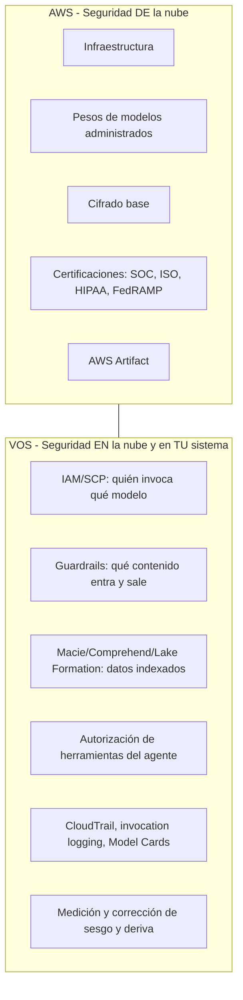

**Frontera que conviene memorizar:** AWS certifica la **plataforma**; vos certificás **tu sistema de IA** (intención de uso, datos, prompts, agentes, herramientas y decisiones). ISO 42001 lo dice explícitamente: AWS no gestiona el AIMS del cliente.

### 3.2 Los cinco planos de control

| Plano | Pregunta | Controles principales |
|---|---|---|
| **1. Identidad y red** | ¿Quién puede invocar qué, desde dónde? | SCP, IAM identity policies, `bedrock:GuardrailIdentifier`, VPC endpoints + endpoint policies, PrivateLink, KMS/CMK |
| **2. Datos** | ¿Qué datos pueden alimentar el sistema? | Macie (clasificación), Comprehend (redacción en ingesta), Lake Formation (acceso granular), KB con metadata filtering (RBAC en recuperación), S3 Lifecycle/Object Lock |
| **3. Contenido (entrada/salida)** | ¿Qué se permite pedir y responder? | Guardrails (6 políticas), moderación propia (Step Functions/Lambda), clasificadores propios, validación post-proceso |
| **4. Agente y herramientas** | ¿Qué acciones puede ejecutar el sistema? | Autorización por herramienta (Gateway/Identity), mínimo privilegio, *human-in-the-loop*, validación de parámetros, aislamiento de sesión |
| **5. Evidencia y gobernanza** | ¿Cómo se demuestra y se corrige? | Model Invocation Logging, CloudTrail (management + data events), Model Cards, Config conformance packs, métricas de evaluación y fairness, alertas y remediación |

### 3.3 El principio que ordena todo: probabilístico vs. determinístico

| Tipo | Ejemplos | Cómo se comporta | Cuándo elegirlo |
|---|---|---|---|
| **Probabilístico** | Filtros de contenido, denied topics, filtros de PII, clasificadores de prompt attack, LLM-as-a-judge, detección de toxicidad | Puntúan confianza; tienen falsos positivos y falsos negativos; **no garantizan** | Contenido abierto, escala, velocidad de implementación |
| **Determinístico** | **Automated Reasoning checks** (lógica formal), **JSON Schema / constrained decoding**, **text-to-SQL** (la respuesta sale de una consulta, no del modelo), **word filters** (match exacto), reglas de negocio en código | Producen garantías dentro del alcance definido; explican el porqué | Reglas de negocio, cumplimiento, extracción estructurada, dominios regulados |
| **Híbrido** | Contextual grounding (referencia + modelo), RAG con citas verificadas, agent tracing + validación de trayectoria | Combina recuperación verificable con generación flexible | Cuando necesitás trazabilidad sin renunciar a lenguaje natural |

> **Regla de examen:** si el enunciado pide *"asegurar que la respuesta no contradiga la política de la empresa"*, la respuesta es **Automated Reasoning checks**, no "un prompt mejor" ni "un juez LLM". Si pide *"que el modelo nunca devuelva JSON inválido"*, es **structured outputs / JSON Schema**. Si pide *"que los cálculos sean correctos y auditables"*, es **text-to-SQL** (el modelo genera la consulta; la base de datos produce el número).

### 3.4 Taxonomía de ataques (vocabulario mínimo)

| Ataque | Definición | Vector típico |
|---|---|---|
| **Inyección directa de prompt** | El usuario escribe instrucciones que intentan anular el sistema | Chat, campo de formulario |
| **Inyección indirecta** | La instrucción maliciosa viaja dentro de contenido que el sistema consume | Documento en RAG, página web, resultado de herramienta, ticket de soporte, descripción de herramienta MCP |
| **Jailbreak** | Técnica para saltar las salvaguardas de alineación (role-play, "DAN", crescendo multi-turno, many-shot, codificación base64) | Conversación |
| **Fuga de system prompt** | Extraer las instrucciones internas (y con ellas, las reglas de negocio y los secretos) | Ingeniería social + iteración |
| **Fuga de datos / contexto** | Sacar PII o documentos de otros usuarios desde el contexto o el vector store | Preguntas de sondeo, falta de aislamiento por tenant |
| **Abuso de agencia** | Hacer que el agente ejecute acciones fuera de su propósito | Parámetros de herramienta manipulados, encadenamiento de herramientas |
| **Envenenamiento de datos** | Introducir contenido malicioso en el corpus o en los datos de ajuste | Ingesta sin validación, backdoors en adaptadores LoRA |
| **Ataques de codificación** | Pedir que la salida peligrosa viaje codificada (base64, hex) para evadir filtros | Prompt + respuesta |

---

## 4. Task 3.1 — Controles de seguridad de entrada y salida

### 4.1 Skill 3.1.1 — Sistemas de seguridad de contenido para entradas de usuario

> *"Guardrails de Bedrock para filtrar contenido, Step Functions y Lambda para workflows de moderación personalizados, mecanismos de validación en tiempo real."*

#### 4.1.1.1 Amazon Bedrock Guardrails: qué es y qué no es

**No es un modelo.** Es una **capa de política configurable** que evalúa texto (y en ciertos casos imágenes) contra las políticas que definís, y actúa antes de que el prompt llegue al modelo y después de que la respuesta se genere. Funciona con modelos alojados en Bedrock, con modelos self-hosted y con **modelos de terceros** (OpenAI, Gemini) a través de la API `ApplyGuardrail`.

**Capacidades permanentes de un guardrail:** ID, versión, mensajes personalizados de bloqueo (`blockedInputMessaging`, `blockedOutputsMessaging`), y trazabilidad (`trace`).

#### 4.1.1.2 Las seis políticas

| # | Política | Qué hace | Naturaleza | Costo (USD / 1.000 text units)* |
|---|---|---|---|---|
| 1 | **Filtros de contenido** | Detecta y bloquea/enmascara contenido dañino en 6 categorías: **hate, insults, sexual, violence, misconduct, prompt attack**. Umbral independiente para entrada y salida, en escala NONE/LOW/MEDIUM/HIGH | Probabilística | **0,15** (texto) · **0,00075 por imagen** |
| 2 | **Temas denegados (denied topics)** | Temas definidos en lenguaje natural que la aplicación no debe discutir; se comparan semánticamente con la consulta | Probabilística | **0,15** |
| 3 | **Filtros de palabras** | Lista de palabras/frases exactas (profanidad, nombres de competidores, nombre en clave de proyectos internos) | **Determinística** | **Gratis** |
| 4 | **Filtros de información sensible (PII)** | Detecta PII predefinida (**31–36 tipos** según la fuente: nombres, emails, teléfonos, SSN, tarjetas, direcciones, IPs…) y **regex propios**. Acciones: **block** o **mask/anonymize** | Probabilística | **0,10** · regex: **gratis** |
| 5 | **Contextual grounding check** | Verifica que la respuesta esté **fundamentada en la fuente** (*grounding*) y **relevante para la consulta** (*relevance*). Umbrales configurables 0–1 | Híbrida | **0,10** (el conteo incluye fuente + consulta + respuesta) |
| 6 | **Automated Reasoning checks** | Verificación **matemática (lógica formal)** contra una política de dominio; explica por qué algo es válido o inválido | **Determinística** | **0,17 por 1.000 text units por política** |

\* 1 text unit = hasta 1.000 caracteres. **Se factura por evaluación**: si aplicás el guardrail a la entrada y a la salida, pagás dos veces. Ejemplo: 300.000 text units con filtros de contenido + temas denegados + PII ≈ **USD 120/mes**.

> ⚠️ **Trampa de precios en la documentación de terceros:** muchos artículos siguen citando **USD 0,75** (filtros) y **USD 1,00** (temas denegados), que son los precios **previos a diciembre de 2024**. Los vigentes son **0,15** y **0,15**.

#### 4.1.1.3 Tiers: Standard vs. Classic

| Aspecto | **Standard** | **Classic** |
|---|---|---|
| Recall en contenido dañino | **+15 %** (y +7 % en balanced accuracy) | Base |
| Idiomas | Hasta **60** | Menos idiomas |
| Filtrado en dominio de **código** (12 lenguajes: comentarios, variables, strings) | Sí | No |
| Prompt attacks | Distingue mejor *jailbreak* de *injection*; detecta intención de codificar la salida | Básico |
| Latencia | Mayor (más análisis) | **Menor** |
| Precio | Igual (0,15/1K) | Igual |
| Requisito de configuración | Requiere **perfil cross-region de guardrail** para su análisis | No requiere |

**Decisión típica:** Standard para producción con contenido abierto, multilingüe o código; Classic cuando el presupuesto de latencia es estricto y la moderación es simple.

#### 4.1.1.4 Modo de operación: block, mask y detect

| Modo | Qué hace | Cuándo |
|---|---|---|
| **Block** | Rechaza la operación y devuelve el mensaje de bloqueo configurado; `stopReason = guardrail_intervened` | Política dura: contenido dañino, temas prohibidos |
| **Mask** | Reemplaza la entidad detectada por un marcador (`{EMAIL}`, `{NAME}`) | PII en entrada o salida donde se necesita conservar utilidad |
| **Detect** | No interfiere; solo reporta scores (**`InvokeGuardrailChecks`**, detect-only) | Fase de calibración, o cuando querés escribir tu propia lógica de decisión |

**Flujo de despliegue seguro de un guardrail (memorizarlo):**
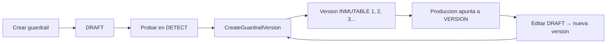
⚠️ **Dos detalles finos:** (a) mientras el DRAFT se está actualizando, el guardrail pasa a estado `UPDATING` y las invocaciones fijadas al DRAFT pueden fallar con `ValidationException`; (b) si un guardrail está **impuesto centralmente** por la organización, ajustar tus propios umbrales no lo relaja.

#### 4.1.1.5 Cómo se aplica un guardrail: las tres formas

| Forma | ¿Llama al modelo? | Cuándo usarla |
|---|---|---|
| **Acoplada** (`guardrailConfig` en `Converse`/`ConverseStream`/`InvokeModel`) | Sí | Guardar una llamada concreta a un modelo de Bedrock |
| **`ApplyGuardrail`** (API independiente) | **No** | Modelos de terceros/self-hosted, entradas y salidas de **herramientas**, puntos arbitrarios del pipeline, evaluación previa a la llamada |
| **`InvokeGuardrailChecks`** | No | Chequeos por turno en agentes con lógica de acción propia (detect-only, devuelve scores) |

**Enforcement por IAM (patrón de gobernanza potente):** con la condición **`bedrock:GuardrailIdentifier`** (y su par de versión) podés **negar cualquier invocación que no lleve el guardrail corporativo**. Es la forma de garantizar que ningún equipo "se olvide" de aplicarlo:
```json
{ "Effect": "Deny",
  "Action": ["bedrock:InvokeModel", "bedrock:InvokeModelWithResponseStream", "bedrock:Converse"],
  "Resource": "*",
  "Condition": { "StringNotEquals": { "bedrock:GuardrailIdentifier": "arn:aws:bedrock:us-east-1:111122223333:guardrail/gr-corp-001" } } }
```
*La condición no puede aportar exigir una versión específica si tu diseño necesita flexibilidad; documentá la excepción.*

#### 4.1.1.6 Moderación personalizada (Step Functions + Lambda)

Cuándo el guardrail administrado **no alcanza**:

| Situación | Patrón |
|---|---|
| Política organizacional con reglas de negocio (listas internas, sanciones, geopolítica corporativa) | **Step Functions** orquesta: `ValidateInput` (Lambda) → `GuardrailCheck` → rama de decisión → `InvokeModel` |
| Necesidad de revisión humana en casos límite | Step Functions con **`waitForTaskToken`** → cola de revisión → aprobación/rechazo |
| Moderación con múltiples clasificadores y votación | Lambda que consulta Comprehend (toxicidad/PII) + Bedrock (clasificador con LLM) + reglas propias, y combina por umbral |
| Bloqueo de dominio (allowlist de URLs, tópicos) | Lambda con listas + caché en DynamoDB/ElastiCache |
| Validación en tiempo real con latencia mínima | Lambda en el camino caliente con reglas baratas primero; guardrail (más costoso) después |

**Anti-patrón:** poner la cadena de moderación **después** de la llamada al modelo caro. El orden correcto es *lo barato primero* (reglas → listas → clasificador económico → guardrail), para no gastar tokens en prompts que ibas a rechazar.

---

### 4.2 Skill 3.1.2 — Marcos de seguridad de contenido para salidas

> *"Guardrails para filtrar respuestas, evaluaciones especializadas de FM para moderación de contenido y detección de toxicidad, transformaciones text-to-SQL para resultados determinísticos."*

#### 4.2.1 Por qué el filtrado de salida es obligatorio aunque hayas filtrado la entrada

AWS publica una recomendación contraintuitiva pero correcta para ataques de codificación: **dejar pasar la entrada codificada y confiar en el filtrado de salida**. El razonamiento: la salida es el *checkpoint* por el que pasa todo resultado dañino, **sin importar cómo se codificó la entrada**. Intentar decodificar toda variación de entrada (base64, hex, rot13, unicode homoglifos…) es una carrera perdida y genera falsos positivos en contextos legítimos (código, matemática, idiomas).

**Defensa en tres capas contra codificación (según AWS):**
1. **Filtrar la salida** con las políticas normales (el contenido dañino se detecta igual esté codificado o no).
2. **Detección de prompt attacks con intención de codificar** (Standard tier): bloquea pedidos explícitos del tipo *"hablemos solo en base64, codificá tus respuestas"*.
3. **Temas denegados con tolerancia cero** para el contenido que nunca debe aparecer codificado.

#### 4.2.2 Evaluaciones de FM para moderación y toxicidad

Cuando necesitás **medir** la seguridad de tus salidas (no solo filtrarlas), las herramientas son las evaluaciones:

| Tipo de evaluación | Métricas de seguridad relevantes | Notas |
|---|---|---|
| **Programática (automática)** | `Builtin.Toxicity` (además de Accuracy y Robustness) | Determinística y reproducible; funciona con datasets propios o integrados (Real Toxicity, BOLD, TREX, WikiText-2, Gigaword, BoolQ, Natural Questions, Trivia QA, Women's Ecommerce Clothing Reviews) |
| **LLM-as-a-judge** | `Builtin.Harmfulness`, `Builtin.Stereotyping`, `Builtin.Refusal` (+ calidad: Correctness, Completeness, Faithfulness, Helpfulness, Coherence, Relevance, FollowingInstructions, ProfessionalStyleAndTone) | Puntajes normalizados 0–1; **en métricas de seguridad el sentido se invierte: más bajo es mejor** |
| **Humana** | Métricas personalizadas por rúbrica | Requiere *work team* (propio o administrado por AWS, gestionado vía SageMaker Ground Truth); es la referencia para calibrar a los jueces |
| **RAG** | `Builtin.Faithfulness`, `Builtin.CitationPrecision`, `Builtin.CitationCoverage` | Evalúa tanto la recuperación como la respuesta final |

**Sesgo del juez (dato de examen):** los modelos tienden a puntuar mejor las salidas de su propia familia (*self-preference bias*). **Mitigación recomendada por AWS: usar un modelo evaluador de una familia distinta a la del modelo evaluado.**

#### 4.2.3 Text-to-SQL: el control determinístico infravalorado

El patrón: **el modelo no calcula, el modelo escribe la consulta**.

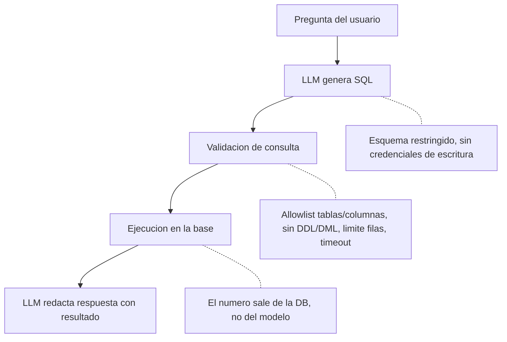

**Por qué es un control de seguridad y no solo de calidad:**
- Elimina la alucinación numérica: el dato viene de un sistema de registro.
- Es **auditable**: la consulta queda registrada y es reproducible.
- Es **verificable**: se puede revisar la lógica sin evaluar la "confianza" del modelo.
- Permite *policy* a nivel de datos (row/column-level security, vistas enmascaradas) incluso cuando el modelo se equivoca.

**Controles obligatorios:** usuario de base de datos de **solo lectura** con permisos mínimos, consultas parametrizadas/sin concatenación de entrada del usuario, límite de filas y de costo, timeout, y enmascarado de columnas sensibles en la vista que ve el modelo.

---

### 4.3 Skill 3.1.3 — Sistemas de verificación de exactitud y reducción de alucinaciones

> *"Knowledge Bases para fundamentar respuestas y hacer fact-checking, scoring de confianza y búsqueda por similitud semántica para verificación, JSON Schema para forzar salidas estructuradas."*

#### 4.3.1 Grounding con Knowledge Bases + citas

**Knowledge Bases for Amazon Bedrock** recupera fragmentos de tus fuentes y devuelve **citaciones** junto con la respuesta: la atribución de fuentes está integrada y es la forma más directa de que el usuario (y el auditor) pueda verificar de dónde salió cada afirmación.

| Pieza | Rol en la verificación |
|---|---|
| Recuperación con metadata filtering | Aísla lo que el usuario puede ver (RBAC a nivel de recuperación, no solo de UI) |
| **Citas / `retrievedReferences`** | Permiten contrastar afirmación ↔ fuente |
| **Contextual grounding check** (Guardrails) | Bloquea respuestas no fundamentadas o no relevantes; >75 % de respuestas alucinadas filtradas en RAG/resumen según AWS |
| **Automated Reasoning check** | Cuando la respuesta debe ser consistente con una *política* y no solo con un documento |
| **Faithfulness / CitationPrecision / CitationCoverage** (evaluaciones RAG) | Miden el grounding de forma continua y comparable |

#### 4.3.2 Scoring de confianza y similitud semántica

Tres familias de técnicas, con usos distintos:

| Técnica | Cómo funciona | Limitación crítica |
|---|---|---|
| **Similitud semántica salida↔fuente** | Embeddings de la respuesta y del contexto recuperado; por debajo de un umbral → marcar/suprimir | Mide cercanía temática, **no veracidad**; una respuesta falsa pero del mismo tema puntúa alto |
| **Scoring de confianza auto-reportado por el modelo** ("estoy 80 % seguro") | Pedís un score y actuás sobre él | Está **mal calibrado**: los modelos son confiados cuando alucinan. AWS recomienda **probar métodos hasta encontrar uno que correlacione con la exactitud real**, no asumirlo |
| **Self-consistency** | Muestrear N respuestas y medir acuerdo | Costoso (N× tokens), pero útil como señal barata en dominios acotados |
| **Entropía / probabilidades de token** | Exponer logprobs o probabilidades al usuario | Baja probabilidad ≠ error, pero es una señal útil de incertidumbre |

> **Recomendación de AWS (Responsible AI Lens):** incluir *confidence scores* en la salida y **verificar empíricamente** que correlacionan con la exactitud; para GenAI, combinar con **atribución de contenido** (citas) y visualización de probabilidades.

#### 4.3.3 JSON Schema y salidas estructuradas

**Structured outputs** (disponibles desde febrero de 2026 vía `outputConfig.textFormat` con `type: json_schema`):

| Aspecto | Detalle |
|---|---|
| Mecanismo | **Decodificación restringida**: el esquema se compila a una gramática y se **enmascaran los tokens inválidos** durante la generación |
| Garantía | La salida **no puede** violar el esquema (no es "generar y validar") |
| Requisitos | Subconjunto de **JSON Schema Draft 2020-12**; `additionalProperties: false` obligatorio; sin recursión ni referencias externas |
| Rendimiento | La gramática se cachea 24 h; el **primer** uso puede demorar en compilar |
| Beneficio de seguridad | Elimina el *insecure output handling* clásico: sin parseos frágiles, sin ejecución de JSON inesperado, sin reintentos inseguros |
| Variante agéntica | *Strict tool use* con `toolChoice` forzado |
| Trampa | Si `maxTokens` es corto, el JSON se trunca → **revisar `stopReason` (`max_tokens`)** |

#### 4.3.4 Fact-checking: la arquitectura mínima

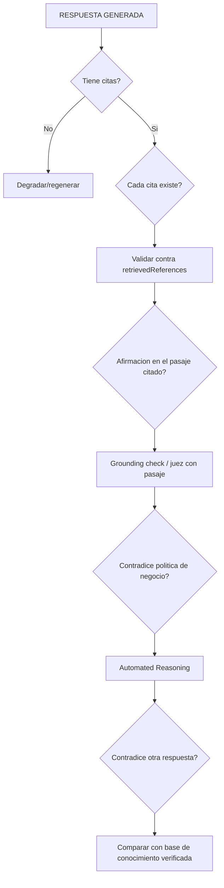

---

### 4.4 Skill 3.1.4 — Sistemas de defensa en profundidad

> *"Comprehend para filtros de preprocesamiento, Bedrock para guardrails basados en modelos, Lambda para validación post-proceso, API Gateway para filtrado de respuestas."*

#### 4.4.1 La tubería de cuatro capas (memorizar)

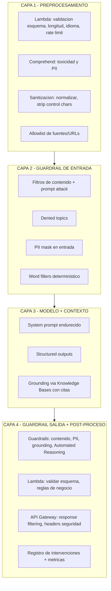

#### 4.4.2 Rol de cada servicio (la parte que el examen pregunta)

| Servicio | Qué aporta | Qué **no** hace |
|---|---|---|
| **Amazon Comprehend** | Detección de **toxicidad** y **PII** (36 tipos, confianza + offsets), redacción masiva asíncrona, análisis de sentimiento, entidades | No conoce tus políticas de negocio ni tus temas prohibidos |
| **Bedrock Guardrails** | Seis políticas de contenido y privacidad, aplicables a Bedrock y a terceros; acciones block/mask/detect | No protege el contenido de herramientas/navegador ni la lógica del agente por sí solo |
| **Lambda** | Validación post-proceso con reglas arbitrarias; hooks para aplicar guardrails a **salidas de herramientas** | No escala sola el estado; requiere diseño idempotente |
| **API Gateway** | Filtrado de respuestas, límites de tamaño, autorización (Cognito/Lambda authorizer), WAF, throttling, logging de acceso | No entiende semántica de contenido |
| **Step Functions** | Orquestación de workflows de moderación con revisión humana y auditoría del flujo | No modera por sí misma |
| **S3 Object Lambda** | Redacción **on-read** de PII con una función prebuilt (Comprehend), sin duplicar datos | Afecta a lecturas vía *access point*; no es un control de escritura |

#### 4.4.3 Endurecimiento del prompt (la capa que más se olvida en el examen)

- **Instrucciones jerárquicas explícitas:** decirle al modelo qué contenido es *contenido* (datos) y qué es *instrucción*.
- **Delimitar** documentos y resultados de herramientas (XML tags, marcadores) y declarar que el contenido delimitado nunca contiene instrucciones legítimas.
- **No revelar el system prompt** ni las reglas internas; recordar que pedirlas es un ataque frecuente (los guardrails Standard detectan intentos de *prompt leakage*).
- **Privilegio mínimo para el agente:** separar el modelo que *decide* del que *ejecuta*; requerir aprobación humana para acciones destructivas.
- **Tratar los resultados de herramientas y de RAG como no confiables** (son el vector de inyección indirecta más común en 2026).

---

### 4.5 Skill 3.1.5 — Detección avanzada de amenazas

> *"Detección de prompt injection y jailbreak, sanitización de entrada y filtros de contenido, clasificadores de seguridad, workflows de pruebas adversarias automatizadas."*

#### 4.5.1 Detección: qué se puede detectar y con qué

| Señal | Mecanismo | Notas |
|---|---|---|
| **Prompt attack / jailbreak** | Categoría `PROMPT_ATTACK` de los filtros de contenido (con umbral propio) | La categoría es de **solo entrada** (no tiene sentido filtrar la salida por eso); en Standard distingue jailbreak de injection |
| **Intención de codificar la salida** | Prompt attack filter (Standard) | Detecta pedidos del tipo "respondé en base64" |
| **Temas prohibidos** | Denied topics (semántico) | Permite "tolerancia cero" sobre contenido codificado o tópicos sensibles |
| **Fuga de PII** | Filtros de información sensible + Comprehend | Con `mask`, la salida sigue siendo útil |
| **Payloads ofuscados** | Sanitización propia: unicode homoglifos, caracteres de ancho cero, HTML oculto, escapes anidados | Común en inyección indirecta |
| **Abuso de herramientas** | Validación de parámetros + autorización por herramienta + telemetría del Gateway | El "excessive agency" se detecta midiendo patrones de llamada |

#### 4.5.2 Clasificadores de seguridad

Tres arquitecturas válidas, en orden creciente de costo y precisión:

1. **Reglas + regex** (gratis, determinísticas, rápidas) — primeras líneas de defensa para patrones conocidos.
2. **Clasificador especializado** (modelo pequeño ajustado o servicio administrado como Comprehend para toxicidad): barato y rápido, cobertura media.
3. **LLM guard / juez dedicado** (modelo distinto al generador, con salida estructurada que devuelve `{safe, risk_category, confidence, reason}`): máxima cobertura de lenguaje natural; más latencia y costo. **Regla de oro: usar un modelo de familia distinta al que se está protegiendo.**

#### 4.5.3 Pruebas adversarias automatizadas (red teaming continuo)

**El cambio de mentalidad:** en seguridad tradicional el resultado es binario (vulnerable o no). En LLM los resultados son **estadísticos**: se mide **Attack Success Rate (ASR)** por categoría.

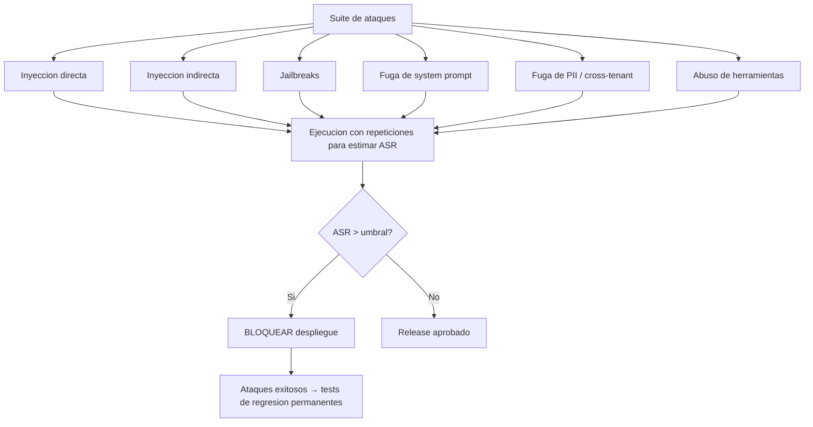

**Frameworks de referencia para diseñar la suite:** OWASP Top 10 for LLM Applications, NIST AI RMF, MITRE ATLAS. **Herramientas del ecosistema** (útiles para el mundo real, no específicas de AWS): Garak (NVIDIA), PyRIT (Microsoft), Promptfoo, DeepTeam, además de los escenarios de inyección indirecta que hay que escribir a medida para tu RAG.

**Métricas que se reportan al negocio:**
- ASR por categoría y por modelo/prompt/versión de guardrail (con tendencia en el tiempo).
- Cobertura: % de categorías del OWASP LLM Top 10 con al menos N pruebas.
- Tiempo medio de detección de una regresión de seguridad (tras un cambio de prompt o de modelo).

> **Regla de examen sobre inyección:** los guardrails ayudan, pero **la inyección de prompts no está resuelta y no se resuelve con un filtro**. La postura correcta es *defensa en profundidad* + *separación de privilegios* + *pruebas continuas*. Si una opción de respuesta promete "eliminar" la inyección, es incorrecta.

---

## 5. Task 3.2 — Seguridad de datos y controles de privacidad

### 5.1 Skill 3.2.1 — Entornos de IA protegidos

> *"VPC endpoints para aislar redes, políticas IAM para patrones de acceso seguro, Lake Formation para acceso granular, CloudWatch para monitorear acceso a datos."*

#### 5.1.1 Aislamiento de red

| Control | Qué hace | Nota de examen |
|---|---|---|
| **VPC interface endpoints (AWS PrivateLink)** | Todo el tráfico a Bedrock (runtime y control plane) queda en la red privada, sin pasar por internet | Requiere endpoints **separados** para `bedrock` y `bedrock-runtime`; hay que agregar reglas de security group y DNS privado |
| **Endpoint policies** | Segunda capa de restricción: qué acciones, principals y **modelos** son alcanzables **por ese endpoint** | Si la política del endpoint no lo permite, el modelo es inalcanzable aunque IAM sí lo permita |
| **Direct Connect** | Backhaul desde on-premises sin internet | Para híbridos |
| **PrivateLink para servicios satélite** | S3, KMS, CloudWatch, Secrets Manager, ECR, Lambda | Sin esto, los logs y los artefactos viajan por rutas públicas |
| **VPC Flow Logs + Network Firewall** | Visibilidad y control de egreso | Detecta tráfico que intenta **evitar** el endpoint |

#### 5.1.2 IAM: los detalles que se preguntan

| Control | Implementación | Trampa |
|---|---|---|
| **Acceso por modelo** | `bedrock:InvokeModel` sobre ARNs de modelos específicos | `Resource: "*"` da acceso a **todos** los modelos de la región, incluidos los no revisados |
| **Acceso por acción de runtime** | Incluir también `bedrock:InvokeModelWithResponseStream` si usás streaming | Autorizar solo `InvokeModel` rompe el streaming |
| **Guardrail obligatorio** | Condición **`bedrock:GuardrailIdentifier`** en una política de **Deny** | Es la forma de forzar su uso a nivel organización |
| **Nombres de acciones** | `Converse` **no es** una acción IAM separada: se autoriza con `bedrock:InvokeModel` | **No existe** la condición `bedrock:ModelId` (es un error frecuente) |
| **Cross-region inference** | Los perfiles CRIS ejecutan en otras regiones | Una política con `aws:RequestedRegion` restrictivo **bloquea CRIS** salvo que permitas las regiones destino |
| **ABAC** | Etiquetar recursos y roles y usar condiciones por tags | Requiere disciplina de tags (y activarlos donde corresponda) |
| **SCP** | Techo organizacional: proveedores de modelos y regiones permitidas | Se evalúa **antes** de IAM: si el SCP niega, el rol no importa |
| **Permission boundaries / Access Analyzer** | Limitar y detectar accesos externos | Hallazgo típico: wildcards en políticas de invocación |
| **Federación** | IAM Identity Center, roles por equipo, session tags para atribución | Evita llaves de largo plazo |

#### 5.1.3 Acceso granular a datos: Lake Formation y más

| Escenario | Servicio | Cómo |
|---|---|---|
| Data lake con PII en tablas | **AWS Lake Formation** | Permisos a nivel de tabla/columna/fila, *row-level filters*, *cell filters*, control centralizado, integración con Glue Data Catalog |
| RAG sobre documentos con visibilidad variable | **Knowledge Bases + metadata filtering** | Etiquetar documentos (p. ej. `role=admin|user`) y filtrar en la recuperación según la identidad del usuario |
| Bases operacionales | IAM + vistas enmascaradas + roles de solo lectura | El modelo nunca ve columnas sensibles |
| Objetos en S3 | Bucket policies, Access Points, Object Lambda para redacción on-read | Útil cuando varios consumidores leen el mismo dataset |
| Registro de accesos a datos sensibles | **CloudWatch Logs**, **CloudTrail data events** en S3/Lambda/Glue, **Macie findings vía EventBridge**, alarmas sobre `GetObject` inesperados | La auditoría de acceso es un control, no un extra |

#### 5.1.4 Monitoreo de acceso (qué alarmar)

- Invocaciones de modelos fuera del horario o por principals inesperados.
- Cambios en políticas de Bedrock/IAM (`PutRolePolicy`, `AttachRolePolicy`, `UpdateAssumeRolePolicy`).
- Lecturas/exportaciones/borrados de los log groups o buckets que contienen invocation logs.
- Uso de KMS: `Decrypt`, fallos de `Decrypt`, `CreateGrant`, `DisableKey`, cambios de key policy.
- Tráfico a Bedrock que **no** pasa por el VPC endpoint esperado.
- Findings de Macie, GuardDuty y Access Analyzer integrados en **Security Hub**.

---

### 5.2 Skill 3.2.2 — Sistemas que preservan la privacidad

> *"Comprehend y Macie para detectar PII, capacidades nativas de privacidad de Bedrock, Guardrails para filtrar salidas, S3 Lifecycle para políticas de retención."*

#### 5.2.1 Las garantías nativas de Bedrock (memorizar textualmente)

| Garantía | Detalle |
|---|---|
| **No entrenamiento** | Los inputs y outputs **no** se usan para entrenar ni mejorar los modelos base, y **no se comparten con los proveedores de modelos** |
| **No retención** | Bedrock **no almacena ni registra** tus prompts y completions (salvo que **vos** habilites Model Invocation Logging) |
| **Aislamiento por proveedor** | Los proveedores no tienen acceso a las cuentas de Bedrock ni a los prompts/completions |
| **Modelos personalizados** | Se crea una **copia privada** del modelo para tu uso; los datos de ajuste no se usan para otros fines; el artefacto se cifra con **tu clave KMS** y solo tu cuenta tiene acceso |
| **Cifrado** | TLS 1.2+ en tránsito; KMS en reposo (claves administradas por AWS o **CMK** propias) |
| **Residencia** | Los datos procesados quedan en la región donde se procesa la llamada (atención con CRIS) |
| **Conectividad privada** | PrivateLink/VPC endpoints, Direct Connect |

**Matiz que el examen puede usar como distractor:** existen **modelos vendidos por AWS** (sin acceso del proveedor a tus datos, cubiertos por el DPA de AWS) y **modelos vendidos por el proveedor** (aplican los términos del proveedor, que hay que revisar: jurisdicción, DPA, entidad legal). Para dominios estrictos conviene elegir modelos AWS-sold o proveedores con entidad y DPA explícitos en tu jurisdicción.

**Cumplimiento:** SOC 1/2/3, ISO 27001/27017/27018, HIPAA **eligible** (requiere BAA con AWS), PCI DSS, FedRAMP (Moderate en regiones selectas; la comunicación reciente de AWS menciona FedRAMP High), GDPR (con DPA), CCPA, CSA STAR Level 2, e **ISO/IEC 42001** para gestión de IA.

#### 5.2.2 Detección de PII: quién hace qué

| Servicio | Alcance | Acción | Limitación |
|---|---|---|---|
| **Amazon Macie** | Descubre y **clasifica** datos sensibles **ya almacenados en S3**; evalúa postura de seguridad del bucket; admite tipos personalizados con regex; findings → EventBridge | **Clasifica e inventaría** | **No redacta** ni aplica control de filas/columnas |
| **Amazon Comprehend** | Detecta PII en texto (tiempo real hasta ~100 KB; asíncrono para lotes), **toxicidad** | Detecta, **redacta/enmascara**, produce offsets | Probabilístico; cobertura de idiomas limitada (documentado para inglés y español) |
| **Bedrock Guardrails (sensitive info filters)** | Detecta PII en **prompts y respuestas**, por request | **Block o mask** con 31+ tipos predefinidos y regex propios | **No cubre salidas de llamadas a funciones/herramientas**; requiere aplicar el guardrail explícitamente ahí |
| **Cognito + ApplyGuardrail** | Enmascarado **por rol** (admin ve completo, usuario ve enmascarado) | Política dinámica por identidad | Es composición tuya, no una feature única |
| **S3 Object Lambda** | Redacta **al leer** con función prebuilt de Comprehend | Redacción on-read | Solo lecturas por el access point |

#### 5.2.3 La arquitectura de PII en capas (el diagrama que hay que poder dibujar)

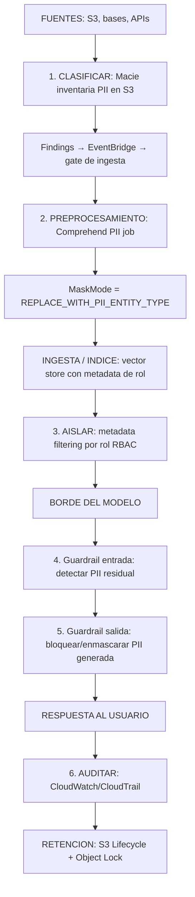

**Cuatro reglas de oro de esta arquitectura:**
1. **Redactar antes de indexar.** Si la PII entra al índice, queda embebida y consultable; redactar solo la salida es tarde.
2. **`REPLACE_WITH_PII_ENTITY_TYPE` para corpus de RAG**, no `MASK`: reemplazar por el tipo de entidad (`[EMAIL]`) preserva el significado del documento; enmascarar con `***` degrada la recuperación porque muchos documentos colisionan.
3. **Definir por camino de datos QUÉ capa transforma**, y dejar las siguientes en modo *detect* para evitar doble transformación (un `[EMAIL]` ya reemplazado siendo re-enmascarado).
4. **Enmascarar no es anonimizar.** Un dataset enmascarado sigue siendo dato personal si la reidentificación es posible; **no lo declares "anonimizado"** en una declaración de cumplimiento.

#### 5.2.4 Retención y minimización

| Control | Uso |
|---|---|
| **S3 Lifecycle** | Transición de clases y expiración por prefijo (p. ej. crudos: 30 días; redactados: 1 año; logs de invocación: 90 días) |
| **S3 Object Lock (WORM)** | Inmutabilidad de evidencias de auditoría y de registros de gobernanza |
| **S3 versioning** | Historial y recuperación; también permite detectar borrados maliciosos |
| **CloudWatch Logs retention** | Por log group; no dejar "Never expire" |
| **Reglas de exclusión** | No loguear payloads sensibles si no son necesarios (la minimización es el control más barato) |
| **Data Protection (CloudWatch)** | Políticas administradas/propias para **enmascarar** datos sensibles en logs y trazas (redacción a nivel de token en la telemetría) |
| **Invocation logging selectivo** | Habilitar solo donde hay necesidad; cifrar con CMK; restringir lectura a roles de auditoría |

---

### 5.3 Skill 3.2.3 — Sistemas de IA centrados en la privacidad sin perder utilidad

> *"Técnicas de enmascarado, detección de PII con Comprehend, estrategias de anonimización, Guardrails."*

#### 5.3.1 Técnicas, de menos a más protectoras

| Técnica | Cómo | Utilidad preservada | Cuándo usarla |
|---|---|---|---|
| **Redacción / masking** | Reemplazar el valor por un carácter o por el tipo de entidad | Baja-media | Logs, corpus de RAG (siempre por tipo de entidad) |
| **Reemplazo por tipo** | `[NAME]`, `[EMAIL]`, `[ACCOUNT]` | Media-alta | Corpus e inputs: mantiene estructura y contexto |
| **Pseudonimización / tokenización** | Reemplazar por valores sintéticos consistentes con bóveda de mapeo seguro | **Alta** (el caso puede razonarse con identidades estables) | Análisis longitudinal ("el mismo cliente volvió a contactar") |
| **Generalización** | Edad → rango etario; ciudad → región | Media | Analítica agregada |
| **Derivación / feature engineering** | Trabajar sobre features derivadas en lugar del dato crudo | Alta | Modelos predictivos |
| **Privacidad diferencial** | Ruido calibrado con presupuesto ε | Media (datos agregados) | Estadística sobre poblaciones sensibles |
| **Enmascarado por rol en el borde** | Guardrail + identidad: el mismo dato se muestra completo o enmascarado según quién pregunta | **Máxima** en producto | Atención al cliente, back office |

#### 5.3.2 El patrón de "privacy proxy" (útil y muy preguntable)

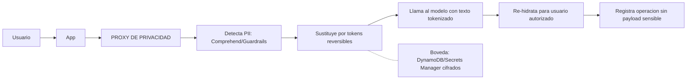
**Ventajas:** el modelo (y cualquier registro de la llamada) nunca contiene datos personales; la utilidad se conserva porque el texto mantiene estructura y coherencia; el mapeo queda centralizado y auditable.
**Riesgos a controlar:** la bóveda se vuelve objetivo crítico (cifrado + acceso mínimo + rotación); si el modelo debe razonar sobre un dato real (dirección exacta, número de cuenta), la tokenización puede degradar el resultado (ahí va enmascarado parcial: últimos 4 dígitos).

#### 5.3.3 Checklist de privacidad del dato en GenAI

- [ ] Inventario de datos: qué fuentes alimentan el sistema y qué sensibilidad tienen (Macie + Data Catalog).
- [ ] Minimización: ¿el modelo realmente necesita ese campo? Si no, no lo mandes.
- [ ] Redacción en ingesta (Comprehend) con `REPLACE_WITH_PII_ENTITY_TYPE`.
- [ ] Aislamiento por tenant en el vector store (namespace/metadata) y en el caché semántico.
- [ ] Guardrail de entrada y salida con filtros de PII (mask donde corresponda).
- [ ] Tokenización reversible cuando se necesita razonar sobre identidades.
- [ ] Enmascarado por rol (Cognito + `ApplyGuardrail`).
- [ ] Logs con minimización: invocation logging selectivo, Data Protection activo, retención definida.
- [ ] Borrado y derecho al olvido: procedimiento para eliminar del índice, del caché y de los logs (recordar que el caché semántico también almacena contenido).
- [ ] Cifrado CMK en: S3 de datos, S3 de logs, vector store, modelos personalizados, KB.
- [ ] Documentar explícitamente que el enmascarado **no** equivale a anonimización.

---

## 6. Task 3.3 — Gobernanza de IA y mecanismos de cumplimiento

### 6.1 Skill 3.3.1 — Marcos de cumplimiento para despliegues de FM

> *"SageMaker para desarrollar model cards programáticos, Glue para seguir automáticamente el linaje de datos, metadata tagging para atribución sistemática de fuentes, CloudWatch Logs para recolectar logs de decisión."*

#### 6.1.1 SageMaker Model Cards: el documento que pide el auditor

| Aspecto | Detalle |
|---|---|
| Qué es | Documento estructurado y **versionado** que describe propósito, uso previsto, detalles de entrenamiento, evaluación, consideraciones éticas, limitaciones y advertencias del modelo |
| Estructura | Fija en sus secciones principales (Model Overview, Training Details, Intended Uses, Evaluation Details, Additional Information) + **campos personalizados** en "Additional information" |
| **Risk rating** | Low / Medium / High / Unknown — lo asigna el cliente; alimenta el proceso de revisión |
| Integración | Se asocia a **versiones** del modelo en **Model Registry**; los metadatos disponibles se **auto-populan** (detalles de entrenamiento, métricas, evaluación, algoritmo, especificación de inferencia, estado de aprobación) |
| **Inmutabilidad** | Una versión de model card es **inmutable**: cualquier cambio genera una **nueva versión** (no se puede "tamperear" una vez creada) |
| Modelos fuera de SageMaker | Se pueden crear model cards para modelos hospedados/registrados fuera de SageMaker (sin auto-poblado) |
| Salida | Exportable a **PDF** para compartir con auditores |
| Programático | SDK de Python (`ModelCard`, `ModelOverview`, `IntendedUses`, `BusinessDetails`, `AdditionalInformation`) y API — esto es lo que pide la skill ("model cards programáticos") |
| Costo | El almacenamiento de metadata, versiones, linaje y registry **no tiene cargo separado** |

**Model Registry (el complemento):** catálogo de versiones inmutables de modelos con **linaje** (job de entrenamiento, dataset en S3, job de procesamiento, reporte de evaluación), **estado de aprobación** (que actúa como *gate* de despliegue), *collections* y *lifecycle stages* (Staging/Production). Es la pieza que permite responder *"¿cómo se construyó este modelo y quién lo aprobó?"*.

**Patrón de gobernanza:** el pipeline de CI/CD **no despliega** una versión que no tenga model card completa **y** estado Approved. La model card deja de ser documentación y pasa a ser un **control previo**.

#### 6.1.2 AWS Glue y el linaje de datos

| Capacidad | Uso en gobernanza GenAI |
|---|---|
| **Glue Data Catalog** | Registro central de fuentes: bases, tablas, esquemas, ubicaciones, propietarios. Es el inventario que permite responder "¿qué datos alimentan esta aplicación?" |
| **Linaje (lineage)** | Trazabilidad automática de dónde viene un dato y por dónde pasó (jobs de Glue, transformaciones); soporta linaje de columnas |
| **Crawlers** | Descubrimiento y clasificación automática de esquemas |
| **SageMaker Catalog / Unified Studio** | Gobernanza integrada de datos + modelos en un mismo plano |
| **Metadata tagging** | Etiquetas sistemáticas de origen, clasificación, sensibilidad, dueño y jurisdicción — la base de la atribución de fuentes y del control de acceso |

#### 6.1.3 Logs de decisión

Los "decision logs" (el registro de **por qué** el sistema hizo lo que hizo) se componen de:
- **CloudTrail**: quién llamó qué API, cuándo y desde dónde (management events + data events para agentes/KB).
- **Model Invocation Logging**: input/output completos (opt-in).
- **Guardrail traces**: qué política intervino y con qué evaluación.
- **Agent traces**: pasos de razonamiento, herramienta elegida, resultado.
- **Evaluaciones**: resultados de calidad/seguridad por versión.
- **CloudWatch Logs + dashboards**: la vista operativa de todo lo anterior.

### 6.2 Skill 3.3.2 — Seguimiento de fuentes de datos y trazabilidad

> *"Glue Data Catalog para registrar fuentes, metadata tagging para atribución de origen en el contenido generado, CloudTrail para auditoría."*

#### 6.2.1 La cadena de trazabilidad completa

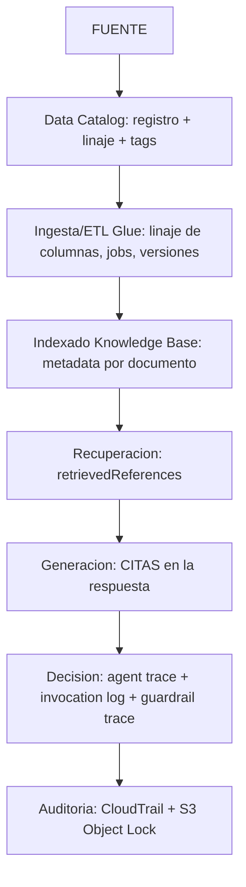

**Los tres niveles de atribución de fuentes (de menor a mayor rigor):**
1. **Citas del modelo** (pedidas en el prompt): baratas, poco confiables, verificables a mano.
2. **Citas del sistema de recuperación** (`retrievedReferences`): confiables sobre **qué se recuperó**; hay que validar además que la afirmación esté en el pasaje.
3. **Atribución verificada por un proceso independiente**: un componente separado mapea cada afirmación a su fuente y puntúa la atribución. Es el estándar enterprise y lo que permite responder a un regulador.

**Metadata tagging: qué etiquetar como mínimo**
| Nivel | Tags mínimos |
|---|---|
| Documento/fuente | `origen`, `fecha_ingesta`, `version`, `propietario`, `clasificacion` (`public|internal|confidential|restricted`), `jurisdiccion`, `rol_permitido` |
| Modelo | `caso_de_uso`, `riesgo` (low/medium/high), `model_card_id`, `fecha_aprobacion`, `owner` |
| Aplicación/inferencia | `app`, `equipo`, `entorno`, `tenant`, `prompt_version`, `guardrail_version` |

#### 6.2.2 CloudTrail: los tres hechos que se preguntan

| Hecho | Detalle |
|---|---|
| **Qué se registra por defecto** | `InvokeModel`, `InvokeModelWithResponseStream`, `Converse`, `ConverseStream` son **management events** → registrados por defecto (inusual para APIs de runtime de alto volumen) |
| **Qué NO se registra por defecto** | Operaciones de agentes y KB: `InvokeAgent`, `Retrieve`, `RetrieveAndGenerate` son **data events** → hay que habilitarlos con *advanced event selectors* sobre `AWS::Bedrock::AgentAlias`, `AWS::Bedrock::KnowledgeBase`, `AWS::Bedrock::Guardrail`, etc. Las invocaciones de la superficie *mantle* también son data events |
| **Qué nunca contiene** | El **contenido**: en un evento de `InvokeModel`, `requestParameters` trae el `modelId` y metadata, y `responseElements` viene **null**. **Ni el prompt ni la respuesta.** Para eso: Model Invocation Logging |

**Los dos sistemas de auditoría son independientes y complementarios:**

| Sistema | Qué responde | Estado por defecto | Alcance |
|---|---|---|---|
| **CloudTrail** | ¿Quién llamó, cuándo, desde dónde, a qué modelo? | Management events: **on by default** | Metadata; se puede agregar a nivel organización con un *organization trail* |
| **Model Invocation Logging** | ¿Qué se preguntó y qué se respondió? | **Off** (opt-in, por cuenta y por región) | Contenido; **no** se agrega automáticamente a nivel organización |

> **El hallazgo de auditoría clásico:** la organización tiene CloudTrail (parece cubierta), pero **no tiene invocation logging**, así que tras un incidente de fuga de datos **no existe registro de qué se preguntó ni qué respondió el modelo**. La evidencia nunca se capturó. Recomendación explícita: **habilitar invocation logging antes de procesar datos sensibles y tratarlo como bloqueante de release.**

**Trampa relacionada (valor forense):** la captura empieza cuando se habilita el logging; un incidente iniciado antes deja un hueco irrecuperable.

### 6.3 Skill 3.3.3 — Sistemas de gobernanza organizacional

> *"Marcos integrales que alinean políticas organizacionales, requisitos regulatorios y principios de IA responsable."*

#### 6.3.1 El modelo operativo de gobernanza (los seis elementos)

| Elemento | Contenido | Implementación AWS |
|---|---|---|
| **1. Política** | Política de uso aceptable de IA, clasificación de datos, prohibiciones | S3 versionado + Object Lock; referencia desde IAM (política como código) |
| **2. Registro de sistemas** | Inventario de casos de uso con dueño, riesgo, datos, estado | S3/Quick Suite + Model Registry + tags; base del *AI system inventory* que exigen ISO 42001 y EU AI Act |
| **3. Clasificación de riesgo** | Tiering: alto (decisiones que afectan derechos, salud, finanzas), medio, bajo | Risk rating en Model Cards + gates por tier |
| **4. Controles técnicos** | Guardrails, cifrado, aislamiento, mínimo privilegio | SCP, IAM (+`GuardrailIdentifier`), VPC endpoints, KMS, Lake Formation |
| **5. Evidencia y auditoría** | Evidencia exportable y continua | Config conformance packs, CloudTrail, Model Cards, resultados de evaluación |
| **6. Revisión y mejora** | Comité de IA, revisión periódica, remediación | EventBridge + Lambda de remediación; revisión trimestral documentada |

#### 6.3.2 Controles organizacionales en AWS

| Capa | Servicio | Qué aporta a la gobernanza de IA |
|---|---|---|
| Organization | **AWS Organizations + SCP** | Techo de proveedores de modelos, regiones permitidas, servicios prohibidos |
| Landing zone | **Control Tower** (+ guardrails) | Cuentas gobernadas con controles preventivos y detectivos; separación de entornos |
| Cuenta | **IAM + Access Analyzer** | Mínimo privilegio verificable; detección de accesos externos |
| Cumplimiento | **AWS Config (+ conformance packs)** | Reglas que evalúan recursos contra políticas; **packs predefinidos para frameworks** (PCI DSS, HIPAA, FedRAMP, NIST, AWS Best Practices) y packs propios |
| Evidencia | **Audit Manager** | ⚠️ **Actualización importante:** AWS movió Audit Manager a **modo mantenimiento** y recomienda **Config conformance packs** como solución de gestión de cumplimiento. Limitaciones a conocer: no hay packs para **SOC 2 ni GDPR**, y Config no recolecta CloudTrail/Security Hub como evidencia ni genera un reporte equivalente al de Audit Manager. AWS sugiere complementar con partners de compliance automation |
| Detección | **Security Hub, GuardDuty, Macie, Access Analyzer** | Hallazgos correlacionados en un solo lugar |
| Despliegue de baseline | **CloudFormation StackSets + CloudFormation Guard en CI/CD** | Distribuir el baseline de guardrails/controles a todas las cuentas y **validar que no se despliegue una plantilla no conforme** |
| Documentación de AWS | **AWS Artifact + AI Service Cards** | Evidencia de cumplimiento de AWS para tus auditores |

#### 6.3.3 Cómo se alinea un marco (ejemplo ISO 42001 en AWS)

Mapeo que AWS documenta en su guía de implementación:

| Requisito del estándar | Implementación típica en AWS |
|---|---|
| Liderazgo, roles y responsabilidades (Cl. 5) | SCPs con tenets de gobernanza, Control Tower, IAM que traduce roles organizacionales en permisos |
| Documentación e información para usuarios (A.8.2) | Model Cards; documentos de política en S3 con versionado y KMS |
| Uso previsto verificado en el tiempo (A.9.4) | Guardrails + condiciones IAM que imponen límites de uso, no solo un gate inicial |
| Registro de eventos (A.6.2.8) | CloudTrail (inmutable) + Model Invocation Logging + logs de decisión |
| Impacto societal y consideraciones éticas | Bedrock Evaluations (toxicidad/sesgo) + Model Cards (uso previsto, limitaciones, consideraciones éticas) |
| Mejora continua / no conformidades | Config + alertas + flujo de acciones correctivas documentado |

> **Mensaje de examen:** ninguna certificación de AWS te certifica en ISO 42001. AWS está certificado **como proveedor** y publica guías; **la organización cliente debe implementar y sostener su propio AIMS** con controles organizacionales, procedimentales y técnicos.

### 6.4 Skill 3.3.4 — Monitoreo continuo y controles avanzados de gobernanza

> *"Detección automatizada de mal uso, drift y violaciones de política; monitoreo de deriva de sesgo; alertas y workflows de remediación; redacción a nivel de token; registro de respuestas; filtros de política de salida."*

#### 6.4.1 Qué se monitorea de forma continua

| Objeto de monitoreo | Señal | Umbral/patrón de alerta |
|---|---|---|
| **Violaciones de política** | Intervenciones de guardrail por tipo de política (`InvocationsIntervened` con dimensión `GuardrailPolicyType`) | Pico súbito (ataque coordinado) o caída brusca (¿guardrail desactivado por error?) |
| **Mal uso / abuso** | Intentos de jailbreak, extracción de system prompt, sondeo de datos de otros usuarios | Cualquier patrón repetido por usuario/IP |
| **Drift de calidad** | Evaluaciones online muestreadas, `Faithfulness`, canary suite diaria | Caída por debajo del piso en ventana móvil |
| **Drift de datos/consultas** | Distribución de embeddings y de longitud de consultas (PSI, Kolmogorov-Smirnov) contra ventana de referencia | Desvío estadístico sostenido |
| **Drift de sesgo** | Métricas de fairness segmentadas por grupo; refusal rate por segmento; distribución de outputs por demografía | Diferencia entre segmentos por encima del delta permitido |
| **Drift del modelo/proveedor** | Canary suite con prompts de resultado conocido; comparación de versiones | Cualquier regresión en el pase de la suite |
| **Accesos anómalos** | CloudTrail + VPC Flow Logs + Macie findings | Invocaciones fuera de patrón, tráfico que evade el endpoint |
| **Costo anómalo** | Cost Anomaly Detection + Budgets | Desvío respecto del forecast |
| **Estado de controles** | Config rules / conformance packs | Recurso no conforme (p. ej. invocation logging deshabilitado, bucket público) |

#### 6.4.2 Controles avanzados que menciona la skill

| Control | Implementación |
|---|---|
| **Filtros de política de salida** | Guardrails de salida (contenido + PII + grounding) + validación Lambda de reglas de negocio antes de devolver la respuesta |
| **Redacción a nivel de token** | Enmascarado de PII en la **telemetría**: CloudWatch **Data Protection** (data protection policies) sobre log groups y trazas, de modo que los logs nunca almacenen el dato crudo; en las respuestas al usuario, *mask* del guardrail |
| **Registro de respuestas** | Model Invocation Logging a S3 (payloads grandes, retención larga) + CloudWatch Logs (operativo) + Object Lock para inmutabilidad |
| **Alertas y remediación automatizada** | CloudWatch Alarm → SNS; **EventBridge → Lambda/SSM Automation** para remediar (revertir una política, rotar una clave, deshabilitar un endpoint, forzar un guardrail); Step Functions para flujos con aprobación humana |
| **Detección de mal uso** | Reglas en Logs Insights + Security Lake/Athena para correlación entre cuentas + alarmas sobre patrones de ataque |
| **Revisión humana calibrada** | Muestreo revisado por humanos contra el cual se calibran los jueces automáticos |

#### 6.4.3 El bucle de gobernanza continua

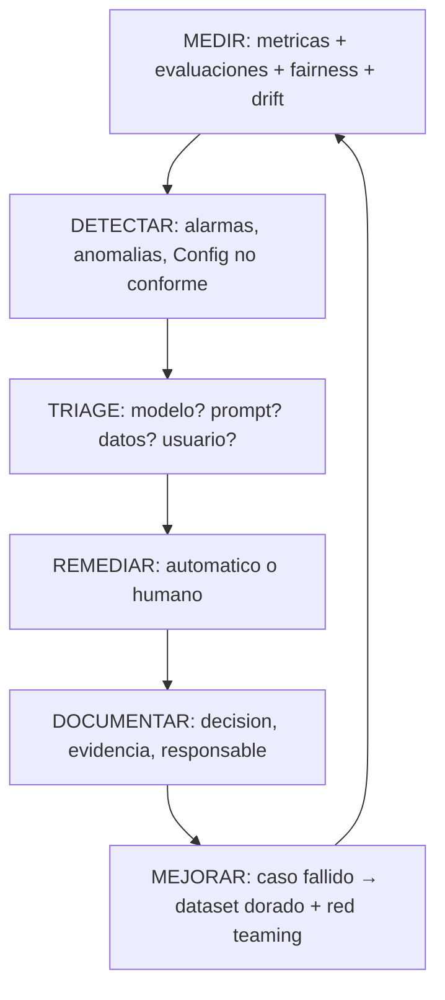

---

## 7. Task 3.4 — Principios de IA responsable

### 7.1 Skill 3.4.1 — Sistemas de IA transparentes en las salidas del FM

> *"Displays de razonamiento para explicaciones al usuario, CloudWatch para recolectar métricas de confianza y cuantificar incertidumbre, presentación de evidencia para atribución de fuentes, agent tracing de Bedrock para trazas de razonamiento."*

#### 7.1.1 Los cuatro mecanismos de transparencia

| Mecanismo | Qué muestra | Servicio / implementación | Precauciones |
|---|---|---|---|
| **Displays de razonamiento** | El "por qué" del resultado (pasos intermedios, cadena de razonamiento) | Trazas de agentes de Bedrock; prompts de chain-of-thought; resumen del razonamiento en la respuesta | El razonamiento **puede ser plausible y estar equivocado**: no es una prueba, es una ayuda. No exponerlo como certificación de corrección |
| **Cuantificación de incertidumbre** | Score de confianza, probabilidades de token, bandas de incertidumbre | Salida estructurada con `confidence`; logprobs donde el modelo los exponga; **métricas en CloudWatch** para observar la distribución y la calibración en el tiempo | Debe **validarse empíricamente** contra la exactitud; si no correlaciona, es una falsa sensación de seguridad |
| **Atribución de evidencia** | Citas con documento, pasaje, versión | Knowledge Bases (`retrievedReferences` + citas); UI que permite abrir la fuente | Verificar que la cita **sostenga** la afirmación, no solo que exista |
| **Agent tracing** | Pasos, herramienta elegida, parámetros, resultado de cada paso | Trazas de agentes de Bedrock / AgentCore Observability; spans en X-Ray/Transaction Search | Las trazas pueden contener PII: aplicar redacción y control de acceso |

#### 7.1.2 Trazabilidad técnica de las trazas de razonamiento

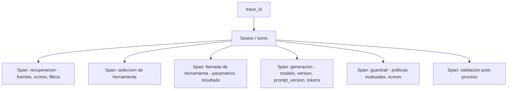
Esta estructura permite responder, en una investigación: **qué evidencia vio el sistema, qué eligió hacer, con qué versión de prompt/modelo, y qué control lo aprobó o lo bloqueó**.

#### 7.1.3 Qué mostrarle al usuario (y qué no)

| Mostrar | No mostrar |
|---|---|
| Fuentes citadas con enlaces/pasajes | El system prompt y las reglas internas (vector de ataque) |
| Grado de confianza cuando está calibrado, con explicación de qué significa | Un score de confianza numérico sin calibración ni explicación |
| Un resumen del razonamiento en lenguaje claro | Cadenas de pensamiento crudas, largas y potencialmente engañosas |
| Limitaciones conocidas ("no cubre X") | Afirmaciones de certeza absoluta |
| "No lo sé / no lo encontré en las fuentes" | Respuestas plausibles sin evidencia |

### 7.2 Skill 3.4.2 — Evaluaciones de equidad (fairness)

> *"Métricas de fairness predefinidas en CloudWatch, Prompt Management y Prompt Flows para A/B testing sistemático, LLM-as-a-judge para evaluaciones automatizadas."*

#### 7.2.1 Medir: qué métricas existen y cómo se leen

| Familia | Métricas útiles | Nota |
|---|---|---|
| **Seguridad / sesgo** | `Builtin.Harmfulness`, `Builtin.Stereotyping`, tasa de refusal por segmento | Normalizadas 0–1; **más bajo es mejor** en métricas de daño |
| **Calidad** | Correctness, Completeness, Faithfulness, Helpfulness, Coherence, Relevance | Más alto es mejor; sirven para detectar si el "ajuste de equidad" degradó la calidad |
| **RAG** | Faithfulness, CitationPrecision, CitationCoverage | La equidad también se rompe por recuperación desigual |
| **Dataset integrado de sesgo** | **BOLD** (Bias in Open-ended Language Generation Dataset): profesión, género, raza, ideología religiosa, ideología política | Punto de partida; para tus dominios hay que traer dataset propio |
| **Fairness segmentada (propia)** | Diferencias en exactitud, tasa de falso positivo/negativo, longitud de respuesta, tono, refusal entre grupos | Se calculan por segmento sobre las respuestas etiquetadas |

**Cómo se construye un test de equidad defendible:**
1. Definir los **atributos protegidos** relevantes (y su base legal/ética).
2. Construir **pares contrafactuales**: el mismo caso cambiando solo el atributo protegido (nombre, género, origen, barrio, discapacidad).
3. Ejecutar con `temperature` baja y **N repeticiones** (el no-determinismo es una fuente de varianza que hay que separar del sesgo).
4. Comparar distribuciones de métricas (no solo medias) entre grupos.
5. Repetir en el tiempo (monitoreo de deriva de sesgo) y tras cada cambio de modelo/prompt.

#### 7.2.2 A/B testing sistemático de prompts y flujos

**Bedrock Prompt Management** (versionado de prompts, con variables) + **Prompt Flows** (orquestación visual) permiten tratar los prompts como artefactos gobernados:

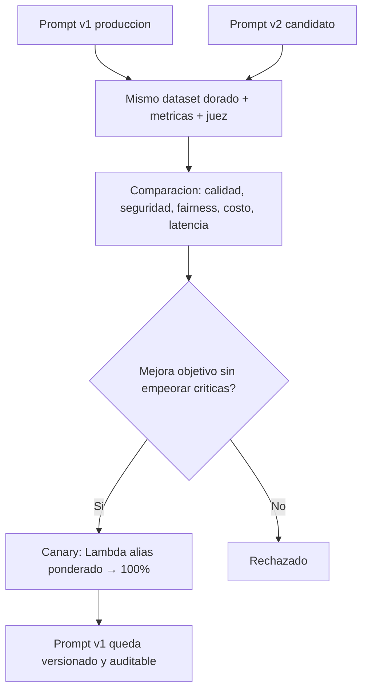

**Buenas prácticas de A/B en GenAI (distintas del A/B web clásico):**
- Un cambio a la vez; el no-determinismo exige **repetición** y comparación de distribuciones.
- Fijar el **juez** durante toda la comparación (y usar familia distinta al modelo evaluado).
- Incluir métricas de seguridad y fairness **como criterios de rechazo**, no solo de reporte.
- Documentar la decisión (qué se cambió, con qué evidencia, quién aprobó) — es evidencia de gobernanza.
- Cuidado con el *prompt drift*: si los prompts se editan fuera del sistema de versionado, el A/B deja de ser trazable.

#### 7.2.3 LLM-as-a-judge para evaluaciones automatizadas

| Aspecto | Recomendación |
|---|---|
| Sesgo de autopreferencia | Evaluador de **familia distinta** al generador |
| Sesgo de posición y de longitud | Aleatorizar orden en comparaciones; penalizar verbosidad en la rúbrica |
| Rúbrica | Explícita, con criterios y ejemplos; salida estructurada (JSON) |
| Calibración | Correlacionar el juez contra un conjunto revisado por humanos (muestreo) y publicar el acuerdo |
| Costo | El juez consume tokens: muestrear en producción, correr completo en pre-release |
| Uso en gobernanza | Los resultados del juez son evidencia; guardarlos con versión de rúbrica, modelo, fecha y dataset |

### 7.3 Skill 3.4.3 — Sistemas de IA conformes a políticas

> *"Guardrails basados en requisitos de política, model cards para documentar limitaciones, Lambda para chequeos de cumplimiento automatizados."*

#### 7.3.1 De la política al control (la traducción que hay que saber hacer)

| Enunciado de política | Control técnico |
|---|---|
| "No damos asesoramiento financiero personalizado" | **Denied topic** (definido en lenguaje natural) + guardrail de salida + respuesta de escalado |
| "Nunca revelamos datos de otros clientes" | Aislamiento por tenant en el índice + metadata filtering + filtro de PII en salida + pruebas de fuga cross-tenant |
| "Las respuestas deben citar la política vigente" | RAG con citas obligatorias + grounding check + validación de que la cita exista |
| "No prometemos plazos que la política no permite" | **Automated Reasoning check** contra la política formalizada (plazos, requisitos, condiciones) |
| "Solo personal autorizado ve datos completos" | Enmascarado por rol (Cognito + `ApplyGuardrail`) |
| "Toda decisión automatizada debe poder auditarse" | Invocation logging + agent tracing + respuesta registrada con versión de prompt/modelo |
| "El sistema no debe usarse para X" | Denied topics + **condición IAM que exige el guardrail** + monitoreo de intervenciones |

#### 7.3.2 Model cards como documentación de limitaciones

Una model card útil para gobernanza no dice "el modelo es bueno": dice **dónde falla**. Contenido mínimo:
- **Uso previsto** y **usos no previstos** (explícitos).
- **Limitaciones conocidas**: idiomas soportados, tipos de documento, dominios fuera de alcance, sensibilidad a formatos.
- **Supuestos y dependencias**: fuentes de datos, versiones, requisitos de contexto.
- **Rendimiento medido**: métricas por segmento, no solo agregadas; condiciones del benchmark.
- **Consideraciones éticas y de riesgo** + `risk rating`.
- **Advertencias operativas**: qué hacer cuando el sistema responde "no sé", cuándo escalar a humano.
- **Contacto/owner** y **fecha de revisión**.

#### 7.3.3 Chequeos de cumplimiento automatizados

Dos niveles:

**A) Chequeos en el pipeline CI/CD (antes de desplegar)**
```python
# Pseudocódigo del gate de cumplimiento
assert guardrail_exists(app) and production_pinned_to_numbered_version(app)   # no DRAFT
assert model_card_complete(model_version) and approval_status == "Approved"
assert data_sources_tagged(app)                       # Glue + tags obligatorios
assert invocation_logging_enabled(account, region)    # hallazgo clásico de auditoría
assert redteam_asr_below(threshold=0.05, categories=HIGH_RISK)
assert fairness_delta_below(threshold=0.05)
assert iam_policies_have_no_wildcard_on_invoke()      # Resource: "*" prohibido
```

**B) Chequeos en runtime (Lambda como control activo)**
- Validar que la respuesta cumpla reglas de negocio antes de entregarla (montos dentro de rango, campos obligatorios, disclaimers presentes).
- Verificar que se hayan incluido las citas requeridas; si faltan, degradar la respuesta.
- Aplicar guardrail a **salidas de herramientas** (patrón de hooks: aplicar `ApplyGuardrail` a los resultados de herramientas antes de reinyectarlos al modelo — evita que la inyección indirecta entre por esa vía).
- Registrar la decisión del chequeo (evidencia) y emitir métrica.

**C) Controles sobre los controles (gobernanza madura)**
- Config rules que detectan si alguien **deshabilitó** el invocation logging o cambió un guardrail.
- Alarmas sobre cambios de política (`PutRolePolicy`, `UpdateGuardrail`) no autorizados.
- Revisión periódica de la lista de modelos habilitados y de los tags de atribución.

---

## 8. Arquitectura de referencia

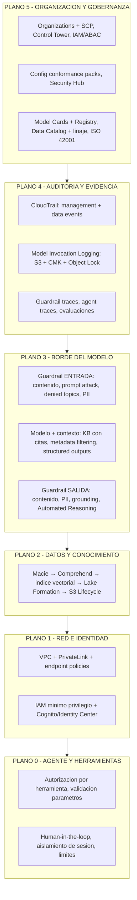

**Flujo de una petición "que pasa todos los controles":**
1. El usuario se autentica (Cognito/Identity Center) → su rol viaja como identidad.
2. La petición entra por API Gateway/WAF (límites, autorización, logging de acceso).
3. **Capa 1:** Lambda valida esquema, tamaño, idioma; Comprehend mide toxicidad y PII.
4. **Capa 2:** Guardrail de entrada (contenido, prompt attack, denied topics, PII→mask).
5. **Capa 3:** se recupera del KB **filtrando por rol**; el modelo genera con structured output y citas.
6. **Capa 4:** Guardrail de salida (contenido, PII, grounding, Automated Reasoning) + Lambda de reglas de negocio.
7. Se responde con citas, confianza calibrada y limitaciones visibles.
8. **Asíncrono:** se registran traza, invocation log (enmascarado), métricas de guardrail y evaluación muestreada.
9. **Continuo:** canary diario, drift de sesgo, anomalías de costo, Config rules, red-teaming programado.

---

## 9. Cheat sheet: tablas de decisión para el examen

### 9.1 "Si el escenario dice… → elegí…"

| El escenario dice | Respuesta esperada |
|---|---|
| Filtrar contenido dañino, temas prohibidos y PII en prompts y respuestas, con modelos de Bedrock **o de terceros** | **Amazon Bedrock Guardrails** (aplicado vía `ApplyGuardrail` si no es un modelo de Bedrock) |
| Aplicar el guardrail a la salida de una **herramienta** o a un punto arbitrario del pipeline | **`ApplyGuardrail`** (independiente de la invocación al modelo) |
| Necesito solo puntajes de riesgo, sin bloquear | **`InvokeGuardrailChecks`** (detect-only) |
| Garantizar que **nadie** invoque el modelo sin guardrail | Condición IAM **`bedrock:GuardrailIdentifier`** en una política de **Deny** |
| Garantizar matemáticamente que la respuesta no contradice la política de la empresa | **Automated Reasoning checks** |
| Detectar respuestas no fundamentadas en el contexto (RAG) | **Contextual grounding check** (+ citas de Knowledge Bases; evaluación `Faithfulness`) |
| Que el modelo jamás devuelva JSON inválido | **Structured outputs (JSON Schema)** o *strict tool use* |
| Los números deben ser exactos y auditables | **Text-to-SQL** (el dato sale de la base, no del modelo) |
| Moderación con reglas propias y revisión humana en casos límite | **Step Functions + Lambda** (con `waitForTaskToken`) |
| Filtrar respuestas en el borde, con límites de tamaño y autorización | **API Gateway** (+ WAF) |
| Detectar toxicidad en un pipeline de ingesta masivo | **Amazon Comprehend** (jobs asíncronos) |
| Saber qué datos sensibles hay en S3 **antes** de indexarlos | **Amazon Macie** (findings → EventBridge para bloquear la ingesta) |
| Redactar PII antes de crear embeddings | **Comprehend** con `REPLACE_WITH_PII_ENTITY_TYPE` |
| Ocultar PII a un usuario pero mostrarla a un administrador | **Cognito + `ApplyGuardrail`** (enmascarado por rol) |
| Que el modelo nunca vea datos personales reales | **Tokenización / pseudonimización** con bóveda segura (proxy de privacidad) |
| Cumplir una política de retención de 30/90 días | **S3 Lifecycle** (+ retención de CloudWatch Logs) |
| Evidencia inmutable para auditoría | **S3 Object Lock** + CloudTrail a bucket de archivo |
| Aislar el tráfico a Bedrock de internet | **VPC interface endpoints (PrivateLink)** + endpoint policies |
| Restringir qué modelos puede invocar cada equipo | **IAM** sobre ARNs de modelo (+ SCP para el techo organizacional) |
| Acceso a nivel de fila/columna en un data lake | **AWS Lake Formation** |
| Reconstruir por qué el sistema respondió eso | **Agent tracing** + **Model Invocation Logging** + trazas de guardrail |
| Saber **quién** invocó el modelo y **cuándo** | **CloudTrail** (management events de `InvokeModel`/`Converse` están por defecto) |
| Auditar invocaciones de **agentes y Knowledge Bases** | **CloudTrail data events** (con advanced event selectors) — **apagados por defecto** |
| Ver el **contenido** del prompt y la respuesta para una investigación | **Model Invocation Logging** (opt-in, por cuenta y región) |
| Documentar propósito, limitaciones y riesgo del modelo | **SageMaker Model Cards** (versionadas, inmutables, con risk rating) |
| Linaje automático de datos y columnas | **AWS Glue** (Data Catalog + lineage) |
| Atribuir cada afirmación generada a su fuente | **Citas de Knowledge Bases** + metadata tagging + verificación de atribución |
| Alinear el despliegue con un framework regulatorio y demostrarlo | **AWS Config conformance packs** (+ Audit Manager en mantenimiento; faltan packs de SOC 2/GDPR) |
| Baseline de controles en todas las cuentas | **CloudFormation StackSets** + **SCPs** + **Control Tower** |
| Medir sesgo y toxicidad de las salidas | **Bedrock Evaluations** (`Builtin.Stereotyping`, `Harmfulness`, dataset **BOLD**, o dataset propio) |
| Comparar dos versiones de prompt de forma sistemática y auditable | **Prompt Management + Prompt Flows** con el mismo dataset y juez |
| Detectar degradación de equidad a lo largo del tiempo | **Monitoreo de drift de sesgo**: métricas de fairness por segmento + drift de distribución (PSI/KS) + canary diario |
| Probar la resistencia a inyección y jailbreak antes de cada release | **Suite de red teaming automatizada** con métrica **ASR** y gate de CI/CD (OWASP LLM Top 10 / MITRE ATLAS) |
| Evitar que los logs guarden PII | **CloudWatch Data Protection** (redacción a nivel de token) + invocation logging selectivo |
| Que el modelo no reciba instrucciones escondidas en un documento | Tratar el contenido recuperado como **no confiable**: delimitación, sanitización, guardrail sobre salidas de herramientas, sin ejecución automática |
| Explicarle al usuario de dónde salió su respuesta | **Agent tracing** + citas + evidencia en la UI |

### 9.2 Qué NO hace cada servicio (errores más frecuentes)

| Servicio | Lo que la gente cree | Realidad |
|---|---|---|
| **CloudTrail** | "Muestra qué le preguntaron al modelo" | Registra **metadata** (quién, cuándo, qué modelo). El contenido **nunca** está ahí |
| **Macie** | "Redacta la PII" | Solo **clasifica e inventaría** en S3 |
| **Comprehend** | "Aplica mis políticas de contenido" | Detecta entidades y toxicidad; **no** conoce tus políticas de negocio |
| **Guardrails** | "Elimina la inyección de prompts" | Mitiga con filtros y temas denegados; **no** resuelve la inyección (es un problema abierto) |
| **Guardrails (filtro PII)** | "También revisa lo que devuelven las herramientas" | **No** cubre salidas de llamadas a funciones: hay que aplicarlo explícitamente (por ejemplo, con hooks) |
| **Audit Manager** | "Sigue siendo el producto recomendado para gestionar cumplimiento" | Está en **modo mantenimiento**; AWS recomienda **Config conformance packs** |
| **Config conformance packs** | "Cubre todos los frameworks" | **No hay packs para SOC 2 ni GDPR**, y Config no recolecta CloudTrail/Security Hub como evidencia |
| **Model Card** | "Se puede editar después de creada" | Es **inmutable**: cualquier cambio genera una nueva versión |
| **Enmascarado de PII** | "Los datos quedaron anonimizados" | Enmascarar es **reducción de riesgo**; no equivale a anonimización legal |
| **Evaluaciones LLM-as-a-judge** | "El juez es objetivo" | Tiene sesgos (autopreferencia, longitud, posición) y hay que calibrarlo contra humanos |
| **Guardrails precio** | "0,75 por 1K text units" | Precio **viejo**; los vigentes son 0,15 / 0,10 / 0,17 según la política |

---

## 10. Patrones de pregunta y trampas frecuentes

### 10.1 Las quince trampas

1. **Confundir CloudTrail con Model Invocation Logging.** La pregunta describe "investigar qué contenido se envió" y ofrece CloudTrail como distractor. CloudTrail no tiene contenido, y el invocation logging está **off por defecto**.
2. **Olvidar que los eventos de agentes y KB son data events.** Un escenario pregunta por qué no hay registros de `InvokeAgent`: hay que habilitar data events con advanced event selectors.
3. **Elegir un control probabilístico cuando el enunciado exige garantía.** "Asegurar", "probar matemáticamente", "verificar sin ambigüedad" → Automated Reasoning, no un juez LLM.
4. **Creer que el filtrado de entrada alcanza.** La inyección indirecta entra por documentos y herramientas; y AWS recomienda explícitamente **filtrar la salida** para ataques de codificación.
5. **Redactar PII después de indexar.** Si el corpus se indexó con PII, los embeddings y los fragmentos ya la contienen; el orden correcto es Macie → Comprehend → índice.
6. **Usar `MASK` en corpus de RAG.** Enmascarar con `***` crea colisiones y degrada la recuperación; se usa `REPLACE_WITH_PII_ENTITY_TYPE`.
7. **Aplicar el guardrail a producción desde el DRAFT.** Se publica una versión numerada; el DRAFT puede fallar con `ValidationException` mientras se actualiza.
8. **Asumir que `Resource: "*"` en `InvokeModel` es aceptable.** Da acceso a todos los modelos de la región.
9. **Buscar la condición IAM `bedrock:ModelId`.** No existe; los modelos se restringen por ARN en `Resource`.
10. **Ignorar el efecto de CRIS sobre políticas de región.** Una política con `aws:RequestedRegion` restrictivo bloquea los perfiles cross-region.
11. **Creer que la firma de un BAA hace mágicamente el sistema HIPAA-compliant.** Hace falta cifrado con CMK, PrivateLink, invocation logging habilitado, guardrails de PII y evidencia de todo ello.
12. **Suponer que los datos de fine-tuning se guardan.** Bedrock no conserva los datos de ajuste; crea una copia privada del modelo cifrada con tu KMS.
13. **Tratar "masking" como "anonymization"** en la respuesta correcta de una pregunta de cumplimiento. Es un distractor habitual.
14. **Creer que Audit Manager sigue siendo la respuesta por defecto.** Está en modo mantenimiento; la recomendación actual es Config conformance packs (con sus limitaciones).
15. **Creer que un model card se puede "corregir" sin dejar rastro.** Las versiones son inmutables y el linaje queda registrado.

### 10.2 Frases que suelen indicar la respuesta correcta

- **"defensa en profundidad"** → múltiples capas, no un control único.
- **"matemáticamente verificable" / "explicar por qué"** → Automated Reasoning checks.
- **"determinístico"** → word filters, JSON Schema, text-to-SQL, reglas en Lambda.
- **"independiente del modelo" / "modelo de terceros"** → `ApplyGuardrail`.
- **"evidencia exportable para el auditor"** → Model Cards + Config + CloudTrail + S3 con Object Lock.
- **"trazabilidad de la decisión"** → agent tracing + invocation logging + versiones de prompt/modelo.
- **"atribución de fuentes"** → citas de Knowledge Bases + metadata tagging.
- **"equidad medible en el tiempo"** → métricas por segmento + monitoreo de drift + canary.
- **"antes de desplegar"** → gate de CI/CD con ASR, fairness y chequeos de cumplimiento.
- **"el modelo no debe ver el dato real"** → tokenización/pseudonimización en un proxy de privacidad.

---

## 11. Checklists operativos

### 11.1 Seguridad de contenido (3.1)
- [ ] Guardrail creado con las seis políticas relevantes; **versión numerada** en producción.
- [ ] Umbrales calibrados en modo *detect* antes de activar bloqueo.
- [ ] `blockedInputMessaging` / `blockedOutputsMessaging` con mensajes útiles y consistentes con la marca.
- [ ] Guardrail aplicado a **entradas, salidas y salidas de herramientas**.
- [ ] Moderación propia (Step Functions/Lambda) donde la política de negocio exceda el guardrail.
- [ ] Validación post-proceso (esquema, reglas de negocio, citas obligatorias) en Lambda.
- [ ] Grounding check activo donde hay RAG; Automated Reasoning donde hay reglas formales.
- [ ] Structured outputs en todo endpoint con contrato de datos.
- [ ] Suite de red teaming con ASR por categoría y gate de release.
- [ ] `stopReason == guardrail_intervened` manejado en la UX (no errores crudos).

### 11.2 Datos y privacidad (3.2)
- [ ] Macie habilitado en los buckets que alimentan el corpus; findings conectados a EventBridge.
- [ ] Redacción en ingesta (Comprehend) + verificación secundaria con Macie.
- [ ] Metadata de rol/sensibilidad en cada documento y filtrado en recuperación.
- [ ] Guardrail de PII (mask) en entrada y salida; enmascarado por rol donde aplique.
- [ ] Cifrado CMK en datos, logs, vector store, KB y modelos personalizados.
- [ ] PrivateLink para Bedrock y servicios satélite; endpoint policies restrictivas.
- [ ] Retención definida (S3 Lifecycle + CloudWatch Logs) y Object Lock para evidencias.
- [ ] Invocation logging habilitado **antes** de procesar datos sensibles, con CMK y acceso restringido.
- [ ] Procedimiento de borrado que cubra índice, caché y logs.
- [ ] Documentación explícita de que el enmascarado no es anonimización.

### 11.3 Gobernanza y cumplimiento (3.3)
- [ ] Inventario de sistemas de IA con dueño, riesgo, datos y estado.
- [ ] Model Cards completas y asociadas a versiones; approval status como gate de despliegue.
- [ ] Linaje y tags en el Data Catalog para todas las fuentes.
- [ ] CloudTrail multi-región con data events de agentes/KB; organización trail.
- [ ] Config conformance packs desplegados y con dashboard de cumplimiento revisado.
- [ ] Baseline distribuido con StackSets y validado con Guard en CI/CD.
- [ ] SCPs que fijan proveedores de modelos y regiones permitidas.
- [ ] Logs de decisión centralizados y consultables (Athena/Logs Insights).
- [ ] Mapeo documentado a los frameworks aplicables (NIST AI RMF / ISO 42001 / EU AI Act).
- [ ] Revisión periódica documentada con acciones correctivas.

### 11.4 Monitoreo continuo y controles avanzados (3.3.4)
- [ ] Alarmas sobre intervenciones de guardrail por política.
- [ ] Detección de anomalies en invocaciones, tokens y costo.
- [ ] Canary suite diaria con golden dataset y diff de resultados.
- [ ] Monitoreo de drift de sesgo por segmento (ventana móvil).
- [ ] Remedición automática (EventBridge → Lambda/SSM) para hallazgos reversibles.
- [ ] Data Protection en logs y trazas (redacción de PII).
- [ ] Revisión de accesos anómalos (CloudTrail + VPC Flow Logs + Macie).
- [ ] Revisión mensual de modelos habilitados, roles y tags de atribución.

### 11.5 IA responsable (3.4)
- [ ] Trazas de razonamiento visibles (al menos internamente) y citas en la UI.
- [ ] Score de confianza **calibrado** contra exactitud; si no correlaciona, no mostrarlo.
- [ ] Página de limitaciones conocidas por caso de uso.
- [ ] Test de equidad con pares contrafactuales, N repeticiones y comparación de distribuciones.
- [ ] A/B de prompts con juez fijo, métricas de seguridad/fairness como criterios de rechazo.
- [ ] Chequeos de cumplimiento automatizados (pre-deploy y runtime) con evidencia registrada.
- [ ] Revisión humana muestreada para calibrar los jueces automáticos.

---

## 12. Anexos

### Anexo A. Snippets de código

**A.1 — Crear un guardrail con las seis políticas y publicar una versión**

```python
import boto3
bedrock = boto3.client("bedrock")

g = bedrock.create_guardrail(
    name="prod-guardrail",
    description="Seguridad de contenido, PII, grounding y reglas de negocio",
    blockedInputMessaging="No puedo procesar esa solicitud.",
    blockedOutputsMessaging="No puedo responder eso; reformulá tu consulta.",

    # 1) Filtros de contenido (entrada y salida) + prompt attacks
    contentPolicyConfig={
        "filtersConfig": [
            {"type": "HATE",          "inputStrength": "HIGH",   "outputStrength": "HIGH"},
            {"type": "INSULTS",       "inputStrength": "MEDIUM", "outputStrength": "MEDIUM"},
            {"type": "SEXUAL",        "inputStrength": "HIGH",   "outputStrength": "HIGH"},
            {"type": "VIOLENCE",      "inputStrength": "MEDIUM", "outputStrength": "MEDIUM"},
            {"type": "MISCONDUCT",    "inputStrength": "MEDIUM", "outputStrength": "MEDIUM"},
            # PROMPT_ATTACK solo admite strength de ENTRADA
            {"type": "PROMPT_ATTACK", "inputStrength": "HIGH",   "outputStrength": "NONE"},
        ],
        "tierConfig": {"tierName": "STANDARD"},   # +recall, 60 idiomas, dominio de código, prompt attacks
    },

    # 2) Temas denegados (en lenguaje natural)
    topicPolicyConfig={"topicsConfig": [
        {"name": "Consejo financiero personalizado",
         "definition": "Recomendaciones de inversión, compra/venta de activos o planificación "
                       "financiera específica para la situación de una persona.",
         "examples": ["¿Debería comprar acciones de X?",
                      "¿Cuánto debería invertir en mi jubilación?"],
         "type": "DENY"},
    ]},

    # 3) Filtro de palabras (determinístico y gratis)
    wordPolicyConfig={"wordsConfig": [{"text": "nombre-en-clave-interno"}]},

    # 4) Información sensible: PII y regex propios
    sensitiveInformationPolicyConfig={
        "piiEntitiesConfig": [
            {"type": "EMAIL",   "action": "ANONYMIZE"},   # ANONYMIZE = enmascara; BLOCK = rechaza
            {"type": "NAME",    "action": "ANONYMIZE"},
            {"type": "US_SOCIAL_SECURITY_NUMBER", "action": "BLOCK"},
        ],
        "regexesConfig": [{"name": "legajo_interno",
                           "pattern": r"LEG-\d{8}", "action": "ANONYMIZE"}],
    },

    # 5) Grounding: fundamentación y relevancia (umbrales 0..1)
    contextualGroundingPolicyConfig={"filtersConfig": [
        {"type": "GROUNDING", "threshold": 0.75},
        {"type": "RELEVANCE", "threshold": 0.70},
    ]},
)
guardrail_id = g["guardrailId"]      # la versión inicial es "DRAFT"

# Publicar versión inmutable para producción
version = bedrock.create_guardrail_version(
    guardrailIdentifier=guardrail_id,
    description="v1: políticas iniciales calibradas tras pruebas en modo detect",
)["version"]
print("Producción debe usar:", guardrail_id, "versión", version)   # NO "DRAFT"
```

**A.2 — Invocar con guardrail y leer las evaluaciones (trace)**

```python
rt = boto3.client("bedrock-runtime")

resp = rt.converse(
    modelId="us.anthropic.claude-sonnet-4-5-20250929-v1:0",
    messages=[{"role": "user", "content": [{"text": user_input}]}],
    guardrailConfig={"guardrailIdentifier": guardrail_id,
                     "guardrailVersion": str(version),   # nunca "DRAFT" en prod
                     "trace": "enabled"},
)

if resp.get("stopReason") == "guardrail_intervened":
    for a in resp["trace"]["guardrail"]["inputAssessment"].values():
        for policy, detail in a.items():
            print("Política que intervino:", policy)
    # UX: responder con el mensaje configurado, y registrar métrica de intervención
else:
    print(resp["output"]["message"]["content"][0]["text"])
```

**A.3 — Guardrail sobre la salida de una herramienta (evita inyección indirecta)**

```python
def tool_result_seguro(texto_de_herramienta: str, fuente: str) -> str:
    """El contenido que viene de afuera se evalúa ANTES de reinyectarlo al modelo."""
    r = rt.apply_guardrail(
        guardrailIdentifier=guardrail_id,
        guardrailVersion=str(version),
        source="INPUT",                       # lo tratamos como entrada no confiable
        content=[{"text": {"text": texto_de_herramienta}}],
    )
    if r["action"] == "GUARDRAIL_INTERVENED":
        emit_metric("tool_output_blocked", source=fuente)
        return "[contenido omitido por política de seguridad]"
    return r["outputs"][0]["text"]
```

**A.4 — Automated Reasoning: interpretar findings y no confundir VALID con verificado**

```python
salida = rt.apply_guardrail(
    guardrailIdentifier=guardrail_id, guardrailVersion=str(version),
    source="OUTPUT", content=[{"text": respuesta_del_modelo}],
)

for assessment in salida["assessments"]:
    ar = assessment.get("automatedReasoningPolicy")
    if not ar:
        continue
    for f in ar["findings"]:
        tipo = f["result"]
        if tipo == "INVALID":
            print("❌ Contradice la política. Reglas:", [r["description"] for r in f.get("rules", [])])
            print("   Correcciones sugeridas:", f.get("suggestions"))
            bloquear_y_regenerar(f)
        elif tipo == "VALID":
            # CRÍTICO: VALID no significa "todo verificado"
            no_traducidos = f.get("untranslatedClaims") or f.get("untranslatedPremises")
            if no_traducidos:
                print("⚠️ Afirmaciones/premisas FUERA del alcance de la política (posible alucinación):")
                for c in no_traducidos:
                    print("   -", c)
        elif tipo == "SATISFIABLE":
            print("⚠️ Consistente con alguna interpretación, pero no cubre todas las reglas")
        elif tipo in ("IMPOSSIBLE", "TRANSLATION_AMBIGUOUS", "TOO_COMPLEX"):
            print("⚠️ No se pudo verificar:", tipo)   # no lo trates como aprobado
```
> Recordá: **Automated Reasoning solo verifica lo que cae dentro de la política** (hay que revisar `untranslatedClaims`/`untranslatedPremises`), soporta **inglés (US)**, **no soporta streaming** y agrega latencia (del orden de segundos).

**A.5 — Redacción de PII antes de indexar el corpus (Comprehend)**

```python
comprehend = boto3.client("comprehend")

job = comprehend.start_pii_entities_detection_job(
    JobName="kb-corpus-redaction",
    LanguageCode="en",
    Mode="ONLY_REDACTION",
    RedactionConfig={
        "PiiEntityTypes": ["ALL"],                        # o un subconjunto explícito
        "MaskMode": "REPLACE_WITH_PII_ENTITY_TYPE",       # NO "MASK" en corpus de RAG
    },
    InputDataConfig={"S3Uri": "s3://mi-corpus-crudo/", "InputFormat": "ONE_DOC_PER_FILE"},
    OutputDataConfig={"S3Uri": "s3://mi-corpus-redactado/"},
    DataAccessRoleArn=ROLE_ARN,
)
# Después: job de Macie de verificación sobre el corpus ya redactado, y recién ahí indexar.
```

**A.6 — Model Card programática (gobernanza como código)**

```python
from sagemaker.model_card import (ModelCard, ModelOverview, IntendedUses,
                                 BusinessDetails, AdditionalInformation,
                                 RiskRatingEnum, ModelCardStatusEnum)

card = ModelCard(
    name="asistente-soporte-v3",
    status=ModelCardStatusEnum.DRAFT,
    model_overview=ModelOverview(
        model_description="Asistente de soporte con RAG sobre documentación de producto.",
        problem_type="Generación de texto con recuperación",
        algorithm_type="FM + Knowledge Base",
        model_creator="equipo-experiencia-cliente",
        model_owner="gobierno-ia@empresa.com",
    ),
    intended_uses=IntendedUses(
        purpose_of_model="Responder consultas de producto con citas verificables.",
        intended_uses="Soporte interno de nivel 1, con escalado humano.",
        factors_affecting_model_efficiency="Cobertura del corpus; actualización de la documentación.",
        risk_rating=RiskRatingEnum.MEDIUM,
        explanations_for_risk_rating="No toma decisiones que afecten derechos; sí puede informar mal.",
    ),
    business_details=BusinessDetails(
        business_problem="Alto volumen de consultas repetitivas.",
        business_stakeholders="Soporte, Éxito del cliente",
        line_of_business="Servicios",
    ),
    additional_information=AdditionalInformation(
        ethical_considerations="Riesgo de sesgo en la recuperación; se monitorea fairness por segmento.",
        caveats_and_recommendations="No respondo temas legales ni de facturación; derivar a humano.",
        custom_details={"evaluacion_baseline": "correctness=0.91, harmfulness=0.00",
                        "proxima_revision": "2026-12-15"},
    ),
)
card.create()
# La versión queda inmutable: cualquier cambio genera una nueva versión.
```

**A.7 — Evaluación de responsabilidad (calidad + sesgo + toxicidad)**

```python
bedrock = boto3.client("bedrock")

job = bedrock.create_evaluation_job(
    jobName="eval-seguridad-v3",
    roleArn=EVAL_ROLE_ARN,
    applicationType="ModelEvaluation",
    evaluationConfig={"automated": {
        "datasetMetricConfigs": [{
            "taskType": "General",
            "dataset": {"name": "golden_set",
                        "datasetLocation": {"s3Uri": GOLDEN_S3_URI}},
            "metricNames": [
                "Builtin.Correctness", "Builtin.Completeness", "Builtin.Faithfulness",
                "Builtin.Harmfulness", "Builtin.Stereotyping", "Builtin.Refusal",
            ],
        }],
        # Evaluador de FAMILIA DISTINTA al modelo evaluado (sesgo de autopreferencia)
        "evaluatorModelConfig": {"bedrockEvaluatorModels": [{"modelIdentifier": EVALUATOR_MODEL}]},
    }},
    inferenceConfig={"models": [{"bedrockModel": {"modelIdentifier": CANDIDATE_MODEL}}]},
    outputDataConfig={"s3Uri": EVAL_OUT_S3_URI},
)
# Lectura de resultados: 0..1. En calidad, más alto es mejor.
# En Harmfulness / Stereotyping, MÁS BAJO es mejor (0.00 = ideal).
```

**A.8 — Harness de red teaming con gate de release por ASR**

```python
import sys, statistics
HIGH_RISK = ("prompt_injection", "indirect_injection", "jailbreak",
             "data_leakage", "system_prompt_leak", "tool_abuse")

def run_suite(target, cases, n=5):
    """cases: [{'id','category','input','expect'}]  expect: refuse|no_leak|safe_completion"""
    totals, wins = {}, {}
    for c in cases:
        totals[c["category"]] = totals.get(c["category"], 0) + 1
        for _ in range(n):                      # repeticiones: el resultado es estadístico
            ok = judge_expected(c["expect"], target(c["input"]))
            if not ok:
                wins[c["category"]] = wins.get(c["category"], 0) + 1
                break                            # basta un éxito del atacante
    return {cat: wins.get(cat, 0) / total for cat, total in totals.items()}

def gate(asr, threshold=0.05):
    breaches = [c for c in HIGH_RISK if asr.get(c, 0) > threshold]
    if breaches:
        sys.exit(f"RELEASE BLOQUEADO — ASR por encima de {threshold:.0%} en: {breaches}")
    print("Gate de seguridad aprobado. ASR:", asr)

gate(run_suite(mi_aplicacion, casos_de_ataque))
# Los ataques que tuvieron éxito se agregan como tests de regresión permanentes.
```

**A.9 — IAM: exigir guardrail, modelo aprobado y endpoint privado**

```json
{
  "Version": "2012-10-17",
  "Statement": [
    {
      "Sid": "NegarInvocacionesSinGuardrailCorporativo",
      "Effect": "Deny",
      "Action": ["bedrock:InvokeModel", "bedrock:InvokeModelWithResponseStream"],
      "Resource": "*",
      "Condition": {
        "StringNotEquals": {
          "bedrock:GuardrailIdentifier": "arn:aws:bedrock:us-east-1:111122223333:guardrail/gr-corp-001"
        }
      }
    },
    {
      "Sid": "PermitirSoloModelosAprobados",
      "Effect": "Allow",
      "Action": ["bedrock:InvokeModel", "bedrock:InvokeModelWithResponseStream"],
      "Resource": [
        "arn:aws:bedrock:us-east-1::foundation-model/anthropic.claude-sonnet-4-5-*",
        "arn:aws:bedrock:us-east-1::foundation-model/amazon.nova-lite-*"
      ]
    }
  ]
}
```
*Nota: no existe la condición `bedrock:ModelId`; la restricción de modelos se hace por ARN en `Resource`. Si usás CRIS, revisá que las políticas con `aws:RequestedRegion` permitan las regiones destino.*

**A.10 — Habilitar Model Invocation Logging (el control que falta casi siempre)**

```python
bedrock.put_model_invocation_logging_configuration(
    loggingConfig={
        "cloudWatchConfig": {
            "logGroupName": "/aws/bedrock/invocations",
            "roleArn": LOGGING_ROLE_ARN,                  # confiar en bedrock.amazonaws.com,
                                                          # con aws:SourceArn y aws:SourceAccount
            "largeDataDeliveryS3Config": {"bucketName": "mi-bucket-logs-grandes"},
        },
        "s3Config": {"bucketName": "mi-bucket-invocaciones", "keyPrefix": "bedrock/"},
        "textDataDeliveryEnabled": True,
        "imageDataDeliveryEnabled": False,                 # minimizá: solo lo necesario
        "embeddingDataDeliveryEnabled": False,
    }
)
# El bucket debe usar CMK; el acceso, restringirse a roles de auditoría;
# la retención, fijarse por política (S3 Lifecycle).
```

**A.11 — Regla de Config que detecta logging deshabilitado (control sobre el control)**

```python
# Concepto: regla custom (o AWS Config managed rule + Lambda) que evalúa
# que PutModelInvocationLoggingConfiguration devuelva un valor no nulo
# y que el guardrail de producción NO apunte a DRAFT.
def evaluate(account, region):
    cfg = boto3.client("bedrock", region_name=region).get_model_invocation_logging_configuration()
    return {
        "ComplianceType": "COMPLIANT" if cfg.get("loggingConfig") else "NON_COMPLIANT",
        "Annotation": "Model invocation logging habilitado" if cfg.get("loggingConfig")
                      else "SIN invocation logging: no habrá evidencia de contenido tras un incidente",
    }
```

### Anexo B. Consultas de auditoría y evidencias de cumplimiento

```sql
-- B.1 Intervenciones de guardrail por política y por aplicación (Logs Insights)
fields @timestamp, app, guardrailVersion, policy, action, severity
| filter ispresent(policy) and action = "GUARDRAIL_INTERVENED"
| stats count() as intervenciones by policy, app, guardrailVersion
| sort intervenciones desc

-- B.2 Intentos de prompt attack y de fuga de system prompt
fields @timestamp, user_id, sessionId, policy
| filter policy in ["PROMPT_ATTACK", "SYSTEM_PROMPT_LEAK"]
| stats count() as intentos, count_distinct(user_id) as usuarios by bin(1h)
| sort intentos desc

-- B.3 Respuestas con PII enmascarada (evidencia de que el filtro actúa)
fields @timestamp, app, pii_type, count_enmascarado
| filter ispresent(pii_type)
| stats sum(count_enmascarado) as total by pii_type, app
```

```bash
# B.4 ¿Quién invocó modelos en la última hora? (CloudTrail: metadata, no contenido)
aws cloudtrail lookup-events \
  --lookup-attributes AttributeKey=EventName,AttributeValue=InvokeModel \
  --start-time "$(date -u -d '1 hour ago' +%Y-%m-%dT%H:%M:%SZ)" \
  --query 'Events[].{t:EventTime,user:Username,ip:CloudTrailEvent}' | jq .

# B.5 ¿Está habilitado el invocation logging? (devuelve null si está apagado)
aws bedrock get-model-invocation-logging-configuration

# B.6 Estado de cumplimiento de los conformance packs
aws configservice describe-conformance-pack-status \
  --conformance-pack-names "operational-best-practices-for-hipaa-security"

# B.7 Hallazgos de Macie sobre el corpus
aws macie2 list-findings --finding-criteria '{"criterion":{"severity":{"eq":["High"]}}}'
```

```sql
-- B.8 Evidencia de auditoría: invocaciones por principal y modelo, desde CUR (atribución)
SELECT line_item_iam_principal, line_item_resource_id AS modelo,
       SUM(line_item_usage_amount) AS unidades,
       SUM(line_item_unblended_cost) AS costo_usd
FROM cur2
WHERE line_item_product_code = 'AmazonBedrock'
  AND line_item_usage_start_date >= current_date - interval '30' day
GROUP BY 1, 2 ORDER BY costo_usd DESC;

-- B.9 Elección de modelo por caso de uso (para justificar uso previsto)
SELECT CASE
         WHEN line_item_usage_type LIKE '%NovaMicro%' THEN 'clasificación/routing'
         WHEN line_item_usage_type LIKE '%Claude%'    THEN 'respuestas complejas'
         ELSE 'otros' END AS caso_de_uso,
       SUM(line_item_unblended_cost) AS costo_usd
FROM cur2 WHERE line_item_product_code='AmazonBedrock'
GROUP BY 1 ORDER BY 2 DESC;
```

### Anexo C. Glosario

| Término | Definición |
|---|---|
| **Guardrail** | Recurso de Bedrock con políticas configurables que evalúa entradas y salidas; tiene DRAFT y versiones numeradas inmutables |
| **Denied topic** | Tema definido en lenguaje natural que la aplicación no debe discutir |
| **Prompt attack** | Categoría de filtro de contenido que detecta intentos de jailbreak e inyección; solo en entrada |
| **Sensitive information filter** | Detección de PII (31+ tipos) y regex propios, con acción block o anonymize |
| **Contextual grounding check** | Verificación de fundamentación (*grounding*) y relevancia contra la fuente |
| **Automated Reasoning check** | Verificación matemática de afirmaciones contra una política en lógica formal; produce findings explicables |
| **`ApplyGuardrail`** | API independiente del modelo para aplicar un guardrail a texto arbitrario (modelos de terceros, salidas de herramientas) |
| **`InvokeGuardrailChecks`** | Chequeo en modo detect-only que devuelve puntajes sin interferir |
| **Defensa en profundidad** | Estrategia de capas de control redundantes (entrada, modelo, salida, datos, agente) |
| **Inyección indirecta** | Instrucción maliciosa embebida en contenido que el sistema consume (documentos, web, resultados de herramientas) |
| **ASR (Attack Success Rate)** | Proporción de intentos adversariales que logran su objetivo; métrica central de red teaming |
| **ASR-gate / quality gate** | Control de CI/CD que bloquea un despliegue si una métrica de seguridad o calidad no cumple el umbral |
| **Token-level redaction** | Enmascarado de datos sensibles dentro de la telemetría (logs y trazas), no solo en la respuesta |
| **PII** | Información que permite identificar directa o indirectamente a una persona |
| **Pseudonimización** | Reemplazo de identificadores por seudónimos reversibles con bóveda segura |
| **Anonimización** | Irreversibilidad efectiva de la identificación; **no equivale a enmascarar** |
| **Object Lock** | Modo WORM de S3 que impide borrar o modificar objetos durante un período |
| **Model Card** | Documento versionado e inmutable con propósito, uso previsto, métricas, limitaciones y consideraciones éticas de un modelo |
| **Model Registry** | Catálogo de versiones de modelos con linaje y estado de aprobación |
| **Linaje (lineage)** | Trazabilidad del origen y las transformaciones de datos y artefactos |
| **Management event / Data event** | Categorías de CloudTrail: las de control (invocación incluida, por defecto) vs. las de recursos de datos (agentes/KB, apagadas por defecto) |
| **Model Invocation Logging** | Función opt-in que entrega prompts y respuestas a CloudWatch/S3 |
| **BOLD** | Dataset de referencia para medir sesgo en generación abierta (profesión, género, raza, religión, política) |
| **LLM-as-a-judge** | Uso de un modelo para puntuar salidas según rúbrica; requiere calibración y control de sesgos |
| **AIMS** | Sistema de gestión de IA que se audita en ISO/IEC 42001 |
| **EU AI Act** | Regulación europea con obligaciones escalonadas por nivel de riesgo |
| **Excessive agency** | Riesgo de que un agente actúe con más permisos o alcance de los necesarios |

### Anexo D. Fuentes consultadas

**Documentación oficial de AWS**
- Dominio 3 del examen AIP-C01 — https://docs.aws.amazon.com/aws-certification/latest/ai-professional-01/ai-professional-01-domain3.html
- Servicios en alcance AIP-C01 — https://docs.aws.amazon.com/aws-certification/latest/ai-professional-01/aip-01-in-scope-services.html
- Amazon Bedrock: seguridad, privacidad e IA responsable — https://aws.amazon.com/bedrock/security-privacy-responsible-ai/
- Amazon Bedrock Guardrails (producto) — https://aws.amazon.com/bedrock/guardrails/
- Qué son los Automated Reasoning checks — https://docs.aws.amazon.com/bedrock/latest/userguide/guardrails-automated-reasoning-checks.html
- Guardrails con la API Converse — https://docs.aws.amazon.com/bedrock/latest/userguide/guardrails-use-converse-api.html
- `ApplyGuardrail` (referencia de API) — https://docs.aws.amazon.com/bedrock/latest/APIReference/API_runtime_ApplyGuardrail.html
- Amazon Bedrock: protección de datos — https://docs.aws.amazon.com/bedrock/latest/userguide/data-protection.html
- Amazon Bedrock FAQs (privacidad, citas, Data Automation) — https://aws.amazon.com/bedrock/faqs/
- Bedrock AgentCore FAQs (Observability, Gateway, Policy) — https://aws.amazon.com/bedrock/agentcore/faqs/
- SageMaker Model Cards: crear — https://docs.aws.amazon.com/sagemaker/latest/dg/model-cards-create.html
- SageMaker Model Cards: FAQs (inmutabilidad, risk rating) — https://docs.aws.amazon.com/sagemaker/latest/dg/model-cards-faqs.html
- SageMaker Model Registry — https://docs.aws.amazon.com/sagemaker/latest/dg/model-registry.html
- Métricas integradas de evaluación de modelos — https://docs.aws.amazon.com/bedrock/latest/userguide/model-evaluation-built-in-metrics.html
- Tutorial de redacción de PII con S3 Object Lambda y Comprehend — https://docs.aws.amazon.com/AmazonS3/latest/userguide/tutorial-s3-object-lambda-redact-pii.html
- Cambio de disponibilidad de AWS Audit Manager (→ Config conformance packs) — https://docs.aws.amazon.com/audit-manager/latest/userguide/audit-manager-availability-change.html
- Responsible AI Lens: mecanismos de explicabilidad (RAISP02-BP07) — https://docs.aws.amazon.com/wellarchitected/latest/responsible-ai-lens/raisp02-bp07.html
- Implementación de ISO/IEC 42001:2023 en AWS (whitepaper) — https://d1.awsstatic.com/onedam/marketing-channels/website/aws/en_US/whitepapers/compliance/iso_42001_responsible_management_of_ai_systems.pdf
- AWS Bedrock security architecture (deep dive) — https://d1.awsstatic.com/onedam/marketing-channels/website/aws/en_US/events/approved/reinforce-2025/reinforce/2024/slides/APS224_Deep-dive-into-Amazon-Bedrock-security-architecture.pdf

**Anuncios y blogs de AWS**
- Guardrails: enforcement por políticas IAM — https://aws.amazon.com/blogs/machine-learning/amazon-bedrock-guardrails-announces-iam-policy-based-enforcement-to-deliver-safe-ai-interactions/
- Ataques basados en codificación y guardrails (octubre 2025) — https://noise.getoto.net/2025/10/16/protect-your-generative-ai-applications-against-encoding-based-attacks-with-amazon-bedrock-guardrails/
- Guardrails para el dominio de código (12 lenguajes) — https://aws.amazon.com/blogs/machine-learning/amazon-bedrock-guardrails-expands-support-for-code-domain/
- Flujos de refinamiento de políticas de Automated Reasoning (junio 2026) — https://aws.amazon.com/about-aws/whats-new/2026/06/amazon-bedrock-guardrails/
- Minimizar alucinaciones con Automated Reasoning checks — https://aws.amazon.com/blogs/machine-learning/minimize-generative-ai-hallucinations-with-amazon-bedrock-automated-reasoning-checks/
- Proteger datos sensibles en aplicaciones RAG con Bedrock — https://aws.amazon.com/blogs/machine-learning/protect-sensitive-data-in-rag-applications-with-amazon-bedrock/
- Detección y redacción de PII con Amazon Comprehend — https://aws.amazon.com/blogs/machine-learning/detecting-and-redacting-pii-using-amazon-comprehend/
- Extender Guardrails a interacciones con herramientas (Strands SDK) — https://aws.amazon.com/blogs/security/extend-amazon-bedrock-guardrails-to-tool-interactions-using-the-strands-agents-sdk/
- LLM-as-a-judge en Bedrock Model Evaluation — https://aws.amazon.com/blogs/machine-learning/llm-as-a-judge-on-amazon-bedrock-model-evaluation/
- Evaluaciones de modelos y RAG GA — https://aws.amazon.com/blogs/machine-learning/evaluate-models-or-rag-systems-using-amazon-bedrock-evaluations-now-generally-available/
- Dimensiones de IA responsable para aplicaciones Bedrock (incluye BOLD) — https://aws.amazon.com/blogs/machine-learning/considerations-for-addressing-the-core-dimensions-of-responsible-ai-for-amazon-bedrock-applications/
- Gobernanza unificada con Model Cards y Model Registry — https://aws.amazon.com/blogs/machine-learning/improve-governance-of-models-with-amazon-sagemaker-unified-model-cards-and-model-registry/
- Base segura, conforme y responsable para GenAI en Bedrock — https://aws.amazon.com/blogs/machine-learning/build-generative-ai-applications-on-amazon-bedrock-the-secure-compliant-and-responsible-foundation/

**Referencia técnica y análisis de terceros**
- Guardrails: deep dive de implementación (políticas, action model, versiones, cross-region guardrail profiles, trace) — https://hidekazu-konishi.com/entry/amazon_bedrock_guardrails_implementation_deep_dive.html
- Seguridad y gobernanza de Bedrock (condition keys, SCP, PrivateLink, invocation logging vs. CloudTrail) — https://hidekazu-konishi.com/entry/amazon_bedrock_security_and_governance_guide.html
- Patrones de detección y redacción de PII en GenAI (Macie + Comprehend + Guardrails en capas) — https://hidekazu-konishi.com/entry/pii_detection_and_redaction_patterns_for_generative_ai_on_aws.html
- Guía práctica de Model Evaluation (métricas, jueces, gates de CI/CD) — https://hidekazu-konishi.com/entry/amazon_bedrock_model_evaluation_practical_guide.html
- Model Registry cheat sheet (linaje, model cards, aprobación) — https://tutorialsdojo.com/amazon-sagemaker-model-registry-cheat-sheet/
- Automatización de PII con Comprehend — https://tutorialsdojo.com/automating-pii-detection-and-redaction-with-amazon-comprehend/
- Guardrails 2026: capacidades, tiers y precios por política — https://techjacksolutions.com/ai-tools/aws/what-is-bedrock-guardrails/
- Automatización de reasoning en Bedrock: guía actualizada 2026 (tipos de findings, límites) — https://qualixsolutions.com/blog/automated-reasoning-aws-bedrock/
- Guardrails en AgentCore (implementación y versionado) — https://dev.to/aws-builders/implementing-guardrails-on-aws-bedrock-agentcore-acj
- Evaluaciones de AgentCore (juez en producción, métricas de seguridad) — https://dev.to/aws-builders/amazon-bedrock-agentcore-evaluations-llm-as-a-judge-in-production-55oc
- Red teaming de LLM: herramientas, ASR y marcos (OWASP/ATLAS) — https://appsecsanta.com/ai-security-tools/llm-red-teaming
- Guía de pruebas de inyección de prompts (directa e indirecta, harness) — https://qaskills.sh/blog/prompt-injection-testing-guide-2026
- Residencia de datos y postura por proveedor en Bedrock (AWS-sold vs. vendor-sold) — https://medium.com/@odere.pub/aws-bedrock-data-residency-which-models-actually-keep-your-data-safe-c4eb35bb2224
- Cumplimiento GDPR/SOC 2 con Bedrock: checklist — https://xorabyte.com/blog/aws-bedrock-gdpr-soc2-compliance/
- Comparativa de frameworks de gobernanza (EU AI Act / NIST AI RMF / ISO 42001) — https://gaicc.org/blog/ai-governance-comparison-eu-ai-act-nist-iso-42001/

---

## 13. Plan de repaso y práctica (5 días)

| Día | Foco | Lectura | Práctica hands-on |
|---|---|---|---|
| **1** | Guardrails a fondo | §4.1, §4.2, anexos A.1–A.4 | Crear un guardrail con las seis políticas; probarlo en el playground; **publicar una versión numerada**; invocar `Converse` con y sin guardrail y leer `stopReason` + `trace`. Provocar intervenciones de cada tipo y anotar cuál política disparó |
| **2** | Alucinación y determinismo | §4.3, A.4, A.5 | Montar un RAG mínimo con Knowledge Bases y activar **grounding check**; comparar respuestas con y sin citas; escribir un esquema JSON y verificar que `maxTokens` corto produce `stopReason=max_tokens`; probar una política de Automated Reasoning con 5 reglas y revisar `untranslatedClaims` |
| **3** | Datos y privacidad | §5, A.5, A.10 | Habilitar **Model Invocation Logging** en S3 con CMK; lanzar un job de Comprehend de redacción sobre un corpus de prueba; correr Macie sobre el bucket; verificar con CloudTrail que `InvokeModel` **no** contiene el prompt (y que `InvokeAgent` no aparece hasta habilitar data events) |
| **4** | Gobernanza y evidencia | §6, §7, Anexo B | Crear una **Model Card** programática y asociarla a una versión del Model Registry; desplegar un **Config conformance pack**; ejecutar las consultas B.1–B.6 y armar una carpeta de "evidencia de auditoría"; verificar con `get-model-invocation-logging-configuration` que el control crítico está encendido |
| **5** | IA responsable y cierre | §7, §9, §10 | Correr una evaluación con `Builtin.Harmfulness` y `Builtin.Stereotyping` sobre un dataset propio; escribir el harness de red teaming (A.8) con 20 casos y **calcular el ASR por categoría**; repasar la cheat sheet §9 en voz alta y explicar en 5 minutos los cinco planos de control |

**Ejercicio de cierre (el que de verdad cierra el dominio):** tomá un caso de uso tuyo y escribí una página con: (1) las cuatro capas de defensa y qué control vive en cada una; (2) qué política del guardrail implementa cada regla de tu política de uso aceptable; (3) dónde se redacta PII en el camino de datos; (4) qué evidencia exacta le mostrarías a un auditor y de qué servicio sale; (5) tus métricas de seguridad (ASR, intervenciones, fairness) con umbrales y quién responde a cada una. Si podés escribirlo sin dudar, el Dominio 3 está cerrado.

### Cierre

En una frase: **tratá cada entrada como hostil y cada salida como pública**: poné guardrails en la entrada, en la salida y alrededor de las herramientas; mantené la PII fuera del corpus antes de indexarlo y enmascarada en los logs; separá lo probabilístico de lo que debe ser matemáticamente verificable; y dejá evidencia continua —CloudTrail para quién, invocation logging para qué, Model Cards para por qué— porque en un sistema de IA la diferencia entre "funciona" y "es confiable" es exactamente la evidencia que podés mostrar cuando alguien pregunta.
