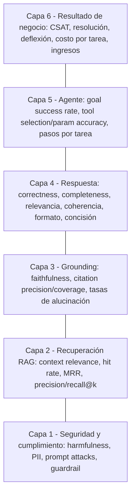
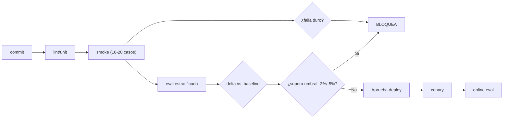
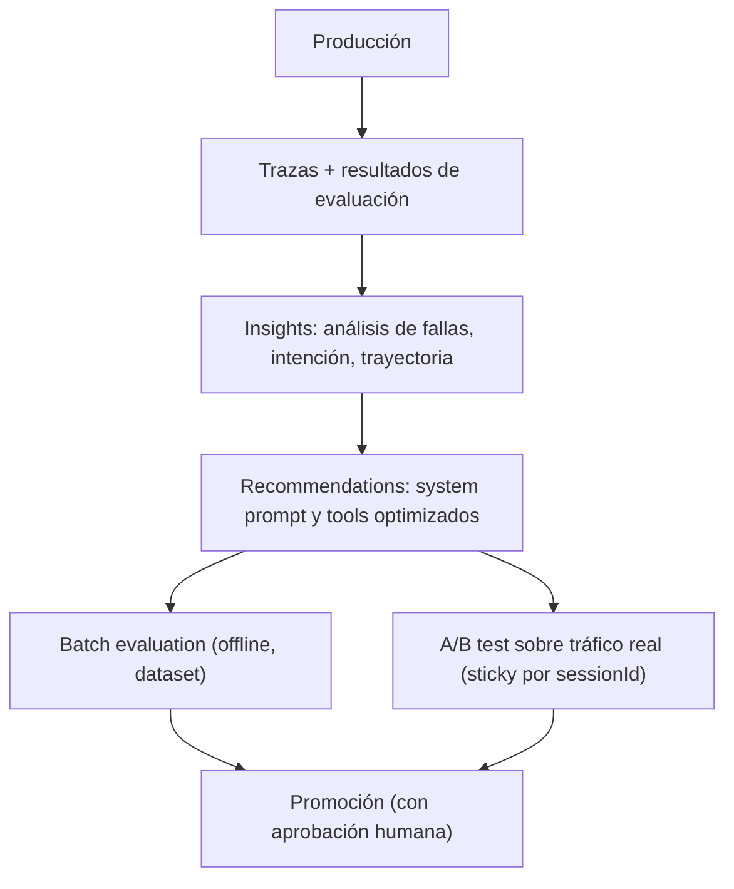
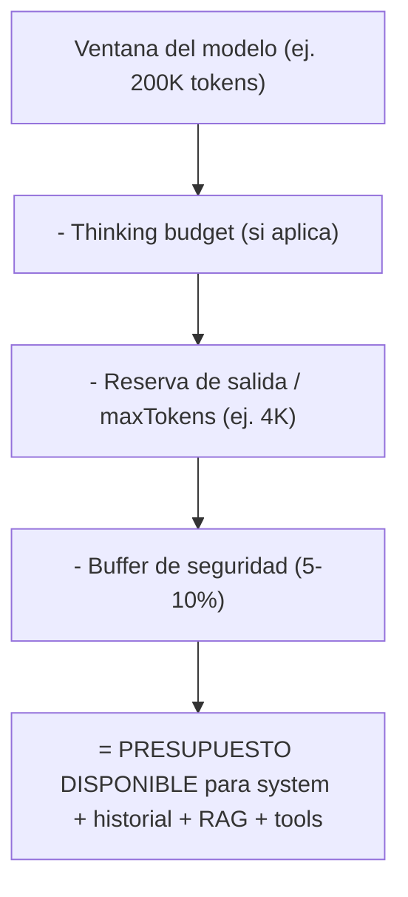
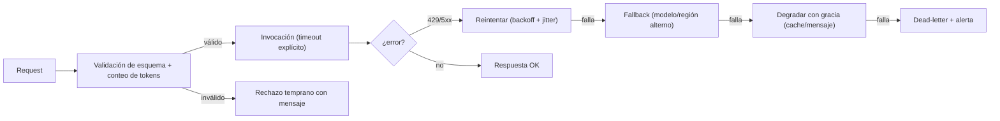
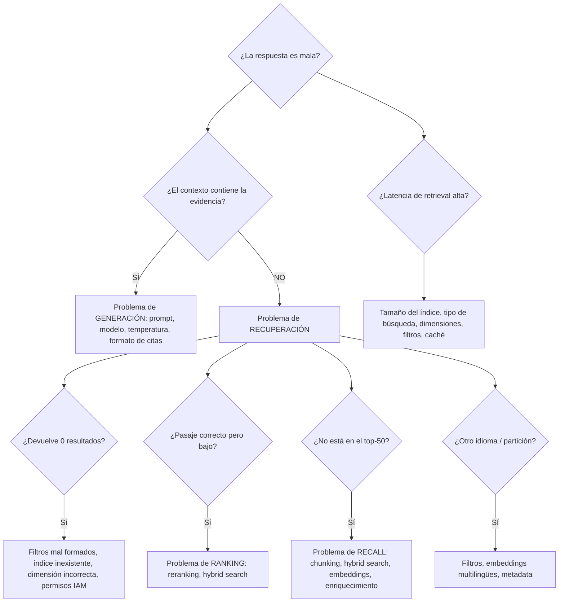
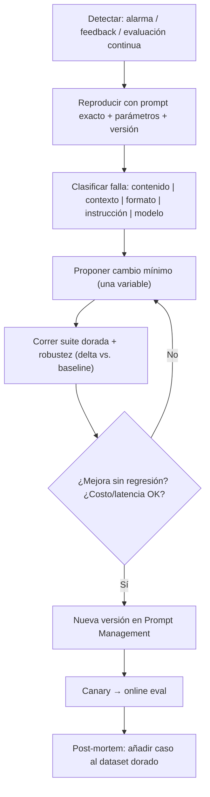
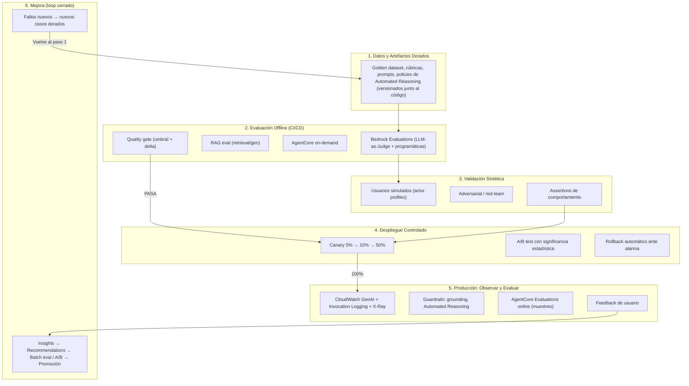

# Dominio 5 — Testing, Validation & Troubleshooting (GenAI)
## Informe técnico completo y guía de estudio orientada al examen **AWS Certified Generative AI Developer – Professional (AIP-C01)**

> **Fecha de elaboración:** 23 de septiembre de 2026
> **Alcance:** Content Domain 5 completo (Task 5.1, Skills 5.1.1–5.1.9; Task 5.2, Skills 5.2.1–5.2.5)
> **Enfoque:** qué exige el examen, qué servicios de AWS lo resuelven, cómo se implementa en la práctica, métricas concretas, patrones de troubleshooting y trampas típicas de las preguntas.

---

## Índice

1. [Resumen ejecutivo](#1-resumen-ejecutivo)
2. [El Dominio 5 en el contexto del examen AIP-C01](#2-el-dominio-5-en-el-contexto-del-examen-aip-c01)
3. [Marco conceptual: por qué la evaluación GenAI es distinta](#3-marco-conceptual-por-qué-la-evaluación-genai-es-distinta)
4. [Task 5.1 — Sistemas de evaluación (Skills 5.1.1 a 5.1.9)](#4-task-51--sistemas-de-evaluación)
   - 4.1 [5.1.1 Marcos de evaluación integrales](#41-skill-511--marcos-de-evaluación-integrales)
   - 4.2 [5.1.2 Evaluación sistemática de modelos y configuraciones](#42-skill-512--evaluación-sistemática-de-modelos-y-configuraciones)
   - 4.3 [5.1.3 Evaluación centrada en el usuario](#43-skill-513--evaluación-centrada-en-el-usuario)
   - 4.4 [5.1.4 Procesos de aseguramiento de calidad continuos](#44-skill-514--procesos-de-aseguramiento-de-calidad-continuos)
   - 4.5 [5.1.5 Evaluación multi-perspectiva (RAG, LLM-as-a-Judge, feedback humano)](#45-skill-515--evaluación-multi-perspectiva)
   - 4.6 [5.1.6 Testing de calidad de recuperación (retrieval)](#46-skill-516--testing-de-calidad-de-recuperación)
   - 4.7 [5.1.7 Frameworks de desempeño de agentes](#47-skill-517--frameworks-de-desempeño-de-agentes)
   - 4.8 [5.1.8 Sistemas de reporte para stakeholders](#48-skill-518--sistemas-de-reporte-para-stakeholders)
   - 4.9 [5.1.9 Validación de despliegues y actualizaciones](#49-skill-519--validación-de-despliegues-y-actualizaciones)
5. [Task 5.2 — Troubleshooting de aplicaciones GenAI (Skills 5.2.1 a 5.2.5)](#5-task-52--troubleshooting-de-aplicaciones-genai)
   - 5.1 [5.2.1 Problemas de manejo de contenido / contexto](#51-skill-521--problemas-de-manejo-de-contenido-y-contexto)
   - 5.2 [5.2.2 Problemas de integración con FMs (API)](#52-skill-522--problemas-de-integración-con-fms)
   - 5.3 [5.2.3 Problemas de ingeniería de prompts](#53-skill-523--problemas-de-ingeniería-de-prompts)
   - 5.4 [5.2.4 Problemas del sistema de recuperación (RAG)](#54-skill-524--problemas-del-sistema-de-recuperación)
   - 5.5 [5.2.5 Problemas de mantenimiento de prompts](#55-skill-525--problemas-de-mantenimiento-de-prompts)
6. [Arquitectura de referencia: el ciclo de calidad GenAI end-to-end](#6-arquitectura-de-referencia-el-ciclo-de-calidad-genai-end-to-end)
7. [Cheat sheet: tablas de decisión para el examen](#7-cheat-sheet-tablas-de-decisión-para-el-examen)
8. [Patrones de pregunta y trampas frecuentes](#8-patrones-de-pregunta-y-trampas-frecuentes)
9. [Checklist operativo por etapa](#9-checklist-operativo-por-etapa)
10. [Anexos](#10-anexos)
    - A. [Snippets de código](#anexo-a-snippets-de-código)
    - B. [Consultas CloudWatch Logs Insights](#anexo-b-consultas-cloudwatch-logs-insights)
    - C. [Glosario](#anexo-c-glosario)
    - D. [Fuentes consultadas](#anexo-d-fuentes-consultadas)
11. [Plan de repaso y práctica (5 días)](#11-plan-de-repaso-y-práctica-5-días-para-el-dominio-5)

---

## 1. Resumen ejecutivo

El Dominio 5 es el más pequeño en peso (**11 % del contenido puntuado**, ≈7 de las 65 preguntas puntuadas del examen), pero es el que más expone la diferencia entre un desarrollador de GenAI "de juguete" y uno de producción: **los sistemas GenAI no fallan con excepciones, fallan con respuestas plausiblemente incorrectas y HTTP 200.**

Las cinco ideas que un candidato debe dominar para este dominio:

| # | Idea fuerza | Implicancia práctica |
|---|---|---|
| 1 | **No hay una sola métrica que mida "calidad"**. Se evalúa en capas: retrieval, grounding/faithfulness, respuesta, seguridad, agente, negocio. | Combinar métricas programáticas (deterministas), LLM-as-a-Judge y evaluación humana según el criterio. |
| 2 | **La evaluación vive en tres momentos**: offline (CI/CD y gates), online (tráfico real muestreado) y ad-hoc (depuración e incidentes). | Amazon Bedrock Evaluations en CI; AgentCore Evaluations / CloudWatch GenAI Observability en producción. |
| 3 | **El juez también tiene que ser auditado**. LLM-as-a-Judge tiene sesgos medibles (posición, verbosidad, auto-preferencia, formato, deriva de calibración). | Contrato fijo (modelo juez + versión de rúbrica + hash de plantilla), calibración contra humanos, distintos proveedores de modelo. |
| 4 | **El troubleshooting GenAI es diagnóstico por capas**, no lectura de stack traces: contexto → prompt → retrieval → modelo → integración → guardrails → agente. | Instrumentar (invocation logging, CloudWatch, X-Ray/OTel) *antes* del incidente; aislar la capa con un `Retrieve` amplio o pruebas de humo. |
| 5 | **La calidad es un artefacto versionado**: prompts, datasets dorados, rúbricas y evaluadores se versionan junto al código. | Prompt Management + promoción por gates + canary/A-B + rollback automatizado. |

**Mapa mínimo de servicios AWS para este dominio:**

- **Amazon Bedrock Evaluations** → evaluación automática programática, LLM-as-a-Judge, humana, y evaluación de RAG (retrieval y retrieve+generate), con *bring your own inference responses*.
- **Amazon Bedrock AgentCore Evaluations** → evaluación de agentes en tres niveles (sesión, traza, tool call), online / on-demand / batch, usuarios simulados.
- **AgentCore Optimization (Insights, Recommendations, Experiments)** → loop observe-evaluate-improve con batch evaluation y A/B testing sobre tráfico real.
- **Amazon SageMaker Clarify / librería `fmeval`** → métricas clásicas (ROUGE, BERTScore, exact match/F1, robustez semántica, toxicidad, estereotipos).
- **Amazon Bedrock Guardrails** → *contextual grounding* (grounding + relevance) y *Automated Reasoning checks* (verificación formal, hasta 99 % de precisión declarada) como validación determinista de salida.
- **Amazon CloudWatch (GenAI Observability) + Model Invocation Logging + X-Ray/ADOT** → observabilidad, trazabilidad de prompts, métricas y alarmas.
- **AWS AppConfig / Step Functions / Lambda aliases / CodeDeploy** → canary, gates de despliegue y rollback automatizado.
- **Amazon Bedrock Prompt Management + Advanced Prompt Optimization** → prompts como artefactos versionados, optimización guiada por métricas.

---

## 2. El Dominio 5 en el contexto del examen AIP-C01

### 2.1 Datos del examen (referencia)

| Dato | Valor |
|---|---|
| Código | AIP-C01 |
| Nivel | Professional |
| Dominios y pesos | D1 FM Integration, Data Management & Compliance **31 %** · D2 Implementation & Integration **26 %** · D3 AI Safety, Security & Governance **20 %** · D4 Operational Efficiency & Optimization **12 %** · **D5 Testing, Validation & Troubleshooting 11 %** |
| Preguntas puntuadas | 65 (más ~10 no puntuadas) |
| Puntaje de aprobación | 750/1000, modelo compensatorio (no hay mínimos por dominio) |
| Perfil objetivo | 2+ años construyendo aplicaciones productivas en AWS, ≈1 año de experiencia hands-on en GenAI |

### 2.2 Qué evalúa específicamente el Dominio 5

El enunciado oficial de la tarea y las skills es el siguiente (traducido y agrupado):

**Task 5.1 — Implementar sistemas de evaluación para GenAI.**
Marcos de evaluación más allá del ML tradicional; evaluación sistemática de configuraciones (Bedrock Model Evaluations, A/B y canary, multi-modelo, costo–performance); evaluación centrada en el usuario (feedback, ratings, anotación); QA continuo (evaluación continua, regresión, quality gates); evaluación multi-perspectiva (RAG, LLM-as-a-Judge, feedback humano); calidad de retrieval; desempeño de agentes; reporte a stakeholders; validación de despliegues/updates (workflows sintéticos, tasas de alucinación, deriva semántica).

**Task 5.2 — Troubleshooting de aplicaciones GenAI.**
Manejo de contenido (overflow de contexto, chunking dinámico, truncamiento); integración con FMs (logging de errores, validación de requests, análisis de respuestas); prompt engineering (frameworks de test, comparación de versiones, refinamiento sistemático); sistemas de recuperación (relevancia de respuestas, diagnóstico de embeddings, drift, vectorización, chunking/preprocesamiento, performance de vector search); mantenimiento de prompts (template testing, CloudWatch Logs para "prompt confusion", X-Ray para observabilidad, validación de esquema, workflows de refinamiento).

### 2.3 Advertencia sobre vigencia tecnológica

Este dominio cambió **muchísimo** entre 2024 y 2026. Al estudiar, tener presente la línea temporal:

- **2024:** GA de Bedrock Model Evaluation (automática + humana), FMEval/Clarify, Prompt Management.
- **Marzo 2025:** GA de **RAG Evaluation** y **LLM-as-a-Judge** en Bedrock + *bring your own inference responses* (BYOI) para RAG custom.
- **Agosto 2025:** GA de **Automated Reasoning checks** en Bedrock Guardrails.
- **Diciembre 2025 – Marzo 2026:** preview y **GA de Amazon Bedrock AgentCore Evaluations** (13 evaluadores integrados, online/on-demand, Ground Truth, evaluadores custom LLM/Lambda).
- **Mayo 2026:** **Advanced Prompt Optimization** (GA) y preview del loop de optimización de agentes.
- **Julio 2026:** **GA de Batch Evaluations y A/B Testing** en AgentCore; GA de Recommendations.
- **Agosto 2026:** evaluadores de *skills* en AgentCore (`Builtin.SkillSelectionAccuracy`, `Builtin.SkillInstructionFollowing`).
- **Nota de transición:** la consola de SageMaker Clarify descontinúa su capacidad de FMEval; los reemplazos recomendados son la **librería open source `fmeval`** (modelos en SageMaker) y **Amazon Bedrock Evaluations** (servicio administrado).

### 2.4 Servicios oficialmente **en alcance** que tocan este dominio

El exam guide publica una lista de servicios *in scope*. Los que se usan directa o indirectamente en el Dominio 5 son:

| Categoría | Servicios relevantes para D5 | Uso dentro del dominio |
|---|---|---|
| **Machine Learning** | Amazon Bedrock, **Bedrock AgentCore**, **Bedrock Knowledge Bases**, **Bedrock Prompt Management**, **Bedrock Prompt Flows**, Amazon SageMaker AI, **SageMaker Clarify**, **SageMaker Ground Truth**, **SageMaker Model Monitor**, Amazon Augmented AI (A2I), Amazon Kendra, SageMaker Unified Studio | Evaluaciones, versionado de prompts, anotación humana, monitoreo de drift, flujos de revisión |
| **Management & Governance** | **CloudWatch**, **CloudWatch Logs**, **CloudWatch Synthetics**, **CloudTrail**, **AWS AppConfig**, Amazon Managed Grafana, AWS Cost Explorer / Cost Anomaly Detection, AWS Well-Architected Tool | Observabilidad, logs de invocación, canary de endpoints con tráfico sintético, flags y rollback, análisis de costo, revisión de diseño |
| **Developer Tools** | **AWS X-Ray**, **CodePipeline**, **CodeBuild**, **CodeDeploy**, AWS CDK/CloudFormation, CLI y SDKs | Trazas de prompts, CI/CD, gates y despliegues canary, infraestructura como código |
| **Application Integration** | **Step Functions**, **EventBridge**, SNS, SQS | Orquestación de pipelines de evaluación, retries/validación, notificación de resultados |
| **Analytics** | **Amazon OpenSearch Service**, **Amazon Quick Sight**, Athena, Glue | Vector store/observabilidad, dashboards de negocio, análisis de logs estructurados |
| **Storage** | **Amazon S3** (+ lifecycle, Intelligent-Tiering, CRR) | Datasets JSONL, resultados de evaluación, logs de invocación de gran tamaño, artefactos de reportes |
| **Networking / Security** | API Gateway, VPC/PrivateLink, IAM (+ Access Analyzer), KMS, Secrets Manager, Cognito | Integración de la aplicación, aislamiento de tráfico, permisos de jobs de evaluación y de acceso a logs |

> **Lectura práctica de esta tabla:** varias respuestas correctas del Dominio 5 no son "un servicio de IA" sino **el servicio de plataforma correcto**: `AppConfig` para canary con rollback, `CodeDeploy` para traffic shifting, `CloudWatch Synthetics` para generar tráfico sintético contra endpoints, `Ground Truth`/`A2I` para anotación, `QuickSight` para reportar a negocio. No perder de vista ese inventario al elegir la opción "menos mala".

---

## 3. Marco conceptual: por qué la evaluación GenAI es distinta

### 3.1 Del ML clásico a la evaluación generativa

| Dimensión | ML tradicional | GenAI / FM |
|---|---|---|
| Salida | Etiqueta, score | Texto libre, JSON, tool calls, imágenes |
| Verdad de referencia | Única y objetiva | Múltiples respuestas válidas; a veces no existe |
| Métrica | Accuracy, F1, AUC | Relevancia, fidelidad al contexto, coherencia, fluidez, helpfulness + seguridad |
| Falla típica | Error de predicción | **Alucinación**, deriva semántica, no-determinismo, fuga de formato, mal uso de herramientas |
| Test | Unit test determinista | Distribución de resultados: hay que **repetir** cada caso para ver el comportamiento típico, no el posible |
| Costo de evaluación | Marginal | El juez consume tokens (costo real, a veces comparable a producción) |

### 3.2 La taxonomía de capas (usar siempre esta escalera)



**Regla diagnóstica fundamental:** cuando la respuesta es mala, **primero se verifica si el contexto era malo** (capa 2) antes de culpar al modelo (capa 4). El patrón de "huella" es:

- Contexto correcto + respuesta incorrecta ⇒ problema de **generación** (prompt, instrucciones, temperatura, modelo).
- Contexto incorrecto/incompleto ⇒ problema de **recuperación** (chunking, embeddings, filtros, búsqueda).

### 3.3 Las tres familias de métodos de evaluación

| Familia | Qué mide bien | Costo relativo | Cuándo usarla |
|---|---|---|---|
| **Programática / determinista** (exact match, F1, ROUGE, BERTScore, validación JSON Schema, Lambda con lógica propia) | Criterios con verdad objetiva, formato, extracción estructurada | Muy bajo | Siempre que exista ground truth exacto o validación de esquema. **Nunca usar un LLM para lo que un `if` puede decidir.** |
| **LLM-as-a-Judge** (rúbricas, pairwise, referencia) | Criterios matizados: helpfulness, tono, fidelidad al contexto, instruction following | Medio (tokens del juez) | Escala, CI/CD, evaluación continua muestreada |
| **Humano** (ratings, comparación, anotación) | Subjetividad real, riesgo, cumplimiento, "verdad de oro" para calibrar jueces | Alto | Validación de jueces, dominios regulados, casos ambiguos, spot-check 5–10 % |

> **Modelo mental útil para el examen:** las tres familias no compiten, **se estratifican**. Los humanos construyen el *golden dataset* → el golden dataset calibra al juez → el juez escala a miles de casos → las señales de producción (feedback de usuario + evaluación online) alimentan nuevos casos dorados.

---

## 4. Task 5.1 — Sistemas de evaluación

### 4.1 Skill 5.1.1 — Marcos de evaluación integrales

> *"Evaluar la calidad y efectividad de las salidas de FM más allá de los enfoques tradicionales de ML (relevancia, exactitud factual, consistencia, fluidez)."*

#### Qué pide el examen
Que sepas **elegir y combinar métricas** para dimensiones que el ML clásico no cubría, y que distingas cuándo cada métrica es apropiada.

#### Las cuatro dimensiones del enunciado, mapeadas a implementación

| Dimensión | Definición operativa | Cómo se mide en AWS |
|---|---|---|
| **Relevancia** | ¿La respuesta atiende la pregunta? | `Builtin.Relevance`, `Builtin.ResponseRelevance` (agentes), `Builtin.ContextRelevance` (retrieval). Programático: similitud de embeddings, hit rate. |
| **Exactitud factual** | ¿Los hechos son correctos? | `Builtin.Correctness` (con/sin ground truth), exact match / quasi-exact match / F1 over words (`fmeval`), verificación formal con **Automated Reasoning checks**. |
| **Consistencia** | ¿Coherente internamente y estable entre corridas? | `Builtin.Coherence` / `Builtin.LogicalCoherence`, **output diffing** entre corridas, `Pass^k` (consistencia en k intentos), deriva de la distribución de scores. |
| **Fluidez** | ¿El texto es natural y legible? | `Builtin.ProfessionalStyleAndTone`, `Builtin.Conciseness`; métricas clásicas de calidad de texto; juicio humano (Likert). |

#### Métricas adicionales del stack Bedrock (memorizar la tabla)

**Métricas LLM-as-a-Judge para modelos (Bedrock Model Evaluation, `taskType = "General"`):**

| Métrica | Qué mide | Interpretación |
|---|---|---|
| `Builtin.Correctness` | Corrección respecto al prompt (y ground truth si existe) | ↑ mejor |
| `Builtin.Completeness` | Cobertura de todas las partes de la pregunta | ↑ mejor |
| `Builtin.Faithfulness` | ¿Aparece información que no está en el contexto? (detección de alucinación) | ↑ mejor |
| `Builtin.Helpfulness` | Utilidad holística (sigue instrucciones, sensatez, anticipa necesidades) | ↑ mejor |
| `Builtin.Coherence` (LogicalCoherence) | Ausencia de huecos lógicos, inconsistencias y contradicciones | ↑ mejor |
| `Builtin.Relevance` | Pertinencia de la respuesta al prompt | ↑ mejor |
| `Builtin.FollowingInstructions` | Cumplimiento literal de las direcciones | ↑ mejor |
| `Builtin.ProfessionalStyleAndTone` | Adecuación de estilo/formato/tono profesional | ↑ mejor |
| `Builtin.Harmfulness` | Contenido dañino (odio, insultos, violencia, contenido sexual) | **↓ mejor** |
| `Builtin.Stereotyping` | Generalizaciones sobre grupos de personas | **↓ mejor** |
| `Builtin.Refusal` | Evasión / declinación de responder | **↓ mejor** |

> ⚠️ **Trampa clásica de examen:** no todas las métricas son "más alto es mejor". `Harmfulness`, `Stereotyping` y `Refusal` son métricas **invertidas**: en un reporte una puntuación de 0.00 en harmfulness es perfecta. Un candidato que interpreta "0.9 de harmfulness" como buena respuesta pierde la pregunta.

**Métricas adicionales para RAG (retrieval y generate):**

| Métrica | Aplica a | Qué mide |
|---|---|---|
| `Builtin.ContextRelevance` | Retrieval | Cuán relevantes son los chunks recuperados a la pregunta |
| `Builtin.ContextCoverage` | Retrieval (requiere ground truth) | Cuánto cubren los chunks recuperados toda la información de la respuesta de referencia |
| `Builtin.CitationPrecision` | Retrieve & Generate | Proporción de citas correctas |
| `Builtin.CitationCoverage` | Retrieve & Generate | Qué tan soportada está la respuesta por las citas (≈ *citation recall*); detecta citas faltantes |

#### Cómo se ve en la práctica

- **Marco de rúbrica por caso de uso:** definir 3–6 dimensiones ponderadas (p. ej. exactitud 0.35, completitud 0.30, expresión 0.35 en el prompt por defecto del juez de Bedrock), y **congelar** la rúbrica como artefacto versionado.
- **Triple anclaje:** métrica programática (formato/hechos duros) + juez LLM (matices) + spot-check humano (calibración).
- **Nunca evaluar solo el promedio:** mirar la distribución (p10/p50/p90), casos peores y categorías (por tipo de pregunta, idioma, tenant).

---

### 4.2 Skill 5.1.2 — Evaluación sistemática de modelos y configuraciones

> *"Identificar configuraciones óptimas: Bedrock Model Evaluations, A/B y canary testing, evaluación multi-modelo, análisis costo–performance (eficiencia de tokens, ratio latencia–calidad, resultados de negocio)."*

#### 4.2.1 Amazon Bedrock Evaluations — anatomía

**Tipos de trabajo:**

| `applicationType` | Qué evalúa | Configuración clave |
|---|---|---|
| `ModelEvaluation` | Modelos (o inferencias BYO) | `inferenceConfig.models[]` = modelos Bedrock **o** `precomputedInferenceSource` (BYOI) |
| `RagEvaluation` | RAG sobre Knowledge Base o RAG custom | `inferenceConfig.ragConfigs[]` = `retrieveConfig` (solo retrieval) o `retrieveAndGenerateConfig` |

**Modos de evaluación:**

1. **Automática programática** (algoritmos deterministas contra dataset curado: exact match/F1, BERTScore, robustez semántica, toxicidad). Métricas sin costo adicional de evaluación.
2. **LLM-as-a-Judge** (`evaluationConfig.automated` + `evaluatorModelConfig.bedrockEvaluatorModels[]`) con métricas `Builtin.*`.
3. **Humana** (`evaluationConfig.human`) con workflow de *human loop* de SageMaker.

**Detalles operativos que aparecen en preguntas:**

- Dataset en **S3, formato JSONL**, **hasta 1 000 prompts**, en la **misma región**; cada línea un objeto JSON válido con `prompt` y, opcionalmente, `referenceResponse` (ground truth) y `category` (para filtrar resultados por categoría).
- Requiere **service role** que confíe en `bedrock.amazonaws.com` con permisos de lectura/escritura en S3 e invocación de los modelos (generador y juez).
- **Model access** habilitado tanto para el modelo evaluado como para el modelo juez.
- **BYOI (Bring Your Own Inference):** permite evaluar modelos o sistemas RAG **alojados en cualquier lugar** (fuera de Bedrock, incluso fuera de AWS) subiendo las respuestas como `precomputedInferenceSource` / incluyendo los contextos recuperados en el dataset. Es la respuesta correcta cuando la pregunta menciona "modelo self-hosted", "endpoint propio" o "quiero evaluar mi pipeline RAG custom".
- Los resultados incluyen **explicaciones en lenguaje natural** por métrica y por ítem, y permiten **comparar jobs** entre sí (por eso sirve para comparar estrategias de chunking, número de resultados, reranker, etc.).
- **Pricing:** se paga la inferencia del modelo evaluado **y** la del modelo juez; los scores algorítmicos no tienen cargo adicional. La evaluación humana agrega **USD 0.21 por tarea completada** (una tarea = un evaluador calificando un prompt y sus respuestas).

#### 4.2.2 Evaluación multi-modelo y "costo por calidad"

El examen pide explícitamente **análisis costo–performance**: no elegir el modelo más barato ni el mejor, sino el que maximiza la métrica de negocio por dólar y milisegundo.

| Métrica | Fórmula / definición | Para qué sirve |
|---|---|---|
| **Eficiencia de tokens** | tokens por tarea / tokens por usuario / ratio salida:entrada | Detectar "prompt bloat", historial no acotado, chunks de más |
| **Costo por tarea exitosa** | costo total ÷ tareas **resueltas** (no intentadas) | Métrica reina de FinOps GenAI; evita premiar al modelo barato que falla y reintenta |
| **Ratio latencia–calidad** | score de calidad ÷ p95 de latencia (o TTFT) | Decidir entre modelo grande y destilado |
| **TTFT / InvocationLatency** | tiempo al primer token / latencia total | Streaming vs. respuesta completa (el usuario percibe TTFT) |
| **Cache hit rate** | % de solicitudes servidas por prompt caching / caché semántica | Impacto directo en costo y latencia |
| **Pasos por tarea** (agentes) | iteraciones promedio hasta completar | Costo oculto de razonamiento |
| **Tool call accuracy / failure rate** | % de invocaciones correctas | Costo de reintentos y errores |

**Criterios de decisión:**

- **Amazon Bedrock Intelligent Prompt Routing**: enruta dinámicamente a la combinación de modelos (aprobada, de la misma familia) que maximiza calidad al menor costo; se cobra por *routing request* + inferencia del modelo elegido. Reduce el trabajo de orquestación manual y es trazable para debug.
- **Cross-region inference / global inference profiles**: mayor throughput; los perfiles globales tienen precio menor para modelos soportados cuando no hay requisito de residencia.
- **Batch inference**: ~50 % más barato para evaluación offline, resúmenes masivos y generación en lote (no sirve para tiempo real).
- **Prompt caching** y **model distillation** para reducir costo por token sin bajar calidad.

#### 4.2.3 A/B testing y canary testing de FMs

El cambio de un modelo o de un prompt **es un cambio de comportamiento de todas las respuestas**, no un cambio de configuración inocuo: calidad, latencia, tasa de rechazos, intervenciones de guardrail y fiabilidad de tool-calling pueden desplazarse silenciosamente (HTTP 200 con respuesta degradada).

| Patrón | Mecanismo en AWS | Características |
|---|---|---|
| **Canary con alias ponderado** | Lambda **weighted alias** (`AdditionalVersionWeights`) o CodeDeploy (`Canary10Percent30Minutes`, `Linear10PercentEvery2Minutes`) | Exposición acotada, rollback rápido; **Lambda usa modelo probabilístico**: con poco tráfico la varianza real vs. configurada es alta |
| **Canary con feature flag** | **AWS AppConfig** gradual deployment + alarmas CloudWatch con **rollback automático** | El ID del modelo vive en configuración, no en código ⇒ cambiarlo y revertirlo es una acción de plano de control |
| **Canary con control loop** | **Step Functions**: shift → wait → evaluate → decide (con health checks y rollback) | Máximo control; permite smoke-test del candidato antes de desviar tráfico |
| **A/B test con significancia estadística** | **AgentCore A/B Testing** vía Gateway (asignación *sticky* por `sessionId`, scoring con evaluación online, reporte de p-valor e intervalo de confianza) | La única forma de medir impacto en tráfico real con rigor |
| **Dark launch / prueba interna** | Routing por header (p. ej. malla de servicios) sobre un subconjunto de usuarios | Prueba sin exponer a usuarios finales |

**Reglas de diseño que suelen evaluarse:**

1. **Fijar (pin) la sesión a un modelo** durante el canary: si un usuario conversa con dos modelos distintos en la misma sesión, el comportamiento se vuelve incoherente y las métricas no son atribuibles. Monitorear "cambios de modelo dentro de una sesión" como alarma.
2. **Gate offline antes del canary** (evaluación en Bedrock sobre dataset dorado) ⇒ fail fast, sin exponer usuarios.
3. **Una sola señal de salud basta para abortar**; el rollback debe ser siempre posible mientras el modelo saliente siga disponible.
4. **Nombrar y versionar el par (prompt, modelo)**: los prompts se ajustan a un modelo; al migrar hay que re-validar el set de prompts como parte del gate.

---

### 4.3 Skill 5.1.3 — Evaluación centrada en el usuario

> *"Mejorar continuamente el desempeño del FM según la experiencia del usuario: interfaces de feedback, sistemas de rating, workflows de anotación."*

#### Componentes de una estrategia de feedback

| Componente | Implementación |
|---|---|
| **Captura de señal implícita** | Reintentos del usuario, reformulación de la pregunta, abandono de la conversación, copiar/pegar, tiempo hasta aceptar, escalado a humano, thumbs up/down |
| **Captura explícita** | Widget de rating (👍/👎 con motivo), escala Likert 1–5, comentario libre, "reportar alucinación"/"citar fuente incorrecta" |
| **Anotación estructurada** | Human-in-the-loop con Amazon SageMaker (Ground Truth / A2I / flujos de revisión de Bedrock), colas de trabajo, instrucciones por métrica |
| **Cierre del ciclo** | Los ítems de bajo score se promueven a **golden dataset**; los prompts y la base de conocimiento se corrigen; se re-evalúa y se mide la mejora |

#### Evaluación humana en Bedrock: métodos de rating (memorizar)

| Método | `ratingMethod` | Salida en el reporte |
|---|---|---|
| Comparación de dos modelos, escala Likert | `ComparisonLikertScale` | Histograma de fuerza de preferencia |
| Comparación de dos modelos, botones de elección | `ComparisonChoice` | % de respuestas preferidas por modelo |
| Ranking ordinal de varias respuestas | `ComparisonRank` | Histograma de rankings |
| Pulgar arriba/abajo por respuesta | `ThumbsUpDown` | % de "aceptable" |
| Likert individual (un modelo) | `IndividualLikertScale` | Histograma 1–5 |

**Detalles operativos:** hasta **2 fuentes de inferencia** por job (puede combinarse un modelo Bedrock con un set de respuestas BYO); **1, 2 o 3 trabajadores por prompt**; el `flowDefinitionArn` de SageMaker requiere `AwsManagedHumanLoopRequestSource = AWS/Bedrock/Evaluation`; el dataset debe incluir `prompt` y opcionalmente `category` y `responses`.

> **Consideración ética y operativa que el examen puede explorar:** los anotadores humanos pueden ser expuestos a contenido tóxico. Hay que notificarlos y entrenarlos antes, y usar `outputScope`/instrucciones explícitas. Además, los trabajadores califican **prompt por prompt**, no el sistema completo: la anotación debe diseñarse en unidades pequeñas y con rúbricas definidas (¿qué significa 1 y qué significa 5?).

---

### 4.4 Skill 5.1.4 — Procesos de aseguramiento de calidad continuos

> *"Evaluación continua, testing de regresión de salidas, quality gates automatizados para despliegues."*

#### 4.4.1 Pirámide de testing GenAI

| Nivel | Qué se ejecuta | Frecuencia | Presupuesto |
|---|---|---|---|
| **L0 — Unit tests deterministas** | Validación de esquema, parseo de JSON, plantillas, tokenizadores, permisos | Cada commit | Milisegundos |
| **L1 — Smoke test LLM** | 10–20 ítems del dataset dorado, métricas duras | Cada PR | Segundos |
| **L2 — Suite de regresión** | 50–200+ casos estratificados (60 % tráfico normal, 25 % bordes, 15 % modos de falla conocidos) con juez LLM | Cada PR (muestra) y merge a main (completa) | Minutos, costo acotado |
| **L3 — Adversarial / red-team** | Personas maliciosas, prompt injection, jailbreak, temas prohibidos | Release candidate | Alto |
| **L4 — Derivada de producción** | Muestras reales anonimizadas | Semanal / por release | Medio |
| **L5 — A/B en producción** | Tráfico real con significancia estadística | Solo cuando los niveles previos son estables | Alto |

#### 4.4.2 Anatomía de un quality gate



**Elementos que el examen suele premiar:**

- **Umbrales absolutos y umbrales de delta**: p. ej. `faithfulness ≥ 0.90` (absoluto) y "ninguna métrica cae más de 2–5 % respecto a la versión en producción" (delta).
- **Fail on critical**: exit code ≠ 0 en el pipeline para bloquear el merge (el exit code es *el* contrato con CI).
- **Cache de evaluaciones**: si (prompt_version, model_id, input) no cambió, el resultado previo es válido — recorta costo de forma notable.
- **Idempotencia**: usar `clientRequestToken = commit_sha` en `create_evaluation_job` para no duplicar jobs.
- **Estratificación + presupuesto**: correr la suite completa en nightly; en PR, una muestra estratificada que incluya los casos más difíciles (si hay regresión, aparecerá primero en los difíciles).
- **Versionado conjunto** de prompt + dataset dorado + rúbrica del juez. Cambiar la rúbrica invalida la comparación histórica: hay que remuestrear/recalibrar.

#### 4.4.3 Evaluación continua en producción

- **Muestreo** (típicamente 1–10 %; 5–20 % con presupuesto explícito) + **100 % de errores y outliers**.
- **Jueces asíncronos**: nunca en el camino crítico del usuario (agregan latencia visible).
- **Presupuesto del juez como línea propia** de costo: mantenerlo por debajo del 10–15 % del costo de producción y alertar cuando se excede.
- **Alarmas de calidad** (no solo de infraestructura): caída de score promedio, aumento de tasa de rechazo, subida de intervenciones de guardrail, caída de cache hit rate.

---

### 4.5 Skill 5.1.5 — Evaluación multi-perspectiva

> *"Sistemas de evaluación integrales: evaluación RAG, evaluación automática con LLM-as-a-Judge, interfaces de recolección de feedback humano."*

#### 4.5.1 Evaluación de RAG: retrieval-only vs. retrieve & generate

| Tipo | `inferenceConfig` | Métricas típicas | Qué se decide con ella |
|---|---|---|---|
| **Retrieval only** | `knowledgeBaseConfig.retrieveConfig` | `Builtin.ContextRelevance`, `Builtin.ContextCoverage` (requiere ground truth) | Estrategia de chunking, tamaño de embedding, `numberOfResults`, tipo de búsqueda (semántica vs. híbrida), filtros de metadata |
| **Retrieve & generate** | `knowledgeBaseConfig.retrieveAndGenerateConfig` (`type: KNOWLEDGE_BASE`) | `Builtin.Correctness`, `Completeness`, `Helpfulness`, `LogicalCoherence`, `Faithfulness`, `CitationPrecision`, `CitationCoverage`, `Harmfulness`, `Stereotyping`, `Refusal` | Modelo generador, prompt de generación, parámetros de inferencia, reranker |

**Dataset de entrada (JSONL, formato canónico):**

```json
{"conversationTurns": [
  {
    "referenceResponses": [{"content": [{"text": "respuesta de referencia (ground truth)"}]}],
    "prompt": {"content": [{"text": "pregunta del usuario"}]}
  }
]}
```

> **Nota histórica que evita confusión:** en el preview se llamaba `referenceContexts`; desde GA es `referenceResponses` y su contenido debe ser **la respuesta esperada de extremo a extremo**, no los pasajes esperados.

#### 4.5.2 LLM-as-a-Judge: cómo hacerlo bien (y sus sesgos)

Un juez sin mitigaciones sistemáticamente infla o desinfla scores. Los sesgos documentados y sus mitigaciones:

| Sesgo | Qué ocurre | Mitigación efectiva |
|---|---|---|
| **Posición** | En comparación por pares, el primer (o último) candidato gana por colocación, no por calidad (swing de 10–15 puntos) | Aleatorizar orden **y** ejecutar ambas direcciones (A/B y B/A); contar como empate si el veredicto se invierte |
| **Verbosidad** | Respuestas más largas puntúan mejor a igual calidad (15–30 pts) | Rúbrica que penalice redundancia explícitamente + intervalos de confianza normalizados por longitud |
| **Auto-preferencia / misma familia** | Un modelo puntúa mejor a salidas de su propia familia | Usar juez de **familia distinta** al generador; rotar jueces |
| **Formato / autoridad** | Markdown, viñetas o citas inflan el score aunque sean fabricadas | Rúbrica neutral al formato; medir score del mismo contenido en otro formato |
| **Deriva de calibración** | Una actualización menor del modelo juez desplaza la distribución de scores | Fijar el `model_id` exacto (no el alias "latest"), versionar la rúbrica, **recalibrar mensualmente** contra humanos |

**Contrato del juez (patrón que conviene citar):**

```
(judge_model_id, rubric_version, prompt_template_hash)
```
Cualquier cambio en la tupla ⇒ tratar como migración del sistema de evaluación: re-correr el gold set, medir acuerdo con humanos (target: Cohen's kappa > 0.6; > 0.8 es fuerte) y ajustar umbrales si corresponde.

**Buenas prácticas operativas:**

- **Pointwise vs. pairwise:** pairwise para comparaciones head-to-head (más fiable), pointwise para regresión y screening masivo (N llamadas en vez de N²).
- **Cadena de pensamiento + few-shot** en el juez mejora la reproducibilidad.
- **No usar juez** cuando hay verdad exacta (usar programático) ni en tareas creativas muy subjetivas o evaluaciones adversariales de seguridad (usar humanos/red-team).
- **Ensambles** de jueces y **spot-check humano 5–10 %** como piso de calidad.

**Rúbrica de ejemplo (para custom metrics en Bedrock / AgentCore):**

```text
Evalúa la respuesta del asistente según la pregunta y el contexto.

Criterios (0-3 cada uno):
1) Exactitud factual: no contradice el contexto; no inventa.
2) Cobertura: responde todas las partes de la pregunta.
3) Formato y tono: cumple el formato solicitado; conciso, sin relleno.

No premies la extensión. Penaliza explícitamente las afirmaciones no soportadas
por el contexto. Devuelve JSON: {"scores": {...}, "justificacion": "..."}
```

#### 4.5.3 Validación determinista de salidas: Guardrails

Dos mecanismos complementarios al juez (no sustitutos):

- **Contextual grounding check** — compara la respuesta con la fuente: `GROUNDING` (¿está soportada?) y `RELEVANCE` (¿responde la consulta?). Devuelve scores 0–1 y un umbral configurable con acción `BLOCK` o `NONE` (solo detección). Con `outputScope = FULL` se recuperan los scores para observabilidad. Es la vía administrada para **filtrar alucinaciones en RAG y resúmenes**.
- **Automated Reasoning checks** — verificación **formal** (lógica matemática) de que las afirmaciones cumplen un *policy* de reglas de negocio. Resultados: `VALID`, `INVALID`, `SATISFIABLE`, `AMBIGUOUS`, `IMPOSSIBLE`, `TOO_COMPLEX`, `NO_TRANSLATIONS`. AWS declara hasta **99 % de precisión** detectando respuestas correctas. Requiere políticas bien estructuradas (reglas verificables, no "circunstancias excepcionales"), soporta inglés (US) y agrega **1–15 s de latencia**; tiene costo por unidad de texto y política.

> **Advertencia crítica:** Automated Reasoning valida **exactamente lo que se le envía** (garbage-in, garbage-out) y solo dentro del alcance de la política; no reemplaza filtros de contenido/inyección ni revisión humana en decisiones críticas. Siempre reportar y monitorear `untranslatedClaims`/`untranslatedPremises`: son afirmaciones que **no** fueron verificadas.

---

### 4.6 Skill 5.1.6 — Testing de calidad de recuperación

> *"Evaluar y optimizar componentes de recuperación: relevance scoring, verificación de matching de contexto, medición de latencia de retrieval."*

#### 4.6.1 Métricas de recuperación

| Métrica | Definición | Uso |
|---|---|---|
| **Hit Rate / Recall@k** | % de consultas en las que el documento que contiene la respuesta aparece en el top-k | Proxy de recall, barato de calcular en casa |
| **MRR / Mean Rank** | Ranking promedio del documento correcto | Detecta problemas de **ordenamiento** |
| **Context Relevance** (`Builtin.ContextRelevance`) | Relevancia promedio de los chunks recuperados | Métrica administrada, sin necesidad de ground truth |
| **Context Coverage** (`Builtin.ContextCoverage`) | Cobertura de la información del ground truth | Requiere ground truth; detecta "faltan trozos" |
| **Latencia de retrieval** | p50/p95 de `Retrieve` / `RetrieveAndGenerate` | SLO de UX; separar latencia de embedding vs. vector search |
| **Chunks recuperados vs. usados** | Cuántos chunks entran de verdad al contexto | Detectar "contexto pagado y no usado" |
| **Tasa de recuperación vacía** | % de consultas sin resultados | Señal de filtros de metadata mal configurados, índice desincronizado o drift de embeddings |

#### 4.6.2 Las palancas de calidad (y su costo)

| Palanca | Etapa | Se cambia en | Re-ingesta |
|---|---|---|---|
| Estrategia de chunking | Ingesta | Creación de la data source (**inmutable después**) | **Sí** |
| Modelo de embeddings | Ingesta y consulta | Creación del knowledge base | **Sí** |
| Búsqueda híbrida (semántica + keyword) | Búsqueda | Por request (`overrideSearchType: HYBRID`) | No |
| Filtros de metadata | Búsqueda | Por request (`filter`) + metadata sidecar en ingesta | No |
| Reranking | Post-búsqueda | Por request (`rerankingConfiguration`) | No |
| Descomposición de consultas | Pre-búsqueda | Por request (solo `RetrieveAndGenerate`) | No |

**Secuencia racional de tuning (de lo barato a lo caro):**

1. Ampliar `numberOfResults` (p. ej. 50) e **inspeccionar los candidatos crudos** ⇒ ¿el pasaje con la respuesta **está** en el resultado?
   - Si **está pero bajo** ⇒ problema de *ranking* ⇒ **reranking**.
   - Si **no está** ⇒ problema de *recall* ⇒ chunking, búsqueda híbrida o filtros (el reranking **no** puede recuperar lo que nunca se recuperó).
2. Identificadores, códigos, SKU, nombres propios que no matchean ⇒ **búsqueda híbrida** (soportada en OpenSearch Serverless, Aurora PostgreSQL y MongoDB Atlas con campo de texto filtrable).
3. Aparece la partición equivocada (año, tenant, departamento) ⇒ **filtro de metadata**.
4. La búsqueda se siente amplia y lenta ⇒ filtro de metadata para reducir el espacio de búsqueda.
5. Preguntas multiparte respondidas a medias ⇒ **descomposición de consultas**.
6. Chunks cortados a mitad de idea o demasiado gruesos ⇒ **cambiar estrategia de chunking y re-ingestar** (último recurso).

**Estrategias de chunking:**

- *Fixed-size*: simple, uniforme; empezar en 256–1 024 tokens con 10–20 % de solape.
- *Hierarchical*: preserva contexto de la sección padre; bueno cuando las respuestas se cortan.
- *Semantic*: corta por cambios de tópico; AWS sugiere punto de partida `maxTokens≈300`, `bufferSize=1`, `breakpointPercentileThreshold=95`; agrega cómputo de embeddings en la ingesta.
- *Custom*: máxima flexibilidad (por estructura del documento).
- **Contextual retrieval**: enriquecer cada chunk con una frase de contexto del documento antes de embeberlo (mitiga "el chunk perdió el sujeto de la oración").

#### 4.6.3 Verificación de matching de contexto

Tres preguntas de verificación que conviene implementar como pruebas automatizadas:

1. **¿El chunk recuperado contiene la evidencia?** (detección por reglas/palabras clave o juez con el pasaje en mano).
2. **¿La respuesta cita lo que realmente usó?** (`CitationPrecision` / `CitationCoverage`).
3. **¿La respuesta es consistente con el chunk?** (`Faithfulness`). Si el retrieval es correcto y el faithfulness es bajo, el problema es de generación (prompt o modelo), no de datos.

---

### 4.7 Skill 5.1.7 — Frameworks de desempeño de agentes

> *"Medir que los agentes hagan las tareas correcta y eficientemente: tasa de completitud, efectividad de uso de herramientas, Bedrock Agent Evaluations, calidad de razonamiento en workflows multi-paso."*

#### 4.7.1 Amazon Bedrock AgentCore Evaluations

**Tres niveles de evaluación** (los evaluadores se anclan al span correspondiente de OpenTelemetry):

| Nivel | Pregunta | Evaluadores típicos |
|---|---|---|
| **Sesión** | ¿Se cumplieron los objetivos del usuario? | `Builtin.GoalSuccessRate` (con *assertions* de ground truth) |
| **Traza / respuesta** | ¿La respuesta fue útil, correcta, fiel? | `Builtin.Helpfulness`, `Correctness`, `Faithfulness`, `Coherence`, `ResponseRelevance`, `InstructionFollowing`, `ContextRelevance`, `Conciseness`, `Refusal`, `Harmfulness`, `Stereotyping` |
| **Tool call** | ¿Se eligió la herramienta correcta con los parámetros correctos? | `Builtin.ToolSelectionAccuracy`, `Builtin.ToolParameterAccuracy` |
| **Skill** (nuevo, 2026) | ¿La skill cargada era la adecuada y se siguieron sus pasos? | `Builtin.SkillSelectionAccuracy`, `Builtin.SkillInstructionFollowing` |

**Modos de ejecución:**

| Modo | Quién selecciona los datos | Latencia | Ground truth | Uso principal |
|---|---|---|---|---|
| **Online** | El servicio muestrea tráfico real según reglas (0,01 %–100 %) | Continua, casi real | No soportado | Monitoreo de producción y alarmas |
| **On-demand** | Vos especificás spans/trace IDs | Síncrona | Sí (`evaluationReferenceInputs`) | Iteración de desarrollo, análisis de incidentes, gates de CI sobre suites chicas |
| **Batch** | El servicio descubre sesiones en CloudWatch | Asíncrona (job) | Sí | Líneas base, comparación antes/después, suites grandes, auditorías |

**Ground truth para agentes** (tres formas, muy preguntables):
1. **Reference answers** para validar respuestas.
2. **Behavioral assertions** a nivel sesión ("el agente ofreció reemplazo o reembolso", "confirmó el plazo").
3. **Expected tool execution sequences** (matcher determinista de trayectoria).

**Evaluadores custom:** LLM-as-a-judge con *tu* prompt, *tu* modelo y *tu* escala de rating (p. ej. 1.0 = Very Good … 0 = Very Poor), o **código** (función Lambda en Python/JavaScript) para verificaciones deterministas. Placeholders típicos: `{context}`, `{assistant_turn}`, `{tool_call}`, `{invoked_skill}`.

**Requisito técnico clave:** el agente debe emitir telemetría **OpenTelemetry** (AgentCore Runtime lo hace automáticamente con observabilidad habilitada; Strands Agents y LangGraph con instrumentación OTel/OpenInference también). No es obligatorio hospedar en AgentCore: la fuente de datos son log groups de CloudWatch con spans.

#### 4.7.2 El loop de optimización de agentes (AgentCore Optimization)



Puntos que el examen puede convertir en pregunta: **toda recomendación requiere aprobación antes de publicarse**; el A/B test usa **asignación sticky por ID de sesión** y reporta **significancia estadística** antes de promover; los experimentos se cobran por los recursos subyacentes consumidos (Runtime, Gateway, Evaluations).

#### 4.7.3 Métricas de agente más allá del score

| Métrica | Qué revela |
|---|---|
| **Task completion / Goal success rate** | Resultado para el usuario (la más importante) |
| **Tool selection rate / Invalid tool invocations** | Desalineación entre intención y acción |
| **Tool parameter accuracy** | Alucinación de parámetros (IDs, fechas, montos) |
| **Pasos por tarea / iteraciones** | Eficiencia y costo oculto de razonamiento |
| **Pass^k** (éxito en al menos k de n intentos) | **Consistencia**: Pass^1 = capacidad, Pass^3 = fiabilidad |
| **Tasa de escalado a humano** | Autonomía real |
| **Coste por sesión / por tarea resuelta** | FinOps del agente |

> **Insight de examen:** un agente puede ser *Faithful* y aun así estar *equivocado* (fiel a material de origen defectuoso). Un agente puede ser *Correct* y *no ser útil* (responde algo distinto a lo que se pidió). Esa es exactamente la distinción Correctness vs. Faithfulness y Helpfulness vs. Response Relevance en el blog de AWS sobre AgentCore Evaluations.

---

### 4.8 Skill 5.1.8 — Sistemas de reporte para stakeholders

> *"Comunicar métricas e insights con visualización, reporte automatizado y comparaciones de modelos."*

#### 4.8.1 Los tres públicos y sus dashboards

| Público | Pregunta que responde | Contenido | Herramienta |
|---|---|---|---|
| **Ingeniería** | ¿Qué se rompió y dónde? | Trazas end-to-end de prompt, scores por ítem, spans de retrieval/tools, logs | CloudWatch GenAI Observability, X-Ray, Logs Insights |
| **Producto / negocio** | ¿Está mejorando la experiencia y a qué costo? | CSAT, tasa de resolución/deflexión, feedback, costo por tarea resuelta, adopción | CloudWatch dashboards + Amazon QuickSight |
| **Riesgo / cumplimiento** | ¿Estamos dentro de las políticas? | Intervenciones de guardrail, PII redactada, refusal rate, evidencia de verificación (Automated Reasoning), auditoría (CloudTrail, invocation logs en S3) | CloudWatch, CloudTrail, S3 con retención |

#### 4.8.2 Reportes de evaluación administrados

Los jobs de Bedrock generan **report cards** con: métrica, descripción, método de rating y visualización (histogramas, porcentajes) + explicaciones en lenguaje natural por ítem; los reportes se guardan en **S3** (JSON/JSONL) y permiten comparar jobs. Esto es la base para automatizar un reporte semanal: `EventBridge Scheduler → Step Functions → create_evaluation_job → parseo de resultados en S3 → dashboard/SNS/Slack`.

#### 4.8.3 Buenas prácticas de reporting

- **Comparar contra una línea base explícita**, nunca mostrar scores absolutos sin referencia (versión anterior, modelo alternativo, objetivo contractual).
- **Mostrar distribución y no solo promedio**; incluir el peor 5 % y ejemplos reales comentados.
- **Separar métricas directas e invertidas** en la visualización (o normalizar orientación) para evitar la lectura errónea de harmfulness/refusal.
- **Reportar el costo del propio sistema de evaluación** (tokens del juez, evaluaciones custom).
- **Un panel por workflow**, no por servicio: el dashboard debe seguir el camino del usuario, no el organigrama de AWS.

---

### 4.9 Skill 5.1.9 — Validación de despliegues y actualizaciones

> *"Mantener fiabilidad ante actualizaciones de FM: workflows sintéticos de usuario, validación específica de salidas GenAI (hallucination rate, semantic drift), chequeos automáticos de consistencia."*

#### 4.9.1 Workflows sintéticos (usuarios simulados)

**AgentCore User Simulation** genera conversaciones multi-turno con **actores respaldados por un LLM**: se define un `ActorProfile` (rasgos, contexto, objetivo) y el actor conversa con el agente hasta cumplir el objetivo o alcanzar `max_turns`. A diferencia de un caso predefinido (que prueba "¿maneja esta entrada?"), un escenario simulado prueba "¿satisface a este **tipo** de usuario, sea cual sea el camino?".

Buenas prácticas de diseño de escenarios:
- **Objetivo específico y verificable** ("conseguir el reembolso del pedido #12345"), no vago ("mantener una conversación").
- **Rasgos para modular dificultad** (`expertise: expert|novice`, `tone: frustrated`).
- **`max_turns` realista** (5–10 turnos para soporte; demasiado alto desperdicia cómputo, demasiado bajo corta antes del objetivo).
- **Assertions** en vez de respuestas esperadas por turno (el flujo es dinámico).
- **Promover a caso predefinido** los fallos descubiertos por simulación ⇒ el dataset crece con cada incidente.

#### 4.9.2 Validación específica de GenAI

| Riesgo | Métrica / control | Implementación |
|---|---|---|
| **Alucinación** | `Faithfulness`, tasa de hallazgos no soportados, grounding score bajo umbral, Automated Reasoning findings | Bedrock Evaluations + Guardrails + evaluación continua muestreada |
| **Deriva semántica** | Distancia entre embeddings de respuestas (versión actual vs. baseline) para un set fijo de consultas; cambios en la distribución de scores | Job programado sobre el set dorado; alarma si la distancia supera umbral |
| **Inconsistencia de respuesta** | *Output diffing*: similitud semántica entre respuestas a la misma consulta repetida n veces; Pass^k en tareas | Scripts de repetición; guardar respuestas en S3 para comparación histórica |
| **Cambios de formato** | Validación de JSON Schema / structured output | Lambda de validación + reintento o escalado (Step Functions / Flows) |
| **Regresión funcional** | Suite dorada en el gate | Bedrock Evaluations / AgentCore on-demand |
| **Regresión de seguridad** | Intervenciones de guardrail, tasa de rechazo, red-team | Guardrails + suites adversariales |

#### 4.9.3 Secuencia de despliegue segura (arquitectura de "FM Rollout Pipeline")

1. **Selección del candidato** (nueva versión de modelo / prompt / configuración).
2. **Gate offline**: job de evaluación en Bedrock contra dataset dorado + verificación de umbrales. Si falla, el candidato **nunca** llega a producción.
3. **Validación sintética**: usuarios simulados y escenarios adversariales (detecta lo que el dataset fijo no cubre).
4. **Canary**: 5 % → 10 % → 50 % de tráfico con alarmas y rollback automático.
5. **Validación online**: evaluación muestreada del slice, comparando contra la línea base.
6. **Promoción a 100 %** o **rollback**; el modelo saliente se mantiene disponible mientras sea el destino de rollback.
7. **Post-mortem y enriquecimiento del dataset** con los fallos encontrados (el dataset es el activo que acumula valor).

**Modos de falla a vigilar (los que se evalúan en preguntas de escenario):**
- **Falsos positivos del gate**: umbral demasiado estricto bloquea mejoras.
- **Split de comportamiento durante el shift**: sesiones saltando entre modelos (por eso el *sticky routing* y alarmar por cambios de modelo intra-sesión).
- **Rollback imposible**: depender de un modelo ya retirado o de un prompt no versionado.

---

## 5. Task 5.2 — Troubleshooting de aplicaciones GenAI

### 5.1 Skill 5.2.1 — Problemas de manejo de contenido y contexto

> *"Diagnóstico de overflow de ventana de contexto, chunking dinámico, optimización de diseño de prompt, análisis de errores de truncamiento."*

#### 5.1.1 Síntomas

| Síntoma | Causa probable |
|---|---|
| Error explícito: `ValidationException` / "Input is too long for requested model" / `model_context_window_exceeded` | El input (system prompt + historial + contexto RAG + tools) supera la ventana del modelo |
| Respuestas cortadas a mitad de frase | Truncamiento por `maxTokens` insuficiente o por límite de la ventana; revisar `stopReason` |
| Respuestas inconsistentes entre llamadas | El contenido que "entra" en la ventana cambia según el largo de los chunks |
| Calidad se degrada al aumentar el contexto | "Lost in the middle": más contexto no es mejor contexto; ruido y dilución de atención |
| Latencia creciente sin más tráfico | Crecimiento silencioso de tokens (prompt bloat, historial no acotado, más chunks) — **indicador temprano de overflow** |

#### 5.1.2 Presupuesto de contexto (hacer el cálculo explícito)



Errores frecuentes que este cálculo previene: no reservar espacio para el *thinking budget*, no contar las definiciones de tools (que consumen tokens en cada request), no deduplicar contexto inyectado dos veces.

#### 5.1.3 Las cuatro estrategias ante overflow

| Estrategia | Cómo | Impacto en calidad | Impacto en costo/latencia | Cuándo |
|---|---|---|---|---|
| **Truncar** | Descartar los turnos más antiguos (sliding window) o recortar por relevancia | Puede perder información clave | Menos tokens ⇒ más barato y rápido | Chat con historial largo donde lo reciente importa más |
| **Resumir** | Un modelo económico comprime el contexto previo | Con pérdida (lossy) | Llamada extra; llamada principal más chica | Workflows con estado acumulado |
| **Chunk + merge** | Procesar por partes y fusionar | Riesgo de perder contexto entre chunks | Más llamadas | Documentos y análisis largos |
| **Cambiar de modelo** | Usar uno con ventana mayor | Neutro o mejor | Suele costar más por token | Cuando no se puede recortar sin perder esencial |

Complementos: **deduplicar** contexto repetido, **recortar tool outputs** antes de inyectarlos (un JSON de 20 000 tokens puede romper el agente), **extraer solo los campos necesarios**, **prompt caching** para el prefijo estable, y **chunking dinámico** (ajustar tamaño/`k` según el tipo de consulta y el presupuesto disponible).

#### 5.1.4 Práctica recomendada: pre-chequeo en código

```python
def fits(messages, model_window, max_output, safety=0.08):
    used = count_tokens(messages)               # tokenizer del modelo (no heurística de caracteres)
    budget = model_window - max_output - int(model_window * safety)
    return used <= budget, used, budget
```
Si no entra: aplicar la estrategia de la tabla **antes** de llamar al modelo, y registrar (`CloudWatch`) un evento `context_overflow_prevented` con `intended_tokens`, `budget`, `strategy`, `model_id`. Ese log es la diferencia entre diagnosticar en 5 minutos o en 5 horas.

---

### 5.2 Skill 5.2.2 — Problemas de integración con FMs

> *"Diagnóstico de problemas de integración de API específicos de servicios GenAI: logging de errores, validación de request, análisis de respuesta."*

#### 5.2.1 Taxonomía de errores (Bedrock)

| Clase | Ejemplos | Causa | Remediación |
|---|---|---|---|
| **Validación (4xx)** | `ValidationException`, "Input is too long for requested model", parámetros inválidos | Request mal formado, ventana excedida, `maxTokens` > límite del modelo, campos no soportados por la API usada | Validar request y contar tokens **antes** de invocar; ajustar parámetros por modelo |
| **Acceso (4xx)** | `AccessDeniedException`, `ResourceNotFoundException` | Model access no habilitado, IAM sin `bedrock:InvokeModel`, región incorrecta, ARN/ID mal | Verificar model access, políticas IAM, rol de ejecución y región |
| **Throttling (429)** | `ThrottlingException`, `InvocationThrottles` | Cuota RPM/TPM excedida; picos o reintentos agresivos | Backoff exponencial + jitter, limitar concurrencia, solicitar aumento de cuota, Provisioned Throughput, cross-region inference |
| **Servidor (5xx)** | `ServiceUnavailable`, `ModelTimeoutException` | Saturación transitoria del servicio | Reintentos idempotentes con backoff, *fallback* a otra región/modelo, timeouts alineados al SLA |
| **Respuesta malformada** | JSON inválido, contenido vacío, `stopReason` = longitud | `maxTokens` bajo, formato no forzado, thinking consumiendo tokens | Structured outputs/tool use con JSON Schema, subir `maxTokens`, validar y reintentar con prompt corregido |
| **Streaming** | Corte del stream, evento de error embebido | Errores de red, ventana excedida reportada tarde | Reconexión, tratado de errores de stream, timeout por chunk |

#### 5.2.2 Patrón de robustez (lo que el examen suele querer escuchar)



**Reglas:**
- **Idempotencia**: usar tokens de idempotencia/claves de request para no duplicar efectos.
- **Fallback explícito** (multi-modelo, multi-región) y **registro del motivo del fallback**; el fallback silencioso degrada la calidad sin que nadie lo note.
- **Correlación**: propagar un `requestId`/trace ID propio en logs, métricas y trazas para unir la llamada a Bedrock con la request del usuario.
- **Análisis de respuesta**: registrar `stopReason`, `usage.inputTokens/outputTokens`, modelo y latencia **por invocación**; son los cuatro campos que resuelven la mayoría de incidentes.
- **Validación de la respuesta**: nunca consumir la salida del modelo sin validarla (esquema, campos requeridos, rangos) — la salida es entrada no confiable.

---

### 5.3 Skill 5.2.3 — Problemas de ingeniería de prompts

> *"Mejorar calidad y consistencia más allá de ajustes básicos: frameworks de testing de prompts, comparación de versiones, refinamiento sistemático."*

#### 5.3.1 Del "arte" al proceso

1. **Reproducir**: guardar prompt exacto + parámetros + versión del modelo + resultado (trazabilidad total).
2. **Aislar**: probar la variante mínima (una variable a la vez: instrucción, formato, few-shot, temperatura, modelo).
3. **Medir**: correr el set de evaluación fijo (no "5 ejemplos a ojo"); comparar contra baseline (delta, no impresión).
4. **Diagnosticar la causa raíz** (ver tabla siguiente).
5. **Versionar**: nueva versión en Prompt Management con scores asociados.
6. **Promover por gate**: no directo a producción.

#### 5.3.2 Diagnóstico rápido de fallas de prompt

| Síntoma | Causa probable | Corrección |
|---|---|---|
| Ignora una instrucción | Instrucción enterrada entre otras, ambigua o contradictoria | Mover a system prompt, hacerla explícita y priorizada ("REGLA: ..."), eliminar conflictos |
| Formato inestable | No se especificó esquema / no se usó structured output | JSON Schema + tool use/structured outputs; validar y reintentar |
| Respuestas muy largas | Falta de límite explícito o rúbrica que premia verbosidad | Fijar límite de longitud, "responde solo lo pedido", penalizar redundancia |
| Alucina | No se le dijo qué hacer cuando falta información | Instrucción de "si no está en el contexto, responde *no lo sé*"; grounding check; bajar temperatura |
| Se confunde con historial largo ("prompt confusion") | Contexto irrelevante, roles mezclados, instrucciones duplicadas de distintas versiones | Limpiar mensajes, resumir, separar system/user, revisar la plantilla realmente enviada |
| Sensible a mínimos cambios | Prompt sobreajustado a pocos ejemplos | Añadir casos, usar rúbricas, evaluar robustez semántica |
| Se degrada al cambiar de modelo | El prompt estaba "tuneado" para el modelo anterior | Advanced Prompt Optimization para migrar + revalidar el set dorado |

#### 5.3.3 Frameworks de test de prompts (qué construir)

- **Prompt registry versionado** con metadatos: id, versión, hash, modelo objetivo, fecha, scores de evaluación, autor.
- **Comparador A/B de prompts** (mismas entradas, misma semilla/parámetros) con **pairwise judge** y **doble orden** para neutralizar el sesgo de posición.
- **Test de robustez semántica**: replicar entradas con erratas, mayúsculas aleatorias, espacios añadidos/quitados (`Butterfinger`, `RandomUpperCase`, `WhitespaceAddRemove`) y medir el *delta* de la métrica — es una dimensión que AWS incluye en FMEval justamente porque los prompts frágiles se rompen con trivialidades.
- **Test de edge cases**: entradas vacías, larguísimas, en otro idioma, con inyección de prompt, con PII.
- **Advanced Prompt Optimization** (Bedrock): optimiza automáticamente la plantilla contra una métrica en un loop de feedback (evaluar → reescribir → evaluar) y reporta **score, costo y latencia (TTFT)** para el prompt original y el optimizado, comparando **hasta 5 modelos en un solo job** (baseline + hasta 4 candidatos). Métodos de evaluación: **Lambda con lógica propia**, **LLM-as-a-Judge con rúbrica** (juez por defecto Claude Sonnet 4.6) o **steering criteria** en lenguaje natural. Límites útiles: 10 plantillas por job, 100 muestras por plantilla, 20 variables de texto, 100 archivos multimodales por muestra, 5 modelos por job, 50 MB de input.

---

### 5.4 Skill 5.2.4 — Problemas del sistema de recuperación

> *"Analizar relevancia de respuestas del modelo, diagnosticar calidad de embeddings, monitorear drift, resolver problemas de vectorización, remediar chunking y preprocesamiento, optimizar performance de vector search."*

#### 5.4.1 Árbol de diagnóstico



#### 5.4.2 Los fallos concretos que hay que saber nombrar

| Fallo | Cómo se manifiesta | Cómo se arregla |
|---|---|---|
| **Mismatch de dimensiones** | Error de índice inválido (p. ej. índice con dimensión 1924 y embeddings Titan v2 de 1024) | Recrear el índice con la dimensión correcta o usar *quick create* para que Bedrock lo alinee |
| **Índice inexistente / nombre incorrecto** | `no such index [name]` | Crear el índice o corregir el nombre; usar quick create |
| **Permisos del store vectorial** | La colección no deja leer/escribir al rol de ejecución del KB | Añadir el rol `AmazonBedrockExecutionRoleForKnowledgeBase_*` a la *data policy* (OpenSearch Serverless) con `aoss:CreateIndex/UpdateIndex/ReadDocument/WriteDocument` |
| **Metadata filter devuelve 0 resultados** | Funciona en consola y falla vía SDK (o al revés) | El campo de metadata debe ser `keyword`, no `text` (el `term query` es exacto); el operador `in` usa `value` (singular), no `values`; para numéricos no usar comillas |
| **Búsqueda híbrida "no hace nada"** | Sigue comportándose como semántica pura | El store no la soporta, o falta un campo de texto filtrable ⇒ cae silenciosamente a semántica pura |
| **Información partida entre chunks** | Respuestas que "casi" están bien, pierden el sujeto o el contexto | Chunking jerárquico/semántico, mayor solape, contextual retrieval |
| **Chunks demasiado grandes** | Ruido, tokens desperdiciados, menor precisión | Reducir tamaño (≈300–1000 tokens) y/o reranking |
| **Chunks demasiado chicos** | Se pierde contexto y coherencia | Aumentar tamaño o ir a jerárquico |
| **Índice desactualizado** | Documentos nuevos no aparecen | Estado del **sync job** (CloudWatch logs del KB), re-sync, ingesta incremental |
| **Drift del corpus** | Métricas de retrieval caen con el tiempo sin cambios de código | Monitoreo programado de hit rate/MRR sobre un set fijo; re-embeddings al cambiar de modelo; re-indexar si cambia el dominio |
| **Mezclar versiones de embeddings** | Recuperación errática en partes del índice | Nunca mezclar modelos/versiones de embeddings en un mismo índice: re-indexar completo |
| **Alta latencia de búsqueda** | Efecto de búsqueda global | Filtros de metadata para achicar el espacio; revisar dimensiones y tipo de índice |

#### 5.4.3 Performance de vector search y operación continua

- **Observabilidad del KB**: latencia de ingesta, throughput de embeddings, errores de sync, uso del store; alarmas sobre error rate y saturación.
- **Re-indexado incremental** cuando se cambia chunking/embeddings: crear nueva data source/estrategia, re-sincronizar, **cambiar el tráfico (cut-over)** y luego retirar la vieja.
- **Consistencia de modelos**: un único modelo/versión de embeddings por índice.
- **Reranking** con retrieve amplio + rerank angosto; recordar que **no soluciona un problema de recall**.
- **Costo de reranking**: ~USD 1 por 1 000 consultas con reranker administrado — incluirlo en el análisis costo-calidad del Skill 5.1.2.

---

### 5.5 Skill 5.2.5 — Problemas de mantenimiento de prompts

> *"Template testing y CloudWatch Logs para diagnosticar confusión de prompts, X-Ray para pipelines de observabilidad de prompts, validación de esquemas para detectar inconsistencias de formato, workflows de refinamiento sistemáticos."*

#### 5.5.1 Por qué "mantenimiento" es distinto de "ingeniería"

El prompt no es un string: es un artefacto con **ciclo de vida**. Los problemas típicos de mantenimiento son de **deriva y convivencia de versiones**, no de redacción:

| Problema de mantenimiento | Síntoma | Control |
|---|---|---|
| **Deriva de prompt** | Alguien editó una plantilla en producción sin pasar por el gate | Prompt Management con versiones inmutables + alias; cambios solo vía pipeline |
| **Confusión de prompt** | El modelo responde con mezcla de instrucciones de versiones distintas o con datos de otro caso | Revisar **la plantilla realmente enviada** (renderizada), no la fuente; detectar placeholders sin rellenar, duplicación de bloques y ejemplos residuales |
| **Inconsistencia de formato** | JSON válido a veces, inválido otras; campos faltantes | Validación de esquema en cada respuesta + reintento/escalado (Step Functions/Flows) + structured outputs |
| **Regresión por cambio de modelo** | Todo empeora tras actualizar el modelo | Gate offline + Advanced Prompt Optimization + revalidación del set dorado |
| **Prompt bloat** | Costo/latencia suben sin más tráfico | Versionar y medir tokens por plantilla; alertas de aumento de tokens por workflow |
| **Placeholders rotos** | Salidas raras con `{{variable}}` literal o texto de plantilla | Test de renderizado de plantilla en CI (unit test, sin LLM) |

#### 5.5.2 Observabilidad de prompts: cómo montarla

| Capa | Herramienta | Qué se obtiene |
|---|---|---|
| **Logs de invocación** | Bedrock **Model Invocation Logging** (deshabilitado por defecto) → CloudWatch Logs y/o S3 | Metadata, request y response completos; permite auditar y depurar. ⚠️ CloudWatch limita el *body* de salida (~100 KB) ⇒ para payloads grandes usar **S3** |
| **Análisis de logs** | CloudWatch **Logs Insights** (con `pattern`, filtros por `modelId`, conteos por `operation`) y **Live Tail** | Encontrar patrones de prompt, prompts anómalos, invocaciones con tokens fuera de rango |
| **Trazas** | **X-Ray** (+ AWS Distro for OpenTelemetry / ADOT) y **CloudWatch Transaction Search** | Cadena completa: request → retrieval → tool → modelo; latencias por tramo y errores. Nota: con `invoke_model_with_response_stream` X-Ray captura la llamada inicial, no cada chunk |
| **Métricas** | Namespace `AWS/Bedrock` (`Invocations`, `InvocationLatency`, `InvocationThrottles`, `InvocationClientErrors/ServerErrors`, `InputTokenCount`, `OutputTokenCount`; en agentes `TimeToFirstToken`, `TotalTime`, `ModelLatency`) + **métricas custom** (EMF) | Alarmas accionables y detección de crecimiento silencioso de tokens |
| **Dashboards** | CloudWatch **GenAI Observability** (vistas de Model Invocations, agentes, KB, guardrails) | Vista única para ingeniería y operación |
| **Auditoría** | **CloudTrail** (los runtime APIs son *management events*; los de agentes son *data events* y no se registran por defecto) | Quién invocó qué, con qué rol, cuándo |

#### 5.5.3 Workflow de refinamiento sistemático



---

## 6. Arquitectura de referencia: el ciclo de calidad GenAI end-to-end



**Cómo se reporta cada capa:**

| Capa | Métrica ancla | Umbral típico de ejemplo |
|---|---|---|
| Retrieval | Context Relevance / Hit Rate / MRR | HR@5 ≥ 0.9 |
| Grounding | Faithfulness / grounding score | ≥ 0.90 |
| Respuesta | Correctness / Completeness | ≥ 0.85 / ≥ 0.80 |
| Seguridad | Harmfulness, Stereotyping, Refusal (orientación invertida) | ≈ 0 / ≤ 0.05 |
| Agente | Goal Success Rate, Tool Selection Accuracy | ≥ 0.90 / ≥ 0.95 |
| Operación | p95 latencia, TTFT, throttles, error rate | por SLO |
| Costo | costo por tarea resuelta, tokens/tarea | por presupuesto |
| Negocio | CSAT, tasa de resolución, deflexión | por objetivo |

---

## 7. Cheat sheet: tablas de decisión para el examen

### 7.1 "Si el enunciado dice… → elegí…"

| El escenario dice | Respuesta esperada |
|---|---|
| Comparar dos modelos de Bedrock con la misma métrica | **Model evaluation job** con 2 modelos en `inferenceConfig` (o evaluación humana comparativa) |
| Evaluar un modelo **fuera de Bedrock** (self-hosted / otro proveedor) | **BYOI** (`precomputedInferenceSource`) en Bedrock Evaluations |
| Evaluar **solo la recuperación** de un RAG | `RagEvaluation` + `retrieveConfig` con `ContextRelevance` / `ContextCoverage` |
| Evaluar el pipeline RAG completo de punta a punta | `RagEvaluation` + `retrieveAndGenerateConfig` con `Faithfulness`, `Correctness`, `Completeness` |
| Detectar alucinaciones de forma sistemática y a escala | `Builtin.Faithfulness` (juez) **+** Guardrails contextual grounding **+** evaluación continua muestreada |
| Garantizar cumplimiento de reglas de negocio con verificación matemática | **Automated Reasoning checks** |
| Comparar configuraciones de chunking / reranker / número de resultados | Dos (o más) job de evaluación de KB y **comparación de reportes** |
| Medir si el agente logra el objetivo del usuario | `Builtin.GoalSuccessRate` (AgentCore, nivel sesión, con assertions) |
| Verificar que el agente llamó la herramienta correcta con parámetros correctos | `Builtin.ToolSelectionAccuracy` + `Builtin.ToolParameterAccuracy` |
| Evaluar un agente en CI/CD antes de desplegar | AgentCore **on-demand** evaluation + gate por umbral en el pipeline |
| Monitorear calidad en producción sin evaluar cada interacción | AgentCore **online evaluation** con muestreo (1–10 %) |
| Probar conversaciones realistas sin usuarios reales | **User simulation** (actor profiles + assertions + max_turns) |
| Validar una mejora de prompt antes de llegar al 100 % del tráfico | **Batch evaluation** (offline) y luego **A/B test** con significancia estadística |
| Rollback automático si el canary se degrada | **AppConfig** gradual deployment con alarmas de CloudWatch (o Step Functions con health checks) |
| Medir el costo real de la calidad | **Costo por tarea resuelta** (no costo por token) + presupuesto del juez separado |
| El modelo ignora instrucciones de formato | **Structured outputs / tool use con JSON Schema** + validación y reintento |
| El agente recibe un JSON gigante de una tool y falla | Truncar/resumir tool output, presupuesto de contexto explícito, no inyectar objetos completos |
| Los resultados de las pruebas son inconsistentes entre corridas | Repetir cada caso n veces y medir **Pass^k** / estabilidad; la no-determinación exige distribuciones, no un único pass |

### 7.2 Orientación de las métricas (memorizar)

| Métrica | Orientación |
|---|---|
| Correctness, Completeness, Faithfulness, Helpfulness, Coherence, Relevance, FollowingInstructions, ProfessionalStyleAndTone | **Más alto = mejor** |
| ContextRelevance, ContextCoverage | Más alto = mejor |
| CitationPrecision, CitationCoverage | Más alto = mejor |
| Harmfulness, Stereotyping, Refusal | **Más bajo = mejor** |
| Hit Rate, MRR, Recall@k, Precision@k | Más alto = mejor |
| Hit rate de caché, Tool accuracy, Goal success rate | Más alto = mejor |
| Costo por tarea resuelta, tokens por tarea, pasos por tarea, throttle rate, hallucination rate, semantic drift | **Más bajo = mejor** |

### 7.3 Servicio por necesidad

| Necesidad | Servicio / capacidad |
|---|---|
| Evaluación automática + humana de modelos y RAG | **Amazon Bedrock Evaluations** |
| Evaluación de agentes (sesión/traza/tool) | **Amazon Bedrock AgentCore Evaluations** |
| Mejora automatizada de agentes en producción | **AgentCore Optimization** (Insights, Recommendations, Batch evals, A/B) |
| Métricas clásicas NLP y robustez | **SageMaker Clarify / librería `fmeval`** |
| Detección de alucinación en línea | **Bedrock Guardrails: contextual grounding / Automated Reasoning** |
| Observabilidad y trazas de GenAI | **CloudWatch GenAI Observability, Model Invocation Logging, X-Ray, ADOT** |
| Anotación humana a escala | **SageMaker (Ground Truth / A2I)** + human loop de Bedrock |
| Prompts como artefactos versionados y optimizados | **Bedrock Prompt Management + Advanced Prompt Optimization** |
| Routing por costo/calidad | **Bedrock Intelligent Prompt Routing** |
| Gates, canary y rollback | **AppConfig, Step Functions, Lambda aliases, CodeDeploy** |
| Reporte visual a negocio | **CloudWatch dashboards + Amazon QuickSight** |

---

## 8. Patrones de pregunta y trampas frecuentes

### 8.1 Trampas

1. **Confundir promedio con calidad.** Varias respuestas correctas apuntan a "mirar la distribución / los peores casos", no al score medio.
2. **Confundir retrieval con generación.** Si el contexto era correcto pero la respuesta no, la acción correcta es de generación (prompt de grounding, modelo, temperatura), no re-indexar.
3. **Confundir recall con ranking.** Añadir un reranker cuando el pasaje **no se recupera nunca** es la respuesta incorrecta (y suele ser la opción "de sentido común" que ofrece el examen).
4. **Confundir faithfulness con correctness.** Faithfulness = fidelidad al contexto suministrado; un texto puede ser perfectamente fiel a un contexto erróneo.
5. **Confundir helpfulness con relevance.** Helpfulness = avanza al objetivo del usuario; Relevance = responde lo que se preguntó.
6. **Usar un LLM judge donde hay verdad exacta.** Para extracción estructurada con esquema, la respuesta correcta es validación programática (Lambda/JSON Schema), no un juez.
7. **Juez del mismo proveedor/familia que el modelo evaluado.** Es la causa de auto-preferencia; el examen premia "juez de familia distinta + calibración contra humanos".
8. **Interpretar métricas invertidas.** Harmfulness 0.0 es perfecto.
9. **Sustituir Automated Reasoning por el resto de los controles.** No reemplaza filtros de contenido, ni evaluación, ni revisión humana; y solo verifica dentro del alcance de la política.
10. **Evaluar cada interacción en producción.** Costo y latencia inaceptables: la respuesta correcta es muestreo + 100 % de errores/outliers, con jueces asíncronos.
11. **Asumir que la evaluación automática no cuesta.** Se pagan tokens del modelo evaluado **y** del juez; los jueces pueden costar 50–1 000× menos que revisión humana, pero no son gratis.
12. **Olvidar el versionado.** Cambiar la rúbrica o el juez sin recalibrar invalida las comparaciones históricas.

### 8.2 Frases que suelen indicar la respuesta correcta

- "**golden dataset**" → conjunto curado de casos con ground truth, versionado **en el repositorio** junto al código.
- "**stratified sample**" → muestra estratificada que incluye los casos más difíciles en cada PR.
- "**delta vs. baseline**" → comparar contra la versión en producción, no solo contra umbral absoluto.
- "**sticky session**" → asignación consistente durante canary/A-B.
- "**flywheel / loop cerrado**" → los fallos de producción se convierten en casos de prueba.
- "**fail fast / gate**" → bloquear el despliegue antes de exponer usuarios.

---

## 9. Checklist operativo por etapa

### 9.1 Diseño (antes de codificar)
- [ ] Definir las dimensiones de calidad del caso de uso y **una métrica ancla** por dimensión (2–3 primarias, no 15).
- [ ] Definir el resultado de negocio que se quiere mover (resolución, tiempo ahorrado, CSAT) y su instrumentación.
- [ ] Definir SLOs de latencia (p95) y TTFT, y presupuesto de costo por tarea.
- [ ] Definir la política de datos de logs (retención, redacción de PII, quién accede).

### 9.2 Construcción del sistema de evaluación
- [ ] Crear el dataset dorado (50–200 casos iniciales; 60 % normal / 25 % bordes / 15 % fallos conocidos) con ground truth humano.
- [ ] Añadir casos adversariales y de seguridad.
- [ ] Elegir jueces (familia distinta al generador), fijar `model_id` exacto y versionar la rúbrica.
- [ ] Calibrar el juez contra labels humanos (kappa > 0.6) y documentar el procedimiento.
- [ ] Implementar validaciones programáticas (esquema, formato, reglas duras).

### 9.3 Integración en CI/CD
- [ ] Unit tests de plantillas y parseo (sin LLM).
- [ ] Smoke test de 10–20 casos en cada PR.
- [ ] Suite estratificada con comparación contra baseline y `--fail-on-critical`.
- [ ] Cache de evaluaciones por (prompt_version, model_id, input).
- [ ] Publicar el reporte como artefacto del pipeline (HTML/JSON) con los casos que cambiaron.

### 9.4 Despliegue
- [ ] ID de modelo y versión de prompt viven en **configuración**, no en código.
- [ ] Canary con alarmas y rollback automático; sesiones fijadas a una variante.
- [ ] A/B test con tamaño de muestra y duración predefinidos; reportar p-valor e intervalo.
- [ ] Plan de rollback probado (no asumido).

### 9.5 Operación
- [ ] Model invocation logging habilitado (CloudWatch y/o S3 para payloads grandes).
- [ ] Dashboards por workflow + alarmas accionables (throttles, errores, TTFT, calidad).
- [ ] Evaluación online muestreada con presupuesto de juez monitoreado.
- [ ] Feedback de usuario capturado y triado semanalmente.
- [ ] Revisión mensual: recalibración del juez, drift del corpus, revisión de umbrales, crecimiento de tokens.

### 9.6 Respuesta a incidentes GenAI
- [ ] Playbook por síntoma (calidad degradada / latencia / errores / costo).
- [ ] Capacidad de reproducir con el prompt renderizado exacto y la versión de modelo.
- [ ] Capacidad de aislar la capa (¿retrieval o generación?) en < 10 minutos con un `Retrieve` amplio.
- [ ] Registro post-incidente con caso nuevo en el dataset dorado.

---

## 10. Anexos

### Anexo A. Snippets de código

**A.1 — Job de LLM-as-a-Judge en Bedrock**

```python
import boto3
client = boto3.client("bedrock")

job = client.create_evaluation_job(
    jobName="llmaj-gate-" + commit_sha,
    clientRequestToken=commit_sha,                 # idempotencia por commit
    roleArn=EVAL_ROLE_ARN,
    applicationType="ModelEvaluation",
    evaluationConfig={
        "automated": {
            "datasetMetricConfigs": [{
                "taskType": "General",             # obligatorio para LLM-as-a-Judge
                "dataset": {"name": "golden",
                            "datasetLocation": {"s3Uri": GOLDEN_S3_URI}},
                "metricNames": [
                    "Builtin.Correctness", "Builtin.Completeness",
                    "Builtin.Faithfulness", "Builtin.Helpfulness",
                    "Builtin.Harmfulness", "Builtin.Refusal",
                ],
            }],
            "evaluatorModelConfig": {
                "bedrockEvaluatorModels": [{"modelIdentifier": JUDGE_MODEL_ID}]
            },
        }
    },
    inferenceConfig={"models": [{"bedrockModel": {"modelIdentifier": CANDIDATE_MODEL_ID}}]},
    outputDataConfig={"s3Uri": RESULTS_S3_URI},
)
```

**A.2 — Evaluación RAG de solo retrieval**

```python
client.create_evaluation_job(
    jobName="rag-retrieval-eval",
    roleArn=ROLE_ARN,
    applicationType="RagEvaluation",
    inferenceConfig={"ragConfigs": [{
        "knowledgeBaseConfig": {
            "retrieveConfig": {
                "knowledgeBaseId": KB_ID,
                "knowledgeBaseRetrievalConfiguration": {
                    "vectorSearchConfiguration": {
                        "numberOfResults": 10,
                        "overrideSearchType": "HYBRID",
                    }
                }
            }
        }
    }]},
    evaluationConfig={"automated": {
        "datasetMetricConfigs": [{
            "taskType": "Custom",
            "dataset": {"name": "RagDataset", "datasetLocation": {"s3Uri": INPUT_S3_URI}},
            "metricNames": ["Builtin.ContextRelevance", "Builtin.ContextCoverage"],
        }],
        "evaluatorModelConfig": {"bedrockEvaluatorModels": [{"modelIdentifier": JUDGE_MODEL_ID}]},
    }},
    outputDataConfig={"s3Uri": OUTPUT_S3_URI},
)
```

**A.3 — Quality gate con umbral absoluto + delta**

```python
FLOORS = {"Builtin.Correctness": 0.85,
          "Builtin.Faithfulness": 0.90,
          "Builtin.Completeness": 0.80}
DELTA_MAX_DROP = -0.03            # ninguna métrica puede caer más de 3 pts vs. producción

scores = load_scores_from_s3(RESULTS_S3_URI)
baseline = load_production_baseline()

blockers = [m for m, floor in FLOORS.items() if scores.get(m, 0.0) < floor]
regressions = [m for m in FLOORS
               if scores.get(m, 0.0) - baseline.get(m, 0.0) < DELTA_MAX_DROP]

if blockers or regressions:
    raise SystemExit(f"GATE FAILED — blockers={blockers} regressions={regressions}")
print("GATE PASSED")
```

**A.4 — Guardrails: grounding y relevancia (detección de alucinación)**

```python
resp = runtime.apply_guardrail(
    guardrailIdentifier=GUARDRAIL_ID, guardrailVersion="1",
    source="OUTPUT", outputScope="FULL",
    content=[
        {"text": {"text": SOURCE_DOC, "qualifiers": ["grounding_source"]}},
        {"text": {"text": USER_QUESTION, "qualifiers": ["query"]}},
        {"text": {"text": MODEL_ANSWER, "qualifiers": ["guard_content"]}},
    ],
)
filters = resp["assessments"][0]["contextualGroundingPolicy"]["filters"]
scores = {f["type"]: (f["score"], f["threshold"]) for f in filters}   # GROUNDING / RELEVANCE
```

**A.5 — Presupuesto de contexto y estrategia de overflow**

```python
def plan_context(messages, model_window, max_output, safety=0.08):
    budget = model_window - max_output - int(model_window * safety)
    used = count_tokens(messages)
    if used <= budget:
        return "ok", messages
    if used < budget * 1.5:
        return "truncate", drop_oldest_turns(messages, budget)
    return "summarize_or_switch", summarize_history(messages, budget)
```

**A.6 — Validación de salida estructurada con reintento**

```python
import json
from jsonschema import validate, ValidationError

def call_with_schema(prompt, schema, max_attempts=3):
    for attempt in range(max_attempts):
        raw = invoke_model(prompt, temperature=0.0 if attempt else 0.2)
        try:
            data = json.loads(raw)
            validate(instance=data, schema=schema)
            return data
        except (json.JSONDecodeError, ValidationError) as e:
            log.warning("invalid_output", extra={"attempt": attempt, "error": str(e),
                                                 "stop_reason": last_stop_reason})
            prompt = f"{prompt}\n\nTu salida previa no cumplió el esquema ({e}). " \
                     f"Devuelve SOLO JSON válido conforme al esquema."
    raise RuntimeError("structured output failed after retries")
```

### Anexo B. Consultas CloudWatch Logs Insights

> Ajustar nombres de campos al esquema de Model Invocation Logging (`schemaType = ModelInvocationLog`).

```sql
-- B.1 Uso y tokens por modelo en la última hora
fields @timestamp, modelId, operation, input.inputTokenCount, output.outputTokenCount
| filter schemaType = "ModelInvocationLog"
| stats count() as invocaciones,
        avg(input.inputTokenCount) as in_medio,
        pct(output.outputTokenCount, 95) as out_p95
        by modelId, operation
| sort invocaciones desc

-- B.2 Prompts anómalamente largos (candidatos a overflow / prompt bloat)
fields @timestamp, modelId, input.inputTokenCount
| filter schemaType = "ModelInvocationLog" and input.inputTokenCount > 20000
| sort input.inputTokenCount desc
| limit 50

-- B.3 Patrones de prompt repetidos ("prompt confusion" / plantillas mal renderizadas)
fields @timestamp, modelId
| filter schemaType = "ModelInvocationLog"
| parse @message /"prompt":"(?<prompt_prefix>.{0,80})/
| stats count() by prompt_prefix
| sort count() desc
| limit 20

-- B.4 Presencia de placeholders sin rellenar o texto de plantilla filtrado
fields @timestamp, modelId, requestId
| filter @message like /\\{\\{[a-zA-Z_]+\\}\\}/ or @message like /PLACEHOLDER/
| limit 50

-- B.5 Errores y throttles agrupados por modelo
fields @timestamp, modelId, errorCode, errorMessage
| filter ispresent(errorCode)
| stats count() by modelId, errorCode
| sort count() desc
```

Complementos: usar **Live Tail** para depuración en vivo, **metric filters** para convertir patrones de log en métricas y **alarmas**; y **Data Protection / enmascaramiento** para PII en los log groups.

### Anexo C. Glosario

| Término | Definición |
|---|---|
| **Golden dataset** | Conjunto curado y versionado de entradas con respuestas de referencia o rúbricas de evaluación humana |
| **LLM-as-a-Judge** | Uso de un modelo para puntuar/comparar salidas de otro según una rúbrica |
| **Pointwise vs. pairwise** | Puntuar casos individualmente vs. elegir el mejor de dos (pairwise es más fiable; pointwise escala mejor) |
| **Faithfulness / groundedness** | Grado en que la respuesta se apoya en el contexto suministrado (detector de alucinación) |
| **Context relevance / coverage** | Calidad de lo recuperado: pertinencia y cobertura frente a la necesidad de información |
| **Pass^k** | Métrica de consistencia: porcentaje de tareas resueltas en al menos k de n intentos |
| **Semantic drift** | Cambio gradual en la distribución semántica de las respuestas o del corpus respecto a la línea base |
| **Output diffing** | Comparación de salidas entre versiones/corridas para detectar cambios de comportamiento |
| **Quality gate** | Condición automática que bloquea un despliegue si la calidad no cumple umbrales |
| **Canary / A-B** | Exposición progresiva a una fracción del tráfico vs. experimento controlado con medición estadística |
| **BYOI** | Bring Your Own Inference: evaluar respuestas generadas fuera de Bedrock |
| **Trace / span / session** | Unidad de observabilidad de OpenTelemetry: llamada individual, cadena de llamadas, conversación completa |
| **Ground truth** | Verdad de referencia aportada (respuesta esperada, assertions, secuencia de tools esperada) |
| **Behavioral assertion** | Afirmación verificable sobre el resultado de una sesión ("el agente ofreció reembolso") |
| **Automated Reasoning check** | Verificación formal de que las afirmaciones cumplen reglas lógicas definidas en un policy |

### Anexo D. Fuentes consultadas

**Documentación oficial de AWS**
- Exam Guide AIP-C01 y Content Domain 5 — https://docs.aws.amazon.com/aws-certification/latest/ai-professional-01/ai-professional-01-domain5.html
- Métricas de evaluación de modelos (Bedrock) — https://docs.aws.amazon.com/bedrock/latest/userguide/model-evaluation-metrics.html
- Métricas de evaluación de RAG — https://docs.aws.amazon.com/bedrock/latest/userguide/knowledge-base-evaluation-metrics.html
- Resultados de evaluación de RAG (consola) — https://docs.aws.amazon.com/bedrock/latest/userguide/knowledge-base-eval-llm-results.html
- Definición de métodos de evaluación (juez por defecto y custom) — https://docs.aws.amazon.com/bedrock/latest/userguide/advanced-prompt-optimization-evaluation.html
- Crear job de evaluación humana — https://docs.aws.amazon.com/bedrock/latest/userguide/model-evaluation-jobs-management-create-human.html
- Revisar job de evaluación humana (métodos de rating) — https://docs.aws.amazon.com/bedrock/latest/userguide/model-evaluation-report-human-customer.html
- AgentCore Evaluations: cómo funciona — https://docs.aws.amazon.com/bedrock-agentcore/latest/devguide/how-it-works-evaluations.html
- AgentCore: simulación de usuarios — https://docs.aws.amazon.com/bedrock-agentcore/latest/devguide/user-simulation.html
- AgentCore: simulación (conceptos) — https://docs.aws.amazon.com/bedrock-agentcore/latest/devguide/simulation.html
- AgentCore: optimización y A/B testing — https://docs.aws.amazon.com/bedrock-agentcore/latest/devguide/optimization.html
- AgentCore: A/B testing — https://docs.aws.amazon.com/bedrock-agentcore/latest/devguide/ab-testing.html
- AgentCore: release notes — https://docs.aws.amazon.com/bedrock-agentcore/latest/devguide/release-notes.html
- CloudWatch Generative AI observability — https://docs.aws.amazon.com/AmazonCloudWatch/latest/monitoring/GenAI-observability.html
- CloudWatch: model invocations — https://docs.aws.amazon.com/AmazonCloudWatch/latest/monitoring/model-invocations.html
- Advanced Prompt Optimization: dataset y cuotas — https://docs.aws.amazon.com/bedrock/latest/userguide/advanced-prompt-optimization-input.html y .../advanced-prompt-optimization-quotas.html
- Guardrails: componentes y contextual grounding — https://docs.aws.amazon.com/bedrock/latest/userguide/guardrails-components.html
- SageMaker Clarify / FMEval: dimensiones y métricas — https://docs.aws.amazon.com/sagemaker/latest/dg/clarify-foundation-model-evaluate-overview.html
- SageMaker Clarify: cambio de disponibilidad (reemplazos de FMEval) — https://docs.aws.amazon.com/sagemaker/latest/dg/clarify-availability-change.html
- Well-Architected Agentic AI Lens: planificación y medición de performance — https://docs.aws.amazon.com/wellarchitected/latest/agentic-ai-lens/agentperf01.html
- Prescriptive Guidance: observabilidad y monitoreo de agentes serverless — https://docs.aws.amazon.com/prescriptive-guidance/latest/agentic-ai-serverless/observability-and-monitoring.html
- Lambda: canary con alias ponderados — https://docs.aws.amazon.com/lambda/latest/dg/configuring-alias-routing.html

**Anuncios y blogs de AWS**
- RAG Evaluation y LLM-as-a-Judge en GA (marzo 2025) — https://aws.amazon.com/blogs/aws/new-rag-evaluation-and-llm-as-a-judge-capabilities-in-amazon-bedrock/
- Evaluar aplicaciones RAG con Knowledge Base evaluation — https://aws.amazon.com/blogs/machine-learning/evaluating-rag-applications-with-amazon-bedrock-knowledge-base-evaluation/
- Métricas custom con Bedrock Evaluations — https://aws.amazon.com/blogs/machine-learning/use-custom-metrics-to-evaluate-your-generative-ai-application-with-amazon-bedrock/
- LLM-as-a-judge on Amazon Bedrock Model Evaluation — https://aws.amazon.com/blogs/machine-learning/llm-as-a-judge-on-amazon-bedrock-model-evaluation/
- Evaluar agentes de Bedrock con Ragas y LLM-as-a-judge — https://aws.amazon.com/blogs/machine-learning/evaluate-amazon-bedrock-agents-with-ragas-and-llm-as-a-judge/
- AgentCore Evaluations GA — https://aws.amazon.com/about-aws/whats-new/2026/03/agentcore-evaluations-generally-available/
- Construir agentes confiables con AgentCore Evaluations — https://aws.amazon.com/blogs/machine-learning/build-reliable-ai-agents-with-amazon-bedrock-agentcore-evaluations/
- AgentCore Optimization en preview (recommendations, batch evals, A/B) — https://aws.amazon.com/about-aws/whats-new/2026/05/bedrock-agentcore-optimization-preview/
- Suite de tests que crece con el agente (dataset management + simulación) — https://aws.amazon.com/blogs/machine-learning/build-a-test-suite-that-grows-with-your-agent-with-dataset-management-in-amazon-bedrock-agentcore/
- Pipeline de evaluación automatizada con Amazon Nova — https://aws.amazon.com/blogs/machine-learning/build-an-automated-generative-ai-solution-evaluation-pipeline-with-amazon-nova/
- Automated Reasoning checks en GA — https://aws.amazon.com/about-aws/whats-new/2025/08/automated-reasoning-checks-amazon-bedrock-guardrails/
- Advanced Prompt Optimization — https://aws.amazon.com/about-aws/whats-new/2026/05/amazon-bedrock-advanced-prompt-optimization-migration-tool/
- Migrar y optimizar prompts en Bedrock — https://aws.amazon.com/blogs/machine-learning/migrate-your-prompts-to-new-models-and-optimize-them-on-amazon-bedrock/
- Monitoreo de aplicaciones GenAI con Bedrock y CloudWatch — https://aws.amazon.com/blogs/mt/monitoring-generative-ai-applications-using-amazon-bedrock-and-amazon-cloudwatch-integration/
- Pricing de Amazon Bedrock (evaluaciones, AgentCore, guardrails) — https://aws.amazon.com/bedrock/agentcore/pricing/ y https://aws.amazon.com/bedrock/pricing/

**Referencia técnica y buenas prácticas**
- Guía práctica de Bedrock Model Evaluation (métricas, LLMaaJ, RAG, gates de CI/CD) — https://hidekazu-konishi.com/entry/amazon_bedrock_model_evaluation_practical_guide.html
- Guía práctica de AgentCore Evaluations (evaluadores, modos, CI/CD) — https://hidekazu-konishi.com/entry/amazon_bedrock_agentcore_evaluations_practical_guide.html
- Ingeniería de calidad de retrieval en Knowledge Bases (chunking, híbrida, filtros, reranking) — https://hidekazu-konishi.com/entry/amazon_bedrock_knowledge_bases_retrieval_quality_engineering.html
- Estrategias de rollout seguro de FMs en AWS (gates, canary, rollback) — https://hidekazu-konishi.com/entry/safe_foundation_model_rollout_on_aws.html
- Sesgos y calibración de LLM-as-a-judge — https://www.langchain.com/resources/llm-as-a-judge y https://futureagi.com/blog/llm-as-judge-best-practices-2026/
- Métricas de token efficiency y costo por tarea resuelta — https://www.glean.com/perspectives/key-metrics-for-evaluating-token-efficiency-in-ai-systems
- FinOps para GenAI (costo, performance, impacto de negocio) — https://www.finops.org/wg/optimizing-genai-usage/
- Ragas: métricas de agentes y RAG — https://docs.ragas.io/en/latest/howtopics/integrations/amazon_bedrock/

---

## 11. Plan de repaso y práctica (5 días) para el Dominio 5

| Día | Foco | Lectura | Práctica hands-on |
|---|---|---|---|
| **1** | Fundamentos de métricas | §3, §4.1, §4.5 | Crear un dataset JSONL de 20 prompts con ground truth en S3 y correr un job de **LLM-as-a-Judge** con 4 métricas; leer el report card y las explicaciones por ítem |
| **2** | RAG y retrieval | §4.6, §5.4 | Correr **retrieval-only eval** (`ContextRelevance`, `ContextCoverage`) contra un Knowledge Base; luego repetir con `overrideSearchType = HYBRID` y con `numberOfResults` distinto, y comparar reportes |
| **3** | Agentes y despliegue | §4.7, §4.9 | Definir 3 escenarios de **user simulation** (uno con usuario frustrado, uno experto, uno con PII) y correr batch evaluation con `GoalSuccessRate`; luego leer las trazas en CloudWatch GenAI Observability |
| **4** | Troubleshooting | §5.1–§5.3, §5.5 | Provocar deliberadamente: (a) un overflow de contexto, (b) un JSON inválido, (c) un filtro de metadata con `text` en vez de `keyword`; diagnosticar cada uno con Logs Insights y corregirlo |
| **5** | CI/CD, reporting y repaso | §4.2, §4.4, §4.8, §7, §8 | Escribir el script de **quality gate** (umbral + delta) contra los resultados del Día 1; armar un dashboard mínimo y repasar la cheat sheet §7 en voz alta |

**Ejercicio de cierre (el más rentable):** tomar un caso de uso propio y redactar, en una página, (1) las 5 métricas ancla con umbral, (2) el dataset dorado, (3) el gate, (4) el plan de canary con criterio de rollback, (5) el esquema de observabilidad. Si podés escribir esa página sin dudar, el Dominio 5 está cerrado.

---

### Cierre

Si tuviera que resumir el Dominio 5 en una sola frase para el examen: **medí cada capa con la técnica adecuada (programática donde hay verdad exacta, juez LLM donde hay matiz, humano donde hay riesgo), versioná prompts y datasets como código, poné gates antes de desplegar, observá en producción con muestreo, y tratá todo cambio de modelo o prompt como una migración con canary y rollback.**

Esa frase, desplegada en las 14 skills del dominio, es exactamente lo que el examen pide reconocer en cada escenario.
